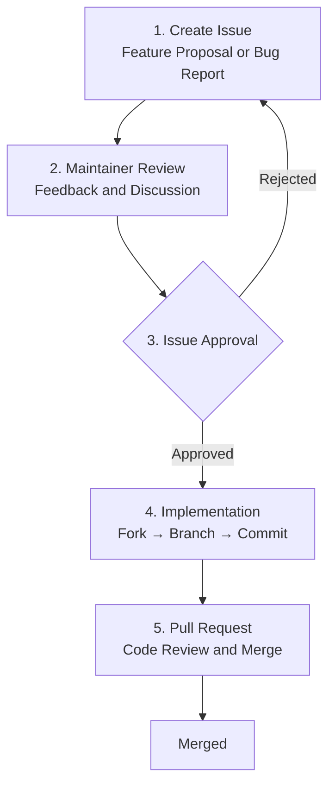

# Contributing

How to contribute to Spine.

## Contribution Process

If you want to contribute a feature or improvement to Spine, please follow the steps below.



## 1. Create Issue

Please **create an Issue first** before starting any implementation.

Create a new Issue at [Spine GitHub Issues](https://github.com/NARUBROWN/spine/issues) and include the following:

**For Feature Proposals**
- Description of the proposed feature
- Reason why this feature is needed
- Expected usage examples

**For Bug Reports**
- How to reproduce the bug
- Expected vs Actual behavior
- Environment info (Go version, OS, etc.)

## 2. Maintainer Review

Once an Issue is created, a Maintainer will review and leave comments. Discussions on design direction and implementation scope may happen at this stage.

## 3. Issue Approval

You can proceed with implementation once the Maintainer approves the Issue. PRs created without approval might not be merged, so please verify approval before starting implementation.

## 4. Pull Request

Create a Pull Request on GitHub. Please specify the related Issue number in the PR description.

```
Closes #123
```

## If you have questions

If you have any questions during implementation, leave a comment on the relevant Issue.
