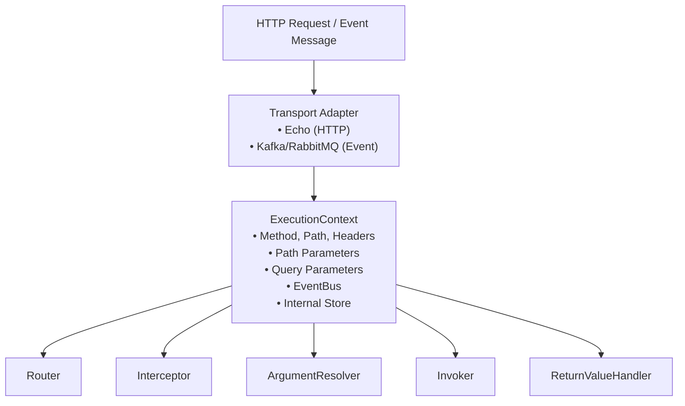
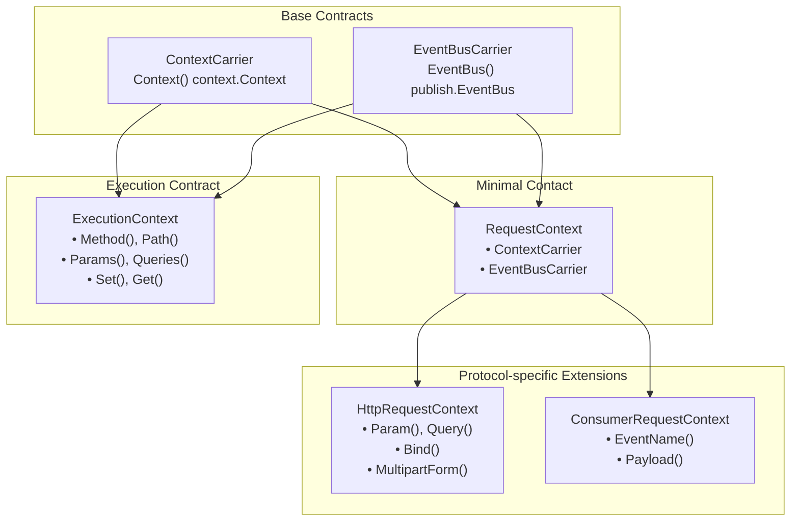

# Execution Context

The core of Spine requests.

## Overview

`ExecutionContext` is a request-scoped context shared throughout the Spine pipeline. When an HTTP request arrives, the Transport adapter creates an `ExecutionContext`, which passes through all stages of the pipeline, carrying request information and execution state.



## Context Hierarchy

Spine **separates Context hierarchically**. This design allows HTTP and Event Consumers to be handled by the same pipeline model.



### Why separation?

| Layer | Responsibility | Usage Location |
|------|------|----------|
| `ContextCarrier` | Carry Go standard context | Everywhere |
| `EventBusCarrier` | Publish domain events | Controller, Consumer |
| `RequestContext` | Resolver common minimal contract | ArgumentResolver base |
| `ExecutionContext` | Control execution flow | Router, Pipeline, Interceptor |
| `HttpRequestContext` | Interpret HTTP input | HTTP ArgumentResolver |
| `ConsumerRequestContext` | Interpret Event input | Consumer ArgumentResolver |

**Goal**: Enable HTTP and Event Consumers to share the same pipeline model while allowing input interpretation tailored to each protocol's characteristics.

## Base Interfaces

### ContextCarrier

Minimal contract for carrying Go standard `context.Context`.

```go
// core/context.go
type ContextCarrier interface {
    Context() context.Context
}
```

### EventBusCarrier

Contract for accessing EventBus to publish domain events.

```go
// core/context.go
type EventBusCarrier interface {
    EventBus() publish.EventBus
}
```

## RequestContext Interface

Common minimal contract for Resolvers. Used by both HTTP and Consumers.

```go
// core/context.go
type RequestContext interface {
    ContextCarrier
    EventBusCarrier
}
```

`RequestContext` is a combination of the two base interfaces. All ArgumentResolvers operate on this contract.

## ExecutionContext Interface

Interface for execution flow control used throughout the pipeline.

```go
// core/context.go
type ExecutionContext interface {
    ContextCarrier
    EventBusCarrier

    // HTTP Request Info (Different meaning in Consumer)
    Method() string                    // HTTP: GET, POST... / Consumer: "EVENT"
    Path() string                      // HTTP: /users/123 / Consumer: EventName
    Header(name string) string         // HTTP Header (Empty string for Consumer)
    
    // Parameter Access
    Params() map[string]string         // Path parameters
    PathKeys() []string                // Path key order
    Queries() map[string][]string      // Query parameters
    
    // Internal Store
    Set(key string, value any)         // Store value
    Get(key string) (any, bool)        // Retrieve value
}
```

### Method Details

#### Context()

Returns Go standard `context.Context`. Used for request cancellation, timeouts, and value passing.

```go
func (e *echoContext) Context() context.Context {
    return e.reqCtx  // HTTP request context
}
```

#### EventBus()

Returns the request-scoped EventBus. Used when publishing domain events from the Controller.

```go
func (c *echoContext) EventBus() publish.EventBus {
    return c.eventBus
}
```

#### Method() / Path()

Returns the method and path of the HTTP request. Used with different meanings in Consumers.

```go
// HTTP
ctx.Method()  // "GET"
ctx.Path()    // "/users/123/posts/456"

// Consumer
ctx.Method()  // "EVENT"
ctx.Path()    // "order.created" (EventName)
```

#### Params() / PathKeys()

Provides Path parameter information.

```go
// Route: /users/:userId/posts/:postId
// Request: /users/123/posts/456

ctx.Params()    // {"userId": "123", "postId": "456"}
ctx.PathKeys()  // ["userId", "postId"]
```

`PathKeys()` guarantees the **declaration order** of parameters. Essential for Spine's order-based binding.

#### Queries()

Returns Query parameters in a multi-value format.

```go
// Request: /users?status=active&tag=go&tag=web

ctx.Queries()  // {"status": ["active"], "tag": ["go", "web"]}
```

#### Set() / Get()

Storage for sharing values within the pipeline.

```go
// Store path params in Router
ctx.Set("spine.params", params)
ctx.Set("spine.pathKeys", keys)

// Store ResponseWriter in Adapter
ctx.Set("spine.response_writer", NewEchoResponseWriter(c))

// Retrieve in Interceptor
rw, ok := ctx.Get("spine.response_writer")
```

## HttpRequestContext Interface

HTTP-specific extension interface. Used in HTTP ArgumentResolvers.

```go
// core/context.go
type HttpRequestContext interface {
    RequestContext

    // Access individual parameters
    Param(name string) string          // Specific path param
    Query(name string) string          // Specific query param (first value)
    
    // Access full view
    Params() map[string]string         // All path params
    Queries() map[string][]string      // All query params
    
    // Body Binding
    Bind(out any) error                // JSON body → struct
    
    // Multipart
    MultipartForm() (*multipart.Form, error)
}
```

### Method Details

#### Param() / Query()

Conveniently access individual parameters.

```go
// Route: /users/:id?page=1&size=20

ctx.Param("id")      // "123"
ctx.Query("page")    // "1"
ctx.Query("size")    // "20"
ctx.Query("missing") // "" (returns empty string if missing)
```

#### Bind()

Binds the HTTP body to a struct.

```go
// internal/resolver/dto_resolver.go
func (r *DTOResolver) Resolve(ctx core.ExecutionContext, parameterMeta ParameterMeta) (any, error) {
    httpCtx, ok := ctx.(core.HttpRequestContext)
    if !ok {
        return nil, fmt.Errorf("Not an HTTP request context")
    }

    valuePtr := reflect.New(parameterMeta.Type)

    if err := httpCtx.Bind(valuePtr.Interface()); err != nil {
        return nil, fmt.Errorf("DTO binding failed (%s): %w", parameterMeta.Type.Name(), err)
    }

    return valuePtr.Elem().Interface(), nil
}
```

#### MultipartForm()

Accesses Multipart form data. Used for file upload processing.

```go
// internal/resolver/uploaded_files_resolver.go
func (r *UploadedFilesResolver) Resolve(ctx core.ExecutionContext, parameterMeta ParameterMeta) (any, error) {
    httpCtx, ok := ctx.(core.HttpRequestContext)
    if !ok {
        return nil, fmt.Errorf("Not an HTTP request context")
    }

    form, err := httpCtx.MultipartForm()
    if err != nil {
        return nil, err
    }
    // ...
}
```

## ConsumerRequestContext Interface

Event Consumer-specific extension interface.

```go
// core/context.go
type ConsumerRequestContext interface {
    RequestContext

    EventName() string    // Event name (e.g., "order.created")
    Payload() []byte      // Event payload (JSON, etc.)
}
```

### Method Details

#### EventName()

Returns the name of the received event.

```go
ctx.EventName()  // "order.created"
```

#### Payload()

Returns the raw payload of the event.

```go
payload := ctx.Payload()  // []byte (JSON)
```

### Consumer Resolver Example

```go
// internal/event/consumer/resolver/dto_resolver.go
func (r *DTOResolver) Resolve(ctx core.ExecutionContext, meta resolver.ParameterMeta) (any, error) {
    consumerCtx, ok := ctx.(core.ConsumerRequestContext)
    if !ok {
        return nil, fmt.Errorf("Not a ConsumerRequestContext")
    }

    payload := consumerCtx.Payload()
    if payload == nil {
        return nil, fmt.Errorf("Payload is empty, cannot create DTO")
    }

    dtoPtr := reflect.New(meta.Type)
    if err := json.Unmarshal(payload, dtoPtr.Interface()); err != nil {
        return nil, fmt.Errorf("Failed to deserialize DTO: %w", err)
    }

    return dtoPtr.Elem().Interface(), nil
}
```

## Echo Adapter Implementation

Spine uses Echo as the HTTP Transport layer. `echoContext` implements both `ExecutionContext` and `HttpRequestContext`.

```go
// internal/adapter/echo/context_impl.go
type echoContext struct {
    echo     echo.Context           // Original Echo context
    reqCtx   context.Context        // Request scope context
    store    map[string]any         // Internal store
    eventBus publish.EventBus       // Event bus
}

func NewContext(c echo.Context) core.ExecutionContext {
    return &echoContext{
        echo:     c,
        reqCtx:   c.Request().Context(),
        store:    make(map[string]any),
        eventBus: publish.NewEventBus(),
    }
}
```

### Key Implementations

#### Path Parameters

Uses results matched by the Router first, then falls back to Echo's values.

```go
func (e *echoContext) Param(name string) string {
    // Priority: Value stored by Spine Router
    if raw, ok := e.store["spine.params"]; ok {
        if m, ok := raw.(map[string]string); ok {
            if v, ok := m[name]; ok {
                return v
            }
        }
    }
    // Fallback to Echo
    return e.echo.Param(name)
}
```

#### Params() - Defensive Copy

Returns a copy to prevent modification of the original map from outside.

```go
func (e *echoContext) Params() map[string]string {
    if raw, ok := e.store["spine.params"]; ok {
        if m, ok := raw.(map[string]string); ok {
            // Defensive copy
            copyMap := make(map[string]string, len(m))
            for k, v := range m {
                copyMap[k] = v
            }
            return copyMap
        }
    }
    // Construct directly from Echo
    names := e.echo.ParamNames()
    values := e.echo.ParamValues()
    params := make(map[string]string, len(names))
    for i, name := range names {
        if i < len(values) {
            params[name] = values[i]
        }
    }
    return params
}
```

#### EventBus

Returns the request-scoped EventBus.

```go
func (c *echoContext) EventBus() publish.EventBus {
    return c.eventBus
}
```

## Consumer Adapter Implementation

Context implementation for Event Consumers.

```go
// internal/event/consumer/request_context_impl.go
type ConsumerRequestContextImpl struct {
    ctx      context.Context
    msg      *Message
    eventBus publish.EventBus
    store    map[string]any
}

func NewRequestContext(
    ctx context.Context,
    msg *Message,
    eventBus publish.EventBus,
) core.ExecutionContext {
    return &ConsumerRequestContextImpl{
        ctx:      ctx,
        msg:      msg,
        eventBus: eventBus,
        store:    make(map[string]any),
    }
}
```

### Special Behaviors of Consumer Context

Since Consumers are not HTTP, some methods behave differently.

```go
func (c *ConsumerRequestContextImpl) Method() string {
    // Consumer execution has no concept of HTTP Method
    // Use "EVENT" for routing distinction
    return "EVENT"
}

func (c *ConsumerRequestContextImpl) Path() string {
    // In Consumer routing, Path is the EventName
    return c.msg.EventName
}

func (c *ConsumerRequestContextImpl) Header(key string) string {
    // Consumer has no concept of HTTP Headers
    return ""
}

func (c *ConsumerRequestContextImpl) Params() map[string]string {
    // Consumer has no concept of Path Parameters
    return map[string]string{}
}
```

## ArgumentResolver and Context

`ArgumentResolver` receives `ExecutionContext` and type-asserts to protocol-specific Context as needed.

```go
// internal/resolver/argument.go
type ArgumentResolver interface {
    Supports(parameterMeta ParameterMeta) bool
    Resolve(ctx core.ExecutionContext, parameterMeta ParameterMeta) (any, error)
}
```

### HTTP Resolver Example

```go
// internal/resolver/path_int_resolver.go
func (r *PathIntResolver) Resolve(ctx core.ExecutionContext, parameterMeta ParameterMeta) (any, error) {
    // Type assert to HttpRequestContext
    httpCtx, ok := ctx.(core.HttpRequestContext)
    if !ok {
        return nil, fmt.Errorf("Not an HTTP request context")
    }

    raw, ok := httpCtx.Params()[parameterMeta.PathKey]
    if !ok {
        return nil, fmt.Errorf("path param not found: %s", parameterMeta.PathKey)
    }

    value, err := strconv.ParseInt(raw, 10, 64)
    if err != nil {
        return nil, err
    }

    return path.Int{Value: value}, nil
}
```

### Consumer Resolver Example

```go
// internal/event/consumer/resolver/event_name_resolver.go
func (r *EventNameResolver) Resolve(ctx core.ExecutionContext, meta resolver.ParameterMeta) (any, error) {
    // Type assert to ConsumerRequestContext
    consumerCtx, ok := ctx.(core.ConsumerRequestContext)
    if !ok {
        return nil, fmt.Errorf("Not a ConsumerRequestContext")
    }

    name := consumerCtx.EventName()
    if name == "" {
        return nil, fmt.Errorf("EventName not found in RequestContext")
    }

    return name, nil
}
```

### Common Resolver Example

`StdContextResolver` works for both HTTP and Consumers.

```go
// internal/resolver/std_context_resolver.go
func (r *StdContextResolver) Resolve(ctx core.ExecutionContext, parameterMeta ParameterMeta) (any, error) {
    baseCtx := ctx.Context()
    bus := ctx.EventBus()
    if bus != nil {
        return context.WithValue(baseCtx, publish.PublisherKey, bus), nil
    }
    return baseCtx, nil
}
```

## Usage in Pipeline

### Router

```go
// internal/router/router.go
func (r *DefaultRouter) Route(ctx core.ExecutionContext) (core.HandlerMeta, error) {
    for _, route := range r.routes {
        if route.Method != ctx.Method() {
            continue
        }
        
        ok, params, keys := matchPath(route.Path, ctx.Path())
        if !ok {
            continue
        }
        
        // Store matched info in Context
        ctx.Set("spine.params", params)
        ctx.Set("spine.pathKeys", keys)
        
        return route.Meta, nil
    }
    return core.HandlerMeta{}, fmt.Errorf("Handler not found.")
}
```

### Pipeline - Calling ArgumentResolver

```go
// internal/pipeline/pipeline.go
func (p *Pipeline) resolveArguments(ctx core.ExecutionContext, paramMetas []resolver.ParameterMeta) ([]any, error) {
    args := make([]any, 0, len(paramMetas))

    for _, paramMeta := range paramMetas {
        resolved := false

        for _, r := range p.argumentResolvers {
            if !r.Supports(paramMeta) {
                continue
            }

            // Pass ExecutionContext directly
            // Type assertion happens inside Resolver if needed
            val, err := r.Resolve(ctx, paramMeta)
            if err != nil {
                return nil, err
            }

            args = append(args, val)
            resolved = true
            break
        }

        if !resolved {
            return nil, fmt.Errorf(
                "No ArgumentResolver for parameter %d (%s)",
                paramMeta.Index,
                paramMeta.Type.String(),
            )
        }
    }
    return args, nil
}
```

### Interceptor

```go
// interceptor/cors/cors.go
func (i *CORSInterceptor) PreHandle(ctx core.ExecutionContext, meta core.HandlerMeta) error {
    // Acquire ResponseWriter
    rwAny, ok := ctx.Get("spine.response_writer")
    if !ok {
        return nil
    }
    rw := rwAny.(core.ResponseWriter)
    
    // Check request info
    origin := ctx.Header("Origin")
    if origin != "" && i.isAllowedOrigin(origin) {
        rw.SetHeader("Access-Control-Allow-Origin", origin)
    }
    
    // Handle Preflight
    if ctx.Method() == "OPTIONS" {
        rw.WriteStatus(204)
        return core.ErrAbortPipeline
    }
    
    return nil
}
```

## Internal Store Conventions

There are clear conventions for keys used with `Set()`/`Get()`.

### Spine Reserved Keys

| Key | Type | Set Location | Purpose |
|----|------|----------|------|
| `spine.params` | `map[string]string` | Router | Path parameter values |
| `spine.pathKeys` | `[]string` | Router | Path key order |
| `spine.response_writer` | `core.ResponseWriter` | Adapter | Output response |

### Usage Example

```go
// Using ResponseWriter in ReturnValueHandler
func (h *JSONReturnHandler) Handle(value any, ctx core.ExecutionContext) error {
    rwAny, ok := ctx.Get("spine.response_writer")
    if !ok {
        return fmt.Errorf("ResponseWriter not found in ExecutionContext.")
    }
    
    rw, ok := rwAny.(core.ResponseWriter)
    if !ok {
        return fmt.Errorf("Invalid ResponseWriter type.")
    }
    
    return rw.WriteJSON(200, value)
}
```

## EventBus Integration

As of Spine 0.3.0, EventBus is integrated into `ExecutionContext`.

### Publishing Events in Controller

```go
// cmd/demo/controller.go
func (c *UserController) CreateOrder(ctx context.Context, orderId path.Int) string {
    // Extract EventBus from context.Context and publish event
    publish.Event(ctx, OrderCreated{
        OrderID: orderId.Value,
        At:      time.Now(),
    })

    return "OK"
}
```

### EventBus Injection Flow

```go
// internal/resolver/std_context_resolver.go
func (r *StdContextResolver) Resolve(ctx core.ExecutionContext, parameterMeta ParameterMeta) (any, error) {
    baseCtx := ctx.Context()
    bus := ctx.EventBus()
    if bus != nil {
        // Inject EventBus into context.Context
        return context.WithValue(baseCtx, publish.PublisherKey, bus), nil
    }
    return baseCtx, nil
}
```

## Design Principles

### 1. Controllers Do Not Know Context

Controllers do not directly receive `ExecutionContext` or `HttpRequestContext`. Instead, they receive only necessary values via semantic types (`path.Int`, `query.Values`, etc.) and `context.Context`.

```go
// ❌ Anti-pattern
func (c *UserController) GetUser(ctx core.ExecutionContext) User

// ✓ Spine way
func (c *UserController) GetUser(ctx context.Context, userId path.Int) User
```

### 2. Resolvers Receive ExecutionContext and Assert Types

ArgumentResolvers receive `ExecutionContext`. If protocol-specific features are needed, they type assert to `HttpRequestContext` or `ConsumerRequestContext`.

```go
func (r *PathIntResolver) Resolve(ctx core.ExecutionContext, parameterMeta ParameterMeta) (any, error) {
    httpCtx, ok := ctx.(core.HttpRequestContext)
    if !ok {
        return nil, fmt.Errorf("Not an HTTP request context")
    }
    // ...
}
```

### 3. Single Pipeline, Multiple Protocols

HTTP and Event Consumers share the same pipeline structure. Context hierarchy separation supports protocol-specific characteristics while maximizing code reuse.

```go
// HTTP Pipeline
httpPipeline.AddArgumentResolver(
    &resolver.StdContextResolver{},      // Common
    &resolver.PathIntResolver{},         // HTTP specific
    &resolver.DTOResolver{},             // HTTP specific
)

// Consumer Pipeline
consumerPipeline.AddArgumentResolver(
    &resolver.StdContextResolver{},           // Common
    &eventResolver.EventNameResolver{},       // Consumer specific
    &eventResolver.DTOResolver{},             // Consumer specific
)
```

## Summary

| Interface | Role | Main Methods | Usage Location |
|-----------|------|------------|----------|
| `ContextCarrier` | Carry Go context | `Context()` | Everywhere |
| `EventBusCarrier` | Publish events | `EventBus()` | Controller, Consumer |
| `RequestContext` | Resolver minimal contract | (Combined) | ArgumentResolver base |
| `ExecutionContext` | Control execution flow | `Method()`, `Path()`, `Set()`, `Get()` | Router, Pipeline, Interceptor |
| `HttpRequestContext` | Interpret HTTP input | `Param()`, `Query()`, `Bind()`, `MultipartForm()` | HTTP ArgumentResolver |
| `ConsumerRequestContext` | Interpret Event input | `EventName()`, `Payload()` | Consumer ArgumentResolver |

**Core Principle**: With Context hierarchy separation, HTTP and Event Consumers share the same pipeline model. Controllers are completely unaware of the execution model and focus solely on business logic.
