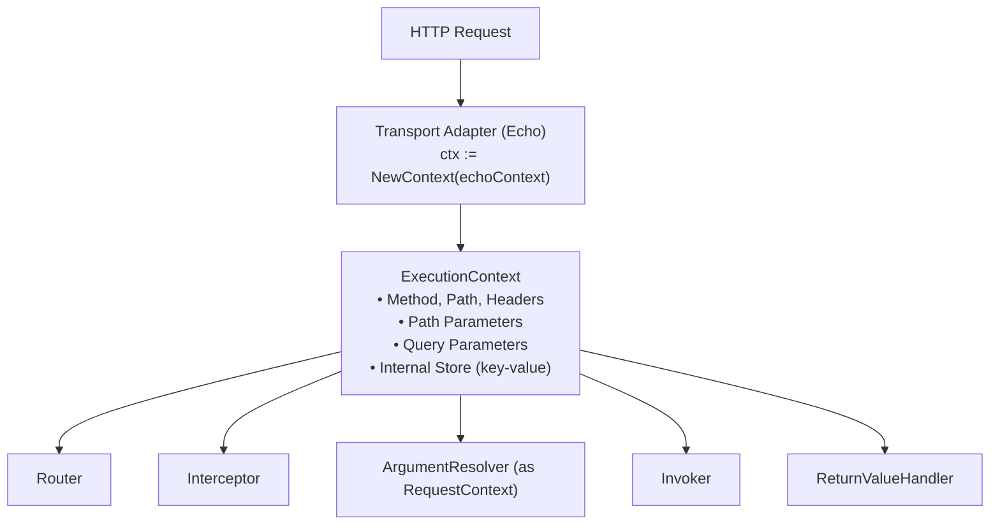

# Execution Context

The Core of Spine Requests.

## Overview

`ExecutionContext` is a request-scoped context shared throughout the Spine pipeline. When an HTTP request arrives, the Transport adapter creates an `ExecutionContext`, which passes through all stages of the pipeline carrying request information and execution state.




## Context Separation Philosophy

Spine clearly separates Context into **two layers**. This is an intentional design decision.

### Why separate?

| Concern | Responsible Context | Usage Location |
|--------|-------------|----------|
| Execution Flow Control | `ExecutionContext` | Router, Pipeline, Interceptor |
| Input Value Interpretation | `RequestContext` | ArgumentResolver |

**Goal**: To prevent Controllers and business logic from knowing anything about the execution model.

```go
// ❌ Controller directly accessing ExecutionContext
func (c *UserController) GetUser(ctx core.ExecutionContext) User {
    id := ctx.Param("id")  // Depends on HTTP layer
    // ...
}

// ✓ Spine's way: Receiving semantic types
func (c *UserController) GetUser(userId path.Int) User {
    // Doesn't know HTTP, doesn't know execution order
    // Only business logic
}
```

## ExecutionContext Interface

Interface for execution flow control used throughout the pipeline.

```go
// core/context.go
type ExecutionContext interface {
    // Standard Context
    Context() context.Context
    
    // HTTP Request Info
    Method() string                    // GET, POST, PUT, DELETE, ...
    Path() string                      // /users/123/posts/456
    Header(name string) string         // Specific header value
    
    // Parameter Access
    Params() map[string]string         // Path parameters
    PathKeys() []string                // Path key order (for binding)
    Queries() map[string][]string      // Query parameters
    
    // Internal Store
    Set(key string, value any)         // Store value
    Get(key string) (any, bool)        // Retrieve value
}
```

### Method Details

#### Context()

Returns the standard Go `context.Context`. Used for request cancellation, timeouts, and value passing.

```go
func (e *echoContext) Context() context.Context {
    return e.reqCtx  // Context of HTTP request
}
```

#### Method() / Path()

Returns the method and path of the HTTP request.

```go
ctx.Method()  // "GET"
ctx.Path()    // "/users/123/posts/456"
```

#### Params() / PathKeys()

Provides Path parameter information.

```go
// Route: /users/:userId/posts/:postId
// Request: /users/123/posts/456

ctx.Params()    // {"userId": "123", "postId": "456"}
ctx.PathKeys()  // ["userId", "postId"]
```

`PathKeys()` guarantees the **declaration order** of parameters. Essential for Spine's order-based binding.

#### Queries()

Returns Query parameters as multi-value map.

```go
// Request: /users?status=active&tag=go&tag=web

ctx.Queries()  // {"status": ["active"], "tag": ["go", "web"]}
```

#### Set() / Get()

Storage for sharing values within the pipeline.

```go
// Store path params in Router
ctx.Set("spine.params", params)
ctx.Set("spine.pathKeys", keys)

// Store ResponseWriter in Adapter
ctx.Set("spine.response_writer", NewEchoResponseWriter(c))

// Retrieve in Interceptor
rw, ok := ctx.Get("spine.response_writer")
```

## RequestContext Interface

Interface dedicated to input interpretation, used only in ArgumentResolver.

```go
// core/context.go
type RequestContext interface {
    // Individual Parameter Access
    Param(name string) string          // Specific path param
    Query(name string) string          // Specific query param (first value)
    
    // Full View Access
    Params() map[string]string         // All path params
    Queries() map[string][]string      // All query params
    
    // Body Binding
    Bind(out any) error                // JSON body → struct
}
```

### Method Details

#### Param() / Query()

Conveniently access individual parameters.

```go
// Route: /users/:id?page=1&size=20

ctx.Param("id")     // "123"
ctx.Query("page")   // "1"
ctx.Query("size")   // "20"
ctx.Query("missing") // "" (Empty string if missing)
```

#### Bind()

Binds HTTP body to a struct.

```go
// internal/resolver/dto_resolver.go
func (r *DTOResolver) Resolve(ctx core.RequestContext, parameterMeta ParameterMeta) (any, error) {
    valuePtr := reflect.New(parameterMeta.Type)
    
    if err := ctx.Bind(valuePtr.Interface()); err != nil {
        return nil, fmt.Errorf("DTO binding failed (%s): %w", parameterMeta.Type.Name(), err)
    }
    
    return valuePtr.Elem().Interface(), nil
}
```


## Echo Adapter Implementation

Spine uses Echo as the Transport layer. `echoContext` implements both interfaces.

```go
// internal/adapter/echo/context_impl.go
type echoContext struct {
    echo   echo.Context           // Original Echo context
    reqCtx context.Context        // Request scoped context
    store  map[string]any         // Internal store
}

func NewContext(c echo.Context) core.ExecutionContext {
    return &echoContext{
        echo:   c,
        reqCtx: c.Request().Context(),
        store:  make(map[string]any),
    }
}
```

### Key Implementations

#### Path Parameters

Uses the result matched by Router first; if not present, falls back to Echo's values.

```go
func (e *echoContext) Param(name string) string {
    // Prioritize values stored by Spine Router
    if raw, ok := e.store["spine.params"]; ok {
        if m, ok := raw.(map[string]string); ok {
            if v, ok := m[name]; ok {
                return v
            }
        }
    }
    // Fallback to Echo
    return e.echo.Param(name)
}
```

#### Params() - Defensive Copy

Returns a copy to prevent external modification of the original map.

```go
func (e *echoContext) Params() map[string]string {
    if raw, ok := e.store["spine.params"]; ok {
        if m, ok := raw.(map[string]string); ok {
            // Defensive copy
            copyMap := make(map[string]string, len(m))
            for k, v := range m {
                copyMap[k] = v
            }
            return copyMap
        }
    }
    // Construct directly from Echo
    names := e.echo.ParamNames()
    values := e.echo.ParamValues()
    params := make(map[string]string, len(names))
    for i, name := range names {
        if i < len(values) {
            params[name] = values[i]
        }
    }
    return params
}
```

#### Body Binding

Delegates directly to Echo's `Bind`.

```go
func (e *echoContext) Bind(out any) error {
    return e.echo.Bind(out)
}
```


## Usage in Pipeline

### Router

```go
// internal/router/router.go
func (r *DefaultRouter) Route(ctx core.ExecutionContext) (core.HandlerMeta, error) {
    for _, route := range r.routes {
        if route.Method != ctx.Method() {
            continue
        }
        
        ok, params, keys := matchPath(route.Path, ctx.Path())
        if !ok {
            continue
        }
        
        // Save matched info to Context
        ctx.Set("spine.params", params)
        ctx.Set("spine.pathKeys", keys)
        
        return route.Meta, nil
    }
    return core.HandlerMeta{}, fmt.Errorf("Handler not found.")
}
```

### ArgumentResolver

```go
// internal/pipeline/pipeline.go
func (p *Pipeline) resolveArguments(ctx core.ExecutionContext, paramMetas []resolver.ParameterMeta) ([]any, error) {
    // ExecutionContext → RequestContext Downcast
    reqCtx, ok := ctx.(core.RequestContext)
    if !ok {
        return nil, fmt.Errorf("ExecutionContext does not implement RequestContext.")
    }
    
    args := make([]any, 0, len(paramMetas))
    
    for _, paramMeta := range paramMetas {
        for _, r := range p.argumentResolvers {
            if r.Supports(paramMeta) {
                // Pass only RequestContext
                val, err := r.Resolve(reqCtx, paramMeta)
                if err != nil {
                    return nil, err
                }
                args = append(args, val)
                break
            }
        }
    }
    return args, nil
}
```

### Interceptor

```go
// interceptor/cors/cors.go
func (i *CORSInterceptor) PreHandle(ctx core.ExecutionContext, meta core.HandlerMeta) error {
    // Get ResponseWriter
    rwAny, ok := ctx.Get("spine.response_writer")
    if !ok {
        return nil
    }
    rw := rwAny.(core.ResponseWriter)
    
    // Check request info
    origin := ctx.Header("Origin")
    if origin != "" && i.isAllowedOrigin(origin) {
        rw.SetHeader("Access-Control-Allow-Origin", origin)
    }
    
    // Preflight handling
    if ctx.Method() == "OPTIONS" {
        rw.WriteStatus(204)
        return core.ErrAbortPipeline
    }
    
    return nil
}
```


## Internal Store Convention

There is a clear convention for keys used in `Set()`/`Get()`.

### Spine Reserved Keys

| Key | Type | Set Location | Purpose |
|----|------|----------|------|
| `spine.params` | `map[string]string` | Router | Path parameter values |
| `spine.pathKeys` | `[]string` | Router | Path key order |
| `spine.response_writer` | `core.ResponseWriter` | Adapter | Response output |

### Usage Example

```go
// Using ResponseWriter in ReturnValueHandler
func (h *JSONReturnHandler) Handle(value any, ctx core.ExecutionContext) error {
    rwAny, ok := ctx.Get("spine.response_writer")
    if !ok {
        return fmt.Errorf("ResponseWriter not found in ExecutionContext.")
    }
    
    rw, ok := rwAny.(core.ResponseWriter)
    if !ok {
        return fmt.Errorf("Invalid ResponseWriter type.")
    }
    
    return rw.WriteJSON(200, value)
}
```

## Design Principles

### 1. Controllers don't know Context

Controllers do not directly receive `ExecutionContext` or `RequestContext`. Instead, they receive only the necessary values as semantic types (`path.Int`, `query.Values`, etc.).

```go
// ❌ Anti-pattern
func (c *UserController) GetUser(ctx core.ExecutionContext) User

// ✓ Spine Way
func (c *UserController) GetUser(userId path.Int) User
```

### 2. Resolvers only know RequestContext

ArgumentResolvers only use `RequestContext`. They do not access execution flow control (`Set`/`Get`).

```go
type ArgumentResolver interface {
    Supports(parameterMeta ParameterMeta) bool
    Resolve(ctx core.RequestContext, parameterMeta ParameterMeta) (any, error)
    //          ^^^^^^^^^^^^^^^^^ Not ExecutionContext
}
```

### 3. Single Implementation, Dual Interfaces

Echo adapter's `echoContext` implements both interfaces. However, only the necessary interface is exposed depending on the usage location.

```go
type echoContext struct { ... }

// ExecutionContext Implementation
func (e *echoContext) Method() string { ... }
func (e *echoContext) Set(key string, value any) { ... }

// RequestContext Implementation
func (e *echoContext) Param(name string) string { ... }
func (e *echoContext) Bind(out any) error { ... }
```

## Summary

| Category | ExecutionContext | RequestContext |
|------|------------------|----------------|
| **Role** | Execution Flow Control | Input Value Interpretation |
| **Usage Location** | Router, Pipeline, Interceptor | ArgumentResolver |
| **Key Methods** | `Method()`, `Path()`, `Set()`, `Get()` | `Param()`, `Query()`, `Bind()` |
| **Exposed to Controller** | ❌ | ❌ |

**Core Principle**: Context is used only within the pipeline. Controllers know nothing about the execution model and focus solely on business logic.
