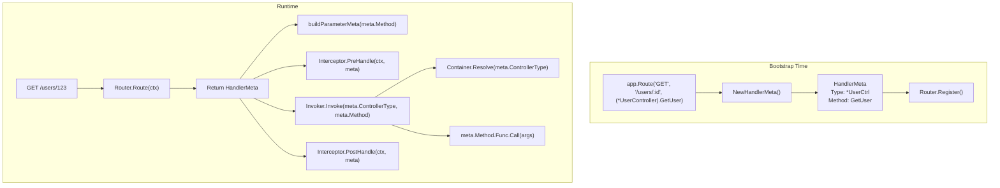

# HandlerMeta

Metadata about Route Handlers.

## Overview

`HandlerMeta` is a structure that holds metadata about the Controller method to be executed. When the Router matches a request path, it returns `HandlerMeta`, and the Pipeline uses this information to call the actual method.

```mermaid
graph TD
    subgraph Bootstrap [Route Registration (Bootstrap)]
        MethodExpr["(*UserController).GetUser<br>(Method Expression)"]
        NewMeta["NewHandlerMeta()"]
        MetaStruct["HandlerMeta<br>ControllerType: *UserController<br>Method: GetUser"]
    end

    subgraph Runtime [Runtime]
        Pipeline["Pipeline"]
        Resolve["1. Container.Resolve(Type)"]
        Call["2. Method.Func.Call(args)"]
    end

    MethodExpr --> NewMeta
    NewMeta --> MetaStruct
    MetaStruct -.-> Pipeline
    Pipeline --> Resolve
    Resolve --> Call
```


## HandlerMeta Struct

```go
// core/handler_meta.go
type HandlerMeta struct {
    // Controller Type (Target for Container Resolve)
    ControllerType reflect.Type
    
    // Method to call
    Method reflect.Method
}
```

### Field Description

#### ControllerType

Pointer type of the Controller. Used when resolving an instance from the IoC Container.

```go
meta.ControllerType  // reflect.Type of *UserController
```

#### Method

Reflection information of the method to call. Includes method name, signature, and function pointer.

```go
meta.Method.Name           // "GetUser"
meta.Method.Type           // func(*UserController, path.Int) (User, error)
meta.Method.Func           // Callable reflect.Value
```


## Creating HandlerMeta

### Method Expression

Spine uses **Method Expressions** to register handlers.

```go
// cmd/demo/main.go
app.Route(
    "GET",
    "/users/:id",
    (*UserController).GetUser,  // Method Expression
)
```

The method expression `(*UserController).GetUser` is treated as a regular function:

```go
// Actual type of method expression
func(*UserController, path.Int) (User, error)
//   ↑ receiver is converted to the first argument
```

### NewHandlerMeta Function

Analyzes the method expression to generate `HandlerMeta`.

```go
// internal/router/handler_meta.go
func NewHandlerMeta(handler any) (core.HandlerMeta, error) {
    t := reflect.TypeOf(handler)
    v := reflect.ValueOf(handler)
    
    // 1. Verify if it is a function
    if t.Kind() != reflect.Func {
        return core.HandlerMeta{}, fmt.Errorf("handler must be a function")
    }
    
    // 2. Verify if it is a method expression (first arg is receiver)
    if t.NumIn() < 1 {
        return core.HandlerMeta{}, fmt.Errorf("handler must be a method expression")
    }
    
    // 3. Verify receiver is a pointer type
    receiverType := t.In(0)
    if receiverType.Kind() != reflect.Ptr {
        return core.HandlerMeta{}, fmt.Errorf("handler receiver must be a pointer type")
    }
    
    // 4. Extract method name
    fn := runtime.FuncForPC(v.Pointer())
    if fn == nil {
        return core.HandlerMeta{}, fmt.Errorf("cannot extract method info")
    }
    
    fullName := fn.Name()
    // e.g.: github.com/NARUBROWN/spine-demo.(*UserController).GetUser
    lastDot := strings.LastIndex(fullName, ".")
    methodName := fullName[lastDot+1:]
    
    // 5. Get method info via reflection
    method, ok := receiverType.MethodByName(methodName)
    if !ok {
        return core.HandlerMeta{}, fmt.Errorf("method not found: %s", methodName)
    }
    
    return core.HandlerMeta{
        ControllerType: receiverType,
        Method:         method,
    }, nil
}
```

### Creation Process Details

#### Step 1: Verify Function

```go
t := reflect.TypeOf((*UserController).GetUser)
t.Kind()  // reflect.Func ✓
```

#### Step 2: Verify Method Expression

```go
t.NumIn()  // 2 (receiver + path.Int)
t.In(0)    // *UserController (receiver)
t.In(1)    // path.Int
```

#### Step 3: Extract Method Name

Get the full path of the function using `runtime.FuncForPC`, and the string after the last `.` is the method name.

```go
fn.Name()  // "github.com/NARUBROWN/spine-demo.(*UserController).GetUser"
           //                                                    ↑ methodName
```

#### Step 4: Acquire Method

```go
method, _ := reflect.TypeOf(&UserController{}).MethodByName("GetUser")
// method.Name: "GetUser"
// method.Type: func(*UserController, path.Int) (User, error)
// method.Func: Callable reflect.Value
```


## Usage in Router

### Route Registration

```go
// internal/router/router.go
type Route struct {
    Method string           // HTTP Method
    Path   string           // URL Pattern
    Meta   core.HandlerMeta // Handler Metadata
}

func (r *DefaultRouter) Register(method string, path string, meta core.HandlerMeta) {
    r.routes = append(r.routes, Route{
        Method: method,
        Path:   path,
        Meta:   meta,
    })
}
```

### Route Matching

```go
func (r *DefaultRouter) Route(ctx core.ExecutionContext) (core.HandlerMeta, error) {
    for _, route := range r.routes {
        if route.Method != ctx.Method() {
            continue
        }
        
        ok, params, keys := matchPath(route.Path, ctx.Path())
        if !ok {
            continue
        }
        
        ctx.Set("spine.params", params)
        ctx.Set("spine.pathKeys", keys)
        
        return route.Meta, nil  // Return HandlerMeta
    }
    return core.HandlerMeta{}, fmt.Errorf("Handler not found.")
}
```


## Usage in Pipeline

### ParameterMeta Creation

Analyzes `HandlerMeta.Method` to generate meta-information for each parameter.

```go
// internal/pipeline/pipeline.go
func buildParameterMeta(method reflect.Method, ctx core.ExecutionContext) []resolver.ParameterMeta {
    pathKeys := ctx.PathKeys()
    pathIdx := 0
    var metas []resolver.ParameterMeta
    
    // method.Type.NumIn() includes receiver
    // i=0 is receiver, so start from i=1
    for i := 1; i < method.Type.NumIn(); i++ {
        pt := method.Type.In(i)
        
        pm := resolver.ParameterMeta{
            Index: i - 1,
            Type:  pt,
        }
        
        if isPathType(pt) {
            if pathIdx < len(pathKeys) {
                pm.PathKey = pathKeys[pathIdx]
            }
            pathIdx++
        }
        
        metas = append(metas, pm)
    }
    
    return metas
}
```

### Controller Invocation

```go
// internal/invoker/invoker.go
func (i *Invoker) Invoke(controllerType reflect.Type, method reflect.Method, args []any) ([]any, error) {
    // 1. Resolve Controller instance from Container
    controller, err := i.container.Resolve(controllerType)
    if err != nil {
        return nil, err
    }
    
    // 2. Construct invocation arguments (receiver + args)
    values := make([]reflect.Value, len(args)+1)
    values[0] = reflect.ValueOf(controller)  // receiver
    for idx, arg := range args {
        values[idx+1] = reflect.ValueOf(arg)
    }
    
    // 3. Call method via reflection
    results := method.Func.Call(values)
    
    // 4. Convert results
    out := make([]any, len(results))
    for i, result := range results {
        out[i] = result.Interface()
    }
    
    return out, nil
}
```

### Passing to Interceptor

All Interceptor methods receive `HandlerMeta` and can access execution target information.

```go
// cmd/demo/loggin_interceptor.go
func (i *LoggingInterceptor) PreHandle(ctx core.ExecutionContext, meta core.HandlerMeta) error {
    log.Printf(
        "[REQ] %s %s -> %s.%s",
        ctx.Method(),
        ctx.Path(),
        meta.ControllerType.Name(),  // "UserController"
        meta.Method.Name,            // "GetUser"
    )
    return nil
}
```


## Bootstrap Process

### 1. Route Declaration

```go
// cmd/demo/main.go
app.Route("GET", "/users/:id", (*UserController).GetUser)
```

### 2. RouteSpec Collection

```go
// app.go
func (a *app) Route(method string, path string, handler any) {
    a.routes = append(a.routes, router.RouteSpec{
        Method:  method,
        Path:    path,
        Handler: handler,  // Method Expression
    })
}
```

### 3. HandlerMeta Creation and Registration

```go
// internal/bootstrap/bootstrap.go
router := spineRouter.NewRouter()

for _, route := range config.Routes {
    // Method Expression → HandlerMeta Conversion
    meta, err := spineRouter.NewHandlerMeta(route.Handler)
    if err != nil {
        return err
    }
    
    router.Register(route.Method, route.Path, meta)
}
```

### 4. Controller Type Collection

Collects all Controller types registered in the Router.

```go
// internal/router/router.go
func (r *DefaultRouter) ControllerTypes() []reflect.Type {
    seen := map[reflect.Type]struct{}{}
    var result []reflect.Type
    
    for _, route := range r.routes {
        t := route.Meta.ControllerType
        if _, ok := seen[t]; ok {
            continue
        }
        seen[t] = struct{}{}
        result = append(result, t)
    }
    
    return result
}
```

### 5. Warm-Up

Pre-instantiates all Controllers at bootstrap time.

```go
// internal/bootstrap/bootstrap.go
if err := container.WarmUp(router.ControllerTypes()); err != nil {
    panic(err)
}
```

## Internal Flow Summary




## Design Principles

### 1. Enforcing Method Expressions

Only allows method expressions, not regular functions or closures.

```go
// ✓ Method Expression
app.Route("GET", "/users/:id", (*UserController).GetUser)

// ❌ Regular Function (Not supported)
app.Route("GET", "/users/:id", func(id path.Int) User { ... })

// ❌ Instance Method (Not supported)
ctrl := &UserController{}
app.Route("GET", "/users/:id", ctrl.GetUser)
```

### 2. Enforcing Pointer Receivers

Value receivers are not supported.

```go
// ✓ Pointer Receiver
func (c *UserController) GetUser(id path.Int) User

// ❌ Value Receiver (Not supported)
func (c UserController) GetUser(id path.Int) User
```

### 3. Bootstrap Verification

`NewHandlerMeta` is called at bootstrap, so invalid handler registration fails before server start.

```go
// Bootstrap fails on invalid handler registration
meta, err := spineRouter.NewHandlerMeta(invalidHandler)
if err != nil {
    return err  // Errors before server start
}
```

## Summary

| Component | Role |
|----------|------|
| `HandlerMeta` | Metadata containing Controller type and Method info |
| `NewHandlerMeta()` | Converts Method Expression → HandlerMeta |
| `Router` | Returns HandlerMeta on request match |
| `Invoker` | Resolves Controller instance and calls method using HandlerMeta |
| `Interceptor` | Accesses execution target info using HandlerMeta |

**Core**: HandlerMeta is metadata about "what to execute". Created at bootstrap and used at runtime, it serves as the key link between execution model and business logic.
