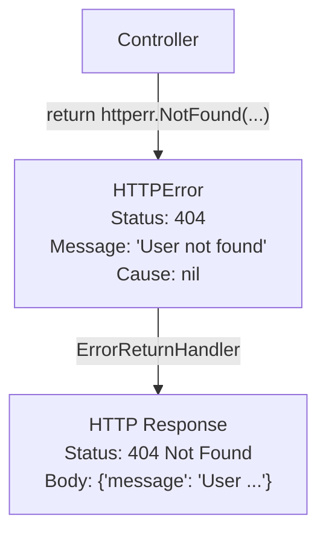

# httperr Package

Standardized HTTP error handling.

## Overview

The `httperr` package provides error types designed to allow Controllers to explicitly express HTTP status codes without directly depending on the HTTP layer. Controllers return errors from a business logic perspective, and `ErrorReturnHandler` converts them into appropriate HTTP responses.




## Why httperr?

### Problem: Should Controllers know HTTP?

In the typical approach, Controllers directly write HTTP responses:

```go
// ❌ Direct dependency on HTTP layer
func (c *UserController) GetUser(ctx echo.Context) error {
    user, err := c.repo.FindByID(id)
    if err != nil {
        return ctx.JSON(404, map[string]string{"error": "not found"})
    }
    return ctx.JSON(200, user)
}
```

Problems with this approach:
- Controller depends on HTTP framework (Echo)
- Status codes and response formats are mixed with business logic
- Difficult to test

### Solution: Express errors with semantic types

```go
// ✓ Spine way: Doesn't know HTTP but meaning is clear
func (c *UserController) GetUser(userId path.Int) (User, error) {
    user, err := c.repo.FindByID(userId.Value)
    if err != nil {
        return User{}, httperr.NotFound("User not found")
    }
    return user, nil
}
```

The Controller:
- Doesn't know the HTTP framework
- Expresses only the **meaning** (NotFound, BadRequest, etc.)
- Actual HTTP conversion is handled by `ErrorReturnHandler`


## HTTPError Struct

```go
// pkg/httperr/types.go
type HTTPError struct {
    Status  int    // HTTP status code
    Message string // Error message
    Cause   error  // Cause error (optional)
}

// Implement error interface
func (e *HTTPError) Error() string {
    return e.Message
}
```

### Field Description

| Field | Type | Description |
|------|------|------|
| `Status` | `int` | HTTP status code (400, 401, 404, etc.) |
| `Message` | `string` | Error message to deliver to client |
| `Cause` | `error` | Underlying cause error (for debugging/logging) |

### error Interface

`HTTPError` implements Go's `error` interface. Thus, it can be returned and handled like a normal error.

```go
func (c *UserController) GetUser(userId path.Int) (User, error) {
    // httperr.NotFound() returns error type
    return User{}, httperr.NotFound("User not found")
}
```


## Helper Functions

Provides helper functions for frequently used HTTP status codes.

### NotFound

```go
func NotFound(msg string) error {
    return &HTTPError{Status: 404, Message: msg}
}
```

Used when a resource cannot be found.

```go
user, err := c.repo.FindByID(id)
if err != nil {
    return User{}, httperr.NotFound("User not found")
}
```

### BadRequest

```go
func BadRequest(msg string) error {
    return &HTTPError{Status: 400, Message: msg}
}
```

Used when the client request is invalid.

```go
if userId.Value <= 0 {
    return User{}, httperr.BadRequest("Invalid user ID")
}
```

### Unauthorized

```go
func Unauthorized(msg string) error {
    return &HTTPError{Status: 401, Message: msg}
}
```

Used when authentication is required or failed.

```go
if !c.auth.IsValid(token) {
    return User{}, httperr.Unauthorized("Authentication required")
}
```


## ErrorReturnHandler

Converts errors returned by the Controller into HTTP responses.

```go
// internal/handler/error_return_handler.go
type ErrorReturnHandler struct{}

func (h *ErrorReturnHandler) Supports(returnType reflect.Type) bool {
    errorType := reflect.TypeFor[error]()
    return returnType.Implements(errorType)
}

func (h *ErrorReturnHandler) Handle(value any, ctx core.ExecutionContext) error {
    rwAny, ok := ctx.Get("spine.response_writer")
    if !ok {
        return fmt.Errorf("ResponseWriter not found in ExecutionContext.")
    }
    
    rw := rwAny.(core.ResponseWriter)
    err := value.(error)
    
    status := 500
    message := err.Error()
    
    // If HTTPError, extract status code
    var httpErr *httperr.HTTPError
    if errors.As(err, &httpErr) {
        status = httpErr.Status
        message = httpErr.Message
    }
    
    return rw.WriteJSON(status, map[string]any{
        "message": message,
    })
}
```

### How it works

1. Controller returns `error`
2. Pipeline calls `ErrorReturnHandler.Supports()` → `true`
3. Executes `ErrorReturnHandler.Handle()`
4. Checks for `HTTPError` using `errors.As()`
5. Uses specified status code if `HTTPError`, otherwise 500

### HTTPError vs Normal error

```go
// HTTPError → Specified status code
return httperr.NotFound("...")  // → 404

// Normal error → 500 Internal Server Error
return errors.New("something went wrong")  // → 500
```


## Usage Examples

### Basic Usage

```go
func (c *UserController) GetUser(userId path.Int) (User, error) {
    if userId.Value <= 0 {
        return User{}, httperr.BadRequest("Invalid user ID")
    }
    
    user, err := c.repo.FindByID(userId.Value)
    if err != nil {
        return User{}, httperr.NotFound("User not found")
    }
    
    return user, nil
}
```

```bash
// Invalid ID
GET /users/-1
→ 400 {"message": "Invalid user ID"}

// User not found
GET /users/999
→ 404 {"message": "User not found"}

// Normal
GET /users/123
→ 200 {"id": 123, "name": "john"}
```

### Authentication Handling

```go
func (c *OrderController) GetOrder(orderId path.Int) (Order, error) {
    order, err := c.repo.FindByID(orderId.Value)
    if err != nil {
        return Order{}, httperr.NotFound("Order not found")
    }
    
    if !c.auth.CanAccess(order.UserID) {
        return Order{}, httperr.Unauthorized("Access denied")
    }
    
    return order, nil
}
```

### Business Rule Validation

```go
func (c *PaymentController) Process(req PaymentRequest) (Receipt, error) {
    if req.Amount <= 0 {
        return Receipt{}, httperr.BadRequest("Payment amount must be greater than 0")
    }
    
    if req.Amount > 10000000 {
        return Receipt{}, httperr.BadRequest("Exceeded single payment limit")
    }
    
    balance, err := c.wallet.GetBalance(req.UserID)
    if err != nil {
        return Receipt{}, httperr.NotFound("Wallet not found")
    }
    
    if balance < req.Amount {
        return Receipt{}, httperr.BadRequest("Insufficient balance")
    }
    
    return c.processPayment(req)
}
```

### Returning Error Only

Can be used even when there is no return value upon success.

```go
func (c *UserController) DeleteUser(userId path.Int) error {
    exists, err := c.repo.Exists(userId.Value)
    if err != nil || !exists {
        return httperr.NotFound("User not found")
    }
    
    if err := c.repo.Delete(userId.Value); err != nil {
        return httperr.BadRequest("Unable to delete")
    }
    
    return nil  // Return nil on success
}
```


## Extending

### Adding New Status Codes

Currently provided helpers are 400, 401, 404. You can extend as needed.

```go
// Create HTTPError directly
func Forbidden(msg string) error {
    return &httperr.HTTPError{Status: 403, Message: msg}
}

func Conflict(msg string) error {
    return &httperr.HTTPError{Status: 409, Message: msg}
}

func UnprocessableEntity(msg string) error {
    return &httperr.HTTPError{Status: 422, Message: msg}
}

func TooManyRequests(msg string) error {
    return &httperr.HTTPError{Status: 429, Message: msg}
}
```

### Utilizing Cause

Can be used for debugging by including the cause error.

```go
func WithCause(status int, msg string, cause error) error {
    return &httperr.HTTPError{
        Status:  status,
        Message: msg,
        Cause:   cause,
    }
}

// Usage
user, err := c.repo.FindByID(id)
if err != nil {
    return User{}, WithCause(404, "User not found", err)
}
```

You can log the `Cause` in an Interceptor's `AfterCompletion`:

```go
func (i *LoggingInterceptor) AfterCompletion(ctx core.ExecutionContext, meta core.HandlerMeta, err error) {
    if err != nil {
        var httpErr *httperr.HTTPError
        if errors.As(err, &httpErr) && httpErr.Cause != nil {
            log.Printf("[ERR] %s %s: %s (cause: %v)", 
                ctx.Method(), ctx.Path(), httpErr.Message, httpErr.Cause)
        }
    }
}
```


## Error Flow in Pipeline

```
Controller
     │
     │  return (User{}, httperr.NotFound("..."))
     ▼
┌─────────────────────────────────────┐
│            Pipeline                 │
│                                     │
│  results = [User{}, *HTTPError]     │
└─────────────────────────────────────┘
     │
     ▼  handleReturn()
┌─────────────────────────────────────┐
│  process error type first           │
│                                     │
│  for _, result := range results {   │
│      if _, isErr := result.(error)  │
│          → ErrorReturnHandler       │
│  }                                  │
└─────────────────────────────────────┘
     │
     ▼  ErrorReturnHandler.Handle()
┌─────────────────────────────────────┐
│  errors.As(err, &httpErr)           │
│      → status = 404                 │
│      → message = "..."              │
│                                     │
│  rw.WriteJSON(404, {...})           │
└─────────────────────────────────────┘
```

### Error Priority Processing

`Pipeline.handleReturn()` processes the error type first:

```go
// internal/pipeline/pipeline.go
func (p *Pipeline) handleReturn(ctx core.ExecutionContext, results []any) error {
    // If error exists, process only error and exit
    for _, result := range results {
        if result == nil {
            continue
        }
        if _, isErr := result.(error); isErr {
            resultType := reflect.TypeOf(result)
            for _, h := range p.returnHandlers {
                if h.Supports(resultType) {
                    return h.Handle(result, ctx)
                }
            }
        }
    }
    
    // If no error, process first non-nil value
    // ...
}
```

Therefore, when returning `(User, error)`:
- `error` is non-nil → process only error, ignore User
- `error` is nil → process User


## Design Principles

### 1. Controllers don't know HTTP

```go
// ✓ Express meaning
return httperr.NotFound("User not found")

// ❌ Direct HTTP manipulation
return ctx.JSON(404, ...)
```

### 2. Status Codes are Semantic Types

```go
// ✓ Function names express meaning
httperr.NotFound(...)
httperr.BadRequest(...)
httperr.Unauthorized(...)

// ❌ Direct number codes
return &HTTPError{Status: 404, ...}  // Possible but not recommended
```

### 3. Errors are Return Values

Follows Go convention to treat errors as return values. Does not throw exceptions.

```go
// ✓ Explicit return
func GetUser(id path.Int) (User, error) {
    if ... {
        return User{}, httperr.NotFound(...)
    }
    return user, nil
}

// ❌ panic (Spine does not use this way)
func GetUser(id path.Int) User {
    if ... {
        panic(httperr.NotFound(...))
    }
    return user
}
```

## Summary

| Function | Status Code | Usage |
|------|----------|------|
| `NotFound(msg)` | 404 | Resource not found |
| `BadRequest(msg)` | 400 | Invalid request |
| `Unauthorized(msg)` | 401 | Auth required/failed |

| Component | Role |
|----------|------|
| `HTTPError` | Error type containing status code and message |
| `ErrorReturnHandler` | HTTPError → HTTP Response Conversion |
| `Pipeline` | Preferential processing of error type |

**Core Philosophy**: Controller expresses "not found", not "return 404". Conversion to HTTP status codes is the pipeline's responsibility. This is Spine's separation of concerns principle.
