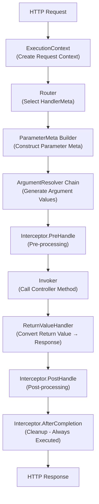

# Execution Pipeline

Understanding Spine's Request Lifecycle.

## Overview

Spine's core philosophy is **explicitness of execution flow**. While most web frameworks hide the request processing steps internally, Spine fixes every step in the code structure and reveals it clearly.

Every HTTP request **must** pass through the following pipeline in order:




## 1. Create ExecutionContext

When an HTTP request arrives, the Transport adapter (Echo) converts the request into Spine's `ExecutionContext`.

```go
// internal/adapter/echo/adapter.go
func (s *Server) handle(c echo.Context) error {
    ctx := NewContext(c)
    
    ctx.Set(
        "spine.response_writer",
        NewEchoResponseWriter(c),
    )
    
    return s.pipeline.Execute(ctx)
}
```

`ExecutionContext` is a request-scoped context shared throughout the pipeline. It provides access to all request information such as HTTP method, path, headers, query parameters, etc.


## 2. Router - Select HandlerMeta

The Router determines which Controller method to execute based on the request path and method.

```go
// internal/router/router.go
func (r *DefaultRouter) Route(ctx core.ExecutionContext) (core.HandlerMeta, error) {
    for _, route := range r.routes {
        if route.Method != ctx.Method() {
            continue
        }
        
        ok, params, keys := matchPath(route.Path, ctx.Path())
        if !ok {
            continue
        }
        
        // Inject path params
        ctx.Set("spine.params", params)
        ctx.Set("spine.pathKeys", keys)
        
        return route.Meta, nil
    }
    return core.HandlerMeta{}, fmt.Errorf("Handler not found.")
}
```

`HandlerMeta` contains metadata about the execution target:

```go
// core/handler_meta.go
type HandlerMeta struct {
    ControllerType reflect.Type   // Controller type
    Method         reflect.Method // Method to call
}
```


## 3. Construct ParameterMeta

Analyzes the signature of the Controller method to generate meta-information for each parameter.

```go
// internal/pipeline/pipeline.go
func buildParameterMeta(method reflect.Method, ctx core.ExecutionContext) []resolver.ParameterMeta {
    pathKeys := ctx.PathKeys()
    pathIdx := 0
    var metas []resolver.ParameterMeta
    
    for i := 1; i < method.Type.NumIn(); i++ {
        pt := method.Type.In(i)
        
        pm := resolver.ParameterMeta{
            Index: i - 1,
            Type:  pt,
        }
        
        // If type is path.*, assign PathKey in order
        if isPathType(pt) {
            if pathIdx < len(pathKeys) {
                pm.PathKey = pathKeys[pathIdx]
            }
            pathIdx++
        }
        
        metas = append(metas, pm)
    }
    
    return metas
}
```

**Path Parameter Binding Rule**: Spine uses order-based binding.

```go
// Route: /users/:userId/posts/:postId
// Controller:
func GetPost(userId path.Int, postId path.Int) // ✓ Matches order
```


## 4. ArgumentResolver Chain

Resolvers corresponding to each parameter type generate the actual values.

```go
// internal/pipeline/pipeline.go
func (p *Pipeline) resolveArguments(ctx core.ExecutionContext, paramMetas []resolver.ParameterMeta) ([]any, error) {
    reqCtx := ctx.(core.RequestContext)
    args := make([]any, 0, len(paramMetas))
    
    for _, paramMeta := range paramMetas {
        for _, r := range p.argumentResolvers {
            if !r.Supports(paramMeta) {
                continue
            }
            
            val, err := r.Resolve(reqCtx, paramMeta)
            if err != nil {
                return nil, err
            }
            
            args = append(args, val)
            break
        }
    }
    return args, nil
}
```

### Built-in Resolvers

| Resolver | Supported Type | Description |
|----------|----------|------|
| `PathIntResolver` | `path.Int` | Extract integer from path |
| `PathStringResolver` | `path.String` | Extract string from path |
| `PathBooleanResolver` | `path.Boolean` | Extract boolean from path |
| `PaginationResolver` | `query.Pagination` | page, size query parameters |
| `QueryValuesResolver` | `query.Values` | Full query parameter view |
| `DTOResolver` | `struct` | JSON body binding |
| `StdContextResolver` | `context.Context` | Standard Context |

### ArgumentResolver Interface

```go
// internal/resolver/argument.go
type ArgumentResolver interface {
    // Determine if this Resolver can handle the type
    Supports(parameterMeta ParameterMeta) bool
    
    // Generate actual value from Context
    Resolve(ctx core.RequestContext, parameterMeta ParameterMeta) (any, error)
}
```


## 5. Interceptor.PreHandle

Handles cross-cutting concerns before Controller invocation.

```go
// internal/pipeline/pipeline.go
for _, it := range p.interceptors {
    if err := it.PreHandle(ctx, meta); err != nil {
        if errors.Is(err, core.ErrAbortPipeline) {
            // Intentional termination (e.g., CORS preflight)
            return nil
        }
        return err
    }
}
```

### Interceptor Interface

```go
// core/interceptor.go
type Interceptor interface {
    // Executed before Controller call
    PreHandle(ctx ExecutionContext, meta HandlerMeta) error
    
    // Executed after ReturnValueHandler processing
    PostHandle(ctx ExecutionContext, meta HandlerMeta)
    
    // Called at the end regardless of success/failure
    AfterCompletion(ctx ExecutionContext, meta HandlerMeta, err error)
}
```

### Aborting the Pipeline

Returning `core.ErrAbortPipeline` in `PreHandle` skips subsequent steps. Often used in CORS preflight handling:

```go
// interceptor/cors/cors.go
if ctx.Method() == "OPTIONS" {
    rw.WriteStatus(204)
    return core.ErrAbortPipeline
}
```


## 6. Invoker - Call Controller Method

Retrieves the Controller instance from the IoC Container and calls the method.

```go
// internal/invoker/invoker.go
func (i *Invoker) Invoke(controllerType reflect.Type, method reflect.Method, args []any) ([]any, error) {
    // Resolve instance from Container
    controller, err := i.container.Resolve(controllerType)
    if err != nil {
        return nil, err
    }
    
    // Call method via reflection
    values := make([]reflect.Value, len(args)+1)
    values[0] = reflect.ValueOf(controller)
    for idx, arg := range args {
        values[idx+1] = reflect.ValueOf(arg)
    }
    
    results := method.Func.Call(values)
    
    // Convert results
    out := make([]any, len(results))
    for i, result := range results {
        out[i] = result.Interface()
    }
    
    return out, nil
}
```

**Controller Responsibility**: The Controller is responsible purely for business logic. It knows nothing about HTTP, pipelines, or execution order.

```go
func (c *UserController) GetUser(userId path.Int) (User, error) {
    if userId.Value <= 0 {
        return User{}, httperr.BadRequest("Invalid User ID")
    }
    return c.repo.FindByID(userId.Value)
}
```


## 7. ReturnValueHandler

Converts the Controller's return value into an HTTP response.

```go
// internal/pipeline/pipeline.go
func (p *Pipeline) handleReturn(ctx core.ExecutionContext, results []any) error {
    // Process error first if present
    for _, result := range results {
        if _, isErr := result.(error); isErr {
            resultType := reflect.TypeOf(result)
            for _, h := range p.returnHandlers {
                if h.Supports(resultType) {
                    return h.Handle(result, ctx)
                }
            }
        }
    }
    
    // If no error, process the first non-nil value
    for _, result := range results {
        if result == nil {
            continue
        }
        
        resultType := reflect.TypeOf(result)
        for _, h := range p.returnHandlers {
            if h.Supports(resultType) {
                return h.Handle(result, ctx)
            }
        }
    }
    return nil
}
```

### Built-in Handlers

| Handler | Supported Type | Response Format |
|---------|----------|----------|
| `JSONReturnHandler` | struct, map, slice | JSON |
| `StringReturnHandler` | string | Plain Text |
| `ErrorReturnHandler` | error | JSON (Status Code Mapping) |

### Error Handling

Using `httperr.HTTPError` maps to appropriate HTTP status codes:

```go
// internal/handler/error_return_handler.go
var httpErr *httperr.HTTPError
if errors.As(err, &httpErr) {
    status = httpErr.Status
    message = httpErr.Message
}

return rw.WriteJSON(status, map[string]any{
    "message": message,
})
```


## 8. Interceptor.PostHandle & AfterCompletion

### PostHandle

Executed in reverse order after ReturnValueHandler processing:

```go
for i := len(p.interceptors) - 1; i >= 0; i-- {
    p.interceptors[i].PostHandle(ctx, meta)
}
```

### AfterCompletion

**Always** executed regardless of success/failure. Guaranteed by `defer`:

```go
defer func() {
    for i := len(p.interceptors) - 1; i >= 0; i-- {
        p.interceptors[i].AfterCompletion(ctx, meta, finalErr)
    }
}()
```

Used for resource cleanup, logging, metrics collection, etc.


## Context Separation Design

Spine clearly separates Context into two layers:

### ExecutionContext

Context for execution flow control used throughout the pipeline:

```go
type ExecutionContext interface {
    Context() context.Context
    Method() string
    Path() string
    Params() map[string]string
    Header(name string) string
    PathKeys() []string
    Queries() map[string][]string
    Set(key string, value any)
    Get(key string) (any, bool)
}
```

### RequestContext

Context dedicated to input interpretation, used only in ArgumentResolver:

```go
type RequestContext interface {
    Param(name string) string
    Query(name string) string
    Params() map[string]string
    Queries() map[string][]string
    Bind(out any) error
}
```

**Design Principle**: Controller and Resolver do not directly reference `ExecutionContext`. This achieves complete separation of execution model and business logic.


## Full Execution Flow Code

```go
// internal/pipeline/pipeline.go
func (p *Pipeline) Execute(ctx core.ExecutionContext) (finalErr error) {
    // 1. Router determines execution target
    meta, err := p.router.Route(ctx)
    if err != nil {
        return err
    }
    
    // 2. Create ParameterMeta
    paramMetas := buildParameterMeta(meta.Method, ctx)
    
    // 3. Application ArgumentResolver Chain
    args, err := p.resolveArguments(ctx, paramMetas)
    if err != nil {
        return err
    }
    
    // 4. Interceptor PreHandle
    for _, it := range p.interceptors {
        if err := it.PreHandle(ctx, meta); err != nil {
            if errors.Is(err, core.ErrAbortPipeline) {
                return nil
            }
            return err
        }
    }
    
    // 5. Call Controller Method
    results, err := p.invoker.Invoke(meta.ControllerType, meta.Method, args)
    if err != nil {
        return err
    }
    
    // 6. Process ReturnValueHandler
    if err := p.handleReturn(ctx, results); err != nil {
        return err
    }
    
    // 7. Interceptor PostHandle (Reverse Order)
    for i := len(p.interceptors) - 1; i >= 0; i-- {
        p.interceptors[i].PostHandle(ctx, meta)
    }
    
    // 8. AfterCompletion (Always Executed)
    defer func() {
        for i := len(p.interceptors) - 1; i >= 0; i-- {
            p.interceptors[i].AfterCompletion(ctx, meta, finalErr)
        }
    }()
    
    return nil
}
```


## Summary

| Step | Component | Responsibility |
|------|----------|------|
| 1 | Transport Adapter | HTTP → ExecutionContext Conversion |
| 2 | Router | Request Path → HandlerMeta Mapping |
| 3 | ParameterMeta Builder | Method Signature Analysis |
| 4 | ArgumentResolver | Parameter Type → Actual Value Generation |
| 5 | Interceptor.PreHandle | Pre-processing (Auth, Logging, etc.) |
| 6 | Invoker | Controller Method Invocation |
| 7 | ReturnValueHandler | Return Value → HTTP Response Conversion |
| 8 | Interceptor.PostHandle | Post-processing |
| 9 | Interceptor.AfterCompletion | Cleanup (Always Executed) |

This order is **not hidden and is not implicitly changed.** This is Spine's "No Magic" philosophy.
