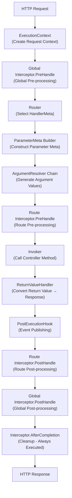

# Execution Pipeline

Understanding Spine's Request Lifecycle.

## Overview

Spine's core philosophy is **explicitness of execution flow**. While most web frameworks hide the request processing steps internally, Spine fixes every step in the code structure and reveals it clearly.

Every HTTP request **must** pass through the following pipeline in order:


```mermaid
graph TD
    Request["HTTP Request"]
    
    ExecutionContext["ExecutionContext<br>(Create Request Context)"]
    GlobalPre["Global Interceptor.PreHandle<br>(Global Pre-processing)"]
    Router["Router<br>(Select HandlerMeta)"]
    ParamMeta["ParameterMeta Builder<br>(Construct Parameter Meta)"]
    ArgResolver["ArgumentResolver Chain<br>(Generate Argument Values)"]
    RoutePre["Route Interceptor.PreHandle<br>(Route Pre-processing)"]
    Invoker["Invoker<br>(Call Controller Method)"]
    ReturnHandler["ReturnValueHandler<br>(Convert Return Value → Response)"]
    PostHook["PostExecutionHook<br>(Event Publishing)"]
    RoutePost["Route Interceptor.PostHandle<br>(Route Post-processing)"]
    GlobalPost["Global Interceptor.PostHandle<br>(Global Post-processing)"]
    AfterCompletion["Interceptor.AfterCompletion<br>(Cleanup - Always Executed)"]
    Response["HTTP Response"]

    Request --> ExecutionContext
    ExecutionContext --> GlobalPre
    GlobalPre --> Router
    Router --> ParamMeta
    ParamMeta --> ArgResolver
    ArgResolver --> RoutePre
    RoutePre --> Invoker
    Invoker --> ReturnHandler
    ReturnHandler --> PostHook
    PostHook --> RoutePost
    RoutePost --> GlobalPost
    GlobalPost --> AfterCompletion
    AfterCompletion --> Response
```


## 1. Create ExecutionContext

When an HTTP request arrives, the Transport adapter (Echo) converts the request into Spine's `ExecutionContext`.

```go
// internal/adapter/echo/adapter.go
func (s *Server) handle(c echo.Context) error {
    ctx := NewContext(c)
    
    ctx.Set(
        "spine.response_writer",
        NewEchoResponseWriter(c),
    )
    
    return s.pipeline.Execute(ctx)
}
```

`ExecutionContext` is a request-scoped context shared throughout the pipeline. It provides access to all request information such as HTTP method, path, headers, query parameters, etc.


## Interceptor Scopes

Spine introduces the concepts of **Global Interceptors** and **Route Interceptors** to clearly separate concerns.

| Scope | Execution Point | Main Use Cases |
|------|-----------|-----------|
| **Global** | Before routing | CORS preflight, global logging, Request ID generation |
| **Route** | After routing | Authentication/Authorization, Tenant validation, business validation |

**Crucial Difference**:
- Global Interceptors do not know the `HandlerMeta` during `PreHandle` (since routing hasn't happened yet).
- Route Interceptors can use `HandlerMeta` during `PreHandle` to make decisions based on the Controller or Method.


## 2. Global Interceptor (PreHandle)

Deals with concerns that must be handled before the routing determines the execution target.

```go
// internal/pipeline/pipeline.go
globalMeta := core.HandlerMeta{}
for _, it := range p.interceptors {
    if err := it.PreHandle(ctx, globalMeta); err != nil {
        if errors.Is(err, core.ErrAbortPipeline) {
            return nil
        }
        return err
    }
}
```


## 3. Router - Select HandlerMeta

The Router determines which Controller method to execute based on the request path and method.

```go
// internal/router/router.go
func (r *DefaultRouter) Route(ctx core.ExecutionContext) (core.HandlerMeta, error) {
    for _, route := range r.routes {
        if route.Method != ctx.Method() {
            continue
        }
        
        ok, params, keys := matchPath(route.Path, ctx.Path())
        if !ok {
            continue
        }
        
        // Inject path params
        ctx.Set("spine.params", params)
        ctx.Set("spine.pathKeys", keys)
        
        return route.Meta, nil
    }
    return core.HandlerMeta{}, fmt.Errorf("Handler not found.")
}
```

`HandlerMeta` contains metadata about the execution target:

```go
// core/handler_meta.go
type HandlerMeta struct {
    ControllerType reflect.Type   // Controller type
    Method         reflect.Method // Method to call
}
```


## 4. Construct ParameterMeta

Analyzes the signature of the Controller method to generate meta-information for each parameter.

```go
// internal/pipeline/pipeline.go
func buildParameterMeta(method reflect.Method, ctx core.ExecutionContext) []resolver.ParameterMeta {
    pathKeys := ctx.PathKeys()
    pathIdx := 0
    var metas []resolver.ParameterMeta
    
    for i := 1; i < method.Type.NumIn(); i++ {
        pt := method.Type.In(i)
        
        pm := resolver.ParameterMeta{
            Index: i - 1,
            Type:  pt,
        }
        
        // If type is path.*, assign PathKey in order
        if isPathType(pt) {
            if pathIdx < len(pathKeys) {
                pm.PathKey = pathKeys[pathIdx]
            }
            pathIdx++
        }
        
        metas = append(metas, pm)
    }
    
    return metas
}
```

**Path Parameter Binding Rule**: Spine uses order-based binding.

```go
// Route: /users/:userId/posts/:postId
// Controller:
func GetPost(userId path.Int, postId path.Int) // ✓ Matches order
```


## 5. ArgumentResolver Chain

Resolvers corresponding to each parameter type generate the actual values.

```go
// internal/pipeline/pipeline.go
func (p *Pipeline) resolveArguments(ctx core.ExecutionContext, paramMetas []resolver.ParameterMeta) ([]any, error) {
    reqCtx := ctx.(core.RequestContext)
    args := make([]any, 0, len(paramMetas))
    
    for _, paramMeta := range paramMetas {
        for _, r := range p.argumentResolvers {
            if !r.Supports(paramMeta) {
                continue
            }
            
            val, err := r.Resolve(reqCtx, paramMeta)
            if err != nil {
                return nil, err
            }
            
            args = append(args, val)
            break
        }
    }
    return args, nil
}
```

### Built-in Resolvers

| Resolver | Supported Type | Description |
|----------|----------|------|
| `PathIntResolver` | `path.Int` | Extract integer from path |
| `PathStringResolver` | `path.String` | Extract string from path |
| `PathBooleanResolver` | `path.Boolean` | Extract boolean from path |
| `PaginationResolver` | `query.Pagination` | page, size query parameters |
| `QueryValuesResolver` | `query.Values` | Full query parameter view |
| `DTOResolver` | `struct` | JSON body binding |
| `StdContextResolver` | `context.Context` | Standard Context |

### ArgumentResolver Interface

```go
// internal/resolver/argument.go
type ArgumentResolver interface {
    // Determine if this Resolver can handle the type
    Supports(parameterMeta ParameterMeta) bool
    
    // Generate actual value from Context
    Resolve(ctx core.RequestContext, parameterMeta ParameterMeta) (any, error)
}
```


## 6. Route Interceptor (PreHandle)

Handles cross-cutting concerns that apply specifically to the resolved route before Controller invocation.

```go
// internal/pipeline/pipeline.go
for _, it := range routeInterceptors {
    if err := it.PreHandle(ctx, meta); err != nil {
        if errors.Is(err, core.ErrAbortPipeline) {
            // Intentional termination (e.g., Auth failure)
            return nil
        }
        return err
    }
}
```

### Interceptor Interface

```go
// core/interceptor.go
type Interceptor interface {
    // Executed before Controller call
    PreHandle(ctx ExecutionContext, meta HandlerMeta) error
    
    // Executed after ReturnValueHandler processing
    PostHandle(ctx ExecutionContext, meta HandlerMeta)
    
    // Called at the end regardless of success/failure
    AfterCompletion(ctx ExecutionContext, meta HandlerMeta, err error)
}
```

### Aborting the Pipeline

Returning `core.ErrAbortPipeline` in `PreHandle` skips subsequent steps (but `AfterCompletion` is always executed).

```go
// interceptor/cors/cors.go
if ctx.Method() == "OPTIONS" {
    rw.WriteStatus(204)
    return core.ErrAbortPipeline
}
```


## 7. Invoker - Call Controller Method

Retrieves the Controller instance from the IoC Container and calls the method.

```go
// internal/invoker/invoker.go
func (i *Invoker) Invoke(controllerType reflect.Type, method reflect.Method, args []any) ([]any, error) {
    // Resolve instance from Container
    controller, err := i.container.Resolve(controllerType)
    if err != nil {
        return nil, err
    }
    
    // Call method via reflection
    values := make([]reflect.Value, len(args)+1)
    values[0] = reflect.ValueOf(controller)
    for idx, arg := range args {
        values[idx+1] = reflect.ValueOf(arg)
    }
    
    results := method.Func.Call(values)
    
    // Convert results
    out := make([]any, len(results))
    for i, result := range results {
        out[i] = result.Interface()
    }
    
    return out, nil
}
```

**Controller Responsibility**: The Controller is responsible purely for business logic. It knows nothing about HTTP, pipelines, or execution order.

```go
func (c *UserController) GetUser(userId path.Int) (User, error) {
    if userId.Value <= 0 {
        return User{}, httperr.BadRequest("Invalid User ID")
    }
    return c.repo.FindByID(userId.Value)
}
```


## 8. ReturnValueHandler

Converts the Controller's return value into an HTTP response.

```go
// internal/pipeline/pipeline.go
func (p *Pipeline) handleReturn(ctx core.ExecutionContext, results []any) error {
    // Process error first if present
    for _, result := range results {
        if _, isErr := result.(error); isErr {
            resultType := reflect.TypeOf(result)
            for _, h := range p.returnHandlers {
                if h.Supports(resultType) {
                    return h.Handle(result, ctx)
                }
            }
        }
    }
    
    // If no error, process the first non-nil value
    for _, result := range results {
        if result == nil {
            continue
        }
        
        resultType := reflect.TypeOf(result)
        for _, h := range p.returnHandlers {
            if h.Supports(resultType) {
                return h.Handle(result, ctx)
            }
        }
    }
    return nil
}
```

### Built-in Handlers

| Handler | Supported Type | Response Format |
|---------|----------|----------|
| `JSONReturnHandler` | struct, map, slice | JSON |
| `StringReturnHandler` | string | Plain Text |
| `ErrorReturnHandler` | error | JSON (Status Code Mapping) |

### Error Handling

Using `httperr.HTTPError` maps to appropriate HTTP status codes:

```go
// internal/handler/error_return_handler.go
var httpErr *httperr.HTTPError
if errors.As(err, &httpErr) {
    status = httpErr.Status
    message = httpErr.Message
}

return rw.WriteJSON(status, map[string]any{
    "message": message,
})
```


## 9. PostExecutionHook

Executes post-execution logic such as dispatching collected domain events after the ReturnValueHandler completes.

```go
// internal/pipeline/pipeline.go
for _, hook := range p.postHooks {
    hook.AfterExecution(ctx, results, returnError)
}
```

If the controller returned an error or if an error occurred in ReturnValueHandler, it is passed via `returnError`.


## 10. Interceptor PostHandle & AfterCompletion

### PostHandle

Executed in reverse order after all normal execution (including hooks) has finished.

```go
// Route Interceptor PostHandle
for i := len(routeInterceptors) - 1; i >= 0; i-- {
    routeInterceptors[i].PostHandle(ctx, meta)
}

// Global Interceptor PostHandle
for i := len(p.interceptors) - 1; i >= 0; i-- {
    p.interceptors[i].PostHandle(ctx, meta)
}
```

### AfterCompletion

**Always** executed regardless of success/failure, thanks to `defer`.

```go
// Route Interceptors
defer func() {
    for i := len(routeInterceptors) - 1; i >= 0; i-- {
        routeInterceptors[i].AfterCompletion(ctx, meta, finalErr)
    }
}()

// Global Interceptors
defer func() {
    for i := len(p.interceptors) - 1; i >= 0; i-- {
        p.interceptors[i].AfterCompletion(ctx, meta, finalErr)
    }
}()
```

Used for resource cleanup, logging, metrics collection, etc.


## Error Safety Net (handleExecutionError)

If an error occurs during Pipeline execution, it falls back to write a final safety-net response. Prevents double response if already committed.

```go
// internal/pipeline/pipeline.go
defer func() {
    if finalErr != nil {
        p.handleExecutionError(ctx, finalErr)
    }
}()

func (p *Pipeline) handleExecutionError(ctx core.ExecutionContext, err error) {
    rwAny, ok := ctx.Get("spine.response_writer")
    if !ok {
        return
    }
    rw, ok := rwAny.(core.ResponseWriter)
    if !ok {
        return
    }
    
    // Check if already committed to avoid double response
    if rw.IsCommitted() {
        return
    }
    
    var httpErr *httperr.HTTPError
    if errors.As(err, &httpErr) {
        rw.WriteJSON(httpErr.Status, map[string]any{
            "message": httpErr.Message,
        })
        return
    }
    
    rw.WriteJSON(500, map[string]any{
        "message": "Internal server error",
    })
}
```

## Interceptor Execution Order Details

The actual execution order verified by tests:

### Normal Flow

```
pre:global → pre:route → [Controller] → post:route → post:global → after:route → after:global
```

### Abort in Route Interceptor (ErrAbortPipeline)

```
pre:global → pre:route → after:route → after:global
```

The Controller is not called, but `AfterCompletion` is always executed.

### Abort in Global Interceptor (ErrAbortPipeline)

```
pre:global → after:global
```

The Router isn't called, which means Route Interceptors are not executed.


## Full Execution Flow Code

```go
// internal/pipeline/pipeline.go
func (p *Pipeline) Execute(ctx core.ExecutionContext) (finalErr error) {
    // Error safety net: write response on error
    defer func() {
        if finalErr != nil {
            p.handleExecutionError(ctx, finalErr)
        }
    }()

    // Global Interceptor AfterCompletion (Always executed)
    globalMeta := core.HandlerMeta{}
    defer func() {
        for i := len(p.interceptors) - 1; i >= 0; i-- {
            p.interceptors[i].AfterCompletion(ctx, globalMeta, finalErr)
        }
    }()

    // 1. Global Interceptor PreHandle (Before routing)
    for _, it := range p.interceptors {
        if err := it.PreHandle(ctx, globalMeta); err != nil {
            if errors.Is(err, core.ErrAbortPipeline) {
                return nil
            }
            return err
        }
    }

    // 2. Router determines execution target
    meta, err := p.router.Route(ctx)
    if err != nil {
        return err
    }

    routeInterceptors := meta.Interceptors

    // Route Interceptor AfterCompletion (Always executed)
    defer func() {
        for i := len(routeInterceptors) - 1; i >= 0; i-- {
            routeInterceptors[i].AfterCompletion(ctx, meta, finalErr)
        }
    }()

    // 3. Create ParameterMeta
    paramMetas := buildParameterMeta(meta.Method, ctx)

    // 4. ArgumentResolver Chain
    args, err := p.resolveArguments(ctx, paramMetas)
    if err != nil {
        return err
    }

    // 5. Route Interceptor PreHandle
    for _, it := range routeInterceptors {
        if err := it.PreHandle(ctx, meta); err != nil {
            if errors.Is(err, core.ErrAbortPipeline) {
                return nil
            }
            return err
        }
    }

    // 6. Call Controller Method
    results, err := p.invoker.Invoke(meta.ControllerType, meta.Method, args)
    if err != nil {
        return err
    }

    // 7. Process ReturnValueHandler
    returnError := p.handleReturn(ctx, results)

    // 8. PostExecutionHook (Domain event dispatch)
    for _, hook := range p.postHooks {
        hook.AfterExecution(ctx, results, returnError)
    }

    if returnError != nil {
        return returnError
    }

    // 9. Route Interceptor PostHandle (Reverse Order)
    for i := len(routeInterceptors) - 1; i >= 0; i-- {
        routeInterceptors[i].PostHandle(ctx, meta)
    }

    // 10. Global Interceptor PostHandle (Reverse Order)
    for i := len(p.interceptors) - 1; i >= 0; i-- {
        p.interceptors[i].PostHandle(ctx, meta)
    }

    return nil
}
```

## Pipeline Struct

```go
// internal/pipeline/pipeline.go
type Pipeline struct {
    router            router.Router
    interceptors      []core.Interceptor
    argumentResolvers []resolver.ArgumentResolver
    returnHandlers    []handler.ReturnValueHandler
    invoker           *invoker.Invoker
    postHooks         []hook.PostExecutionHook
}
```

Pipeline is used not only for HTTP pipelines but identically for Consumer Pipelines and WebSocket Pipelines. Separate Pipeline instances are created per Transport, with just different Resolvers and Handlers configured.


## Summary

| Step | Component | Responsibility |
|------|----------|------|
| 1 | Transport Adapter | HTTP → ExecutionContext Conversion |
| 2 | Global Interceptor.PreHandle | Global Pre-processing (CORS, etc.) before routing |
| 3 | Router | Request Path → HandlerMeta Mapping |
| 4 | ParameterMeta Builder | Method Signature Analysis |
| 5 | ArgumentResolver | Parameter Type → Actual Value Generation |
| 6 | Route Interceptor.PreHandle | Route Pre-processing (Auth, etc.) |
| 7 | Invoker | Controller Method Invocation |
| 8 | ReturnValueHandler | Return Value → HTTP Response Conversion |
| 9 | PostExecutionHook | Domain event dispatch & post-processing |
| 10 | Route Interceptor.PostHandle ↩ | Route Post-processing (Reverse Order) |
| 11 | Global Interceptor.PostHandle ↩ | Global Post-processing (Reverse Order) |
| 12 | AfterCompletion ↩ | Cleanup (Route → Global, Always Executed) |
| 13 | handleExecutionError | Error Safety Net (prevents double response) |

This order is **not hidden and is not implicitly changed.** This is Spine's "No Magic" philosophy.
