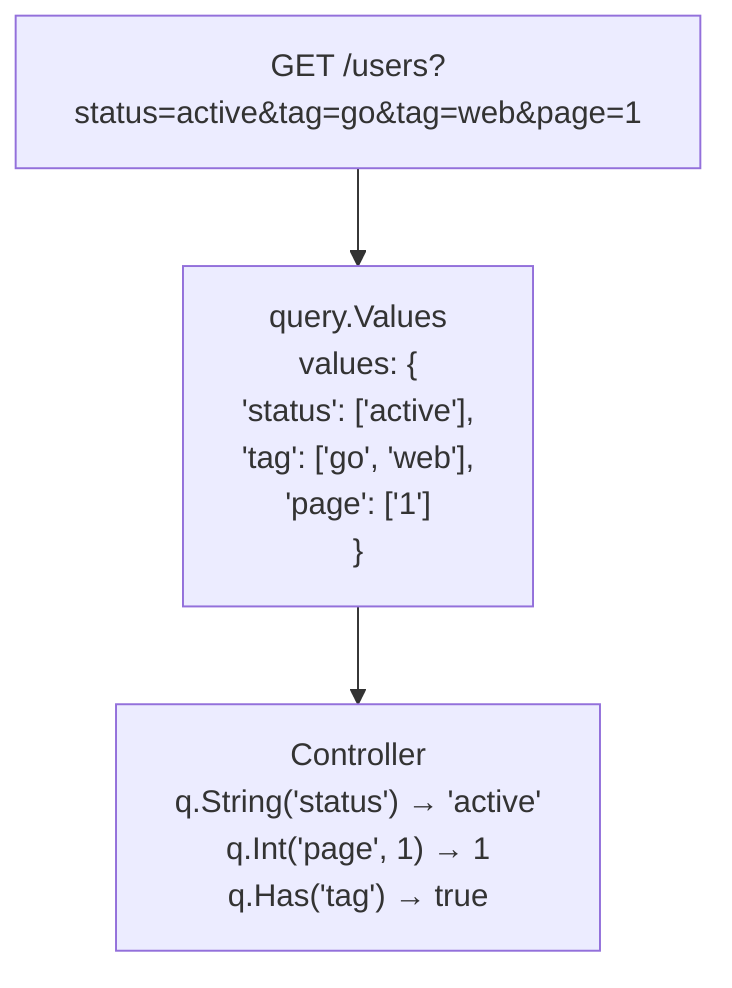

# query.Values

Handling query parameters explicitly.

## Overview

`query.Values` provides a read-only view of all HTTP query parameters. Spine does not automatically map query parameters to DTOs. Instead, it is designed so that the Controller explicitly retrieves necessary values via `query.Values`.




## Why not automatic mapping?

Most frameworks automatically bind query parameters using struct tags:

```go
// Other frameworks
type SearchParams struct {
    Status string   `query:"status"`
    Tags   []string `query:"tag"`
    Page   int      `query:"page"`
}

func Search(params SearchParams) { ... }
```

Spine does not adopt this approach.

### Reason 1: Explicitness

Query parameters are mutable and optional. Automatic mapping hides "where a parameter came from".

```go
// Spine way: Explicit extraction
func Search(q query.Values) []User {
    status := q.String("status")      // Clear source
    page := q.Int("page", 1)          // Explicit default
    
    if q.Has("premium") {             // Conditional processing
        // ...
    }
}
```

### Reason 2: Flexibility

Struct-based binding becomes a constraint when handling dynamic queries like search APIs.

```go
// Dynamic filter handling
func Search(q query.Values) []Product {
    filters := make(map[string]string)
    
    // Cannot know beforehand which filters will come
    if q.Has("min_price") {
        filters["min_price"] = q.String("min_price")
    }
    if q.Has("max_price") {
        filters["max_price"] = q.String("max_price")
    }
    if q.Has("category") {
        filters["category"] = q.String("category")
    }
    
    return c.repo.FindByFilters(filters)
}
```


## Values Struct

```go
// pkg/query/types.go
type Values struct {
    values map[string][]string
}

func NewValues(values map[string][]string) Values {
    return Values{values: values}
}
```

`Values` is a wrapper around `map[string][]string`. Each key can have multiple values (e.g., `?tag=go&tag=web`).


## Methods

### String(key string) string

Returns the first value of the specified key as a string. Returns empty string if the key does not exist.

```go
// GET /users?name=john&status=active

q.String("name")    // "john"
q.String("status")  // "active"
q.String("missing") // ""
```

### Get(key string) string

Same as `String()`. Provided as an alias.

```go
q.Get("name")  // "john"
```

### Int(key string, def int64) int64

Parses the value of the specified key as an integer. Returns the default value if parsing fails or key does not exist.

```go
// GET /users?page=3&size=20

q.Int("page", 1)    // 3
q.Int("size", 10)   // 20
q.Int("offset", 0)  // 0 (key missing → default)
q.Int("page", 1)    // 1 (if page=abc → default)
```

### GetBoolByKey(key string, def bool) bool

Parses the value of the specified key as a boolean.

**Recognized as true**: `"true"`, `"1"`, `"yes"`, `"y"`, `"on"` (case insensitive)

**Recognized as false**: `"false"`, `"0"`, `"no"`, `"n"`, `"off"` (case insensitive)

```go
// GET /users?active=true&verified=1&premium=yes

q.GetBoolByKey("active", false)    // true
q.GetBoolByKey("verified", false)  // true
q.GetBoolByKey("premium", false)   // true
q.GetBoolByKey("deleted", false)   // false (key missing → default)
q.GetBoolByKey("active", false)    // false (if active=maybe → default)
```

### Has(key string) bool

Checks if the specified key exists. Returns `true` if the key exists even if the value is empty.

```go
// GET /users?status=active&empty=

q.Has("status")  // true
q.Has("empty")   // true (value empty but key exists)
q.Has("missing") // false
```


## QueryValuesResolver

If `query.Values` type is used as a Controller parameter, `QueryValuesResolver` automatically generates the value.

```go
// internal/resolver/query_values_resolver.go
type QueryValuesResolver struct{}

func (r *QueryValuesResolver) Supports(pm ParameterMeta) bool {
    return pm.Type == reflect.TypeFor[query.Values]()
}

func (r *QueryValuesResolver) Resolve(ctx core.RequestContext, parameterMeta ParameterMeta) (any, error) {
    return query.NewValues(ctx.Queries()), nil
}
```

### How it works

1. Pipeline analyzes Controller signature
2. Finds `query.Values` type parameter
3. `QueryValuesResolver.Supports()` → `true`
4. `QueryValuesResolver.Resolve()` called
5. Get full query map via `ctx.Queries()`
6. Wrap with `query.NewValues()` and return


## Usage Examples

### Basic Usage

```go
// cmd/demo/controller.go
func (c *UserController) GetUserQuery(q query.Values) User {
    return User{
        ID:   q.Int("id", 0),
        Name: q.String("name"),
    }
}
```

```bash
# Request
GET /users?id=123&name=john

# Response
{
    "id": 123,
    "name": "john"
}
```

### Search API

```go
func (c *ProductController) Search(q query.Values) SearchResult {
    keyword := q.String("q")
    category := q.String("category")
    minPrice := q.Int("min_price", 0)
    maxPrice := q.Int("max_price", 999999)
    inStock := q.GetBoolByKey("in_stock", true)
    
    products := c.repo.Search(SearchCriteria{
        Keyword:  keyword,
        Category: category,
        MinPrice: minPrice,
        MaxPrice: maxPrice,
        InStock:  inStock,
    })
    
    return SearchResult{
        Query:    keyword,
        Count:    len(products),
        Products: products,
    }
}
```

```bash
GET /products?q=laptop&category=electronics&min_price=500&in_stock=true
```

### With Pagination

You can use `query.Values` and `query.Pagination` together.

```go
func (c *UserController) List(p query.Pagination, q query.Values) PagedResult {
    status := q.String("status")
    sortBy := q.String("sort_by")
    
    users := c.repo.FindAll(status, sortBy, p.Page, p.Size)
    total := c.repo.Count(status)
    
    return PagedResult{
        Data:  users,
        Page:  p.Page,
        Size:  p.Size,
        Total: total,
    }
}
```

```bash
GET /users?page=2&size=20&status=active&sort_by=created_at
```

### Conditional Filter

```go
func (c *OrderController) List(q query.Values) []Order {
    filters := OrderFilters{}
    
    if q.Has("user_id") {
        filters.UserID = q.Int("user_id", 0)
    }
    
    if q.Has("status") {
        filters.Status = q.String("status")
    }
    
    if q.Has("from_date") {
        filters.FromDate = parseDate(q.String("from_date"))
    }
    
    if q.Has("to_date") {
        filters.ToDate = parseDate(q.String("to_date"))
    }
    
    return c.repo.FindByFilters(filters)
}
```


## Handling Multiple Values

Query parameters can have multiple values for the same key.

```
GET /products?tag=go&tag=web&tag=api
```

Currently, `String()` and `Get()` methods of `query.Values` return only the first value. If you need multiple values, you can add a method to access the internal map directly, or use comma-separated values parsing.

```go
// Comma separated way
// GET /products?tags=go,web,api

func (c *ProductController) Search(q query.Values) []Product {
    tagsRaw := q.String("tags")
    tags := strings.Split(tagsRaw, ",")
    
    return c.repo.FindByTags(tags)
}
```


## Difference with query.Pagination

| Feature | query.Values | query.Pagination |
|------|--------------|------------------|
| **Usage** | Variable query parameters | Fixed pagination |
| **Parameters** | All queries | `page`, `size` only |
| **Default** | Specified at method call | Automatically applied (page=1, size=20) |
| **Type Conversion** | Explicit | Automatic |

### Selection Criteria

```go
// Only fixed pagination needed → query.Pagination
func List(p query.Pagination) []User

// Dynamic filter + pagination → Use both
func Search(p query.Pagination, q query.Values) []User

// Completely dynamic query → query.Values only
func CustomSearch(q query.Values) []User
```

## Design Principles

### 1. Explicit Extraction

```go
// ✓ Spine: Clear where it comes from
status := q.String("status")
page := q.Int("page", 1)

// ❌ Automatic Binding: Unclear source
func Search(params SearchParams) // Does status come from query? body? path?
```

### 2. Explicit Defaults

```go
// ✓ Defaults revealed in code
page := q.Int("page", 1)
size := q.Int("size", 20)

// ❌ Defaults hidden in struct tags
type Params struct {
    Page int `query:"page" default:"1"`  // Hard to trace where it's set
}
```

### 3. Optional Parameter Handling

```go
// ✓ Explicit check for existence with Has()
if q.Has("premium") {
    filters.Premium = q.GetBoolByKey("premium", false)
}

// ❌ Automatic binding can't distinguish zero value from "missing"
type Params struct {
    Premium bool `query:"premium"`  // Is false default or explicitly false?
}
```

## Summary

| Method | Return Type | Usage |
|--------|----------|------|
| `String(key)` | `string` | String value (returns `""` if missing) |
| `Get(key)` | `string` | Alias for `String()` |
| `Int(key, def)` | `int64` | Integer value (default if failed) |
| `GetBoolByKey(key, def)` | `bool` | Boolean value (default if failed) |
| `Has(key)` | `bool` | Key existence |

**Core Philosophy**: Spine does not map query parameters "magically". Controllers explicitly retrieve necessary values via `query.Values`. This aligns with Spine's "No Magic" principle.
