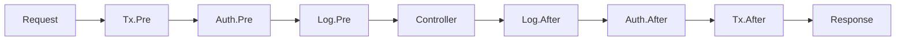

# Introduction

## What is Spine?

Spine is a **Go web framework that doesn't hide the request process**.

It reveals how a request is interpreted, in what order it executes, when business logic is invoked, and how the response is finalized through an explicit execution pipeline.

```go
func main() {
    app := spine.New()
    
    // Register dependencies — order doesn't matter, just register constructors and it's resolved automatically
    app.Constructor(NewUserRepository, NewUserService, NewUserController)
    
    // Interceptors — execution order is visible in code
    app.Interceptor(&TxInterceptor{}, &LoggingInterceptor{})
    
    // Routes — clear which method maps to which path
    app.Route("GET", "/users", (*UserController).GetUser)
    
    app.Run(boot.Options{
		Address:                ":8080",
		EnableGracefulShutdown: true,
		ShutdownTimeout:        10 * time.Second,
	})
}
```

## Why Spine?

### No Hidden Magic

Spring Boot's `@Autowired`, NestJS's `@Injectable`.
Convenient, but hard to know what happens inside.

Spine is different.

- **No Annotations** — Pure Go code
- **No Module Definitions** — Dependency Injection resolved just by registering constructors
- **No Proxies** — Intuitive stack traces

Read the code and you see the execution flow.

### Familiar Structure

If you have used Spring or NestJS, you can start right away.

```
Controller → Service → Repository
```

Constructor injection, interceptor chain, layered architecture.
Familiar patterns brought to Go.

### Go Performance

- No JVM warmup
- No Node.js runtime initialization
- Compiled binary runs immediately

Optimized for containers and serverless environments.

## Core Concepts

### 1. Constructor-based DI

```go
// Constructor parameters are dependency declarations
func NewUserService(repo *UserRepository) *UserService {
    return &UserService{repo: repo}
}

// Just register and the dependency graph is resolved automatically
app.Constructor(NewUserRepository, NewUserService, NewUserController)
```

### 2. Interceptor Pipeline

```go
app.Interceptor(
    &TxInterceptor{},      // 1. Start transaction
    &AuthInterceptor{},    // 2. Check auth
    &LoggingInterceptor{}, // 3. Logging
)

```

**Execution Order:**



### 3. Explicit Routing

```go
// Manage all routes in one place
func RegisterUserRoutes(app spine.App) {
    app.Route("GET", "/users", (*UserController).GetUser)
    app.Route("POST", "/users", (*UserController).CreateUser)
    app.Route("PUT", "/users", (*UserController).UpdateUser)
    app.Route("DELETE", "/users", (*UserController).DeleteUser)
}
```

### 4. Type-safe Handlers

```go
// Function signature is the API spec
func (c *UserController) GetUser(
    ctx context.Context,      // Context
    q query.Values,           // Query parameters
) (UserResponse, error) {     // Response type
    return c.svc.Get(ctx, q.Int("id", 0))
}

// DTO is automatically bound
func (c *UserController) CreateUser(
    ctx context.Context,
    req CreateUserRequest,    // JSON body → Struct
) (UserResponse, error) {
    return c.svc.Create(ctx, req)
}
```

## Comparison with other frameworks

| | Spine | NestJS | Spring Boot |
|---|:---:|:---:|:---:|
| **Language** | Go | TypeScript | Java/Kotlin |
| **Runtime** | Native Binary | Node.js | JVM |
| **IoC Container** | ✅ | ✅ | ✅ |
| **Annotations/Decorators** | Unnecessary | Required | Required |
| **Module Definition** | Unnecessary | Required | Unnecessary |
| **Type Safety** | Compile Time | Runtime | Compile Time |


## Ready to start?

```bash
go get github.com/NARUBROWN/spine
```

[5 Minute Quickstart →](/en/learn/getting-started/first-app)
