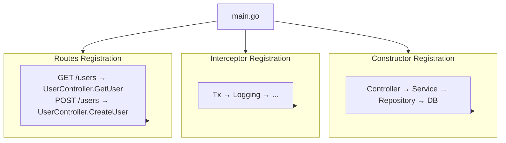

# Project Structure

How to structure a Spine project.

## Recommended Structure

```
my-app/
├── main.go                  # App entry point
├── go.mod
├── go.sum
│
├── controller/              # Controller layer
│   └── user_controller.go
│
├── service/                 # Service layer (Business logic)
│   └── user_service.go
│
├── repository/              # Repository layer (Data access)
│   └── user_repository.go
│
├── entity/                  # Database entities
│   └── user.go
│
├── dto/                     # Request/Response objects
│   ├── user_request.go
│   └── user_response.go
│
├── routes/                  # Route definitions
│   └── user_routes.go
│
├── interceptor/             # Interceptors
│   ├── tx_interceptor.go
│   └── logging_interceptor.go
│
└── migrations/              # DB migrations
    ├── 001_create_users.up.sql
    └── 001_create_users.down.sql
```


## Role of Each Layer

### main.go

Entry point of the app. Performs constructor registration, interceptor setup, and route registration.

```go
package main

func main() {
    app := spine.New()

    // 1. Register Constructors
    app.Constructor(
        NewDB,
        repository.NewUserRepository,
        service.NewUserService,
        controller.NewUserController,
        interceptor.NewTxInterceptor,
    )

    // 2. Register Interceptors
    app.Interceptor(
        (*interceptor.TxInterceptor)(nil),
        &interceptor.LoggingInterceptor{},
    )

    // 3. Register Routes
    routes.RegisterUserRoutes(app)

    // 4. Start Server
    app.Run(boot.Options{
		Address:                ":8080",
		EnableGracefulShutdown: true,
		ShutdownTimeout:        10 * time.Second,
	})
}
```

### controller/

Receives HTTP requests and delegates to services. Does not contain business logic.

```go
// controller/user_controller.go
package controller

type UserController struct {
    svc *service.UserService  // Service dependency
}

func NewUserController(svc *service.UserService) *UserController {
    return &UserController{svc: svc}
}

// Function signature is the API spec
func (c *UserController) GetUser(
    ctx context.Context,
    q query.Values,
) (dto.UserResponse, error) {
    id := int(q.Int("id", 0))
    return c.svc.Get(ctx, id)
}

func (c *UserController) CreateUser(
    ctx context.Context,
    req dto.CreateUserRequest,
) (dto.UserResponse, error) {
    return c.svc.Create(ctx, req.Name, req.Email)
}
```


### service/

Handles business logic. Accesses data via repositories.

```go
// service/user_service.go
package service

type UserService struct {
    repo *repository.UserRepository  // Repository dependency
}

func NewUserService(repo *repository.UserRepository) *UserService {
    return &UserService{repo: repo}
}

func (s *UserService) Get(ctx context.Context, id int) (dto.UserResponse, error) {
    user, err := s.repo.FindByID(ctx, id)
    if err != nil {
        return dto.UserResponse{}, err
    }
    
    return dto.UserResponse{
        ID:    int(user.ID),
        Name:  user.Name,
        Email: user.Email,
    }, nil
}

func (s *UserService) Create(ctx context.Context, name, email string) (dto.UserResponse, error) {
    user := &entity.User{Name: name, Email: email}
    
    if err := s.repo.Save(ctx, user); err != nil {
        return dto.UserResponse{}, err
    }
    
    return dto.UserResponse{
        ID:    int(user.ID),
        Name:  user.Name,
        Email: user.Email,
    }, nil
}
```


### repository/

Handles database access. SQL queries or ORM calls are located here.

```go
// repository/user_repository.go
package repository

type UserRepository struct {
    db bun.IDB  // Accepts both bun.DB or bun.Tx
}

func NewUserRepository(db bun.IDB) *UserRepository {
    return &UserRepository{db: db}
}

func (r *UserRepository) FindByID(ctx context.Context, id int) (*entity.User, error) {
    user := new(entity.User)
    err := r.db.NewSelect().
        Model(user).
        Where("id = ?", id).
        Scan(ctx)
    return user, err
}

func (r *UserRepository) Save(ctx context.Context, user *entity.User) error {
    _, err := r.db.NewInsert().
        Model(user).
        Exec(ctx)
    return err
}
```


### entity/

Structures mapped to database tables.

```go
// entity/user.go
package entity

type User struct {
    ID        int64     `bun:",pk,autoincrement"`
    Name      string    `bun:",notnull"`
    Email     string    `bun:",unique,notnull"`
    CreatedAt time.Time `bun:",nullzero,notnull,default:current_timestamp"`
    UpdatedAt time.Time `bun:",nullzero,notnull,default:current_timestamp"`
}
```


### dto/

Request/Response objects. Defines API contracts.

```go
// dto/user_request.go
package dto

type CreateUserRequest struct {
    Name  string `json:"name"`
    Email string `json:"email"`
}

type UpdateUserRequest struct {
    Name  string `json:"name"`
    Email string `json:"email"`
}
```

```go
// dto/user_response.go
package dto

type UserResponse struct {
    ID    int    `json:"id"`
    Name  string `json:"name"`
    Email string `json:"email"`
}
```


### routes/

Manages routes in one place. You can see at a glance which path is connected to which handler.

```go
// routes/user_routes.go
package routes

func RegisterUserRoutes(app spine.App) {
    app.Route("GET", "/users", (*controller.UserController).GetUser)
    app.Route("POST", "/users", (*controller.UserController).CreateUser)
    app.Route("PUT", "/users", (*controller.UserController).UpdateUser)
    app.Route("DELETE", "/users", (*controller.UserController).DeleteUser)
}
```


### interceptor/

Logic for pre/post-processing of requests. Handles transactions, logging, authentication, etc.

```go
// interceptor/logging_interceptor.go
package interceptor

type LoggingInterceptor struct{}

func (i *LoggingInterceptor) PreHandle(ctx core.ExecutionContext, meta core.HandlerMeta) error {
    log.Printf("[REQ] %s %s", ctx.Method(), ctx.Path())
    return nil
}

func (i *LoggingInterceptor) PostHandle(ctx core.ExecutionContext, meta core.HandlerMeta) {
    log.Printf("[RES] %s %s OK", ctx.Method(), ctx.Path())
}

func (i *LoggingInterceptor) AfterCompletion(ctx core.ExecutionContext, meta core.HandlerMeta, err error) {
    if err != nil {
        log.Printf("[ERR] %s %s : %v", ctx.Method(), ctx.Path(), err)
    }
}
```


## Dependency Flow




## Core Principles

| Principle | Description |
|------|------|
| **Unidirectional Dependency** | Controller → Service → Repository (Reverse prohibited) |
| **Separation of Concerns** | Each layer performs only its role |
| **Constructor Injection** | All dependencies are injected via constructors |
| **Interface Usage** | Repository accepts `bun.IDB` to support both DB/Tx |


## Next Steps

- [Tutorial: Controller](/en/learn/tutorial/2-controller) — How to write controllers
- [Tutorial: Dependency Injection](/en/learn/tutorial/3-dependency-injection) — Deep dive into DI
- [Tutorial: Interceptor](/en/learn/tutorial/4-interceptor) — Transaction, Logging implementation
