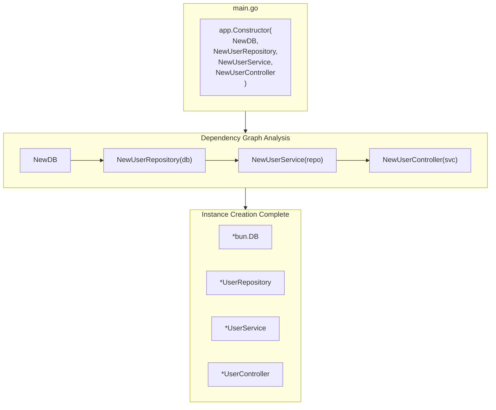

# Dependency Injection

Understanding DI in Spine.

## Core Concepts

Spine's Dependency Injection is **constructor-based**.

- No annotations (No `@Autowired`, `@Injectable`)
- No configuration files
- Constructor parameters are the dependency declarations

```go
// Automatically injects dependency based on parameter type
func NewUserService(repo *UserRepository) *UserService {
    return &UserService{repo: repo}
}
```


## Basic Usage

### 1. Write Constructors

Each component has a constructor function.

```go
// repository.go
type UserRepository struct {
    db *bun.DB
}

func NewUserRepository(db *bun.DB) *UserRepository {
    return &UserRepository{db: db}
}

// service.go
type UserService struct {
    repo *UserRepository
}

func NewUserService(repo *UserRepository) *UserService {
    return &UserService{repo: repo}
}

// controller.go
type UserController struct {
    svc *UserService
}

func NewUserController(svc *UserService) *UserController {
    return &UserController{svc: svc}
}
```

### 2. Register Constructors

Register constructors in `app.Constructor()`.

```go
func main() {
    app := spine.New()
    
    app.Constructor(
        NewDB,              // Returns *bun.DB
        NewUserRepository,  // Needs *bun.DB → Returns *UserRepository
        NewUserService,     // Needs *UserRepository → Returns *UserService
        NewUserController,  // Needs *UserService → Returns *UserController
    )
    
    app.Run(boot.Options{
		Address:                ":8080",
		EnableGracefulShutdown: true,
		ShutdownTimeout:        10 * time.Second,
		HTTP: &boot.HTTPOptions{},
	})
}
```

### 3. Automatic Resolution

Spine analyzes the dependency graph and creates instances in the correct order.

```
Registration Order: Any
Execution Order: DB → Repository → Service → Controller
```

## Order Independence

Registration order does not matter. Spine automatically sorts them by analyzing dependencies.

```go
// Even if registered like this
app.Constructor(
    NewUserController,  // Needs UserService
    NewUserService,     // Needs UserRepository
    NewUserRepository,  // Needs bun.DB
    NewDB,
)

// Actual creation order:
// 1. NewDB()
// 2. NewUserRepository(db)
// 3. NewUserService(repo)
// 4. NewUserController(svc)
```


## Dependency Graph

### Visualization




## Constructor Rules

### Parameters

Constructor parameters must be **already registered types**.

```go
// ✅ Correct Example
func NewUserService(repo *UserRepository) *UserService

// ✅ Multiple dependencies allowed
func NewUserController(svc *UserService, logger *Logger) *UserController

// ✅ No dependency also allowed
func NewLogger() *Logger
```

### Return Types

Constructors return a **single value** or **(value, error)**.

```go
// ✅ Return single value
func NewUserService(repo *UserRepository) *UserService {
    return &UserService{repo: repo}
}

// ✅ Return with error
func NewDB() (*bun.DB, error) {
    db, err := sql.Open("mysql", "...")
    if err != nil {
        return nil, err
    }
    return bun.NewDB(db, mysqldialect.New()), nil
}
```

## Using Interfaces

### Problem Scenario

When using transactions, Repository needs to handle both `*bun.DB` and `*bun.Tx`.

```go
// ❌ Cannot use transaction with this
type UserRepository struct {
    db *bun.DB  // Cannot accept *bun.Tx
}
```

### Solution: Use Interfaces

Using the `bun.IDB` interface accepts both.

```go
// ✅ bun.IDB implements both *bun.DB and *bun.Tx
type UserRepository struct {
    db bun.IDB
}

func NewUserRepository(db bun.IDB) *UserRepository {
    return &UserRepository{db: db}
}
```

### Injecting Transaction in Interceptor

```go
// interceptor/tx_interceptor.go
func (i *TxInterceptor) PreHandle(ctx core.ExecutionContext, meta core.HandlerMeta) error {
    tx, err := i.db.BeginTx(ctx.Context(), nil)
    if err != nil {
        return err
    }
    
    ctx.Set("tx", tx)  // Store transaction
    return nil
}

func (i *TxInterceptor) AfterCompletion(ctx core.ExecutionContext, meta core.HandlerMeta, err error) {
    tx, ok := ctx.Get("tx")
    if !ok {
        return
    }
    
    if err != nil {
        tx.(*bun.Tx).Rollback()
    } else {
        tx.(*bun.Tx).Commit()
    }
}
```


## Registering Multiple Components

### Separation by Domain

```go
func main() {
    app := spine.New()
    
    // Infrastructure
    app.Constructor(
        NewDB,
        NewRedisClient,
        NewLogger,
    )
    
    // User Domain
    app.Constructor(
        repository.NewUserRepository,
        service.NewUserService,
        controller.NewUserController,
    )
    
    // Order Domain
    app.Constructor(
        repository.NewOrderRepository,
        service.NewOrderService,
        controller.NewOrderController,
    )
    
    app.Run(boot.Options{
		Address:                ":8080",
		EnableGracefulShutdown: true,
		ShutdownTimeout:        10 * time.Second,
		HTTP: &boot.HTTPOptions{},
	})
}
```

### Multiple Calls Allowed

`app.Constructor()` can be called multiple times.

```go
app.Constructor(NewDB)
app.Constructor(NewUserRepository, NewUserService)
app.Constructor(NewUserController)
```

## Multiple Instances of Same Type

If you need multiple instances of the same type, use wrapper types.

```go
// ❌ Indistinguishable
func NewApp(db1 *bun.DB, db2 *bun.DB) *App  // Which is which?

// ✅ Distinguish with wrapper types
type PrimaryDB struct{ *bun.DB }
type ReplicaDB struct{ *bun.DB }

func NewPrimaryDB() *PrimaryDB {
    return &PrimaryDB{connectToPrimary()}
}

func NewReplicaDB() *ReplicaDB {
    return &ReplicaDB{connectToReplica()}
}

func NewUserRepository(primary *PrimaryDB, replica *ReplicaDB) *UserRepository {
    return &UserRepository{
        writer: primary.DB,
        reader: replica.DB,
    }
}
```

## Error Handling

### Circular Dependency

```go
// ❌ A → B → A Circular
func NewA(b *B) *A { ... }
func NewB(a *A) *B { ... }

// Error at boot time
// panic: circular dependency detected: *A
```

### Missing Dependency

```go
// If UserRepository is not registered
app.Constructor(
    NewUserService,     // Needs *UserRepository
    NewUserController,
)

// Error at boot time
// panic: no constructor registered for: *repository.UserRepository
```

## Key Takeaways

| Concept | Description |
|------|------|
| **Constructor-Based** | Parameter types declare dependencies |
| **Auto Resolution** | Registration order irrelevant, created after graph analysis |
| **Type Matching** | Auto-injected if types match |
| **Interfaces** | Allows flexible dependency handling |

## Next Steps

- [Tutorial: Interceptor](/en/learn/tutorial/4-interceptor) — Pre/Post request processing
- [Tutorial: Database](/en/learn/tutorial/5-database) — Bun ORM connection
