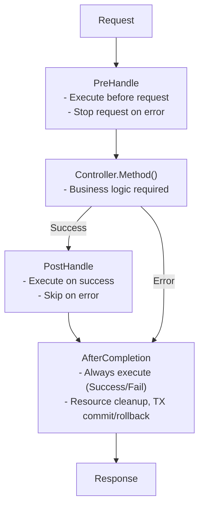

# Interceptor

Creating and using Interceptors.

## What is an Interceptor?

Interceptors are logic executed before/after requests.

- Transaction Management
- Logging
- Authentication/Authorization
- Request Validation

It is the same pattern as Spring's `HandlerInterceptor`.


## Lifecycle

Interceptors have a 3-stage lifecycle.




## Interface

```go
type Interceptor interface {
    PreHandle(ctx ExecutionContext, meta HandlerMeta) error
    PostHandle(ctx ExecutionContext, meta HandlerMeta)
    AfterCompletion(ctx ExecutionContext, meta HandlerMeta, err error)
}
```

| Method | Execution timing | Return | Purpose |
|--------|----------|------|------|
| `PreHandle` | Before Controller execution | `error` | Auth, Validation, TX Start |
| `PostHandle` | After Controller success | None | Response Modification |
| `AfterCompletion` | Always (Success/Fail) | None | Resource cleanup, Commit/Rollback |


## Basic Example: Logging Interceptor

```go
// interceptor/logging_interceptor.go
package interceptor

import (
    "log"
    "github.com/NARUBROWN/spine/core"
)

type LoggingInterceptor struct{}

func (i *LoggingInterceptor) PreHandle(ctx core.ExecutionContext, meta core.HandlerMeta) error {
    log.Printf("[REQ] %s %s → %s.%s",
        ctx.Method(),
        ctx.Path(),
        meta.ControllerType.Name(),
        meta.Method.Name,
    )
    return nil
}

func (i *LoggingInterceptor) PostHandle(ctx core.ExecutionContext, meta core.HandlerMeta) {
    log.Printf("[RES] %s %s OK",
        ctx.Method(),
        ctx.Path(),
    )
}

func (i *LoggingInterceptor) AfterCompletion(ctx core.ExecutionContext, meta core.HandlerMeta, err error) {
    if err != nil {
        log.Printf("[ERR] %s %s : %v",
            ctx.Method(),
            ctx.Path(),
            err,
        )
    }
}
```

### Registration

```go
func main() {
    app := spine.New()
    
    app.Interceptor(
        &interceptor.LoggingInterceptor{},
    )
    
    app.Run(":8080")
}
```

### Output Example

```
[REQ] GET /users → UserController.GetUser
[RES] GET /users OK

[REQ] GET /users → UserController.GetUser
[ERR] GET /users : User not found.
```


## Transaction Interceptor

Automatically manages database transactions.

```go
// interceptor/tx_interceptor.go
package interceptor

import (
    "errors"
    "github.com/NARUBROWN/spine/core"
    "github.com/uptrace/bun"
)

type TxInterceptor struct {
    db *bun.DB
}

// Constructor — DB Dependency Injection
func NewTxInterceptor(db *bun.DB) *TxInterceptor {
    return &TxInterceptor{db: db}
}

func (i *TxInterceptor) PreHandle(ctx core.ExecutionContext, meta core.HandlerMeta) error {
    reqCtx := ctx.Context()
    if reqCtx == nil {
        return errors.New("execution context has no request context")
    }
    
    // Start Transaction
    tx, err := i.db.BeginTx(reqCtx, nil)
    if err != nil {
        return err
    }
    
    // Store in ExecutionContext
    ctx.Set("tx", tx)
    return nil
}

func (i *TxInterceptor) PostHandle(ctx core.ExecutionContext, meta core.HandlerMeta) {
    // Do nothing
}

func (i *TxInterceptor) AfterCompletion(ctx core.ExecutionContext, meta core.HandlerMeta, err error) {
    v, ok := ctx.Get("tx")
    if !ok {
        return
    }
    
    tx, ok := v.(*bun.Tx)
    if !ok {
        return
    }
    
    // Rollback/Commit based on error
    if err != nil {
        tx.Rollback()
    } else {
        tx.Commit()
    }
}
```

### Registration (Requires Dependency Injection)

Interceptors with constructors are registered in `Constructor` first.

```go
func main() {
    app := spine.New()
    
    // 1. Register Constructors
    app.Constructor(
        NewDB,
        interceptor.NewTxInterceptor,  // DB dependency needed
    )
    
    // 2. Register Interceptor (Reference by type)
    app.Interceptor(
        (*interceptor.TxInterceptor)(nil),  // ← Uses already created instance
    )
    
    app.Run(":8080")
}
```


## ExecutionContext

Store and retrieve values from the request context.

### Methods

| Method | Description |
|--------|------|
| `Context()` | Returns `context.Context` |
| `Method()` | HTTP Method (GET, POST, etc.) |
| `Path()` | Request Path |
| `Set(key, value)` | Store value |
| `Get(key)` | Retrieve value |

### Usage Example

```go
// Store in PreHandle
func (i *AuthInterceptor) PreHandle(ctx core.ExecutionContext, meta core.HandlerMeta) error {
    user := validateToken(ctx)
    ctx.Set("currentUser", user)  // Store
    return nil
}

// Retrieve in other interceptors or controllers
func (i *LoggingInterceptor) PreHandle(ctx core.ExecutionContext, meta core.HandlerMeta) error {
    user, ok := ctx.Get("currentUser")  // Retrieve
    if ok {
        log.Printf("User: %v", user)
    }
    return nil
}
```


## HandlerMeta

Meta information of the handler to be executed.

| Field | Type | Description |
|------|------|------|
| `ControllerType` | `reflect.Type` | Controller Type |
| `Method` | `reflect.Method` | Handler Method |

### Usage Example

```go
func (i *LoggingInterceptor) PreHandle(ctx core.ExecutionContext, meta core.HandlerMeta) error {
    log.Printf("Controller: %s", meta.ControllerType.Name())  // UserController
    log.Printf("Method: %s", meta.Method.Name)              // GetUser
    return nil
}
```


## Interceptor Chain

Executes multiple interceptors in order.

### Registration Order = Execution Order

```go
app.Interceptor(
    (*interceptor.TxInterceptor)(nil),     // 1st
    &interceptor.AuthInterceptor{},        // 2nd
    &interceptor.LoggingInterceptor{},     // 3rd
)
```

### Execution Flow

```
Request
   │
   ├─→ Tx.PreHandle        (1)
   ├─→ Auth.PreHandle      (2)
   ├─→ Logging.PreHandle   (3)
   │
   ├─→ Controller.Method
   │
   ├─→ Logging.PostHandle  (3)
   ├─→ Auth.PostHandle     (2)
   ├─→ Tx.PostHandle       (1)
   │
   ├─→ Logging.AfterCompletion  (3)
   ├─→ Auth.AfterCompletion     (2)
   └─→ Tx.AfterCompletion       (1)
   
Response
```

- `PreHandle`: Registration order (1 → 2 → 3)
- `PostHandle`: Reverse order (3 → 2 → 1)
- `AfterCompletion`: Reverse order (3 → 2 → 1)


## Error Handling

### Returning Error in PreHandle

If `PreHandle` returns an error, the request is stopped.

```go
func (i *AuthInterceptor) PreHandle(ctx core.ExecutionContext, meta core.HandlerMeta) error {
    token := getToken(ctx)
    if token == "" {
        return httperr.Unauthorized("Authentication required.")  // Stop request
    }
    return nil
}
```

```
Request
   │
   ├─→ Tx.PreHandle        ✓
   ├─→ Auth.PreHandle      ✗ (Error returned)
   │
   ├─→ Auth.AfterCompletion
   └─→ Tx.AfterCompletion
   
Response (401 Unauthorized)
```


## Auth Interceptor Example

```go
// interceptor/auth_interceptor.go
package interceptor

import (
    "github.com/NARUBROWN/spine/core"
    "github.com/NARUBROWN/spine/pkg/httperr"
)

type AuthInterceptor struct{}

func (i *AuthInterceptor) PreHandle(ctx core.ExecutionContext, meta core.HandlerMeta) error {
    // Extract token from header
    // token := ctx.Request().Header.Get("Authorization")
    
    // Validate token (example)
    token := "valid"  // Actually extract from header
    
    if token == "" {
        return httperr.Unauthorized("Authentication required.")
    }
    
    // Store user info
    user := validateAndGetUser(token)
    ctx.Set("currentUser", user)
    
    return nil
}

func (i *AuthInterceptor) PostHandle(ctx core.ExecutionContext, meta core.HandlerMeta) {}

func (i *AuthInterceptor) AfterCompletion(ctx core.ExecutionContext, meta core.HandlerMeta, err error) {}

func validateAndGetUser(token string) interface{} {
    // Token validtion logic
    return map[string]string{"id": "1", "name": "Alice"}
}
```

## Timing Interceptor

```go
// interceptor/timing_interceptor.go
package interceptor

import (
    "log"
    "time"
    "github.com/NARUBROWN/spine/core"
)

type TimingInterceptor struct{}

func (i *TimingInterceptor) PreHandle(ctx core.ExecutionContext, meta core.HandlerMeta) error {
    ctx.Set("startTime", time.Now())
    return nil
}

func (i *TimingInterceptor) PostHandle(ctx core.ExecutionContext, meta core.HandlerMeta) {}

func (i *TimingInterceptor) AfterCompletion(ctx core.ExecutionContext, meta core.HandlerMeta, err error) {
    startTime, ok := ctx.Get("startTime")
    if !ok {
        return
    }
    
    duration := time.Since(startTime.(time.Time))
    log.Printf("[TIMING] %s %s took %v",
        ctx.Method(),
        ctx.Path(),
        duration,
    )
}
```


## Registration Method Summary

### Interceptors without Dependencies

Pass instance directly.

```go
app.Interceptor(
    &interceptor.LoggingInterceptor{},
    &interceptor.TimingInterceptor{},
)
```

### Interceptors with Dependencies

Register in `Constructor` and reference by type.

```go
// 1. Register Constructor
app.Constructor(
    NewDB,
    interceptor.NewTxInterceptor,
)

// 2. Reference by Type
app.Interceptor(
    (*interceptor.TxInterceptor)(nil),
)
```

### Mixed Usage

```go
app.Constructor(
    NewDB,
    interceptor.NewTxInterceptor,
)

app.Interceptor(
    (*interceptor.TxInterceptor)(nil),     // Has dependency (Type reference)
    &interceptor.AuthInterceptor{},        // No dependency (Instance)
    &interceptor.LoggingInterceptor{},     // No dependency (Instance)
)
```


## Key Takeaways

| Concept | Description |
|------|------|
| **3-Stage Lifecycle** | PreHandle → PostHandle → AfterCompletion |
| **Chain Execution** | Pre in order, Post/After in reverse |
| **Stop on Error** | PreHandle Error → Skip Controller |
| **Context Sharing** | Pass data with `ctx.Set()` / `ctx.Get()` |


## Next Steps

- [Tutorial: Database](/en/learn/tutorial/5-database) — Bun ORM connection
- [Tutorial: Error Handling](/en/learn/tutorial/7-error-handling) — httperr usage
