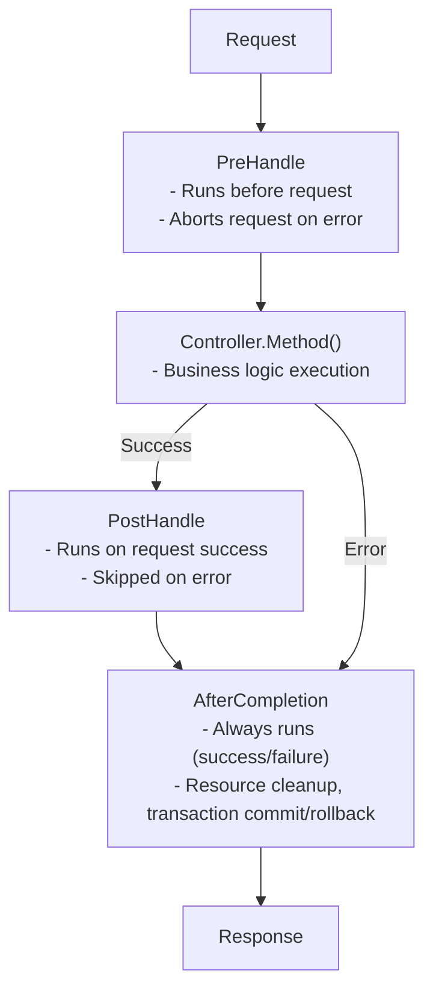

# Interceptors

Creating and using interceptors.

## What is an Interceptor?

Interceptors are logic that runs before and after requests.

- Transaction management
- Logging
- Authentication/Authorization
- Request validation

## Lifecycle

Interceptors have a 3-phase lifecycle.




## Interface

```go
type Interceptor interface {
    PreHandle(ctx ExecutionContext, meta HandlerMeta) error
    PostHandle(ctx ExecutionContext, meta HandlerMeta)
    AfterCompletion(ctx ExecutionContext, meta HandlerMeta, err error)
}
```

| Method | Execution Timing | Return | Purpose |
|--------|------------------|--------|---------|
| `PreHandle` | Before controller execution | `error` | Auth, validation, transaction start |
| `PostHandle` | After controller success | none | Response processing |
| `AfterCompletion` | Always (success/failure) | none | Resource cleanup, commit/rollback |


## Global Interceptors vs Route Interceptors

Spine supports two levels of interceptors.

| Type | Global Interceptor | Route Interceptor |
|------|-------------------|-------------------|
| Scope | All requests | Specific routes only |
| Registration | `app.Interceptor()` | `route.WithInterceptors()` |
| Use cases | CORS, logging, transactions | Authentication, permission checks |
| Execution order | Runs first | Runs after global |


## Global Interceptors

Interceptors that apply to all requests.

### Logging Interceptor Example

```go
// interceptor/logging_interceptor.go
package interceptor

import (
    "log"
    "github.com/NARUBROWN/spine/core"
)

type LoggingInterceptor struct{}

func (i *LoggingInterceptor) PreHandle(ctx core.ExecutionContext, meta core.HandlerMeta) error {
    log.Printf("[REQ] %s %s → %s.%s",
        ctx.Method(),
        ctx.Path(),
        meta.ControllerType.Name(),
        meta.Method.Name,
    )
    return nil
}

func (i *LoggingInterceptor) PostHandle(ctx core.ExecutionContext, meta core.HandlerMeta) {
    log.Printf("[RES] %s %s OK",
        ctx.Method(),
        ctx.Path(),
    )
}

func (i *LoggingInterceptor) AfterCompletion(ctx core.ExecutionContext, meta core.HandlerMeta, err error) {
    if err != nil {
        log.Printf("[ERR] %s %s : %v",
            ctx.Method(),
            ctx.Path(),
            err,
        )
    }
}
```

### Registering Global Interceptors

```go
func main() {
    app := spine.New()
    
    // Global interceptor — applies to all requests
    app.Interceptor(
        &interceptor.LoggingInterceptor{},
    )
    
    app.Run(":8080")
}
```


## Route Interceptors

Interceptors that apply only to specific routes.

### Auth Interceptor Example

```go
// interceptor/auth_interceptor.go
package interceptor

import (
    "github.com/NARUBROWN/spine/core"
    "github.com/NARUBROWN/spine/pkg/httperr"
)

type AuthInterceptor struct{}

func (i *AuthInterceptor) PreHandle(ctx core.ExecutionContext, meta core.HandlerMeta) error {
    token := ctx.Header("Authorization")
    
    if token == "" {
        return httperr.Unauthorized("Authentication required.")
    }
    
    user, err := validateToken(token)
    if err != nil {
        return httperr.Unauthorized("Invalid token.")
    }
    
    ctx.Set("currentUser", user)
    return nil
}

func (i *AuthInterceptor) PostHandle(ctx core.ExecutionContext, meta core.HandlerMeta) {}

func (i *AuthInterceptor) AfterCompletion(ctx core.ExecutionContext, meta core.HandlerMeta, err error) {}

func validateToken(token string) (map[string]string, error) {
    // Token validation logic
    return map[string]string{"id": "1", "name": "Alice"}, nil
}
```

### Registering Route Interceptors

Use `route.WithInterceptors()`.

```go
import (
    "github.com/NARUBROWN/spine"
    "github.com/NARUBROWN/spine/pkg/route"
)

func main() {
    app := spine.New()
    
    app.Constructor(
        NewUserController,
    )
    
    // Route without authentication
    app.Route(
        "POST",
        "/login",
        (*UserController).Login,
    )
    
    // Route requiring authentication
    app.Route(
        "GET",
        "/users/:id",
        (*UserController).GetUser,
        route.WithInterceptors(&interceptor.AuthInterceptor{}),
    )
    
    // Route requiring authentication
    app.Route(
        "PUT",
        "/users/:id",
        (*UserController).UpdateUser,
        route.WithInterceptors(&interceptor.AuthInterceptor{}),
    )
    
    app.Run(":8080")
}
```


## Combining Global + Route Interceptors

In real applications, both are used together.

```go
func main() {
    app := spine.New()
    
    app.Constructor(
        NewUserController,
    )
    
    // Global interceptors — apply to all requests
    app.Interceptor(
        &interceptor.LoggingInterceptor{},
        cors.New(cors.Config{
            AllowOrigins: []string{"*"},
            AllowMethods: []string{"GET", "POST", "PUT", "DELETE"},
        }),
    )
    
    // Public routes — only global interceptors apply
    app.Route("POST", "/login", (*UserController).Login)
    app.Route("POST", "/signup", (*UserController).Signup)
    
    // Protected routes — global + Auth interceptor
    app.Route(
        "GET",
        "/users/:id",
        (*UserController).GetUser,
        route.WithInterceptors(&interceptor.AuthInterceptor{}),
    )
    
    app.Route(
        "GET",
        "/me",
        (*UserController).GetMe,
        route.WithInterceptors(&interceptor.AuthInterceptor{}),
    )
    
    app.Run(":8080")
}
```


## Execution Order

Global interceptors run first, route interceptors run after.

### Registration Example

```go
// Global interceptors
app.Interceptor(
    &interceptor.LoggingInterceptor{},   // Global 1
    &interceptor.CORSInterceptor{},      // Global 2
)

// Route interceptor
app.Route(
    "GET",
    "/users/:id",
    (*UserController).GetUser,
    route.WithInterceptors(&interceptor.AuthInterceptor{}),  // Route 1
)
```

### Execution Flow

```
Request (GET /users/1)
   │
   ├─→ Logging.PreHandle     (Global 1)
   ├─→ CORS.PreHandle        (Global 2)
   ├─→ Auth.PreHandle        (Route 1)
   │
   ├─→ UserController.GetUser
   │
   ├─→ Auth.PostHandle       (Route 1)
   ├─→ CORS.PostHandle       (Global 2)
   ├─→ Logging.PostHandle    (Global 1)
   │
   ├─→ Auth.AfterCompletion       (Route 1)
   ├─→ CORS.AfterCompletion       (Global 2)
   └─→ Logging.AfterCompletion    (Global 1)
   
Response
```

- `PreHandle`: Global → Route order
- `PostHandle`: Route → Global reverse order
- `AfterCompletion`: Route → Global reverse order


## Error Handling

### Returning Error from PreHandle

When `PreHandle` returns an error, the request is aborted.

```go
func (i *AuthInterceptor) PreHandle(ctx core.ExecutionContext, meta core.HandlerMeta) error {
    token := ctx.Header("Authorization")
    if token == "" {
        return httperr.Unauthorized("Authentication required.")
    }
    return nil
}
```

```
Request (GET /users/1, no token)
   │
   ├─→ Logging.PreHandle     ✓
   ├─→ CORS.PreHandle        ✓
   ├─→ Auth.PreHandle        ✗ (error returned)
   │
   ├─→ Auth.AfterCompletion
   ├─→ CORS.AfterCompletion
   └─→ Logging.AfterCompletion
   
Response (401 Unauthorized)
```


## ExecutionContext

Store and retrieve values from the request context.

### Methods

| Method | Description |
|--------|-------------|
| `Context()` | Returns `context.Context` |
| `Method()` | HTTP method (GET, POST, etc.) |
| `Path()` | Request path |
| `Header(name)` | Get header value |
| `Set(key, value)` | Store value |
| `Get(key)` | Retrieve value |

### Passing Data Between Interceptors

```go
// AuthInterceptor — store user info
func (i *AuthInterceptor) PreHandle(ctx core.ExecutionContext, meta core.HandlerMeta) error {
    token := ctx.Header("Authorization")
    user, _ := validateToken(token)
    ctx.Set("currentUser", user)
    return nil
}

// Retrieve in another interceptor
func (i *AuditInterceptor) PreHandle(ctx core.ExecutionContext, meta core.HandlerMeta) error {
    user, ok := ctx.Get("currentUser")
    if ok {
        log.Printf("User %v accessing %s", user, ctx.Path())
    }
    return nil
}
```


## HandlerMeta

Metadata about the handler to be executed.

| Field | Type | Description |
|-------|------|-------------|
| `ControllerType` | `reflect.Type` | Controller type |
| `Method` | `reflect.Method` | Handler method |
| `Interceptors` | `[]Interceptor` | Interceptors bound to the route |

### Usage Example

```go
func (i *LoggingInterceptor) PreHandle(ctx core.ExecutionContext, meta core.HandlerMeta) error {
    log.Printf("Controller: %s", meta.ControllerType.Name())  // UserController
    log.Printf("Method: %s", meta.Method.Name)                // GetUser
    return nil
}
```


## Interceptors with Dependency Injection

Interceptors with constructors must be registered with `Constructor` first.

### Transaction Interceptor Example

```go
// interceptor/tx_interceptor.go
package interceptor

import (
    "github.com/NARUBROWN/spine/core"
    "github.com/uptrace/bun"
)

type TxInterceptor struct {
    db *bun.DB
}

func NewTxInterceptor(db *bun.DB) *TxInterceptor {
    return &TxInterceptor{db: db}
}

func (i *TxInterceptor) PreHandle(ctx core.ExecutionContext, meta core.HandlerMeta) error {
    tx, err := i.db.BeginTx(ctx.Context(), nil)
    if err != nil {
        return err
    }
    ctx.Set("tx", tx)
    return nil
}

func (i *TxInterceptor) PostHandle(ctx core.ExecutionContext, meta core.HandlerMeta) {}

func (i *TxInterceptor) AfterCompletion(ctx core.ExecutionContext, meta core.HandlerMeta, err error) {
    v, ok := ctx.Get("tx")
    if !ok {
        return
    }
    
    tx := v.(*bun.Tx)
    if err != nil {
        tx.Rollback()
    } else {
        tx.Commit()
    }
}
```

### Registration (Global)

```go
app.Constructor(
    NewDB,
    interceptor.NewTxInterceptor,
)

app.Interceptor(
    (*interceptor.TxInterceptor)(nil),  // Reference by type
)
```

### Registration (Route)

```go
app.Constructor(
    NewDB,
    interceptor.NewTxInterceptor,
)

app.Route(
    "POST",
    "/orders",
    (*OrderController).CreateOrder,
    route.WithInterceptors((*interceptor.TxInterceptor)(nil)),  // Reference by type
)
```


## Registration Methods Summary

### Global Interceptors

| Method | Code | When to Use |
|--------|------|-------------|
| Direct instance | `&interceptor.LoggingInterceptor{}` | No dependencies |
| Type reference | `(*interceptor.TxInterceptor)(nil)` | Has dependencies |

```go
app.Interceptor(
    &interceptor.LoggingInterceptor{},      // Instance
    (*interceptor.TxInterceptor)(nil),      // Type reference
)
```

### Route Interceptors

| Method | Code | When to Use |
|--------|------|-------------|
| Direct instance | `&interceptor.AuthInterceptor{}` | No dependencies |
| Type reference | `(*interceptor.TxInterceptor)(nil)` | Has dependencies |

```go
app.Route(
    "GET",
    "/users/:id",
    (*UserController).GetUser,
    route.WithInterceptors(
        &interceptor.AuthInterceptor{},         // Instance
        (*interceptor.TxInterceptor)(nil),      // Type reference
    ),
)
```


## Key Summary

| Concept | Description |
|---------|-------------|
| **Global Interceptor** | `app.Interceptor()` — applies to all requests |
| **Route Interceptor** | `route.WithInterceptors()` — specific routes only |
| **Execution Order** | Global → Route (Post/After in reverse) |
| **3-Phase Lifecycle** | PreHandle → PostHandle → AfterCompletion |
| **Abort on Error** | PreHandle error → controller skipped |
| **Context Sharing** | Pass data via `ctx.Set()` / `ctx.Get()` |


## Next Steps

- [Tutorial: Database](/en/learn/tutorial/5-database) — Bun ORM connection
- [Tutorial: Error Handling](/en/learn/tutorial/7-error-handling) — Using httperr