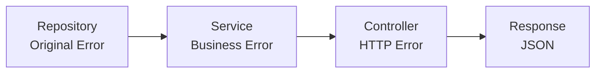
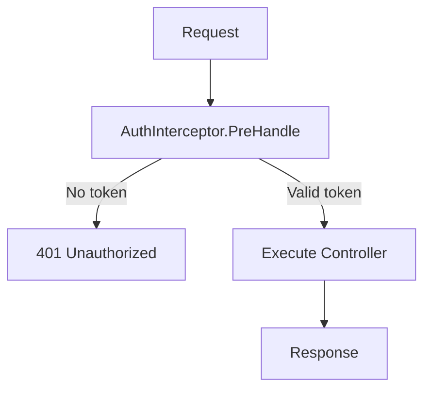

# Error Handling

How to handle errors gracefully.

## Overview

Spine uses the `httperr` package to represent HTTP errors. Controllers do not handle HTTP directly, but express only the **meaning** of the error with `httperr`. The actual HTTP response conversion is handled by `ErrorReturnHandler`.

```go
import "github.com/NARUBROWN/spine/pkg/httperr"

func (c *UserController) GetUser(userId path.Int) (User, error) {
    if userId.Value <= 0 {
        return User{}, httperr.BadRequest("Invalid user ID")
    }
    
    user, err := c.repo.FindByID(userId.Value)
    if err != nil {
        return User{}, httperr.NotFound("User not found")
    }
    
    return user, nil
}
```

## httperr Functions

| Function | Status Code | Purpose |
|----------|----------|---------|
| `httperr.BadRequest(msg)` | 400 | Invalid request, validation failure |
| `httperr.Unauthorized(msg)` | 401 | Auth required, Invalid token |
| `httperr.NotFound(msg)` | 404 | Resource missing |

## HTTPError Struct

```go
type HTTPError struct {
    Status  int    // HTTP status code
    Message string // Error message
    Cause   error  // Cause error (optional)
}

func (e *HTTPError) Error() string {
    return e.Message
}
```

## Usage Examples

### Resource Not Found (404)

```go
func (c *UserController) GetUser(userId path.Int) (User, error) {
    user, err := c.repo.FindByID(userId.Value)
    if err != nil {
        return User{}, httperr.NotFound("User not found")
    }
    return user, nil
}
```

Response:
```json
{"message": "User not found"}
```
```
HTTP/1.1 404 Not Found
```

### Invalid Request (400)

```go
func (c *UserController) CreateUser(req CreateUserRequest) (User, error) {
    if req.Name == "" {
        return User{}, httperr.BadRequest("Name is required")
    }
    if req.Email == "" {
        return User{}, httperr.BadRequest("Email is required")
    }
    
    return c.service.Create(req)
}
```

### Authorization Required (401)

```go
func (i *AuthInterceptor) PreHandle(ctx core.ExecutionContext, meta core.HandlerMeta) error {
    token := ctx.Header("Authorization")
    
    if token == "" {
        return httperr.Unauthorized("Authentication required")
    }
    
    if !isValidToken(token) {
        return httperr.Unauthorized("Invalid token")
    }
    
    return nil
}
```

## Using Other Status Codes

If you need status codes not provided, create `HTTPError` directly.

```go
// 403 Forbidden
func Forbidden(msg string) error {
    return &httperr.HTTPError{Status: 403, Message: msg}
}

// 409 Conflict
func Conflict(msg string) error {
    return &httperr.HTTPError{Status: 409, Message: msg}
}

// 500 Internal Server Error
func InternalServerError(msg string) error {
    return &httperr.HTTPError{Status: 500, Message: msg}
}
```

## Layered Error Handling



### Repository

Returns the original error as is.

```go
func (r *UserRepository) FindByID(id int64) (*User, error) {
    user, ok := r.users[id]
    if !ok {
        return nil, ErrUserNotFound  // Original Error
    }
    return user, nil
}

var ErrUserNotFound = errors.New("user not found")
```

### Service

Handles business logic and propagates Repository errors.

```go
func (s *UserService) GetUser(id int64) (*User, error) {
    user, err := s.repo.FindByID(id)
    if err != nil {
        return nil, err  // Propagate Error
    }
    return user, nil
}
```

### Controller

Converts business errors to HTTP errors.

```go
func (c *UserController) GetUser(userId path.Int) (User, error) {
    user, err := c.service.GetUser(userId.Value)
    if err != nil {
        return User{}, toHTTPError(err)
    }
    return *user, nil
}

func toHTTPError(err error) error {
    switch {
    case errors.Is(err, repository.ErrUserNotFound):
        return httperr.NotFound("User not found")
    case errors.Is(err, repository.ErrEmailAlreadyExists):
        return httperr.BadRequest("Email already in use")
    default:
        return httperr.BadRequest(err.Error())
    }
}
```

## Input Validation

### Defining Validation Method in DTO

```go
type CreateUserRequest struct {
    Name  string `json:"name"`
    Email string `json:"email"`
}

func (r *CreateUserRequest) Validate() error {
    if r.Name == "" {
        return errors.New("Name is required")
    }
    if len(r.Name) > 100 {
        return errors.New("Name must be 100 characters or less")
    }
    if r.Email == "" {
        return errors.New("Email is required")
    }
    return nil
}
```

### Calling Validation in Controller

```go
func (c *UserController) CreateUser(req CreateUserRequest) (User, error) {
    if err := req.Validate(); err != nil {
        return User{}, httperr.BadRequest(err.Error())
    }
    
    return c.service.Create(req)
}
```

## Error Handling in Interceptor

If `PreHandle` returns an error, the Controller is not executed.

```go
func (i *AuthInterceptor) PreHandle(ctx core.ExecutionContext, meta core.HandlerMeta) error {
    token := ctx.Header("Authorization")
    
    if token == "" {
        return httperr.Unauthorized("Auth token is required")
    }
    
    user, err := i.auth.Validate(token)
    if err != nil {
        return httperr.Unauthorized("Invalid token")
    }
    
    ctx.Set("auth.user", user)
    return nil
}
```



## Error Logging

You can log errors in `AfterCompletion`.

```go
func (i *LoggingInterceptor) AfterCompletion(ctx core.ExecutionContext, meta core.HandlerMeta, err error) {
    if err != nil {
        log.Printf("[ERR] %s %s : %v", ctx.Method(), ctx.Path(), err)
    }
}
```

## General Error Handling

Errors that are not `httperr.HTTPError` are treated as 500 status codes.

```go
// httperr.HTTPError → Specified status code
return httperr.NotFound("...")  // → 404

// General error → 500
return errors.New("something went wrong")  // → 500
```

## Key Takeaways

| Layer | Role |
|------|------|
| Repository | Return Original Error |
| Service | Business Logic, Propagate Error |
| Controller | Convert to HTTP Error |
| Interceptor | Common Error Handling (Auth, Logging) |

| httperr Function | Status Code |
|--------------|----------|
| `BadRequest` | 400 |
| `Unauthorized` | 401 |
| `NotFound` | 404 |
