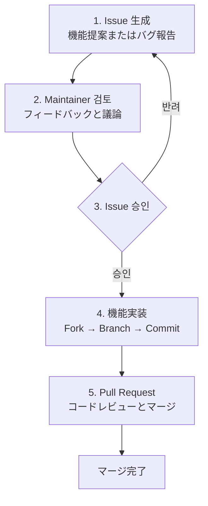

# 貢献(Contributing)

Spineに貢献する方法。

## 貢献プロセス

Spineに貢献したい機能や改善点がある場合は、次の手順に従ってください。




## 1. Issueの生成

機能を実装する前に**必ずIssueを最初に生成**してください。

[Spin​​e GitHub Issues](https://github.com/NARUBROWN/spine/issues) で新しい Issue を作成し、次の内容を含めてください。

**機能提案の場合**
- 提案する機能の説明
- その機能が必要な理由
- 予想される使用例

**バグレポートの場合**
- バグの再現方法
- 予想動作と実際の動作
- 環境情報(Goバージョン、OSなど)

## 2. Maintainerレビュー

Issueが作成されると、Maintainerは確認後にコメントを残します。この段階では、設計方向、実装範囲などについて議論することができる。

## 3. Issue承認

MaintainerがIssueを承認したら、実装を進めることができます。承認されていない状態で作成されたPRはマージされない場合がありますので、必ず承認を確認して実装を開始してください。

## 4. Pull Request

GitHubでPull Requestを生成します。 PRの説明に関連するIssue番号を明記してください。

```
Closes #123
```

## 質問がある場合

実装中に質問がある場合は、対応するIssueにコメントを残してください。