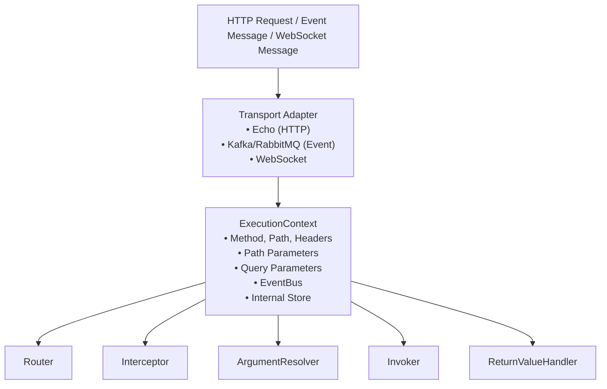
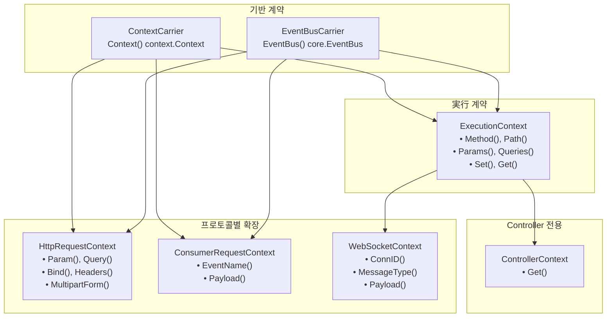

# 実行コンテキスト(ExecutionContext)

Spineリクエストの中核。


## 概要

`ExecutionContext`は、Spineパイプライン全体で共有される要求スコープのコンテキストです。 HTTP要求が到着すると、Transportアダプターは`ExecutionContext`を生成し、このコンテキストはパイプラインのすべてのステップを通過し、要求情報と実行状況を渡します。





## Context階層

SpineはContextを**階層的に分離**します。これは、HTTP、Event Consumer、WebSocketを同じパイプラインモデルとして処理するための設計です。




### なぜそう分けるか。

|階層担当|使用場所|
|------|------|----------|
| `ContextCarrier` | Go標準コンテキスト配信|どこでも
| `EventBusCarrier` |ドメインイベント発行（`core.EventBus`）|コントローラー、コンシューマー
| `ExecutionContext` |実行フロー制御|ルーター、パイプライン、インターセプター|
| `ControllerContext` | ExecutionContextの読み取り専用Facade |コントローラー（インターセプター注入値を参照）
| `HttpRequestContext` | HTTP入力の解釈HTTP ArgumentResolver |
| `ConsumerRequestContext` |イベント入力の解釈Consumer ArgumentResolver |
| `WebSocketContext` | WebSocket入力解析| WebSocket ArgumentResolver |

**目標**：HTTP、Event Consumer、WebSocketが同じパイプラインモデルを共有しながら、各プロトコルの特性に合った入力解析が可能になります。


## ベースのインターフェース

### ContextCarrier

Go 標準 `context.Context` を渡す最小契約です。


```go
// core/context.go
type ContextCarrier interface {
    Context() context.Context
}
```

### EventBusCarrier

ドメインイベントを発行するためのEventBusアクセス契約です。戻り型は`core.EventBus`です。


```go
// core/context.go
type EventBusCarrier interface {
    EventBus() EventBus
}
```

`core.EventBus`は、ドメインイベントを収集して実行後に​​一度に発行するための最小契約です。


```go
// core/event_bus.go
type EventBus interface {
    Publish(events ...publish.DomainEvent)
    Drain() []publish.DomainEvent
}
```

> **注**: `internal/event/publish.EventBus` は `core.EventBus` のタイプ別名 (`type EventBus = core.EventBus`) で、内部実装がこのタイプを満たすように構成されます。


## ExecutionContextインタフェース

パイプライン全体で使用される実行フロー制御用のインタフェースです。


```go
// core/context.go
type ExecutionContext interface {
    ContextCarrier
    EventBusCarrier

    // HTTP リクエスト 情報 (Consumer/WebSocket에서는 意味가 다름)
    Method() string                    // HTTP: GET, POST... / Consumer: "EVENT" / WS: "WS"
    Path() string                      // HTTP: /users/123 / Consumer: EventName / WS: path
    Header(name string) string         // HTTP ヘッダー (Consumer, WS는 空文字列)
    
    // 파라미터 접근
    Params() map[string]string         // Path parameters
    PathKeys() []string                // Path key 順序
    Queries() map[string][]string      // Query parameters
    
    // 내부 保存소
    Set(key string, value any)         // 값 保存
    Get(key string) (any, bool)        // 값 参照
}
```

### メソッドの詳細

#### Context()

Go 標準 `context.Context` を返します。要求のキャンセル、タイムアウト、値の転送に使用されます。


```go
func (e *echoContext) Context() context.Context {
    return e.reqCtx  // HTTP リクエスト의 context
}
```

#### EventBus()

リクエストスコープのEventBusを返します。 Controllerがドメインイベントを発行するときに使用されます。


```go
func (c *echoContext) EventBus() publish.EventBus {
    return c.eventBus
}
```

#### Method() / Path()

HTTP リクエストのメソッドとパスを返します。 Consumer と WebSocket では異なる意味で使用されます。


```go
// HTTP
ctx.Method()  // "GET"
ctx.Path()    // "/users/123/posts/456"

// Consumer
ctx.Method()  // "EVENT"
ctx.Path()    // "order.created" (EventName)

// WebSocket
ctx.Method()  // "WS"
ctx.Path()    // WebSocket 경로
```

#### Params() / PathKeys()

Path パラメータ情報を提供します。


```go
// Route: /users/:userId/posts/:postId
// Request: /users/123/posts/456

ctx.Params()    // {"userId": "123", "postId": "456"}
ctx.PathKeys()  // ["userId", "postId"]
```

`PathKeys()`は、パラメータの**宣言順序**を保証します。 Spineの順序ベースのバインディングに不可欠です。

#### Queries()

クエリパラメータを複数値の形式で返します。


```go
// Request: /users?status=active&tag=go&tag=web

ctx.Queries()  // {"status": ["active"], "tag": ["go", "web"]}
```

#### Set() / Get()

パイプライン内で値を共有するリポジトリ。


```go
// Router에서 path params 保存
ctx.Set("spine.params", params)
ctx.Set("spine.pathKeys", keys)

// Adapter에서 ResponseWriter 保存
ctx.Set("spine.response_writer", NewEchoResponseWriter(c))

// Interceptor에서 参照
rw, ok := ctx.Get("spine.response_writer")
```


## ControllerContext インタフェース

Controller専用のContext Viewです。 `ExecutionContext`の読み取り専用Facadeで、Interceptorから注入した値をControllerで参照するための公式通路です。


```go
// core/context.go
type ControllerContext interface {
    Get(key string) (any, bool)
}
```

### 実装


```go
// internal/runtime/controller_ctx.go
type controllerCtxView struct {
    ec core.ExecutionContext
}

func NewControllerContext(ec core.ExecutionContext) core.ControllerContext {
    return controllerCtxView{ec: ec}
}

func (v controllerCtxView) Get(key string) (any, bool) {
    return v.ec.Get(key)
}
```

### 使用例


```go
// Controller에서 Interceptor가 주입한 값 참조
func (c *UserController) GetUser(ctx context.Context, cc core.ControllerContext, userId path.Int) User {
    authInfo, _ := cc.Get("auth.user")
    // ...
}
```

> **注意**: `pkg/spine/types.go`には`Ctx`インタフェース（`Get(key string) (any, bool)`）が定義されており、ユーザーコードから`spine.Ctx`にもアクセス可能です。


## HttpRequestContext インタフェース

HTTP 専用拡張インターフェイスです。 HTTP ArgumentResolverで使用されます。


```go
// core/context.go
type HttpRequestContext interface {
    ContextCarrier
    EventBusCarrier

    // 個別 파라미터 접근
    Param(name string) string          // 특정 path param
    Query(name string) string          // 특정 query param (最初の 값)
    Header(name string) string         // 특정 ヘッダー
    
    // 全体 뷰 접근
    Params() map[string]string         // すべて path params
    Queries() map[string][]string      // すべて query params
    Headers() map[string][]string      // すべて ヘッダー
    
    // Body バインディング
    Bind(out any) error                // JSON body → struct
    
    // Multipart
    MultipartForm() (*multipart.Form, error)
}
```

> **注**：`HttpRequestContext`には`RequestContext`は含まれていません。 `ContextCarrier`と`EventBusCarrier`を直接埋め込みます。さらに、`Headers() map[string][]string`メソッドが追加され、ヘッダーマップ全体にアクセスできます。

### メソッドの詳細

#### Param() / Query()

個々のパラメータに便利にアクセスします。


```go
// Route: /users/:id?page=1&size=20

ctx.Param("id")      // "123"
ctx.Query("page")    // "1"
ctx.Query("size")    // "20"
ctx.Query("missing") // "" (없으면 空文字列)
```

#### Bind()

HTTP bodyを構造体にバインドします。


```go
// internal/resolver/dto_resolver.go
func (r *DTOResolver) Resolve(ctx core.ExecutionContext, parameterMeta ParameterMeta) (any, error) {
    httpCtx, ok := ctx.(core.HttpRequestContext)
    if !ok {
        return nil, fmt.Errorf("HTTP リクエスト 컨텍스트가 아닙니다")
    }

    valuePtr := reflect.New(parameterMeta.Type)

    if err := httpCtx.Bind(valuePtr.Interface()); err != nil {
        return nil, fmt.Errorf("DTO バインディング 失敗 (%s): %w", parameterMeta.Type.Name(), err)
    }

    return valuePtr.Elem().Interface(), nil
}
```

#### MultipartForm()

Multipart form データにアクセスします。ファイルアップロード処理に使用されます。


```go
// internal/resolver/uploaded_files_resolver.go
func (r *UploadedFilesResolver) Resolve(ctx core.ExecutionContext, parameterMeta ParameterMeta) (any, error) {
    httpCtx, ok := ctx.(core.HttpRequestContext)
    if !ok {
        return nil, fmt.Errorf("HTTP リクエスト 컨텍스트가 아닙니다")
    }

    form, err := httpCtx.MultipartForm()
    if err != nil {
        return nil, err
    }
    // ...
}
```


## ConsumerRequestContext インタフェース

Event Consumer 専用の拡張インタフェースです。


```go
// core/context.go
type ConsumerRequestContext interface {
    ContextCarrier
    EventBusCarrier

    EventName() string    // イベント 名前 (예: "order.created")
    Payload() []byte      // イベント 페이로드 (JSON 등)
}
```

### メソッドの詳細

#### EventName()

受信したイベントの名前を返します。


```go
ctx.EventName()  // "order.created"
```

#### Payload()

イベントの生のペイロードを返します。


```go
payload := ctx.Payload()  // []byte (JSON)
```

### Consumer Resolverの例


```go
// internal/event/consumer/resolver/dto_resolver.go
func (r *DTOResolver) Resolve(ctx core.ExecutionContext, meta resolver.ParameterMeta) (any, error) {
    consumerCtx, ok := ctx.(core.ConsumerRequestContext)
    if !ok {
        return nil, fmt.Errorf("ConsumerRequestContext가 아닙니다")
    }

    payload := consumerCtx.Payload()
    if payload == nil {
        return nil, fmt.Errorf("Payload가 비어있어 DTO를 生成할 수 ありません")
    }

    dtoPtr := reflect.New(meta.Type)
    if err := json.Unmarshal(payload, dtoPtr.Interface()); err != nil {
        return nil, fmt.Errorf("DTO 역직렬화에 失敗했습니다: %w", err)
    }

    return dtoPtr.Elem().Interface(), nil
}
```


## WebSocketContext インタフェース

WebSocket 専用の ExecutionContext 拡張です。 `ExecutionContext`を埋め込み、パイプラインの互換性を維持します。


```go
// core/context.go
type WebSocketContext interface {
    ExecutionContext

    ConnID() string       // 연결 ID
    MessageType() int     // 메시지 型 (Text, Binary 등)
    Payload() []byte      // 메시지 페이로드
}
```

### WebSocket Resolverの例


```go
// internal/ws/resolver/dto_resolver.go
func (r *DTOResolver) Resolve(ctx core.ExecutionContext, meta resolver.ParameterMeta) (any, error) {
    wsCtx, ok := ctx.(core.WebSocketContext)
    if !ok {
        return nil, fmt.Errorf("WebSocketContext가 아닙니다")
    }

    payload := wsCtx.Payload()
    if payload == nil {
        return nil, fmt.Errorf("Payload가 비어있어 DTO를 生成할 수 ありません")
    }

    dtoPtr := reflect.New(meta.Type)
    if err := json.Unmarshal(payload, dtoPtr.Interface()); err != nil {
        return nil, fmt.Errorf("DTO 역직렬화 失敗: %w", err)
    }

    return dtoPtr.Elem().Interface(), nil
}
```


## Echoアダプタの実装

Spine は Echo を HTTP Transport レイヤーとして使用します。 `echoContext`は`ExecutionContext`と`HttpRequestContext`の両方を実装します。


```go
// internal/adapter/echo/context_impl.go
type echoContext struct {
    echo     echo.Context           // Echo의 원본 컨텍스트
    reqCtx   context.Context        // リクエスト 스코프 컨텍스트
    store    map[string]any         // 내부 保存소
    eventBus publish.EventBus       // イベント 버스
}

func NewContext(c echo.Context) core.ExecutionContext {
    return &echoContext{
        echo:     c,
        reqCtx:   c.Request().Context(),
        store:    make(map[string]any),
        eventBus: publish.NewEventBus(),
    }
}
```

### 主な実装

#### Path Parameters

Routerがマッチングした結果を優先し、なければEchoの値を使用します。


```go
func (e *echoContext) Param(name string) string {
    // Spine Router가 保存한 값 우선
    if raw, ok := e.store["spine.params"]; ok {
        if m, ok := raw.(map[string]string); ok {
            if v, ok := m[name]; ok {
                return v
            }
        }
    }
    // Fallback to Echo
    return e.echo.Param(name)
}
```

#### Params() - 防御コピー

外部からソースマップを変更しないようにコピーを返します。 `maps.Copy`を使用してください。


```go
func (e *echoContext) Params() map[string]string {
    if raw, ok := e.store["spine.params"]; ok {
        if m, ok := raw.(map[string]string); ok {
            // return a shallow copy to avoid mutation
            copyMap := make(map[string]string, len(m))
            maps.Copy(copyMap, m)
            return copyMap
        }
    }
    // Echo에서 직접 구성
    names := e.echo.ParamNames()
    values := e.echo.ParamValues()
    params := make(map[string]string, len(names))
    for i, name := range names {
        if i < len(values) {
            params[name] = values[i]
        }
    }
    return params
}
```

#### Headers()

すべてのHTTPヘッダーをマップとして返​​します。


```go
func (e *echoContext) Headers() map[string][]string {
    return e.echo.Request().Header
}
```

#### EventBus

リクエストスコープのEventBusを返します。


```go
func (c *echoContext) EventBus() publish.EventBus {
    return c.eventBus
}
```


## Consumerアダプタの実装

Event Consumer 用の Context 実装です。


```go
// internal/event/consumer/request_context_impl.go
type ConsumerRequestContextImpl struct {
    ctx      context.Context
    msg      *Message
    eventBus publish.EventBus
    store    map[string]any
}

func NewRequestContext(
    ctx context.Context,
    msg *Message,
    eventBus publish.EventBus,
) core.ExecutionContext {
    return &ConsumerRequestContextImpl{
        ctx:      ctx,
        msg:      msg,
        eventBus: eventBus,
        store:    make(map[string]any),
    }
}
```

### Consumer Contextの特殊動作

Consumer は HTTP ではないため、いくつかのメソッドが異なる動作をします。


```go
func (c *ConsumerRequestContextImpl) Method() string {
    // Consumer 実行은 HTTP Method 개념이 없으며, 라우팅 구분을 위해 "EVENT" 사용
    return "EVENT"
}

func (c *ConsumerRequestContextImpl) Path() string {
    // Consumer 라우팅에서 Path는 EventName을 그대로 사용
    return c.msg.EventName
}

func (c *ConsumerRequestContextImpl) Header(key string) string {
    // Consumer에는 HTTP Header 개념이 없음
    return ""
}

func (c *ConsumerRequestContextImpl) Params() map[string]string {
    // Consumer에는 Path Parameter 개념이 없음
    return map[string]string{}
}

func (c *ConsumerRequestContextImpl) PathKeys() []string {
    // Consumer에는 Path Key 개념이 없음
    return []string{}
}

func (c *ConsumerRequestContextImpl) Queries() map[string][]string {
    // Consumer에는 Query Parameter 개념이 없음
    return map[string][]string{}
}
```


## WebSocketアダプタの実装

WebSocket用のContext実装です。 `core.WebSocketContext`を実装します。


```go
// internal/ws/context_impl.go
type WSExecutionContext struct {
    ctx         context.Context
    connID      string
    path        string
    messageType int
    payload     []byte
    eventBus    publish.EventBus
    store       map[string]any
}

func NewWSExecutionContext(
    ctx context.Context,
    connID string,
    path string,
    messageType int,
    payload []byte,
    eventBus publish.EventBus,
    sendFn func(int, []byte) error,
) core.WebSocketContext {
    ctx = context.WithValue(ctx, pkgws.SenderKey, &connSender{send: sendFn})

    return &WSExecutionContext{
        ctx:         ctx,
        connID:      connID,
        path:        path,
        messageType: messageType,
        payload:     payload,
        eventBus:    eventBus,
        store:       make(map[string]any),
    }
}
```

### WebSocket Contextの特殊動作


```go
func (w *WSExecutionContext) Method() string {
    return "WS"
}

func (w *WSExecutionContext) ConnID() string {
    return w.connID
}

func (w *WSExecutionContext) MessageType() int {
    return w.messageType
}

func (w *WSExecutionContext) Payload() []byte {
    return w.payload
}

func (w *WSExecutionContext) EventBus() core.EventBus {
    return w.eventBus
}
```


## ArgumentResolverとContext

ArgumentResolver は `ExecutionContext` を受け取り、必要に応じてプロトコル固有の Context で型断言します。


```go
// internal/resolver/argument.go
type ArgumentResolver interface {
    Supports(parameterMeta ParameterMeta) bool
    Resolve(ctx core.ExecutionContext, parameterMeta ParameterMeta) (any, error)
}
```

### HTTP Resolverの例


```go
// internal/resolver/path_int_resolver.go
func (r *PathIntResolver) Resolve(ctx core.ExecutionContext, parameterMeta ParameterMeta) (any, error) {
    // HttpRequestContext로 型 단언
    httpCtx, ok := ctx.(core.HttpRequestContext)
    if !ok {
        return nil, fmt.Errorf("HTTP リクエスト 컨텍스트가 아닙니다")
    }

    raw, ok := httpCtx.Params()[parameterMeta.PathKey]
    if !ok {
        return nil, fmt.Errorf("path param을 見つかりません. %s", parameterMeta.PathKey)
    }

    value, err := strconv.ParseInt(raw, 10, 64)
    if err != nil {
        return nil, err
    }

    return path.Int{Value: value}, nil
}
```

### Consumer Resolverの例


```go
// internal/event/consumer/resolver/event_name_resolver.go
func (r *EventNameResolver) Resolve(ctx core.ExecutionContext, meta resolver.ParameterMeta) (any, error) {
    // ConsumerRequestContext로 型 단언
    consumerCtx, ok := ctx.(core.ConsumerRequestContext)
    if !ok {
        return nil, fmt.Errorf("ConsumerRequestContext가 아닙니다")
    }

    name := consumerCtx.EventName()
    if name == "" {
        return nil, fmt.Errorf("EventName을 RequestContext에서 見つかりません")
    }

    return name, nil
}
```

### WebSocket Resolverの例


```go
// internal/ws/resolver/dto_resolver.go
func (r *DTOResolver) Resolve(ctx core.ExecutionContext, meta resolver.ParameterMeta) (any, error) {
    wsCtx, ok := ctx.(core.WebSocketContext)
    if !ok {
        return nil, fmt.Errorf("WebSocketContext가 아닙니다")
    }

    payload := wsCtx.Payload()
    if payload == nil {
        return nil, fmt.Errorf("Payload가 비어있어 DTO를 生成할 수 ありません")
    }

    dtoPtr := reflect.New(meta.Type)
    if err := json.Unmarshal(payload, dtoPtr.Interface()); err != nil {
        return nil, fmt.Errorf("DTO 역직렬화 失敗: %w", err)
    }

    return dtoPtr.Elem().Interface(), nil
}
```

### Common Resolverの例

`StdContextResolver`は、HTTP、Consumer、WebSocketの両方で動作します。


```go
// internal/resolver/std_context_resolver.go
func (r *StdContextResolver) Resolve(ctx core.ExecutionContext, parameterMeta ParameterMeta) (any, error) {
    baseCtx := ctx.Context()
    bus := ctx.EventBus()
    if bus != nil {
        return context.WithValue(baseCtx, publish.PublisherKey, bus), nil
    }
    return baseCtx, nil
}
```

### ControllerContext Resolver

`ControllerContextResolver` は、`ExecutionContext` を読み取り専用 `ControllerContext` でラップします。


```go
// internal/resolver/controller_context_resolver.go
func (r *ControllerContextResolver) Resolve(ctx core.ExecutionContext, _ ParameterMeta) (any, error) {
    return runtime.NewControllerContext(ctx), nil
}
```


## パイプラインでの使用

### Router


```go
// internal/router/router.go
func (r *DefaultRouter) Route(ctx core.ExecutionContext) (core.HandlerMeta, error) {
    for _, route := range r.routes {
        if route.Method != ctx.Method() {
            continue
        }
        
        ok, params, keys := matchPath(route.Path, ctx.Path())
        if !ok {
            continue
        }
        
        // 매칭된 情報를 Context에 保存
        ctx.Set("spine.params", params)
        ctx.Set("spine.pathKeys", keys)
        
        return route.Meta, nil
    }
    return core.HandlerMeta{}, httperr.NotFound("핸들러가 ありません.")
}
```

### Pipeline - Executeフロー


```go
// internal/pipeline/pipeline.go
func (p *Pipeline) Execute(ctx core.ExecutionContext) (finalErr error) {
    // 1. グローバル Interceptor PreHandle (라우팅 전)
    // 2. Router가 実行 対象을 결정
    // 3. ルート Interceptor PreHandle
    // 4. ArgumentResolver 체인 実行
    // 5. Controller Method 呼び出し (Invoker)
    // 6. ReturnValueHandler 処理
    // 7. PostExecutionHook (イベント 発行 등)
    // 8. ルート Interceptor PostHandle (역순)
    // 9. グローバル Interceptor PostHandle (역순)
    // 10. AfterCompletion (성공/失敗 무관, 역순)
}
```

### Pipeline - ArgumentResolver 呼び出し


```go
// internal/pipeline/pipeline.go
func (p *Pipeline) resolveArguments(ctx core.ExecutionContext, paramMetas []resolver.ParameterMeta) ([]any, error) {
    args := make([]any, 0, len(paramMetas))

    for _, paramMeta := range paramMetas {
        resolved := false

        for _, r := range p.argumentResolvers {
            if !r.Supports(paramMeta) {
                continue
            }

            // ExecutionContext를 직접 伝達
            // Resolver 내부에서 필요한 型으로 단언
            val, err := r.Resolve(ctx, paramMeta)
            if err != nil {
                return nil, err
            }

            args = append(args, val)
            resolved = true
            break
        }

        if !resolved {
            return nil, fmt.Errorf(
                "ArgumentResolver에 parameter가 ありません. %d (%s)",
                paramMeta.Index,
                paramMeta.Type.String(),
            )
        }
    }
    return args, nil
}
```

### Interceptor


```go
// interceptor/cors/cors.go
func (i *CORSInterceptor) PreHandle(ctx core.ExecutionContext, meta core.HandlerMeta) error {
    // ResponseWriter 획득
    rwAny, ok := ctx.Get("spine.response_writer")
    if !ok {
        return nil
    }
    rw := rwAny.(core.ResponseWriter)
    
    // リクエスト 情報 확인
    origin := ctx.Header("Origin")
    if origin != "" && i.isAllowedOrigin(origin) {
        rw.SetHeader("Access-Control-Allow-Origin", origin)
    }
    
    // Preflight 処理
    if ctx.Method() == "OPTIONS" {
        rw.WriteStatus(204)
        return core.ErrAbortPipeline
    }
    
    return nil
}
```


## 内部ストレージ規約

`Set()`/`Get()` で使用するキーには明確な規約があります。

### Spine予約キー

|キー|タイプ|設定位置|用途|
|----|------|----------|------|
| `spine.params` | `map[string]string` | Router | Path parameter値|
| `spine.pathKeys` | `[]string` | Router |パスキーの順序
| `spine.response_writer` | `core.ResponseWriter` |アダプター|応答出力|

### 使用例


```go
// ReturnValueHandler에서 ResponseWriter 사용
func (h *JSONReturnHandler) Handle(value any, ctx core.ExecutionContext) error {
    rwAny, ok := ctx.Get("spine.response_writer")
    if !ok {
        return fmt.Errorf("ExecutionContext 内で ResponseWriter를 見つかりません.")
    }
    
    rw, ok := rwAny.(core.ResponseWriter)
    if !ok {
        return fmt.Errorf("ResponseWriter 型이 올바르지 しません.")
    }
    
    return rw.WriteJSON(200, value)
}
```


## EventBus統合

`ExecutionContext`に`core.EventBus`が統合されています。

### Controllerでイベントを発行する


```go
// cmd/demo/controller.go
func (c *UserController) CreateOrder(ctx context.Context, orderId path.Int) string {
    // context.Context에서 EventBus를 꺼내 イベント 発行
    publish.Event(ctx, OrderCreated{
        OrderID: orderId.Value,
        At:      time.Now(),
    })

    return "OK"
}
```

### EventBus 注入フロー


```go
// internal/resolver/std_context_resolver.go
func (r *StdContextResolver) Resolve(ctx core.ExecutionContext, parameterMeta ParameterMeta) (any, error) {
    baseCtx := ctx.Context()
    bus := ctx.EventBus()
    if bus != nil {
        // EventBus를 context.Context에 주입
        return context.WithValue(baseCtx, publish.PublisherKey, bus), nil
    }
    return baseCtx, nil
}
```

### PostExecutionHookからイベントを解放

Pipeline 実行完了後に収集されたイベントを一度に放出します。


```go
// internal/event/hook/post_execution.go
func (h *EventDispatchHook) AfterExecution(ctx core.ExecutionContext, results []any, err error) {
    if err != nil {
        return
    }

    events := ctx.EventBus().Drain()
    if len(events) == 0 {
        return
    }

    h.Dispatcher.Dispatch(ctx.Context(), events)
}
```


## 設計原則

### 1. ControllerはExecutionContextを知らない

コントローラは`ExecutionContext`や`HttpRequestContext`を直接受け取りません。代わりに、意味タイプ（`path.Int`、`query.Values`など）、`context.Context`、および必要に応じて`ControllerContext`として値のみを受け取ります。


```go
// ❌ 안티패턴
func (c *UserController) GetUser(ctx core.ExecutionContext) User

// ✓ Spine 方式
func (c *UserController) GetUser(ctx context.Context, userId path.Int) User

// ✓ Interceptor 주입 값이 필요할 때
func (c *UserController) GetUser(ctx context.Context, cc core.ControllerContext, userId path.Int) User
```

### 2. ResolverはExecutionContextを受け取り、必要な型に断言する

ArgumentResolverは`ExecutionContext`を受け取ります。プロトコル固有の機能が必要な場合は、`HttpRequestContext`、`ConsumerRequestContext`、または`WebSocketContext`とタイプします。


```go
func (r *PathIntResolver) Resolve(ctx core.ExecutionContext, parameterMeta ParameterMeta) (any, error) {
    httpCtx, ok := ctx.(core.HttpRequestContext)
    if !ok {
        return nil, fmt.Errorf("HTTP リクエスト 컨텍스트가 아닙니다")
    }
    // ...
}
```

### 3. シングルパイプライン、マルチプロトコル

HTTP、Event Consumer、WebSocketは同じパイプライン構造を共有します。コンテキスト層分離により、各プロトコルの特性をサポートしながら、コードの再利用を最大化します。


```go
// HTTP Pipeline
httpPipeline.AddArgumentResolver(
    &resolver.StdContextResolver{},           // 공통
    &resolver.ControllerContextResolver{},    // 공통
    &resolver.HeaderResolver{},               // HTTP 전용
    &resolver.PathIntResolver{},              // HTTP 전용
    &resolver.PathStringResolver{},           // HTTP 전용
    &resolver.PathBooleanResolver{},          // HTTP 전용
    &resolver.PaginationResolver{},           // HTTP 전용
    &resolver.QueryValuesResolver{},          // HTTP 전용
    &resolver.DTOResolver{},                  // HTTP 전용
    &resolver.FormDTOResolver{},              // HTTP 전용
    &resolver.UploadedFilesResolver{},        // HTTP 전용
)

// Consumer Pipeline
consumerPipeline.AddArgumentResolver(
    &resolver.StdContextResolver{},           // 공통
    &eventResolver.EventNameResolver{},       // Consumer 전용
    &eventResolver.DTOResolver{},             // Consumer 전용
)

// WebSocket Pipeline
wsPipeline.AddArgumentResolver(
    &resolver.StdContextResolver{},           // 공통
    &wsResolver.ConnectionIDResolver{},       // WebSocket 전용
    &wsResolver.DTOResolver{},                // WebSocket 전용
)
```


## まとめ

|インターフェース|役割|主な方法使用場所|
|-----------|------|------------|----------|
| `ContextCarrier` | Go context配信| `Context()` |どこでも
| `EventBusCarrier` |イベント発行（`core.EventBus`）| `EventBus()` |コントローラー、コンシューマー
| `ExecutionContext` |実行フロー制御| `Method()`、`Path()`、`Header()`、`Set()`、`Get()` |ルーター、パイプライン、インターセプター|
| `ControllerContext` | ExecutionContext読み取り専用Facade | `Get()` | Controller |
| `HttpRequestContext` | HTTP入力の解釈`Param()`、`Query()`、`Header()`、`Headers()`、`Bind()`、`MultipartForm()` | HTTP ArgumentResolver |
| `ConsumerRequestContext` |イベント入力の解釈`EventName()`、`Payload()` | Consumer ArgumentResolver |
| `WebSocketContext` | WebSocket入力解析| `ConnID()`、`MessageType()`、`Payload()` | WebSocket ArgumentResolver |

**核心原則**：Context階層分離により、HTTP、Event Consumer、WebSocketは同じパイプラインモデルを共有します。 Controllerは実行モデルをまったく知らず、ビジネスロジックだけに集中しています。