# ハンドラメタ(HandlerMeta)
ルートハンドラのメタデータ。
## 概要
`HandlerMeta`は、実行するControllerメソッドのメタデータを含む構造体です。 Routerが要求パスを一致すると`HandlerMeta`が返され、Pipelineはこの情報を使用して実際のメソッドを呼び出します。

```mermaid
graph TD
    subgraph Bootstrap [Route 登録 (ブートストラップ)]
        MethodExpr["(*UserController).GetUser<br>(メソッド式)"]
        NewMeta["NewHandlerMeta()"]
        MetaStruct["HandlerMeta<br>ControllerType: *UserController<br>Method: GetUser<br>Interceptors: []Interceptor"]
    end

    subgraph Runtime [ランタイム]
        Pipeline["Pipeline"]
        Resolve["1. Container.Resolve(Type)"]
        Call["2. Method.Func.Call(args)"]
    end

    MethodExpr --> NewMeta
    NewMeta --> MetaStruct
    MetaStruct -.-> Pipeline
    Pipeline --> Resolve
    Resolve --> Call
```


## HandlerMeta構造体

```go
// core/handler_meta.go
type HandlerMeta struct {
    // コントローラ型 (Container Resolve 対象)
    ControllerType reflect.Type
    
    // 呼び出すメソッド
    Method reflect.Method
    
    // ハンドラに適用されたインターセプタ
    Interceptors []Interceptor
}
```

### フィールドの説明
#### ControllerType

Controller のポインタタイプです。 IoC ContainerでインスタンスをResolveするときに使用されます。

```go
meta.ControllerType  // reflect.Type of *UserController
```

#### Method

呼び出すメソッドのリフレクション情報です。メソッド名、シグネチャ、関数ポインタを含みます。

```go
meta.Method.Name           // "GetUser"
meta.Method.Type           // func(*UserController, path.Int) (User, error)
meta.Method.Func           // 呼び出し 可能な reflect.Value
```

#### Interceptors

そのルートにのみ適用されるインターセプタのリスト。グローバルインターセプタとは別に、ルート単位で交差点を適用できます。

```go
meta.Interceptors  // []core.Interceptor (ルート レベル)
```


## HandlerMetaの生成
### メソッド式
Spineは**メソッド式**（Method Expression）を使用してハンドラを登録します。

```go
// cmd/demo/main.go
app.Route(
    "GET",
    "/users/:id",
    (*UserController).GetUser,  // メソッド式
)
```

メソッド式`(*UserController).GetUser`は一般関数として扱われます。

```go
// メソッド式의 実際の 型
func(*UserController, path.Int) (User, error)
//   ↑ receiver가 最初の 인자로 변환됨
```

### RouteOptionでルートインターセプタを適用する
`route.WithInterceptors`を使用してルート単位のインターセプタを指定できます。

```go
app.Route(
    "GET",
    "/users/:id",
    (*UserController).GetUser,
    route.WithInterceptors(&AuthInterceptor{}),
)
```


```go
// pkg/route/route_options.go
func WithInterceptors(interceptors ...core.Interceptor) router.RouteOption {
    return func(rs *router.RouteSpec) {
        rs.Interceptors = append(rs.Interceptors, interceptors...)
    }
}
```

### NewHandlerMeta関数
メソッド式を分析して`HandlerMeta`を生成します。

```go
// internal/router/handler_meta.go
func NewHandlerMeta(handler any) (core.HandlerMeta, error) {
    t := reflect.TypeOf(handler)
    v := reflect.ValueOf(handler)
    
    // 1. 関数かどうか 検証
    if t.Kind() != reflect.Func {
        return core.HandlerMeta{}, fmt.Errorf("handler는 함수여야 합니다")
    }
    
    // 2. メソッド式인지 検証 (最初の 인자가 receiver)
    if t.NumIn() < 1 {
        return core.HandlerMeta{}, fmt.Errorf("handler는 メソッド式이어야 합니다")
    }
    
    // 3. receiver가 ポインタ 型인지 検証
    receiverType := t.In(0)
    if receiverType.Kind() != reflect.Ptr {
        return core.HandlerMeta{}, fmt.Errorf("handler의 리시버는 ポインタ 型이어야 합니다")
    }
    
    // 4. メソッド 名前 抽出
    fn := runtime.FuncForPC(v.Pointer())
    if fn == nil {
        return core.HandlerMeta{}, fmt.Errorf("メソッド 情報를 抽出할 수 ありません")
    }
    
    fullName := fn.Name()
    // 예: github.com/NARUBROWN/spine-demo.(*UserController).GetUser
    lastDot := strings.LastIndex(fullName, ".")
    if lastDot == -1 {
        return core.HandlerMeta{}, fmt.Errorf("メソッド 名前 解析失敗: %s", fullName)
    }
    
    methodName := fullName[lastDot+1:]
    
    // 5. リフレクションでメソッド情報を取得
    method, ok := receiverType.MethodByName(methodName)
    if !ok {
        return core.HandlerMeta{}, fmt.Errorf("メソッド를 見つかりません: %s", methodName)
    }
    
    return core.HandlerMeta{
        ControllerType: receiverType,
        Method:         method,
    }, nil
}
```

### 生成プロセスの詳細
#### Step 1: 関数の検証

```go
t := reflect.TypeOf((*UserController).GetUser)
t.Kind()  // reflect.Func ✓
```

#### Step 2: メソッド式の検証

```go
t.NumIn()  // 2 (receiver + path.Int)
t.In(0)    // *UserController (receiver)
t.In(1)    // path.Int
```

#### Step 3: メソッド名の抽出
`runtime.FuncForPC`で関数のフルパスを取得し、最後の`.`以降の文字列がメソッド名です。 `lastDot == -1`の場合、解析失敗エラーを返します。

```go
fn.Name()  // "github.com/NARUBROWN/spine-demo.(*UserController).GetUser"
           //                                                    ↑ methodName
```

#### Step 4: Method 獲得

```go
method, _ := reflect.TypeOf(&UserController{}).MethodByName("GetUser")
// method.Name: "GetUser"
// method.Type: func(*UserController, path.Int) (User, error)
// method.Func: 呼び出し 可能な reflect.Value
```


## Routerでの使用
### Route 登録

```go
// internal/router/router.go
type Route struct {
    Method string           // HTTP メソッド
    Path   string           // URL 패턴
    Meta   core.HandlerMeta // 핸들러 메타데이터 (Interceptors 포함)
}

func (r *DefaultRouter) Register(method string, path string, meta core.HandlerMeta) {
    r.routes = append(r.routes, Route{
        Method: method,
        Path:   path,
        Meta:   meta,
    })
}
```

### Route マッチング

```go
func (r *DefaultRouter) Route(ctx core.ExecutionContext) (core.HandlerMeta, error) {
    for _, route := range r.routes {
        if route.Method != ctx.Method() {
            continue
        }
        
        ok, params, keys := matchPath(route.Path, ctx.Path())
        if !ok {
            continue
        }
        
        ctx.Set("spine.params", params)
        ctx.Set("spine.pathKeys", keys)
        
        return route.Meta, nil  // HandlerMeta 반환 (Interceptors 포함)
    }
    return core.HandlerMeta{}, httperr.NotFound("핸들러가 ありません.")
}
```


## Pipelineでの使用
### グローバル+ルートインターセプタ実行フロー
Pipelineは、グローバルインターセプタとルートインターセプタを分離して実行します。

```go
// internal/pipeline/pipeline.go
func (p *Pipeline) Execute(ctx core.ExecutionContext) (finalErr error) {
    globalMeta := core.HandlerMeta{}
    
    // AfterCompletion은 성공/失敗와 관계없이 보장
    defer func() {
        for i := len(p.interceptors) - 1; i >= 0; i-- {
            p.interceptors[i].AfterCompletion(ctx, globalMeta, finalErr)
        }
    }()

    // 1. グローバル Interceptor PreHandle (라우팅 전)
    for _, it := range p.interceptors {
        if err := it.PreHandle(ctx, globalMeta); err != nil {
            if errors.Is(err, core.ErrAbortPipeline) {
                return nil
            }
            return err
        }
    }

    // 2. Router가 実行 対象을 결정
    meta, err := p.router.Route(ctx)
    if err != nil {
        return err
    }

    routeInterceptors := meta.Interceptors

    // ルート Interceptor AfterCompletion은 무조건 보장
    defer func() {
        for i := len(routeInterceptors) - 1; i >= 0; i-- {
            routeInterceptors[i].AfterCompletion(ctx, meta, finalErr)
        }
    }()

    // 3. ArgumentResolver 체인 実行
    paramMetas := buildParameterMeta(meta.Method, ctx)
    args, err := p.resolveArguments(ctx, paramMetas)
    if err != nil {
        return err
    }

    // 4. ルート Interceptor PreHandle
    for _, it := range routeInterceptors {
        if err := it.PreHandle(ctx, meta); err != nil {
            if errors.Is(err, core.ErrAbortPipeline) {
                return nil
            }
            return err
        }
    }

    // 5. Controller Method 呼び出し
    results, err := p.invoker.Invoke(meta.ControllerType, meta.Method, args)
    if err != nil {
        return err
    }

    // 6. ReturnValueHandler 処理
    returnError := p.handleReturn(ctx, results)

    // 7. PostExecutionHook (イベント 発行 등)
    for _, hook := range p.postHooks {
        hook.AfterExecution(ctx, results, returnError)
    }

    if returnError != nil {
        return returnError
    }

    // 8. ルート Interceptor PostHandle (역순)
    for i := len(routeInterceptors) - 1; i >= 0; i-- {
        routeInterceptors[i].PostHandle(ctx, meta)
    }

    // 9. グローバル Interceptor PostHandle (역순)
    for i := len(p.interceptors) - 1; i >= 0; i-- {
        p.interceptors[i].PostHandle(ctx, meta)
    }

    return nil
}
```

### ParameterMetaの生成
`HandlerMeta.Method`を分析して各パラメータのメタ情報を生成します。

```go
// internal/pipeline/pipeline.go
func buildParameterMeta(method reflect.Method, ctx core.ExecutionContext) []resolver.ParameterMeta {
    pathKeys := ctx.PathKeys()
    pathIdx := 0
    var metas []resolver.ParameterMeta
    
    // method.Type.NumIn()은 receiver 포함
    // i=0은 receiver이므로 i=1부터 시작
    for i := 1; i < method.Type.NumIn(); i++ {
        pt := method.Type.In(i)
        
        pm := resolver.ParameterMeta{
            Index: i - 1,
            Type:  pt,
        }
        
        if isPathType(pt) {
            if pathIdx >= len(pathKeys) {
                pm.PathKey = ""
            } else {
                pm.PathKey = pathKeys[pathIdx]
            }
            pathIdx++
        }
        
        metas = append(metas, pm)
    }
    
    return metas
}

func isPathType(pt reflect.Type) bool {
    pathPkg := reflect.TypeFor[path.Int]().PkgPath()
    return pt.PkgPath() == pathPkg
}
```

### Controller呼び出し

```go
// internal/invoker/invoker.go
func (i *Invoker) Invoke(controllerType reflect.Type, method reflect.Method, args []any) ([]any, error) {
    // 1. Container에서 Controller 인스턴스 Resolve
    controller, err := i.container.Resolve(controllerType)
    if err != nil {
        return nil, err
    }
    
    // 2. 呼び出し 인자 구성 (receiver + args)
    values := make([]reflect.Value, len(args)+1)
    values[0] = reflect.ValueOf(controller)  // receiver
    for idx, arg := range args {
        values[idx+1] = reflect.ValueOf(arg)
    }
    
    // 3. 리플렉션으로 メソッド 呼び出し
    results := method.Func.Call(values)
    
    // 4. 결과 변환
    out := make([]any, len(results))
    for i, result := range results {
        out[i] = result.Interface()
    }
    
    return out, nil
}
```

### Interceptor 渡し
Interceptorのすべてのメソッドは`HandlerMeta`を受け取り、実行先情報にアクセスできます。

```go
// cmd/demo/logging_interceptor.go
func (i *LoggingInterceptor) PreHandle(ctx core.ExecutionContext, meta core.HandlerMeta) error {
    log.Printf(
        "[REQ] %s %s -> %s.%s",
        ctx.Method(),
        ctx.Path(),
        meta.ControllerType.Name(),  // "UserController"
        meta.Method.Name,            // "GetUser"
    )
    return nil
}
```


＃＃ブートストラッププロセス
### 1. Route宣言

```go
// cmd/demo/main.go
app.Route("GET", "/users/:id", (*UserController).GetUser)

// ルートインターセプタ와 함께
app.Route("GET", "/admin/users/:id", (*AdminController).GetUser,
    route.WithInterceptors((*AuthInterceptor)(nil)),  // nil ポインタ → Container에서 Resolve
)
```

### 2. RouteSpec コレクション

```go
// app.go
func (a *app) Route(method string, path string, handler any, opts ...router.RouteOption) {
    // HTTP メソッド를 대문자로 변환해 대소문자 불일치 방지
    method = strings.ToUpper(strings.TrimSpace(method))

    spec := router.RouteSpec{
        Method:  method,
        Path:    path,
        Handler: handler,
    }

    for _, opt := range opts {
        opt(&spec)
    }

    a.routes = append(a.routes, spec)
}
```

### 3. HandlerMetaの生成とルートインターセプタResolve
ブートストラップ時に`NewHandlerMeta`でメタデータを作成し、ルートインターセプタを処理します。 nilポインタに渡されたインターセプタは、IoC ContainerでResolveされます。

```go
// internal/bootstrap/bootstrap.go
router := spineRouter.NewRouter()

for _, route := range config.Routes {
    // メソッド式 → HandlerMeta 변환
    meta, err := spineRouter.NewHandlerMeta(route.Handler)
    if err != nil {
        return err
    }

    // ルートインターセプタ Resolve
    resolved := make([]core.Interceptor, len(route.Interceptors))
    for i, interceptor := range route.Interceptors {
        interceptorType := reflect.TypeOf(interceptor)
        value := reflect.ValueOf(interceptor)

        if interceptorType.Kind() == reflect.Pointer && value.IsNil() {
            // nil ポインタ → Container에서 Resolve
            inst, err := container.Resolve(interceptorType)
            if err != nil {
                panic(err)
            }
            resolved[i] = inst.(core.Interceptor)
        } else {
            // 인스턴스 직접 사용
            resolved[i] = interceptor
        }
    }

    meta.Interceptors = resolved

    fullPath := joinPath(prefix, route.Path)
    router.Register(route.Method, fullPath, meta)
}
```

### 4. Controllerタイプの収集
Routerに登録されているすべてのControllerタイプを収集します。

```go
// internal/router/router.go
func (r *DefaultRouter) ControllerTypes() []reflect.Type {
    seen := map[reflect.Type]struct{}{}
    var result []reflect.Type
    
    for _, route := range r.routes {
        t := route.Meta.ControllerType
        if _, ok := seen[t]; ok {
            continue
        }
        seen[t] = struct{}{}
        result = append(result, t)
    }
    
    return result
}
```

### 5. Warm-Up

ブートストラップ時にすべてのControllerを事前にインスタンス化します。

```go
// internal/bootstrap/bootstrap.go
if err := container.WarmUp(router.ControllerTypes()); err != nil {
    panic(err)
}
```

## フルフローサマリー

```mermaid
graph TD
    subgraph Bootstrap [ブートストラップ 시점]
        RouteDef["app.Route('GET', '/users/:id',<br>(*UserController).GetUser,<br>route.WithInterceptors(...))"]
        NewHandlerMeta["NewHandlerMeta()"]
        ResolveInterceptors["ルート Interceptor Resolve"]
        HandlerMeta["HandlerMeta<br>Type: *UserCtrl<br>Method: GetUser<br>Interceptors: [...]"]
        Register["Router.Register()"]

        RouteDef --> NewHandlerMeta
        NewHandlerMeta --> ResolveInterceptors
        ResolveInterceptors --> HandlerMeta
        HandlerMeta --> Register
    end

    subgraph Runtime [ランタイム 시점]
        Request["GET /users/123"]
        
        GlobalPre["グローバル Interceptor PreHandle"]
        RouteCall["Router.Route(ctx)"]
        MetaReturn["HandlerMeta 반환"]
        
        BuildMeta["buildParameterMeta(meta.Method)"]
        ResolveArgs["ArgumentResolver 체인"]
        RoutePre["ルート Interceptor PreHandle"]
        Invoke["Invoker.Invoke(meta.ControllerType, meta.Method)"]
        ReturnHandle["ReturnValueHandler"]
        PostHook["PostExecutionHook"]
        RoutePost["ルート Interceptor PostHandle ↩"]
        GlobalPost["グローバル Interceptor PostHandle ↩"]

        Request --> GlobalPre
        GlobalPre --> RouteCall
        RouteCall --> MetaReturn
        MetaReturn --> BuildMeta
        BuildMeta --> ResolveArgs
        ResolveArgs --> RoutePre
        RoutePre --> Invoke
        Invoke --> ReturnHandle
        ReturnHandle --> PostHook
        PostHook --> RoutePost
        RoutePost --> GlobalPost
    end
```




## 設計原則
### 1. メソッド式の強制
通常の関数やクロージャではなく、メソッド式のみを受け入れます。

```go
// ✓ メソッド式
app.Route("GET", "/users/:id", (*UserController).GetUser)

// ❌ 일반 함수 (지원 안 함)
app.Route("GET", "/users/:id", func(id path.Int) User { ... })

// ❌ 인스턴스 メソッド (지원 안 함)
ctrl := &UserController{}
app.Route("GET", "/users/:id", ctrl.GetUser)
```

### 2. ポインタレシーバを強制
値レシーバーはサポートされていません。

```go
// ✓ ポインタ 리시버
func (c *UserController) GetUser(id path.Int) User

// ❌ 값 리시버 (지원 안 함)
func (c UserController) GetUser(id path.Int) User
```

### 3. ブートストラップの検証
`NewHandlerMeta`はブートストラップの時点で呼び出されるため、無効なハンドラ登録はサーバーの起動前に失敗します。

```go
// 不正な 핸들러 登録 시 ブートストラップ 失敗
meta, err := spineRouter.NewHandlerMeta(invalidHandler)
if err != nil {
    return err  // サーバー起動 전 エラー
}
```

### 4. グローバル vs ルートインターセプタの分離
グローバルインターセプタは`app.Interceptor()`として登録し、ルートインターセプタは`route.WithInterceptors()`として登録します。 Pipelineでは実行順序が異なります。

```go
// グローバル: すべて リクエスト에 적용 (라우팅 전 実行)
app.Interceptor(&CORSInterceptor{})

// ルート: 특정 핸들러에만 적용 (라우팅 후, Controller 呼び出し 전 実行)
app.Route("GET", "/admin/:id", (*AdminController).Get,
    route.WithInterceptors(&AuthInterceptor{}),
)
```


## まとめ
|コンポーネント役割||----------|------|
| `HandlerMeta` |コントローラタイプ、メソッド情報、ルートインターセプタを含むメタデータ
| `NewHandlerMeta()` |メソッド式→HandlerMeta変換|
| `RouteOption` / `WithInterceptors()` |ルート単位インターセプタの指定|
| `Router` |要求マッチング時にHandlerMetaを返します（Interceptorsを含む）
| `Invoker` | HandlerMetaによるControllerインスタンスのresolveとメソッドの呼び出し
| `Interceptor` | HandlerMetaでの実行対象情報へのアクセス
**核心**: HandlerMetaは「何を実行するのか」に関するメタデータです。ブートストラップ時に生成され、ランタイムに使用され、実行モデルとビジネスロジックを結ぶためのコアリングとして機能します。ルートインターセプタを含めることで、ハンドラ単位の横断関心事の適用もサポートします。