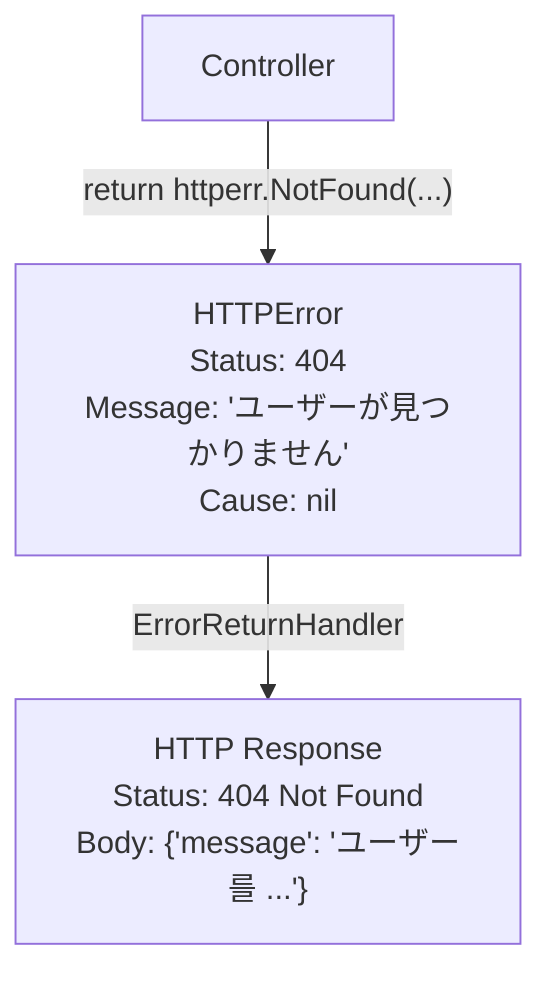

# httperrパッケージ

標準化されたHTTPエラー処理。


## 概要

`httperr` パッケージは、コントローラで HTTP ステータスコードを明示的に表現しながら、HTTP レイヤに直接依存しないように設計されたエラータイプを提供します。 Controllerはビジネスロジックの観点からエラーを返し、`ErrorReturnHandler`はそれを適切なHTTP応答に変換します。





## なぜhttperrなのか？

＃＃＃問題：コントローラはHTTPを知る必要がありますか？

一般的な方法では、ControllerはHTTP応答を直接作成します。


```go
// ❌ HTTP層に直接依存
func (c *UserController) GetUser(ctx echo.Context) error {
    user, err := c.repo.FindByID(id)
    if err != nil {
        return ctx.JSON(404, map[string]string{"error": "not found"})
    }
    return ctx.JSON(200, user)
}
```

このアプローチの問題：
- ControllerがHTTPフレームワーク(Echo)に依存
- ステータスコードと応答形式がビジネスロジックと混在する
- テストするのが難しい

### 解決: 意味タイプによるエラー表現


```go
// ✓ Spine 方式: HTTPを知らなくても意味は明確
func (c *UserController) GetUser(userId path.Int) (User, error) {
    user, err := c.repo.FindByID(userId.Value)
    if err != nil {
        return User{}, httperr.NotFound("ユーザーが見つかりません")
    }
    return user, nil
}
```

コントローラーは：
- HTTPフレームワークを知らない
- ステータスコードの**意味**のみ表現(NotFound、BadRequestなど)
- 実際のHTTP変換は`ErrorReturnHandler`が担当


## HTTPError構造体


```go
// pkg/httperr/types.go
type HTTPError struct {
    Status  int    // HTTPステータスコード
    Message string // エラーメッセージ
    Cause   error  // 原因エラー（任意）
}

// error 인터페이스 구현
func (e *HTTPError) Error() string {
    return e.Message
}
```

### フィールドの説明

|フィールド|タイプ|説明
|------|------|------|
| `Status` | `int` | HTTPステータスコード（400、401、404、500など）|
| `Message` | `string` |クライアントに渡すエラーメッセージ
| `Cause` | `error` |原因となるサブエラー（デバッグ/ロギング用）

### errorインターフェース

`HTTPError`はGoの`error`インターフェースを実装します。したがって、通常のエラーのように返して処理できます。


```go
func (c *UserController) GetUser(userId path.Int) (User, error) {
    // httperr.NotFound()는 error 型을 반환
    return User{}, httperr.NotFound("ユーザーが見つかりません")
}
```


## ヘルパー関数

よく使用するHTTPステータスコードのヘルパー関数を提供します。

### BadRequest


```go
func BadRequest(msg string) error {
    return &HTTPError{Status: 400, Message: msg}
}
```

クライアント要求が間違っているときに使用します。


```go
if userId.Value <= 0 {
    return User{}, httperr.BadRequest("無効なユーザーIDです")
}
```

### Unauthorized


```go
func Unauthorized(msg string) error {
    return &HTTPError{Status: 401, Message: msg}
}
```

認証が必要または失敗したときに使用します。


```go
if !c.auth.IsValid(token) {
    return User{}, httperr.Unauthorized("認証が必要です")
}
```

### NotFound


```go
func NotFound(msg string) error {
    return &HTTPError{Status: 404, Message: msg}
}
```

リソースが見つからない場合に使用します。


```go
user, err := c.repo.FindByID(id)
if err != nil {
    return User{}, httperr.NotFound("ユーザーが見つかりません")
}
```

### InternalServerError


```go
func InternalServerError(msg string) error {
    return &HTTPError{Status: 500, Message: msg}
}
```

サーバー内部エラーを明示的に表現するときに使用します。


```go
result, err := c.externalService.Call()
if err != nil {
    return Result{}, httperr.InternalServerError("외부 서비스 呼び出し에 失敗했습니다")
}
```


## ErrorReturnHandler

Controllerによって返されたエラーをHTTP応答に変換します。


```go
// internal/handler/error_return_handler.go
type ErrorReturnHandler struct{}

func (h *ErrorReturnHandler) Supports(returnType reflect.Type) bool {
    errorType := reflect.TypeFor[error]()
    return returnType.Implements(errorType)
}

func (h *ErrorReturnHandler) Handle(value any, ctx core.ExecutionContext) error {
    rwAny, ok := ctx.Get("spine.response_writer")
    if !ok {
        return fmt.Errorf("ExecutionContext 内で ResponseWriter를 見つかりません.")
    }
    
    rw, ok := rwAny.(core.ResponseWriter)
    if !ok {
        return fmt.Errorf("ResponseWriter 型이 올바르지 しません.")
    }
    
    err, ok := value.(error)
    if !ok {
        return fmt.Errorf("ErrorReturnHandler는 error 型만 処理할 수 있습니다: %T", value)
    }
    
    status := 500
    message := err.Error()
    
    // HTTPError면 ステータスコードを抽出
    var httpErr *httperr.HTTPError
    if errors.As(err, &httpErr) {
        status = httpErr.Status
        message = httpErr.Message
    }
    
    return rw.WriteJSON(status, map[string]any{
        "message": message,
    })
}
```

### 動作原理

1. Controllerが`error`を返す
2. Pipelineが`ErrorReturnHandler.Supports()`を呼び出す→`true`
3. `ErrorReturnHandler.Handle()`の実行
4. `errors.As()`で`HTTPError`かどうかを確認する
5. `HTTPError`の場合、指定されたステータスコードの使用、または500

### HTTPError vs 汎用エラー


```go
// HTTPError → 지정된 상태 코드
return httperr.NotFound("...")  // → 404

// 通常のerror → 500 Internal Server Error
return errors.New("something went wrong")  // → 500
```


## 使用例

### デフォルトの使用


```go
func (c *UserController) GetUser(userId path.Int) (User, error) {
    if userId.Value <= 0 {
        return User{}, httperr.BadRequest("無効なユーザーIDです")
    }
    
    user, err := c.repo.FindByID(userId.Value)
    if err != nil {
        return User{}, httperr.NotFound("ユーザーが見つかりません")
    }
    
    return user, nil
}
```


```bash
# 不正な ID
GET /users/-1
→ 400 {"message": "無効なユーザーIDです"}

# 존재하지 않는 ユーザー
GET /users/999
→ 404 {"message": "ユーザーが見つかりません"}

# 정상
GET /users/123
→ 200 {"id": 123, "name": "john"}
```

### 認証処理


```go
func (c *OrderController) GetOrder(orderId path.Int) (Order, error) {
    order, err := c.repo.FindByID(orderId.Value)
    if err != nil {
        return Order{}, httperr.NotFound("주문을 見つかりません")
    }
    
    if !c.auth.CanAccess(order.UserID) {
        return Order{}, httperr.Unauthorized("접근 권한이 ありません")
    }
    
    return order, nil
}
```

### ビジネスルールの検証


```go
func (c *PaymentController) Process(req PaymentRequest) (Receipt, error) {
    if req.Amount <= 0 {
        return Receipt{}, httperr.BadRequest("결제 금액은 0보다 커야 합니다")
    }
    
    if req.Amount > 10000000 {
        return Receipt{}, httperr.BadRequest("1회 결제 한도를 초과했습니다")
    }
    
    balance, err := c.wallet.GetBalance(req.UserID)
    if err != nil {
        return Receipt{}, httperr.NotFound("지갑을 見つかりません")
    }
    
    if balance < req.Amount {
        return Receipt{}, httperr.BadRequest("잔액이 부족합니다")
    }
    
    return c.processPayment(req)
}
```

### エラーのみを返す場合

成功時に戻り値がない場合にも使用できます。


```go
func (c *UserController) DeleteUser(userId path.Int) error {
    exists, err := c.repo.Exists(userId.Value)
    if err != nil || !exists {
        return httperr.NotFound("ユーザーが見つかりません")
    }
    
    if err := c.repo.Delete(userId.Value); err != nil {
        return httperr.BadRequest("삭제할 수 ありません")
    }
    
    return nil  // 성공 시 nil 반환
}
```


## 拡張する

### 新しいステータスコードを追加

現在提供されているヘルパーは400、401、404、500です。必要に応じて拡張できます。


```go
// 직접 HTTPError 生成
func Forbidden(msg string) error {
    return &httperr.HTTPError{Status: 403, Message: msg}
}

func Conflict(msg string) error {
    return &httperr.HTTPError{Status: 409, Message: msg}
}

func UnprocessableEntity(msg string) error {
    return &httperr.HTTPError{Status: 422, Message: msg}
}

func TooManyRequests(msg string) error {
    return &httperr.HTTPError{Status: 429, Message: msg}
}
```

### Causeの活用

原因 エラーを含むデバッグに活用できます。


```go
func WithCause(status int, msg string, cause error) error {
    return &httperr.HTTPError{
        Status:  status,
        Message: msg,
        Cause:   cause,
    }
}

// 사용
user, err := c.repo.FindByID(id)
if err != nil {
    return User{}, WithCause(404, "ユーザーが見つかりません", err)
}
```

Interceptorの`AfterCompletion`から`Cause`をログに記録できます。


```go
func (i *LoggingInterceptor) AfterCompletion(ctx core.ExecutionContext, meta core.HandlerMeta, err error) {
    if err != nil {
        var httpErr *httperr.HTTPError
        if errors.As(err, &httpErr) && httpErr.Cause != nil {
            log.Printf("[ERR] %s %s: %s (cause: %v)", 
                ctx.Method(), ctx.Path(), httpErr.Message, httpErr.Cause)
        }
    }
}
```


## Pipelineでのエラーフロー

### 2段階のエラー処理

Spine Pipelineはエラーを**2つのステップ**で処理します。

1. **`handleReturn()`**: Controller 戻り値のうち error を `ErrorReturnHandler` として扱う
2. **`handleExecutionError()`**: Pipeline 実行中に発生したエラーを最終安全網として処理

```
Controller
     │
     │  return (User{}, httperr.NotFound("..."))
     ▼
┌─────────────────────────────────────┐
│         handleReturn()              │
│                                     │
│  results = [User{}, *HTTPError]     │
│                                     │
│  1. isNilResult() 체크              │
│  2. error 型 우선 탐색             │
│  3. ErrorReturnHandler.Handle()     │
│     → rw.WriteJSON(404, {...})      │
└─────────────────────────────────────┘
```

### handleReturn - error 優先処理

`Pipeline.handleReturn()`はエラータイプを優先します。 `isNilResult()`でnilかどうかを包括的にチェックします。


```go
// internal/pipeline/pipeline.go
func (p *Pipeline) handleReturn(ctx core.ExecutionContext, results []any) error {
    // error가 있으면 error만 処理하고 종료
    for _, result := range results {
        if isNilResult(result) {
            continue
        }
        if _, isErr := result.(error); isErr {
            resultType := reflect.TypeOf(result)
            for _, h := range p.returnHandlers {
                if h.Supports(resultType) {
                    if err := h.Handle(result, ctx); err != nil {
                        return err
                    }
                    // error 반환값은 여기서 소비하고 종료한다.
                    return nil
                }
            }
            return fmt.Errorf(
                "error 반환값을 処理할 ReturnValueHandler가 ありません. (%s)",
                resultType.String(),
            )
        }
    }
    
    // error가 없으면 最初の non-nil 값 処理
    for _, result := range results {
        if isNilResult(result) {
            continue
        }
        resultType := reflect.TypeOf(result)
        // ...ReturnValueHandler로 処理
    }
    return nil
}
```

> **`isNilResult`**: `nil` リテラルだけでなく、タイプ情報はあるが値が nil の場合（`interface` に nil が含まれた場合など）まで包括的に処理します。

したがって、`(User, error)`を返すとき：
- `error`がnon-nil→errorのみ処理、Userを無視
- `error`がnil→User処理

### handleExecutionError - 最終セーフティネット

パイプラインの実行中にエラーが発生すると、`handleExecutionError`は最終安全ネットワークとして機能します。すでに応答がコミットされている場合は、二重応答を防ぎます。


```go
// internal/pipeline/pipeline.go
func (p *Pipeline) handleExecutionError(ctx core.ExecutionContext, err error) {
    rwAny, ok := ctx.Get("spine.response_writer")
    if !ok {
        return
    }
    
    rw, ok := rwAny.(core.ResponseWriter)
    if !ok {
        return
    }
    
    // 이미 レスポンス이 커밋된 경우 이중 レスポンス 방지
    if rw.IsCommitted() {
        return
    }
    
    var httpErr *httperr.HTTPError
    if errors.As(err, &httpErr) {
        rw.WriteJSON(httpErr.Status, map[string]any{
            "message": httpErr.Message,
        })
        return
    }
    
    rw.WriteJSON(500, map[string]any{
        "message": "Internal server error",
    })
}
```

### エラー処理全体の流れ

```
Pipeline.Execute()
     │
     ├── handleReturn() 에서 error 処理 성공
     │   └── ErrorReturnHandler가 レスポンス 작성 → 종료
     │
     ├── handleReturn() 자체가 error 반환
     │   └── handleExecutionError() → 안전망 レスポンス
     │
     ├── Router/Resolver/Invoker 에서 error 발생
     │   └── handleExecutionError() → 안전망 レスポンス
     │
     └── handleExecutionError() 조건 분기
         ├── rw.IsCommitted() → 스킵 (이중 レスポンス 방지)
         ├── HTTPError → 지정된 상태 코드로 レスポンス
         └── 通常のerror → 500 "Internal server error"
```


## フレームワーク内部の使用

`httperr`は、Controllerだけでなくフレームワーク内でも使用されます。

### Routerでの使用

一致するハンドラがない場合は`httperr.NotFound`を返します。


```go
// internal/router/router.go
func (r *DefaultRouter) Route(ctx core.ExecutionContext) (core.HandlerMeta, error) {
    for _, route := range r.routes {
        // ...매칭 시도
    }
    return core.HandlerMeta{}, httperr.NotFound("핸들러가 ありません.")
}
```

このエラーは`handleExecutionError`によって404応答に変換されます。


## 設計原則

### 1. ControllerはHTTPを知らない


```go
// ✓ 意味만 표현
return httperr.NotFound("ユーザーが見つかりません")

// ❌ HTTP 직접 조작
return ctx.JSON(404, ...)
```

### 2.ステータスコードは意味タイプ


```go
// ✓ 함수 名前이 意味를 표현
httperr.BadRequest(...)
httperr.Unauthorized(...)
httperr.NotFound(...)
httperr.InternalServerError(...)

// ❌ 숫자 코드 직접 사용
return &HTTPError{Status: 404, ...}  // 가능하지만 권장하지 않음
```

### 3. エラーも戻り値

Goの慣例通り、エラーを戻り値として処理します。例外を投げません。


```go
// ✓ 明示적 반환
func GetUser(id path.Int) (User, error) {
    if ... {
        return User{}, httperr.NotFound(...)
    }
    return user, nil
}

// ❌ panic (Spine은 이 方式을 사용하지 않음)
func GetUser(id path.Int) User {
    if ... {
        panic(httperr.NotFound(...))
    }
    return user
}
```

### 4. 二重応答の防止

Pipelineの`handleExecutionError`は`rw.IsCommitted()`をチェックし、すでに応答が作成されている場合の追加応答を防ぎます。これは、Interceptorが直接応答を作成した後に`ErrAbortPipeline`を返すパターンとも安全に共存します。


## まとめ

|機能|ステータスコード|用途|
|------|----------|------|
| `BadRequest(msg)` | 400 |間違った要求
| `Unauthorized(msg)` | 401 |認証が必要/失敗|
| `NotFound(msg)` | 404 |リソースが見つかりません
| `InternalServerError(msg)` | 500 |サーバー内部エラー

|コンポーネント役割|
|----------|------|
| `HTTPError` |ステータスコードとメッセージを含むエラータイプ|
| `ErrorReturnHandler` | Controller戻りエラー→HTTP応答変換|
| `handleExecutionError` |パイプラインエラー最終安全ネットワーク（二重応答防止）|
| `isNilResult` |包括的なnilチェック（インタフェースnilを含む）|

**核心哲学**: Controllerは「404を返す」ではなく「見つからない」を表現します。 HTTPステータスコードへの変換はパイプラインが担当します。これがSpineの関心の分離原則です。