＃実行パイプライン

Spineの要求ライフサイクルを理解する。


## 概要

Spineの中心的な哲学は、**実行フローの明示性**です。ほとんどのWebフレームワークは要求処理プロセスを内部に隠しますが、Spineはすべてのステップをコード構造に固定して明確に明らかにします。

すべてのHTTPリクエストは、次のパイプラインを**必ず**順に渡します。

```mermaid
graph TD
    Request["HTTP Request"]
    
    ExecutionContext["ExecutionContext<br>(リクエスト コンテキスト 生成)"]
    GlobalPre["Global Interceptor.PreHandle<br>(ルーティング前 前処理)"]
    Router["Router<br>(HandlerMeta 任意)"]
    ParamMeta["ParameterMeta Builder<br>(パラメータ メタ情報 構成)"]
    ArgResolver["ArgumentResolver Chain<br>(引数 値 生成)"]
    RoutePre["Route Interceptor.PreHandle<br>(ルート 前処理)"]
    Invoker["Invoker<br>(Controller メソッド 呼び出し)"]
    ReturnHandler["ReturnValueHandler<br>(返却値 → レスポンス 変換)"]
    PostHook["PostExecutionHook<br>(イベント 発行 など)"]
    RoutePost["Route Interceptor.PostHandle ↩<br>(ルート 後処理)"]
    GlobalPost["Global Interceptor.PostHandle ↩<br>(グローバル 後処理)"]
    RouteAfter["Route Interceptor.AfterCompletion ↩<br>(常に 実行)"]
    GlobalAfter["Global Interceptor.AfterCompletion ↩<br>(常に 実行)"]
    ErrorHandler["handleExecutionError<br>(エラーセーフティネット)"]
    Response["HTTP Response"]

    Request --> ExecutionContext
    ExecutionContext --> GlobalPre
    GlobalPre --> Router
    Router --> ParamMeta
    ParamMeta --> ArgResolver
    ArgResolver --> RoutePre
    RoutePre --> Invoker
    Invoker --> ReturnHandler
    ReturnHandler --> PostHook
    PostHook --> RoutePost
    RoutePost --> GlobalPost
    GlobalPost --> RouteAfter
    RouteAfter --> GlobalAfter
    GlobalAfter --> ErrorHandler
    ErrorHandler --> Response
```





## 1. ExecutionContextの生成

HTTP要求が到着すると、Transportアダプター（Echo）は要求をSpineの`ExecutionContext`に変換します。


```go
// internal/adapter/echo/adapter.go
func (s *Server) handle(c echo.Context) error {
    ctx := NewContext(c)
    
    ctx.Set(
        "spine.response_writer",
        NewEchoResponseWriter(c),
    )
    
    if err := s.pipeline.Execute(ctx); err != nil {
        c.Logger().Errorf("pipeline error: %v", err)
        // パイプラインの内部で すでに レスポンスは 作成されたために
        // Echo 基本 エラー ハンドラーに 重複 伝達しません.
        return nil
    }
    return nil
}
```

`ExecutionContext`は、パイプライン全体で共有される要求スコープのコンテキストです。 HTTPメソッド、パス、ヘッダー、クエリパラメータなど、リクエスト内のすべての情報にアクセスできます。

> **注**：WebSocketリクエストも同じパイプラインを使用します。 `ws.Runtime` このメッセージごとに `WSExecutionContext` を生成して `pipeline.Execute(ctx)` を呼び出します。


## 2. Global Interceptor.PreHandle

**ルーティングの前に**グローバルインターセプタが最初に実行されます。この時点では、まだどのハンドラが実行されるかが決定されていないため、空の`HandlerMeta`が渡されます。


```go
// internal/pipeline/pipeline.go
globalMeta := core.HandlerMeta{}

for _, it := range p.interceptors {
    if err := it.PreHandle(ctx, globalMeta); err != nil {
        if errors.Is(err, core.ErrAbortPipeline) {
            return nil
        }
        return err
    }
}
```

CORSプリフライト処理のように、ルーティング前に要求を傍受する必要がある場合に使用されます。


```go
// interceptor/cors/cors.go
if ctx.Method() == "OPTIONS" {
    rw.WriteStatus(204)
    return core.ErrAbortPipeline
}
```


## 3. Router - HandlerMetaを選択

Router は、要求パスとメソッドに基づいて実行する Controller メソッドを決定します。


```go
// internal/router/router.go
func (r *DefaultRouter) Route(ctx core.ExecutionContext) (core.HandlerMeta, error) {
    for _, route := range r.routes {
        if route.Method != ctx.Method() {
            continue
        }
        
        ok, params, keys := matchPath(route.Path, ctx.Path())
        if !ok {
            continue
        }
        
        // path param注入
        ctx.Set("spine.params", params)
        ctx.Set("spine.pathKeys", keys)
        
        return route.Meta, nil
    }
    return core.HandlerMeta{}, httperr.NotFound("ハンドラーが ありません.")
}
```

`HandlerMeta`には、実行先のメタデータが含まれています。


```go
// core/handler_meta.go
type HandlerMeta struct {
    ControllerType reflect.Type    // コントローラ型
    Method         reflect.Method  // 呼び出すメソッド
    Interceptors   []Interceptor   // ルート レベル インターセプター
}
```


## 4. ParameterMetaの設定

Controllerメソッドのシグネチャを分析して、各パラメータのメタ情報を生成します。


```go
// internal/pipeline/pipeline.go
func buildParameterMeta(method reflect.Method, ctx core.ExecutionContext) []resolver.ParameterMeta {
    pathKeys := ctx.PathKeys()
    pathIdx := 0
    var metas []resolver.ParameterMeta
    
    for i := 1; i < method.Type.NumIn(); i++ {
        pt := method.Type.In(i)
        
        pm := resolver.ParameterMeta{
            Index: i - 1,
            Type:  pt,
        }
        
        // path.* 型なら 順序どおりに PathKey 割り当てる
        if isPathType(pt) {
            if pathIdx >= len(pathKeys) {
                pm.PathKey = ""
            } else {
                pm.PathKey = pathKeys[pathIdx]
            }
            pathIdx++
        }
        
        metas = append(metas, pm)
    }
    
    return metas
}

func isPathType(pt reflect.Type) bool {
    pathPkg := reflect.TypeFor[path.Int]().PkgPath()
    return pt.PkgPath() == pathPkg
}
```

**Path Parameterバインディングルール**：Spineはオーダーベースのバインディングを使用します。 `path`パッケージに属するタイプ（`path.Int`、`path.String`、`path.Boolean`）のみPathKeyが割り当てられます。


```go
// Route: /users/:userId/posts/:postId
// Controller:
func GetPost(userId path.Int, postId path.Int) // ✓ 順序 一致
```


## 5. ArgumentResolver Chain

各パラメータタイプに合ったResolverが実際の値を生成します。


```go
// internal/pipeline/pipeline.go
func (p *Pipeline) resolveArguments(ctx core.ExecutionContext, paramMetas []resolver.ParameterMeta) ([]any, error) {
    args := make([]any, 0, len(paramMetas))
    
    for _, paramMeta := range paramMetas {
        resolved := false
        
        for _, r := range p.argumentResolvers {
            if !r.Supports(paramMeta) {
                continue
            }
            
            val, err := r.Resolve(ctx, paramMeta)
            if err != nil {
                return nil, err
            }
            
            args = append(args, val)
            resolved = true
            break
        }
        
        if !resolved {
            return nil, fmt.Errorf(
                "ArgumentResolverに parameterが ありません. %d (%s)",
                paramMeta.Index,
                paramMeta.Type.String(),
            )
        }
    }
    return args, nil
}
```

### 組み込みResolver

| Resolver |サポートタイプ|説明
|----------|----------|------|
| `StdContextResolver` | `context.Context` |標準コンテキスト（EventBus注入）|
| `ControllerContextResolver` | `core.ControllerContext` | ExecutionContext読み取り専用Facade |
| `HeaderResolver` | `header.*` | HTTPヘッダー値|
| `PathIntResolver` | `path.Int` |パスから整数を抽出する
| `PathStringResolver` | `path.String` |パスから文字列を抽出する
| `PathBooleanResolver` | `path.Boolean` |パスからブール語を抽出する
| `PaginationResolver` | `query.Pagination` |ページ、サイズクエリパラメータ|
| `QueryValuesResolver` | `query.Values` |フルクエリパラメータビュー|
| `DTOResolver` | `*struct`（ポインター）| JSON bodyバインディング|
| `FormDTOResolver` | `*struct`（フォームタグ）| Multipart / Formバインディング
| `UploadedFilesResolver` | `multipart.Form` |ファイルアップロード|

### ArgumentResolver インタフェース


```go
// internal/resolver/argument.go
type ArgumentResolver interface {
    // は Resolverが し当 型を 処理する できますかどうかを判断
    Supports(parameterMeta ParameterMeta) bool
    
    // Contextから 実際の 値 生成
    Resolve(ctx core.ExecutionContext, parameterMeta ParameterMeta) (any, error)
}
```

> **注意**：Resolverは`core.ExecutionContext`を受け取り、必要に応じて`core.HttpRequestContext`、`core.ConsumerRequestContext`、`core.WebSocketContext`とタイプします。


## 6. Route Interceptor.PreHandle

ルーティングの後、コントローラの呼び出し前にルートレベルインターセプタが実行されます。このインターセプタは`HandlerMeta.Interceptors`に含まれており、特定のハンドラにのみ適用されます。


```go
routeInterceptors := meta.Interceptors

for _, it := range routeInterceptors {
    if err := it.PreHandle(ctx, meta); err != nil {
        if errors.Is(err, core.ErrAbortPipeline) {
            return nil
        }
        return err
    }
}
```

### Interceptor インタフェース


```go
// core/interceptor.go
type Interceptor interface {
    // Controller 呼び出し 前 実行
    PreHandle(ctx ExecutionContext, meta HandlerMeta) error
    
    // ReturnValueHandler 処理 後 実行
    PostHandle(ctx ExecutionContext, meta HandlerMeta)
    
    // 成功/失敗と に関係なく 最後にに 呼び出し
    AfterCompletion(ctx ExecutionContext, meta HandlerMeta, err error)
}
```

### グローバルvsルートインターセプタ

|区分登録方法実行時点| metaコンテンツ|
|------|----------|----------|----------|
|グローバル`app.Interceptor()` |ルーティング**前** |空`HandlerMeta{}` |
|ルート| `route.WithInterceptors()` |ルーティング**後**、Controller**前** |実際の`HandlerMeta` |

### パイプラインの中断

`PreHandle`から`core.ErrAbortPipeline`を返すと、以降のステップはスキップされます。ただし、`AfterCompletion`は常に実行されます。


## 7. Invoker - Controller メソッドの呼び出し

IoC Container から Controller インスタンスを取得し、メソッドを呼び出します。


```go
// internal/invoker/invoker.go
func (i *Invoker) Invoke(controllerType reflect.Type, method reflect.Method, args []any) ([]any, error) {
    // Containerで インスタンス Resolve
    controller, err := i.container.Resolve(controllerType)
    if err != nil {
        return nil, err
    }
    
    // リフレクションにに メソッド 呼び出し
    values := make([]reflect.Value, len(args)+1)
    values[0] = reflect.ValueOf(controller)
    for idx, arg := range args {
        values[idx+1] = reflect.ValueOf(arg)
    }
    
    results := method.Func.Call(values)
    
    // 結と 変換
    out := make([]any, len(results))
    for i, result := range results {
        out[i] = result.Interface()
    }
    
    return out, nil
}
```

**Controllerの責任**：Controllerは純粋にビジネスロジックのみを担当します。 HTTP、パイプライン、実行順序をまったく知りません。


```go
func (c *UserController) GetUser(userId path.Int) (User, error) {
    if userId.Value <= 0 {
        return User{}, httperr.BadRequest("無効な ユーザー ID")
    }
    return c.repo.FindByID(userId.Value)
}
```


## 8. ReturnValueHandler

Controllerの戻り値をHTTPレスポンスに変換します。 error型を優先処理し、`isNilResult()`で包括的なnilチェックを行います。


```go
// internal/pipeline/pipeline.go
func (p *Pipeline) handleReturn(ctx core.ExecutionContext, results []any) error {
    // errorがあればerrorだけ処理して終了
    for _, result := range results {
        if isNilResult(result) {
            continue
        }
        if _, isErr := result.(error); isErr {
            resultType := reflect.TypeOf(result)
            for _, h := range p.returnHandlers {
                if h.Supports(resultType) {
                    if err := h.Handle(result, ctx); err != nil {
                        return err
                    }
                    return nil
                }
            }
            return fmt.Errorf(
                "error 返却値を 処理する ReturnValueHandlerが ありません. (%s)",
                resultType.String(),
            )
        }
    }
    
    // errorが なければ 最初の non-nil 値 処理
    for _, result := range results {
        if isNilResult(result) {
            continue
        }
        resultType := reflect.TypeOf(result)
        handled := false
        for _, h := range p.returnHandlers {
            if !h.Supports(resultType) {
                continue
            }
            if err := h.Handle(result, ctx); err != nil {
                return err
            }
            handled = true
            break
        }
        if !handled {
            return fmt.Errorf(
                "ReturnValueHandlerが ありません. (%s)",
                resultType.String(),
            )
        }
    }
    return nil
}
```

### 組み込みハンドラー

| Handler |サポートタイプ|応答形式
|---------|----------|----------|
| `RedirectReturnValueHandler` | `httpx.Redirect` | Locationヘッダー+ 302 |
| `BinaryReturnHandler` | `httpx.Binary` |バイナリデータ（ファイルなど）|
| `StringReturnHandler` | `httpx.Response[string]` | Plain Text |
| `JSONReturnHandler` | `httpx.Response[T]` (T ≠ string) | JSON |
| `ErrorReturnHandler` | `error` | JSON（ステータスコードマッピング）|

### ReturnValueHandlerインタフェース


```go
// internal/handler/return_value.go
type ReturnValueHandler interface {
    Supports(returnType reflect.Type) bool
    Handle(value any, ctx core.ExecutionContext) error
}
```


## 9. PostExecutionHook

ReturnValueHandler処理後、登録された後処理フックが実行されます。代表的には、ドメインイベントの発行はこの段階で行われます。


```go
// PostHooks 実行
for _, hook := range p.postHooks {
    hook.AfterExecution(ctx, results, returnError)
}
```


```go
// internal/event/hook/post_execution.go
func (h *EventDispatchHook) AfterExecution(ctx core.ExecutionContext, results []any, err error) {
    if err != nil {
        return
    }
    events := ctx.EventBus().Drain()
    if len(events) == 0 {
        return
    }
    h.Dispatcher.Dispatch(ctx.Context(), events)
}
```


## 10. Interceptor.PostHandle & AfterCompletion

### PostHandle

ReturnValueHandler 処理後、逆の順序で実行されます。ルートインターセプタが最初に、グローバルインターセプタが後で実行されます。


```go
// ルート Interceptor postHandle (逆順)
for i := len(routeInterceptors) - 1; i >= 0; i-- {
    routeInterceptors[i].PostHandle(ctx, meta)
}

// グローバル Interceptor postHandle (逆順)
for i := len(p.interceptors) - 1; i >= 0; i-- {
    p.interceptors[i].PostHandle(ctx, meta)
}
```

### AfterCompletion

成功/失敗に関係なく**常に**実行されます。 `defer`で保証されています。ルートインターセプタが最初に、グローバルインターセプタが後で整理されます。


```go
// ルート Interceptor AfterCompletion (defer - 常に 実行)
defer func() {
    for i := len(routeInterceptors) - 1; i >= 0; i-- {
        routeInterceptors[i].AfterCompletion(ctx, meta, finalErr)
    }
}()

// グローバル Interceptor AfterCompletion (defer - 常に 実行)
defer func() {
    for i := len(p.interceptors) - 1; i >= 0; i-- {
        p.interceptors[i].AfterCompletion(ctx, globalMeta, finalErr)
    }
}()
```

リソースのクリーンアップ、ロギング、メトリックの収集などに活用します。


## 11. handleExecutionError - エラーセーフティネット

Pipelineの実行中にエラーが発生した場合は、最終的な安全ネットワークで応答を作成します。すでに応答がコミットされている場合は、二重応答を防ぎます。


```go
// internal/pipeline/pipeline.go
defer func() {
    if finalErr != nil {
        p.handleExecutionError(ctx, finalErr)
    }
}()

func (p *Pipeline) handleExecutionError(ctx core.ExecutionContext, err error) {
    rwAny, ok := ctx.Get("spine.response_writer")
    if !ok {
        return
    }
    rw, ok := rwAny.(core.ResponseWriter)
    if !ok {
        return
    }
    
    // すでに レスポンスがコミットされた 場合 二重 レスポンス 防止
    if rw.IsCommitted() {
        return
    }
    
    var httpErr *httperr.HTTPError
    if errors.As(err, &httpErr) {
        rw.WriteJSON(httpErr.Status, map[string]any{
            "message": httpErr.Message,
        })
        return
    }
    
    rw.WriteJSON(500, map[string]any{
        "message": "Internal server error",
    })
}
```


## インターセプタ実行順序の詳細

テストコードで検証された実際の実行順序です。

### 通常フロー

```
pre:global → pre:route → [Controller] → post:route → post:global → after:route → after:global
```

### ルートインターセプタで中断 (ErrAbortPipeline)

```
pre:global → pre:route → after:route → after:global
```

Controllerは呼び出されませんが、`AfterCompletion`は常に実行されます。

### グローバルインターセプタで中断 (ErrAbortPipeline)

```
pre:global → after:global
```

Routerも呼び出されないため、ルートインターセプタも実行されません。


## フル実行フローコード


```go
// internal/pipeline/pipeline.go
func (p *Pipeline) Execute(ctx core.ExecutionContext) (finalErr error) {
    // エラーセーフティネット: エラー 発生 時 レスポンス 作成
    defer func() {
        if finalErr != nil {
            p.handleExecutionError(ctx, finalErr)
        }
    }()

    // グローバル Interceptor AfterCompletion (常に 実行)
    globalMeta := core.HandlerMeta{}
    defer func() {
        for i := len(p.interceptors) - 1; i >= 0; i-- {
            p.interceptors[i].AfterCompletion(ctx, globalMeta, finalErr)
        }
    }()

    // 1. グローバル Interceptor PreHandle (ルーティング前)
    for _, it := range p.interceptors {
        if err := it.PreHandle(ctx, globalMeta); err != nil {
            if errors.Is(err, core.ErrAbortPipeline) {
                return nil
            }
            return err
        }
    }

    // 2. Routerが 実行 対象 決定
    meta, err := p.router.Route(ctx)
    if err != nil {
        return err
    }

    routeInterceptors := meta.Interceptors

    // ルート Interceptor AfterCompletion (常に 実行)
    defer func() {
        for i := len(routeInterceptors) - 1; i >= 0; i-- {
            routeInterceptors[i].AfterCompletion(ctx, meta, finalErr)
        }
    }()

    // 3. ParameterMeta 生成
    paramMetas := buildParameterMeta(meta.Method, ctx)

    // 4. ArgumentResolver チェーン 実行
    args, err := p.resolveArguments(ctx, paramMetas)
    if err != nil {
        return err
    }

    // 5. ルート Interceptor PreHandle
    for _, it := range routeInterceptors {
        if err := it.PreHandle(ctx, meta); err != nil {
            if errors.Is(err, core.ErrAbortPipeline) {
                return nil
            }
            return err
        }
    }

    // 6. Controller メソッド 呼び出し
    results, err := p.invoker.Invoke(meta.ControllerType, meta.Method, args)
    if err != nil {
        return err
    }

    // 7. ReturnValueHandler 処理
    returnError := p.handleReturn(ctx, results)

    // 8. PostExecutionHook (イベント 発行 など)
    for _, hook := range p.postHooks {
        hook.AfterExecution(ctx, results, returnError)
    }

    if returnError != nil {
        return returnError
    }

    // 9. ルート Interceptor PostHandle (逆順)
    for i := len(routeInterceptors) - 1; i >= 0; i-- {
        routeInterceptors[i].PostHandle(ctx, meta)
    }

    // 10. グローバル Interceptor PostHandle (逆順)
    for i := len(p.interceptors) - 1; i >= 0; i-- {
        p.interceptors[i].PostHandle(ctx, meta)
    }

    return nil
}
```


## Pipeline構造体


```go
// internal/pipeline/pipeline.go
type Pipeline struct {
    router            router.Router
    interceptors      []core.Interceptor
    argumentResolvers []resolver.ArgumentResolver
    returnHandlers    []handler.ReturnValueHandler
    invoker           *invoker.Invoker
    postHooks         []hook.PostExecutionHook
}
```

Pipelineは、単一のHTTPパイプラインだけでなく、Consumer Pipeline、WebSocket Pipelineでも同じように使用されます。各トランスポートごとに別々の Pipeline インスタンスが作成され、Resolver と Handler の構成のみが異なります。


## まとめ

|ステップ|コンポーネント|責任
|------|----------|------|
| 1 | Transport Adapter | HTTP→ExecutionContext変換|
| 2 | Global Interceptor.PreHandle |ルーティング前の前処理（CORSなど）|
| 3 | Router |リクエストパス→HandlerMetaマッピング|
| 4 | ParameterMeta Builder |メソッドシグネチャ分析|
| 5 | ArgumentResolver |パラメータタイプ→実数値生成|
| 6 | Route Interceptor.PreHandle |ルート前処理（認証など）|
| 7 | Invoker | Controllerメソッドの呼び出し|
| 8 | ReturnValueHandler |戻り値→HTTP応答変換|
| 9 | PostExecutionHook |ドメインイベント発行などの後処理
| 10 | Route Interceptor.PostHandle↩|ルート後処理（逆順）|
| 11 | Global Interceptor.PostHandle↩|グローバル後処理（逆順）|
| 12 | AfterCompletion ↩ |クリーンアップ（ルート→グローバル、常に実行）|
| 13 | handleExecutionError |エラーセーフティネット（二重応答防止）|

この順序は**隠されておらず、暗黙的に変わりません**これはSpineの「No Magic」哲学です。