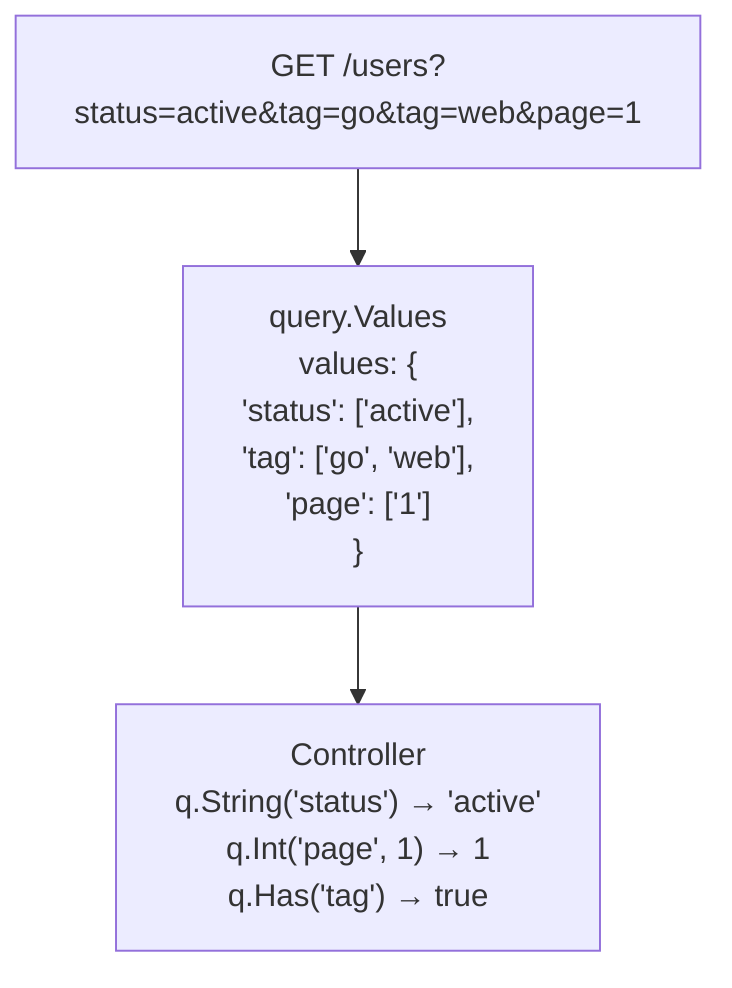

# query.Values

クエリパラメータを明示的に処理する。

## 概要

`query.Values` は、HTTP クエリーパラメータ全体の読み取り専用ビューを提供します。 SpineはクエリパラメータをDTOに自動的にマッピングしません。代わりに、`query.Values`を介してControllerが直接必要な値を明示的に取り出すように設計されています。





＃＃なぜ自動マッピングではないのですか？

ほとんどのフレームワークは、クエリパラメータをstructタグに自動バインドします。


```go
// 他のフレームワークの方式
type SearchParams struct {
    Status string   `query:"status"`
    Tags   []string `query:"tag"`
    Page   int      `query:"page"`
}

func Search(params SearchParams) { ... }
```

Spineはこのアプローチを採用していません。

### 理由 1: 明示性

クエリパラメータは可変でオプションです。自動マッピングは「どのパラメータがどこから来たのか」を隠します。


```go
// Spine 方式: 明示的 抽出
func Search(q query.Values) []User {
    status := q.String("status")      // 明確な出所
    page := q.Int("page", 1)          // デフォルト値を明示
    
    if q.Has("premium") {             // 条件付き処理
        // ...
    }
}
```

### 理由 2: 柔軟性

検索APIのように動的なクエリを扱う場合、structベースのバインディングは制約になります。


```go
// 動的フィルタ処理
func Search(q query.Values) []Product {
    filters := make(map[string]string)
    
    // どのような フィルターが 来るか あらかじめ 分からない
    if q.Has("min_price") {
        filters["min_price"] = q.String("min_price")
    }
    if q.Has("max_price") {
        filters["max_price"] = q.String("max_price")
    }
    if q.Has("category") {
        filters["category"] = q.String("category")
    }
    
    return c.repo.FindByFilters(filters)
}
```


## Values 構造体


```go
// pkg/query/types.go
type Values struct {
    values map[string][]string
}

func NewValues(values map[string][]string) Values {
    return Values{values: values}
}
```

`Values`は`map[string][]string`を包むラッパーです。各キーは複数の値を持つことができます（例：`?tag=go&tag=web`）。


## メソッド

### Get(key string) string

指定したキーの最初の値を文字列として返します。キーがない場合は空の文字列を返します。


```go
// GET /users?name=john&status=active

q.Get("name")    // "john"
q.Get("status")  // "active"
q.Get("missing") // ""
```

### String(key string) string

`Get()`と同じです。エイリアスとして提供されます。


```go
q.String("name")  // "john"
```

### Int(key string, def int64) int64

指定したキーの値を整数として解析します。解析失敗またはキーがない場合はデフォルト値を返します。


```go
// GET /users?page=3&size=20

q.Int("page", 1)    // 3
q.Int("size", 10)   // 20
q.Int("offset", 0)  // 0 (キーなし → デフォルト値)
q.Int("page", 1)    // 1 (もし page=abcなら → デフォルト値)
```

### GetBoolByKey(key string, def bool) bool

指定したキーの値をブーリアンとして解析します。値を小文字に変換して判別します。

**trueとして認識**：`"true"`、`"1"`、`"yes"`、`"y"`、`"on"`（大文字と小文字を無視）

**falseとして認識**：`"false"`、`"0"`、`"no"`、`"n"`、`"off"`（大文字と小文字を無視）


```go
// GET /users?active=true&verified=1&premium=yes

q.GetBoolByKey("active", false)    // true
q.GetBoolByKey("verified", false)  // true
q.GetBoolByKey("premium", false)   // true
q.GetBoolByKey("deleted", false)   // false (キーなし → デフォルト値)
q.GetBoolByKey("active", false)    // false (もし active=maybe → デフォルト値)
```

### Has(key string) bool

指定したキーが存在することを確認してください。値が空でもキーがある場合は`true`です。


```go
// GET /users?status=active&empty=

q.Has("status")  // true
q.Has("empty")   // true (値は 空ですだけ キーは 存在)
q.Has("missing") // false
```


## QueryValuesResolver

`query.Values`タイプをControllerパラメータとして使用すると、`QueryValuesResolver`は自動的に値を生成します。


```go
// internal/resolver/query_values_resolver.go
type QueryValuesResolver struct{}

func (r *QueryValuesResolver) Supports(pm ParameterMeta) bool {
    return pm.Type == reflect.TypeFor[query.Values]()
}

func (r *QueryValuesResolver) Resolve(ctx core.ExecutionContext, parameterMeta ParameterMeta) (any, error) {
    httpCtx, ok := ctx.(core.HttpRequestContext)
    if !ok {
        return nil, fmt.Errorf("HTTP リクエスト コンテキストが ではありません")
    }
    return query.NewValues(httpCtx.Queries()), nil
}
```

### 動作原理

1. PipelineがControllerシグネチャを分析する
2. `query.Values`タイプパラメータ発見
3. `QueryValuesResolver.Supports()` → `true`
4. `QueryValuesResolver.Resolve()`呼び出し
5. `ExecutionContext`を`HttpRequestContext`にタイプ断言
6. `httpCtx.Queries()`でフルクエリマップを取得
7. `query.NewValues()`でラップして返す

> **注**: Resolverは`core.ExecutionContext`を受け取った後、`core.HttpRequestContext`にタイプ断言します。 HTTP要求ではなくコンテキスト（Consumer、WebSocket）はエラーを返します。


## 使用例

### デフォルトの使用


```go
// cmd/demo/controller.go
func (c *UserController) GetUserQuery(q query.Values) User {
    return User{
        ID:   q.Int("id", 0),
        Name: q.String("name"),
    }
}
```


```bash
# リクエスト
GET /users?id=123&name=john

# レスポンス
{
    "id": 123,
    "name": "john"
}
```

### 検索API


```go
func (c *ProductController) Search(q query.Values) SearchResult {
    keyword := q.String("q")
    category := q.String("category")
    minPrice := q.Int("min_price", 0)
    maxPrice := q.Int("max_price", 999999)
    inStock := q.GetBoolByKey("in_stock", true)
    
    products := c.repo.Search(SearchCriteria{
        Keyword:  keyword,
        Category: category,
        MinPrice: minPrice,
        MaxPrice: maxPrice,
        InStock:  inStock,
    })
    
    return SearchResult{
        Query:    keyword,
        Count:    len(products),
        Products: products,
    }
}
```


```bash
GET /products?q=laptop&category=electronics&min_price=500&in_stock=true
```

### ページネーションで使用

`query.Values`と`query.Pagination`を併用できます。


```go
func (c *UserController) List(p query.Pagination, q query.Values) PagedResult {
    status := q.String("status")
    sortBy := q.String("sort_by")
    
    users := c.repo.FindAll(status, sortBy, p.Page, p.Size)
    total := c.repo.Count(status)
    
    return PagedResult{
        Data:  users,
        Page:  p.Page,
        Size:  p.Size,
        Total: total,
    }
}
```


```bash
GET /users?page=2&size=20&status=active&sort_by=created_at
```

### 条件付きフィルタ


```go
func (c *OrderController) List(q query.Values) []Order {
    filters := OrderFilters{}
    
    if q.Has("user_id") {
        filters.UserID = q.Int("user_id", 0)
    }
    
    if q.Has("status") {
        filters.Status = q.String("status")
    }
    
    if q.Has("from_date") {
        filters.FromDate = parseDate(q.String("from_date"))
    }
    
    if q.Has("to_date") {
        filters.ToDate = parseDate(q.String("to_date"))
    }
    
    return c.repo.FindByFilters(filters)
}
```


## 多値処理

クエリパラメータは、同じキーで複数の値を渡すことができます。

```
GET /products?tag=go&tag=web&tag=api
```

現在、`query.Values`の`String()`、`Get()`メソッドは最初の値のみを返します。複数の値が必要な場合は、内部マップに直接アクセスするメソッドを追加したり、コンマ区切り値を解析する方法を使用できます。


```go
// カンマ 区切り 方式
// GET /products?tags=go,web,api

func (c *ProductController) Search(q query.Values) []Product {
    tagsRaw := q.String("tags")
    tags := strings.Split(tagsRaw, ",")
    
    return c.repo.FindByTags(tags)
}
```


## query.Paginationとの違い

|特性query.Values | query.Pagination |
|------|--------------|------------------|
| **用途** |可変クエリパラメータ|固定ページネーション
| **パラメータ** |すべてのクエリ`page`、`size`のみ|
| **デフォルト** |メソッド呼び出し時の指定自動適用（page = 1、size = 20）|
| **タイプ変換** |明示的自動

### 使用選択基準


```go
// 固定の ページネーションだけ 必要 → query.Pagination
func List(p query.Pagination) []User

// 動的 フィルター + ページネーション → 両方 使用
func Search(p query.Pagination, q query.Values) []User

// 完全に 動的のクエリ → query.Valuesだけ
func CustomSearch(q query.Values) []User
```

## 設計原則

### 1. 明示的な抽出


```go
// ✓ Spine: どこから来たか 明確
status := q.String("status")
page := q.Int("page", 1)

// ❌ 自動 バインディング: 出所 不明確
func Search(params SearchParams) // statusが query? body? path?
```

### 2. デフォルト値の指定


```go
// ✓ デフォルト値このコードに 明示
page := q.Int("page", 1)
size := q.Int("size", 20)

// ❌ struct タグの デフォルト値は 非表示
type Params struct {
    Page int `query:"page" default:"1"`  // どこから 設定なったかどうか 追跡困難
}
```

### 3. オプションのパラメータ処理


```go
// ✓ Has()に 存在 有無 明示的 確認
if q.Has("premium") {
    filters.Premium = q.GetBoolByKey("premium", false)
}

// ❌ 自動 バインディングは zero valueと "値 なし"を 区別できません
type Params struct {
    Premium bool `query:"premium"`  // falseが デフォルト値かどうか 明示的 falseかどうか?
}
```

## まとめ

|メソッド戻りタイプ用途|
|--------|----------|------|
| `Get(key)` | `string` |文字列値（存在しない場合は`""`）|
| `String(key)` | `string` | `Get()`のエイリアス|
| `Int(key, def)` | `int64` |整数値（失敗時のデフォルト）|
| `GetBoolByKey(key, def)` | `bool` |ブール値（失敗時のデフォルト）|
| `Has(key)` | `bool` |キーが存在するかどうか

**核心哲学**：Spineはクエリパラメータを「魔法のように」自動マッピングしません。 `query.Values` を介して Controller が必要な値を明示的に取り出し、書き込みます。これはSpineの「No Magic」原則と一致しています。