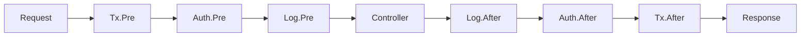

# 紹介

## Spineとは何ですか？

Spineは、**リクエストの処理過程を隠さないGoウェブフレームワーク**です。

リクエストがどのように解決され、どのような順序で実行され、いつビジネスロジックが呼び出され、どのようにレスポンスとして完成するかを、明示的な実行パイプラインとして明らかにします。


```go
func main() {
    app := spine.New()
    
    // 依存関係の登録 — 順序は関係なく、コンストラクタを登録するだけで自動解決
    app.Constructor(NewUserRepository, NewUserService, NewUserController)
    
    // インターセプター — 実行順序がコード上でそのまま見えます
    app.Interceptor(&TxInterceptor{}, &LoggingInterceptor{})
    
    // ルート — どのメソッドがどのパスであるかが明確
    app.Route("GET", "/users", (*UserController).GetUser)
    
    if err := app.Run(boot.Options{
		Address:                ":8080",
		EnableGracefulShutdown: true,
		ShutdownTimeout:        10 * time.Second,
		HTTP: &boot.HTTPOptions{},
	}); err != nil {
		log.Fatal(err)
	}
}
```


## なぜSpineなのですか？

### 隠された魔法はありません

Spring Bootの`@Autowired`、NestJSの`@Injectable`。 (日本語に変更: NestJSの`@Injectable`)
便利ですが、内部で何が起こっているのかを把握するのは難しいです。 （日本語のピリオドに変更：把握しづらいです。）Spineは異なります。

- **アノテーションなし** — 純粋なGoコード
- **モジュール定義なし** — コンストラクタ登録だけでDI解決
- **プロキシなし** — スタックトレースが直感的に

コードを読めば実行の流れが見えてきます。


### 慣れ親しんだ構造

SpringやNestJSを使ったことがあれば、すぐに始めることができます。

```
Controller → Service → Repository
```

コンストラクタ注入、インターセプターチェーン、レイヤードアーキテクチャ。
慣れ親しんだパターンをGoに移植しました。


### Goのパフォーマンス

- JVMのウォーミングアップなし
- Node.jsランタイムの初期化なし
- コンパイルされたバイナリが即座に実行

コンテナやサーバーレス環境に最適化されています。


## コア概念

### 1. コンストラクタベースの依存関係の注入 (DI)


```go
// コンストラクタのパラメータがそのまま依存関係の宣言になります
func NewUserService(repo *UserRepository) *UserService {
    return &UserService{repo: repo}
}

// 登録するだけで自動的に依存関係グラフを解決します
app.Constructor(NewUserRepository, NewUserService, NewUserController)
```

### 2. インターセプターパイプライン


```go
app.Interceptor(
    &TxInterceptor{},      // 1. トランザクション開始
    &AuthInterceptor{},    // 2. 認証確認
    &LoggingInterceptor{}, // 3. ロギング
)
```

**実行順序:**




### 3. 明示的なルーティング


```go
// 1箇所ですべてのルートを管理します
func RegisterUserRoutes(app spine.App) {
    app.Route("GET", "/users", (*UserController).GetUser)
    app.Route("POST", "/users", (*UserController).CreateUser)
    app.Route("PUT", "/users", (*UserController).UpdateUser)
    app.Route("DELETE", "/users", (*UserController).DeleteUser)
}
```

### 4. 型安全なハンドラー


```go
// 関数のシグネチャがそのままAPIスペックになります
func (c *UserController) GetUser(
    ctx context.Context,      // コンテキスト
    q query.Values,           // クエリパラメータ
) (httpx.Response[UserResponse], error) {     // レスポンスの型
    user, err := c.svc.Get(ctx, q.Int("id", 0))
    if err != nil {
        return httpx.Response[UserResponse]{}, err
    }
    return httpx.Response[UserResponse]{Body: user}, nil
}

// DTOは自動的にバインドされます
func (c *UserController) CreateUser(
    ctx context.Context,
    req *CreateUserRequest,    // JSON body → 構造体 (ポインタ)
) (httpx.Response[UserResponse], error) {
    user, err := c.svc.Create(ctx, req)
    if err != nil {
        return httpx.Response[UserResponse]{}, err
    }
    return httpx.Response[UserResponse]{Body: user}, nil
}
```

## 他のフレームワークとの比較

| | Spine | NestJS | Spring Boot |
|---|:---:|:---:|:---:|
| **言語** | Go | TypeScript | Java/Kotlin |
| **ランタイム** | ネイティブバイナリ | Node.js | JVM |
| **IoCコンテナ** | ✅ | ✅ | ✅ |
| **アノテーション/デコレータ** | 不要 | 必須 | 必須 |
| **モジュール定義** | 不要 | 必須 | 不要 |
| **型安全性** | コンパイルタイム | ランタイム | コンパイルタイム |


## 始める準備はできましたか？


```bash
go get github.com/NARUBROWN/spine
```

[5分クイックスタート →](/ja/learn/getting-started/first-app)