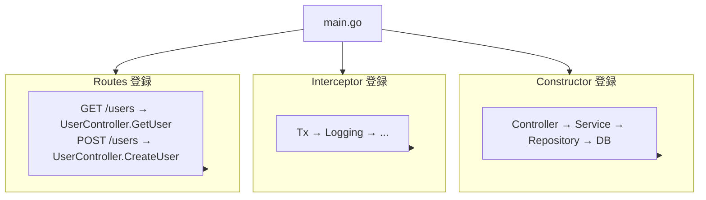

# プロジェクト構造

Spineプロジェクトを構造化する方法。


## 推奨構造

```
my-app/
├── main.go                  # アプリのエントリポイント
├── go.mod
├── go.sum
│
├── controller/              # コントローラーレイヤー
│   └── user_controller.go
│
├── service/                 # サービスレイヤー (ビジネスロジック)
│   └── user_service.go
│
├── repository/              # リポジトリレイヤー (データアクセス)
│   └── user_repository.go
│
├── entity/                  # データベースエンティティ
│   └── user.go
│
├── dto/                     # リクエスト/レスポンスオブジェクト
│   ├── user_request.go
│   └── user_response.go
│
├── routes/                  # ルート定義
│   └── user_routes.go
│
├── interceptor/             # インターセプター
│   ├── tx_interceptor.go
│   └── logging_interceptor.go
│
└── migrations/              # DBマイグレーション
    ├── 001_create_users.up.sql
    └── 001_create_users.down.sql
```


## 各レイヤーの役割

### main.go

アプリのエントリポイントです。コンストラクタの登録、インターセプターの設定、ルートの登録を行います。


```go
package main

import (
    "log"
    "time"

    "github.com/NARUBROWN/spine"
    "github.com/NARUBROWN/spine/pkg/boot"
)

func main() {
    app := spine.New()

    // 1. コンストラクタの登録
    app.Constructor(
        NewDB,
        repository.NewUserRepository,
        service.NewUserService,
        controller.NewUserController,
        interceptor.NewTxInterceptor,
    )

    // 2. インターセプターの登録
    app.Interceptor(
        (*interceptor.TxInterceptor)(nil),
        &interceptor.LoggingInterceptor{},
    )

    // 3. ルートの登録
    routes.RegisterUserRoutes(app)

    // 4. サーバーの起動
    if err := app.Run(boot.Options{
		Address:                ":8080",
		EnableGracefulShutdown: true,
		ShutdownTimeout:        10 * time.Second,
		HTTP: &boot.HTTPOptions{},
	}); err != nil {
		log.Fatal(err)
	}
}
```

### controller/

HTTPリクエストを受け取り、サービスに委譲します。ビジネスロジックは含みません。


```go
// controller/user_controller.go
package controller

import (
    "context"

    "dto"
    "service"

    "github.com/NARUBROWN/spine/pkg/httpx"
    "github.com/NARUBROWN/spine/pkg/query"
)

type UserController struct {
    svc *service.UserService  // サービスへの依存
}

func NewUserController(svc *service.UserService) *UserController {
    return &UserController{svc: svc}
}

// 関数シグネチャがそのままAPIスペックになります
func (c *UserController) GetUser(
    ctx context.Context,
    q query.Values,
) (httpx.Response[dto.UserResponse], error) {
    id := int(q.Int("id", 0))
    user, err := c.svc.Get(ctx, id)
    if err != nil {
        return httpx.Response[dto.UserResponse]{}, err
    }
    return httpx.Response[dto.UserResponse]{Body: user}, nil
}

func (c *UserController) CreateUser(
    ctx context.Context,
    req *dto.CreateUserRequest,
) (httpx.Response[dto.UserResponse], error) {
    user, err := c.svc.Create(ctx, req.Name, req.Email)
    if err != nil {
        return httpx.Response[dto.UserResponse]{}, err
    }
    return httpx.Response[dto.UserResponse]{Body: user}, nil
}
```


### service/

ビジネスロジックを担当します。リポジトリを通じてデータにアクセスします。


```go
// service/user_service.go
package service

type UserService struct {
    repo *repository.UserRepository  // リポジトリへの依存
}

func NewUserService(repo *repository.UserRepository) *UserService {
    return &UserService{repo: repo}
}

func (s *UserService) Get(ctx context.Context, id int) (dto.UserResponse, error) {
    user, err := s.repo.FindByID(ctx, id)
    if err != nil {
        return dto.UserResponse{}, err
    }
    
    return dto.UserResponse{
        ID:    int(user.ID),
        Name:  user.Name,
        Email: user.Email,
    }, nil
}

func (s *UserService) Create(ctx context.Context, name, email string) (dto.UserResponse, error) {
    user := &entity.User{Name: name, Email: email}
    
    if err := s.repo.Save(ctx, user); err != nil {
        return dto.UserResponse{}, err
    }
    
    return dto.UserResponse{
        ID:    int(user.ID),
        Name:  user.Name,
        Email: user.Email,
    }, nil
}
```


### repository/

データベースへのアクセスを担当します。SQLクエリやORMの呼び出しがここに位置します。


```go
// repository/user_repository.go
package repository

type UserRepository struct {
    db bun.IDB  // bun.DB または bun.Tx の両方を受け入れる
}

func NewUserRepository(db bun.IDB) *UserRepository {
    return &UserRepository{db: db}
}

func (r *UserRepository) FindByID(ctx context.Context, id int) (*entity.User, error) {
    user := new(entity.User)
    err := r.db.NewSelect().
        Model(user).
        Where("id = ?", id).
        Scan(ctx)
    return user, err
}

func (r *UserRepository) Save(ctx context.Context, user *entity.User) error {
    _, err := r.db.NewInsert().
        Model(user).
        Exec(ctx)
    return err
}
```


### entity/

データベースのテーブルとマッピングされる構造体です。


```go
// entity/user.go
package entity

type User struct {
    ID        int64     `bun:",pk,autoincrement"`
    Name      string    `bun:",notnull"`
    Email     string    `bun:",unique,notnull"`
    CreatedAt time.Time `bun:",nullzero,notnull,default:current_timestamp"`
    UpdatedAt time.Time `bun:",nullzero,notnull,default:current_timestamp"`
}
```


### dto/

リクエスト/レスポンスオブジェクトです。APIコントラクトを定義します。


```go
// dto/user_request.go
package dto

type CreateUserRequest struct {
    Name  string `json:"name"`
    Email string `json:"email"`
}

type UpdateUserRequest struct {
    Name  string `json:"name"`
    Email string `json:"email"`
}
```


```go
// dto/user_response.go
package dto

type UserResponse struct {
    ID    int    `json:"id"`
    Name  string `json:"name"`
    Email string `json:"email"`
}
```


### routes/

ルートを1箇所で管理します。どのパスがどのハンドラーに接続されるか一目で把握できます。


```go
// routes/user_routes.go
package routes

func RegisterUserRoutes(app spine.App) {
    app.Route("GET", "/users", (*controller.UserController).GetUser)
    app.Route("POST", "/users", (*controller.UserController).CreateUser)
    app.Route("PUT", "/users", (*controller.UserController).UpdateUser)
    app.Route("DELETE", "/users", (*controller.UserController).DeleteUser)
}
```


### interceptor/

リクエストの前/後処理ロジックです。トランザクション、ロギング、認証などを担当します。


```go
// interceptor/logging_interceptor.go
package interceptor

type LoggingInterceptor struct{}

func (i *LoggingInterceptor) PreHandle(ctx core.ExecutionContext, meta core.HandlerMeta) error {
    log.Printf("[REQ] %s %s", ctx.Method(), ctx.Path())
    return nil
}

func (i *LoggingInterceptor) PostHandle(ctx core.ExecutionContext, meta core.HandlerMeta) {
    log.Printf("[RES] %s %s OK", ctx.Method(), ctx.Path())
}

func (i *LoggingInterceptor) AfterCompletion(ctx core.ExecutionContext, meta core.HandlerMeta, err error) {
    if err != nil {
        log.Printf("[ERR] %s %s : %v", ctx.Method(), ctx.Path(), err)
    }
}
```


## 依存関係のフロー





## 主要な原則

| 原則 | 説明 |
|------|------|
| **単方向の依存関係** | Controller → Service → Repository (逆方向は禁止) |
| **関心事の分離** | 各レイヤーは自身の役割のみを実行 |
| **コンストラクタ注入** | すべての依存関係はコンストラクタを通じて注入 |
| **インターフェースの活用** | Repositoryは `bun.IDB` としてDB/Txの両方を受け入れる |


## 次のステップ

- [チュートリアル: コントローラー](/ja/learn/tutorial/2-controller) — コントローラーの作成方法
- [チュートリアル: 依存関係の注入](/ja/learn/tutorial/3-dependency-injection) — DIの詳細
- [チュートリアル: インターセプター](/ja/learn/tutorial/4-interceptor) — トランザクション、ロギングの実装