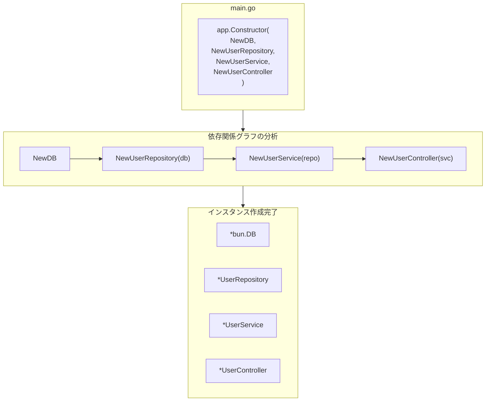

# 依存性の注入

SpineのDI（依存性の注入）を理解する。


## コアコンセプト

Spineの依存性注入は**コンストラクタベース**です。

- アノテーションなし (`@Autowired`、`@Injectable` 不要)
- 設定ファイルなし
- コンストラクタパラメータがそのまま依存関係の宣言になります


```go
// パラメータタイプを見て自動的に依存関係を注入
func NewUserService(repo *UserRepository) *UserService {
    return &UserService{repo: repo}
}
```


## 基本的な使い方

### 1. コンストラクタの作成

各コンポーネントはコンストラクタ関数を持ちます。


```go
// repository.go
type UserRepository struct {
    db *bun.DB
}

func NewUserRepository(db *bun.DB) *UserRepository {
    return &UserRepository{db: db}
}

// service.go
type UserService struct {
    repo *UserRepository
}

func NewUserService(repo *UserRepository) *UserService {
    return &UserService{repo: repo}
}

// controller.go
type UserController struct {
    svc *UserService
}

func NewUserController(svc *UserService) *UserController {
    return &UserController{svc: svc}
}
```

### 2. コンストラクタの登録

`app.Constructor()` にコンストラクタを登録します。


```go
func main() {
    app := spine.New()
    
    app.Constructor(
        NewDB,              // *bun.DB を返す
        NewUserRepository,  // *bun.DB が必要 → *UserRepository を返す
        NewUserService,     // *UserRepository が必要 → *UserService を返す
        NewUserController,  // *UserService が必要 → *UserController を返す
    )
    
    if err := app.Run(boot.Options{
		Address:                ":8080",
		EnableGracefulShutdown: true,
		ShutdownTimeout:        10 * time.Second,
		HTTP: &boot.HTTPOptions{},
	}); err != nil {
		log.Fatal(err)
	}
}
```

### 3. 自動解決

Spineが依存関係グラフを分析し、正しい順序でインスタンスを作成します。

```
登録順序: 任意
実行順序: DB → Repository → Service → Controller
```

## 順序に依存しない

登録順序は関係ありません。Spineが依存関係を分析して自動的にソートします。


```go
// このように登録しても
app.Constructor(
    NewUserController,  // UserService が必要
    NewUserService,     // UserRepository が必要
    NewUserRepository,  // bun.DB が必要
    NewDB,
)

// 実際の作成順序は
// 1. NewDB()
// 2. NewUserRepository(db)
// 3. NewUserService(repo)
// 4. NewUserController(svc)
```


## 依存関係グラフ

### 視覚化





## コンストラクタのルール

### パラメータ

コンストラクタパラメータは**すでに登録されているタイプ**である必要があります。


```go
// ✅ 正しい例
func NewUserService(repo *UserRepository) *UserService

// ✅ 複数の依存関係も可能
func NewUserController(svc *UserService, logger *Logger) *UserController

// ✅ 依存関係なしも可能
func NewLogger() *Logger
```

### 戻り値のタイプ

コンストラクタは**単一の値**または**(値, error)**を返します。


```go
// ✅ 単一の値を返す
func NewUserService(repo *UserRepository) *UserService {
    return &UserService{repo: repo}
}

// ✅ エラーを返すことも可能
func NewDB() (*bun.DB, error) {
    db, err := sql.Open("mysql", "...")
    if err != nil {
        return nil, err
    }
    return bun.NewDB(db, mysqldialect.New()), nil
}
```

## インターフェースの活用

### 問題状況

トランザクションを使用する場合、Repositoryは `*bun.DB` と `*bun.Tx` の両方を処理する必要があります。


```go
// ❌ これだとトランザクションを使用できません
type UserRepository struct {
    db *bun.DB  // *bun.Tx を受け取れない
}
```

### 解決: インターフェースの使用

`bun.IDB` インターフェースを使用すると、両方を受け入れることができます。


```go
// ✅ bun.IDBは *bun.DB と *bun.Tx の両方を実装しています
type UserRepository struct {
    db bun.IDB
}

func NewUserRepository(db bun.IDB) *UserRepository {
    return &UserRepository{db: db}
}
```

### インターセプターでトランザクションを注入


```go
// interceptor/tx_interceptor.go
func (i *TxInterceptor) PreHandle(ctx core.ExecutionContext, meta core.HandlerMeta) error {
    tx, err := i.db.BeginTx(ctx.Context(), nil)
    if err != nil {
        return err
    }
    
    ctx.Set("tx", tx)  // トランザクションを保存
    return nil
}

func (i *TxInterceptor) AfterCompletion(ctx core.ExecutionContext, meta core.HandlerMeta, err error) {
    tx, ok := ctx.Get("tx")
    if !ok {
        return
    }
    
    if err != nil {
        tx.(*bun.Tx).Rollback()
    } else {
        tx.(*bun.Tx).Commit()
    }
}
```


## 複数のコンポーネントの登録

### ドメイン別の分離


```go
func main() {
    app := spine.New()
    
    // インフラ
    app.Constructor(
        NewDB,
        NewRedisClient,
        NewLogger,
    )
    
    // Userドメイン
    app.Constructor(
        repository.NewUserRepository,
        service.NewUserService,
        controller.NewUserController,
    )
    
    // Orderドメイン
    app.Constructor(
        repository.NewOrderRepository,
        service.NewOrderService,
        controller.NewOrderController,
    )
    
    if err := app.Run(boot.Options{
		Address:                ":8080",
		EnableGracefulShutdown: true,
		ShutdownTimeout:        10 * time.Second,
		HTTP: &boot.HTTPOptions{},
	}); err != nil {
		log.Fatal(err)
	}
}
```

### 複数回の呼び出しが可能

`app.Constructor()` は複数回呼び出すことができます。


```go
app.Constructor(NewDB)
app.Constructor(NewUserRepository, NewUserService)
app.Constructor(NewUserController)
```

## 同じタイプが複数ある場合

同じタイプのインスタンスが複数必要な場合は、ラッパータイプを使用します。


```go
// ❌ 区別できない
func NewApp(db1 *bun.DB, db2 *bun.DB) *App  // どっちがどっち？

// ✅ ラッパータイプで区別
type PrimaryDB struct{ *bun.DB }
type ReplicaDB struct{ *bun.DB }

func NewPrimaryDB() *PrimaryDB {
    return &PrimaryDB{connectToPrimary()}
}

func NewReplicaDB() *ReplicaDB {
    return &ReplicaDB{connectToReplica()}
}

func NewUserRepository(primary *PrimaryDB, replica *ReplicaDB) *UserRepository {
    return &UserRepository{
        writer: primary.DB,
        reader: replica.DB,
    }
}
```
## エラー処理

### 循環依存関係


```go
// ❌ A → B → A の循環
func NewA(b *B) *A { ... }
func NewB(a *A) *B { ... }

// 起動時にエラー発生
// panic: 循環依存関係の検出: *A
```

### 依存関係の欠落


```go
// UserRepository を登録しないと
app.Constructor(
    NewUserService,     // *UserRepository が必要
    NewUserController,
)

// 起動時にエラー発生
// panic: 登録されたコンストラクタがありません: *repository.UserRepository
```

## 要点のまとめ

| 概念 | 説明 |
|------|------|
| **コンストラクタベース** | パラメータタイプで依存関係を宣言 |
| **自動解決** | 登録順序は任意、グラフを分析して生成 |
| **タイプのマッチング** | 同じタイプであれば自動的に注入 |
| **インターフェース** | 柔軟な依存関係の処理が可能 |

## 次のステップ

- [チュートリアル: インターセプター](/ja/learn/tutorial/4-interceptor) — リクエストの前/後処理
- [チュートリアル: データベース](/ja/learn/tutorial/5-database) — Bun ORM接続