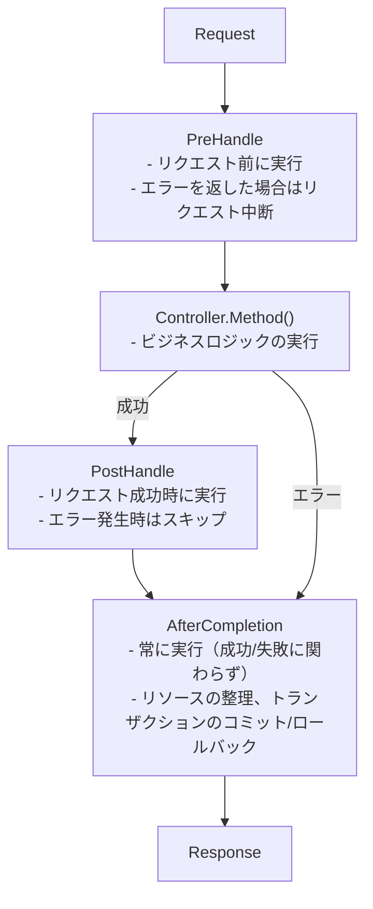

# インターセプター

インターセプターの作成と使用方法。

## インターセプターとは？

インターセプターはリクエストの前後に実行されるロジックです。

- トランザクション管理
- ロギング
- 認証/認可
- リクエストの検証

## ライフサイクル

インターセプターは3つの段階のライフサイクルを持ちます。





## インターフェース


```go
type Interceptor interface {
    PreHandle(ctx ExecutionContext, meta HandlerMeta) error
    PostHandle(ctx ExecutionContext, meta HandlerMeta)
    AfterCompletion(ctx ExecutionContext, meta HandlerMeta, err error)
}
```

| メソッド | 実行タイミング | 戻り値 | 用途 |
|--------|----------|------|------|
| `PreHandle` | コントローラー実行前 | `error` | 認証、検証、トランザクション開始 |
| `PostHandle` | コントローラー成功後 | なし | 応答の加工 |
| `AfterCompletion` | 常に（成功/失敗） | なし | リソースの整理、コミット/ロールバック |


## グローバルインターセプター vs ルートインターセプター

Spineは2つのレベルのインターセプターをサポートしています。

| 区分 | グローバルインターセプター | ルートインターセプター |
|------|--------------|----------------|
| 適用範囲 | すべてのリクエスト | 特定のルートのみ |
| 登録方法 | `app.Interceptor()` | `route.WithInterceptors()` |
| 用途 | CORS、ロギング、トランザクション | 認証、権限の検査 |
| 実行順序 | 先に実行される | グローバルの後に実行される |


## グローバルインターセプター

すべてのリクエストに適用されるインターセプターです。

### ロギングインターセプターの例


```go
// interceptor/logging_interceptor.go
package interceptor

import (
    "log"
    "github.com/NARUBROWN/spine/core"
)

type LoggingInterceptor struct{}

func (i *LoggingInterceptor) PreHandle(ctx core.ExecutionContext, meta core.HandlerMeta) error {
    log.Printf("[REQ] %s %s → %s.%s",
        ctx.Method(),
        ctx.Path(),
        meta.ControllerType.Name(),
        meta.Method.Name,
    )
    return nil
}

func (i *LoggingInterceptor) PostHandle(ctx core.ExecutionContext, meta core.HandlerMeta) {
    log.Printf("[RES] %s %s OK",
        ctx.Method(),
        ctx.Path(),
    )
}

func (i *LoggingInterceptor) AfterCompletion(ctx core.ExecutionContext, meta core.HandlerMeta, err error) {
    if err != nil {
        log.Printf("[ERR] %s %s : %v",
            ctx.Method(),
            ctx.Path(),
            err,
        )
    }
}
```

### グローバルインターセプターの登録


```go
func main() {
    app := spine.New()
    
    // グローバルインターセプター — すべてのリクエストに適用
    app.Interceptor(
        &interceptor.LoggingInterceptor{},
    )
    
    app.Run(boot.Options{
		Address:                ":8080",
		EnableGracefulShutdown: true,
		ShutdownTimeout:        10 * time.Second,
		HTTP: &boot.HTTPOptions{},
	})
}
```


## ルートインターセプター

特定のルートにのみ適用されるインターセプターです。

### 認証インターセプターの例


```go
// interceptor/auth_interceptor.go
package interceptor

import (
    "github.com/NARUBROWN/spine/core"
    "github.com/NARUBROWN/spine/pkg/httperr"
)

type AuthInterceptor struct{}

func (i *AuthInterceptor) PreHandle(ctx core.ExecutionContext, meta core.HandlerMeta) error {
    token := ctx.Header("Authorization")
    
    if token == "" {
        return httperr.Unauthorized("認証が必要です。")
    }
    
    user, err := validateToken(token)
    if err != nil {
        return httperr.Unauthorized("無効なトークンです。")
    }
    
    ctx.Set("currentUser", user)
    return nil
}

func (i *AuthInterceptor) PostHandle(ctx core.ExecutionContext, meta core.HandlerMeta) {}

func (i *AuthInterceptor) AfterCompletion(ctx core.ExecutionContext, meta core.HandlerMeta, err error) {}

func validateToken(token string) (map[string]string, error) {
    // トークン検証ロジック
    return map[string]string{"id": "1", "name": "Alice"}, nil
}
```

### ルートインターセプターの登録

`route.WithInterceptors()` を使用します。


```go
import (
    "github.com/NARUBROWN/spine"
    "github.com/NARUBROWN/spine/pkg/route"
)

func main() {
    app := spine.New()
    
    app.Constructor(
        NewUserController,
    )
    
    // 認証不要なルート
    app.Route(
        "POST",
        "/login",
        (*UserController).Login,
    )
    
    // 認証が必要なルート
    app.Route(
        "GET",
        "/users/:id",
        (*UserController).GetUser,
        route.WithInterceptors(&interceptor.AuthInterceptor{}),
    )
    
    // 認証が必要なルート
    app.Route(
        "PUT",
        "/users/:id",
        (*UserController).UpdateUser,
        route.WithInterceptors(&interceptor.AuthInterceptor{}),
    )
    
    app.Run(boot.Options{
		Address:                ":8080",
		EnableGracefulShutdown: true,
		ShutdownTimeout:        10 * time.Second,
		HTTP: &boot.HTTPOptions{},
	})
}
```


## グローバル + ルートインターセプターの組み合わせ

実際のアプリケーションでは、2つを一緒に使用します。


```go
func main() {
    app := spine.New()
    
    app.Constructor(
        NewUserController,
    )
    
    // グローバルインターセプター — すべてのリクエストに適用
    app.Interceptor(
        &interceptor.LoggingInterceptor{},
        cors.New(cors.Config{
            AllowOrigins: []string{"*"},
            AllowMethods: []string{"GET", "POST", "PUT", "DELETE"},
        }),
    )
    
    // 公開ルート — グローバルインターセプターのみ適用
    app.Route("POST", "/login", (*UserController).Login)
    app.Route("POST", "/signup", (*UserController).Signup)
    
    // 認証が必要なルート — グローバル + Auth インターセプター
    app.Route(
        "GET",
        "/users/:id",
        (*UserController).GetUser,
        route.WithInterceptors(&interceptor.AuthInterceptor{}),
    )
    
    app.Route(
        "GET",
        "/me",
        (*UserController).GetMe,
        route.WithInterceptors(&interceptor.AuthInterceptor{}),
    )
    
    app.Run(boot.Options{
		Address:                ":8080",
		EnableGracefulShutdown: true,
		ShutdownTimeout:        10 * time.Second,
		HTTP: &boot.HTTPOptions{},
	})
}
```


## 実行順序

グローバルインターセプターが先に、ルートインターセプターが後で実行されます。

### 登録例


```go
// グローバルインターセプター
app.Interceptor(
    &interceptor.LoggingInterceptor{},   // グローバル 1
    &interceptor.CORSInterceptor{},      // グローバル 2
)

// ルートインターセプター
app.Route(
    "GET",
    "/users/:id",
    (*UserController).GetUser,
    route.WithInterceptors(&interceptor.AuthInterceptor{}),  // ルート 1
)
```

### 実行フロー

```
Request (GET /users/1)
   │
   ├─→ Logging.PreHandle     (グローバル 1)
   ├─→ CORS.PreHandle        (グローバル 2)
   ├─→ Auth.PreHandle        (ルート 1)
   │
   ├─→ UserController.GetUser
   │
   ├─→ Auth.PostHandle       (ルート 1)
   ├─→ CORS.PostHandle       (グローバル 2)
   ├─→ Logging.PostHandle    (グローバル 1)
   │
   ├─→ Auth.AfterCompletion       (ルート 1)
   ├─→ CORS.AfterCompletion       (グローバル 2)
   └─→ Logging.AfterCompletion    (グローバル 1)
   
Response
```

- `PreHandle`: グローバル → ルートの順序
- `PostHandle`: ルート → グローバルの逆順
- `AfterCompletion`: ルート → グローバルの逆順


## エラー処理

### PreHandleでエラーを返す

`PreHandle`でエラーを返すと、リクエストが中断されます。


```go
func (i *AuthInterceptor) PreHandle(ctx core.ExecutionContext, meta core.HandlerMeta) error {
    token := ctx.Header("Authorization")
    if token == "" {
        return httperr.Unauthorized("認証が必要です。")
    }
    return nil
}
```

```
Request (GET /users/1, トークンなし)
   │
   ├─→ Logging.PreHandle     ✓
   ├─→ CORS.PreHandle        ✓
   ├─→ Auth.PreHandle        ✗ (エラーを返す)
   │
   ├─→ Auth.AfterCompletion
   ├─→ CORS.AfterCompletion
   └─→ Logging.AfterCompletion
   
Response (401 Unauthorized)
```


## ExecutionContext

リクエストコンテキストに値を保存し、照会します。

### メソッド

| メソッド | 説明 |
|--------|------|
| `Context()` | `context.Context` を返す |
| `Method()` | HTTPメソッド (GET、POSTなど) |
| `Path()` | リクエストパス |
| `Header(name)` | ヘッダー値の照会 |
| `Set(key, value)` | 値の保存 |
| `Get(key)` | 値の照会 |

### インターセプター間のデータ伝達


```go
// AuthInterceptor — ユーザー情報を保存
func (i *AuthInterceptor) PreHandle(ctx core.ExecutionContext, meta core.HandlerMeta) error {
    token := ctx.Header("Authorization")
    user, _ := validateToken(token)
    ctx.Set("currentUser", user)
    return nil
}

// コントローラーで照会するにはExecutionContextを注入してもらう必要がある
// または別のインターセプターで照会
func (i *AuditInterceptor) PreHandle(ctx core.ExecutionContext, meta core.HandlerMeta) error {
    user, ok := ctx.Get("currentUser")
    if ok {
        log.Printf("User %v accessing %s", user, ctx.Path())
    }
    return nil
}
```


## HandlerMeta

実行されるハンドラーのメタ情報です。

| フィールド | タイプ | 説明 |
|------|------|------|
| `ControllerType` | `reflect.Type` | コントローラーのタイプ |
| `Method` | `reflect.Method` | ハンドラーメソッド |
| `Interceptors` | `[]Interceptor` | ルートにバインドされたインターセプター |

### 使用例


```go
func (i *LoggingInterceptor) PreHandle(ctx core.ExecutionContext, meta core.HandlerMeta) error {
    log.Printf("コントローラー: %s", meta.ControllerType.Name())  // UserController
    log.Printf("メソッド: %s", meta.Method.Name)              // GetUser
    return nil
}
```


## 依存性の注入が必要なインターセプター

コンストラクタを持つインターセプターは、まず `Constructor` に登録します。

### トランザクションインターセプターの例


```go
// interceptor/tx_interceptor.go
package interceptor

import (
    "github.com/NARUBROWN/spine/core"
    "github.com/uptrace/bun"
)

type TxInterceptor struct {
    db *bun.DB
}

func NewTxInterceptor(db *bun.DB) *TxInterceptor {
    return &TxInterceptor{db: db}
}

func (i *TxInterceptor) PreHandle(ctx core.ExecutionContext, meta core.HandlerMeta) error {
    tx, err := i.db.BeginTx(ctx.Context(), nil)
    if err != nil {
        return err
    }
    ctx.Set("tx", tx)
    return nil
}

func (i *TxInterceptor) PostHandle(ctx core.ExecutionContext, meta core.HandlerMeta) {}

func (i *TxInterceptor) AfterCompletion(ctx core.ExecutionContext, meta core.HandlerMeta, err error) {
    v, ok := ctx.Get("tx")
    if !ok {
        return
    }
    
    tx := v.(*bun.Tx)
    if err != nil {
        tx.Rollback()
    } else {
        tx.Commit()
    }
}
```

### 登録 (グローバル)


```go
app.Constructor(
    NewDB,
    interceptor.NewTxInterceptor,
)

app.Interceptor(
    (*interceptor.TxInterceptor)(nil),  // タイプで参照
)
```

### 登録 (ルート)


```go
app.Constructor(
    NewDB,
    interceptor.NewTxInterceptor,
)

app.Route(
    "POST",
    "/orders",
    (*OrderController).CreateOrder,
    route.WithInterceptors((*interceptor.TxInterceptor)(nil)),  // タイプで参照
)
```


## 登録方法のまとめ

### グローバルインターセプター

| 方式 | コード | 使用タイミング |
|------|------|----------|
| インスタンスを直接渡す | `&interceptor.LoggingInterceptor{}` | 依存関係なし |
| タイプで参照 | `(*interceptor.TxInterceptor)(nil)` | 依存関係あり |


```go
app.Interceptor(
    &interceptor.LoggingInterceptor{},      // インスタンス
    (*interceptor.TxInterceptor)(nil),      // タイプ参照
)
```

### ルートインターセプター

| 方式 | コード | 使用タイミング |
|------|------|----------|
| インスタンスを直接渡す | `&interceptor.AuthInterceptor{}` | 依存関係なし |
| タイプで参照 | `(*interceptor.TxInterceptor)(nil)` | 依存関係あり |


```go
app.Route(
    "GET",
    "/users/:id",
    (*UserController).GetUser,
    route.WithInterceptors(
        &interceptor.AuthInterceptor{},         // インスタンス
        (*interceptor.TxInterceptor)(nil),      // タイプ参照
    ),
)
```


## 要点のまとめ

| 概念 | 説明 |
|------|------|
| **グローバルインターセプター** | `app.Interceptor()` — すべてのリクエストに適用 |
| **ルートインターセプター** | `route.WithInterceptors()` — 特定のルートのみ適用 |
| **実行順序** | グローバル → ルート (Post/After は逆順) |
| **3段階ライフサイクル** | PreHandle → PostHandle → AfterCompletion |
| **エラー時中断** | PreHandleでのエラー → コントローラースキップ |
| **コンテキスト共有** | `ctx.Set()` / `ctx.Get()` でデータ伝達 |


## 次のステップ

- [チュートリアル: データベース](/ja/learn/tutorial/5-database) — Bun ORM接続
- [チュートリアル: エラー処理](/ja/learn/tutorial/7-error-handling) — httperr の使い方