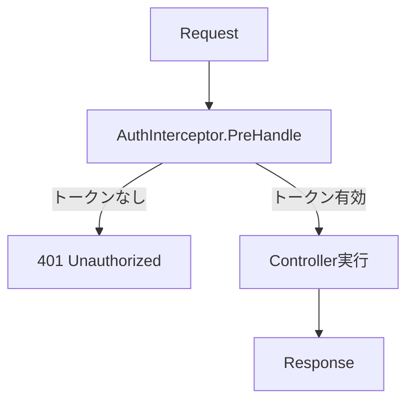

コードを確認しました。実際の`httperr`パッケージには3つのヘルパー関数しかありません。

```go
// pkg/httperr/types.go
func NotFound(msg string) error {
    return &HTTPError{Status: 404, Message: msg}
}

func BadRequest(msg string) error {
    return &HTTPError{Status: 400, Message: msg}
}

func Unauthorized(msg string) error {
    return &HTTPError{Status: 401, Message: msg}
}
```

文書を編集します。
---

# エラー処理
エラーをエレガントに処理する方法。
## 概要
Spineは`httperr`パッケージでHTTPエラーを表現します。 ControllerはHTTPを直接扱わず、`httperr`でエラーの**意味**だけを表現します。実際のHTTP応答変換は`ErrorReturnHandler`が担当します。

```go
import "github.com/NARUBROWN/spine/pkg/httperr"

func (c *UserController) GetUser(userId path.Int) (User, error) {
    if userId.Value <= 0 {
        return User{}, httperr.BadRequest("無効なユーザーIDです")
    }
    
    user, err := c.repo.FindByID(userId.Value)
    if err != nil {
        return User{}, httperr.NotFound("ユーザーが見つかりません")
    }
    
    return user, nil
}
```

## httperr関数
| 機能 | ステータスコード | 用途 |
|------|------------------|------|
| `httperr.BadRequest(msg)` | 400 | 無効なリクエスト、入力検証失敗 |
| `httperr.Unauthorized(msg)` | 401 | 認証が必要、またはトークンが無効 |
| `httperr.NotFound(msg)` | 404 | リソースが存在しない |
## HTTPError構造体

```go
type HTTPError struct {
    Status  int    // HTTPステータスコード
    Message string // エラーメッセージ
    Cause   error  // 原因エラー（任意）
}

func (e *HTTPError) Error() string {
    return e.Message
}
```

## 使用例
### リソースなし (404)

```go
func (c *UserController) GetUser(userId path.Int) (User, error) {
    user, err := c.repo.FindByID(userId.Value)
    if err != nil {
        return User{}, httperr.NotFound("ユーザーが見つかりません")
    }
    return user, nil
}
```

応答：
```json
{"message": "ユーザーが見つかりません"}
```

```http
HTTP/1.1 404 Not Found
```

### 不正なリクエスト (400)

```go
func (c *UserController) CreateUser(req CreateUserRequest) (User, error) {
    if req.Name == "" {
        return User{}, httperr.BadRequest("名前は必須")
    }
    if req.Email == "" {
        return User{}, httperr.BadRequest("メールは必須")
    }
    
    return c.service.Create(req)
}
```

### 認証が必要 (401)

```go
func (i *AuthInterceptor) PreHandle(ctx core.ExecutionContext, meta core.HandlerMeta) error {
    token := ctx.Header("Authorization")
    
    if token == "" {
        return httperr.Unauthorized("認証が必要です")
    }
    
    if !isValidToken(token) {
        return httperr.Unauthorized("無効なトークンです")
    }
    
    return nil
}
```

## 他のステータスコードを使う
提供されていないステータスコードが必要な場合は、`HTTPError`を直接生成します。

```go
// 403 Forbidden
func Forbidden(msg string) error {
    return &httperr.HTTPError{Status: 403, Message: msg}
}

// 409 Conflict
func Conflict(msg string) error {
    return &httperr.HTTPError{Status: 409, Message: msg}
}

// 500 Internal Server Error
func InternalServerError(msg string) error {
    return &httperr.HTTPError{Status: 500, Message: msg}
}
```

## 階層別エラー処理

```mermaid
flowchart LR
A[Repository<br/>原本エラー] --> B[Service<br/>ビジネスエラー]
    B --> C[Controller<br/>HTTPエラー]    C --> D[Response<br/>JSON]
```

### Repository

元のエラーをそのまま返します。

```go
func (r *UserRepository) FindByID(id int64) (*User, error) {
    user, ok := r.users[id]
    if !ok {
        return nil, ErrUserNotFound // 元のエラー
    }
    return user, nil
}

var ErrUserNotFound = errors.New("user not found")
```

### Service

ビジネスロジックを処理し、リポジトリエラーを渡します。

```go
func (s *UserService) GetUser(id int64) (*User, error) {
    user, err := s.repo.FindByID(id)
    if err != nil {
        return nil, err // エラーをそのまま転送
    }
    return user, nil
}
```

### Controller

ビジネスエラーをHTTPエラーに変換します。

```go
func (c *UserController) GetUser(userId path.Int) (User, error) {
    user, err := c.service.GetUser(userId.Value)
    if err != nil {
        return User{}, toHTTPError(err)
    }
    return *user, nil
}

func toHTTPError(err error) error {
    switch {
    case errors.Is(err, repository.ErrUserNotFound):
        return httperr.NotFound("ユーザーが見つかりません")
    case errors.Is(err, repository.ErrEmailAlreadyExists):
        return httperr.BadRequest("既に使用中のメールです")
    default:
        return httperr.BadRequest(err.Error())
    }
}
```

## 入力検証
### DTOで検証メソッドを定義する

```go
type CreateUserRequest struct {
    Name  string `json:"name"`
    Email string `json:"email"`
}

func (r *CreateUserRequest) Validate() error {
    if r.Name == "" {
        return errors.New("名前は必須")
    }
    if len(r.Name) > 100 {
        return errors.New("名前は100文字以下でなければなりません")
    }
    if r.Email == "" {
        return errors.New("メールは必須")
    }
    return nil
}
```

### Controllerで検証を呼び出す

```go
func (c *UserController) CreateUser(req CreateUserRequest) (User, error) {
    if err := req.Validate(); err != nil {
        return User{}, httperr.BadRequest(err.Error())
    }
    
    return c.service.Create(req)
}
```

## Interceptorでのエラー処理
`PreHandle` からエラーを返した場合、Controller は実行されません。

```go
func (i *AuthInterceptor) PreHandle(ctx core.ExecutionContext, meta core.HandlerMeta) error {
    token := ctx.Header("Authorization")
    
    if token == "" {
        return httperr.Unauthorized("認証トークンが必要です")
    }
    
    user, err := i.auth.Validate(token)
    if err != nil {
        return httperr.Unauthorized("無効なトークンです")
    }
    
    ctx.Set("auth.user", user)
    return nil
}
```




## エラーロギング
`AfterCompletion`でエラーを記録できます。

```go
func (i *LoggingInterceptor) AfterCompletion(ctx core.ExecutionContext, meta core.HandlerMeta, err error) {
    if err != nil {
        log.Printf("[ERR] %s %s : %v", ctx.Method(), ctx.Path(), err)
    }
}
```

## 一般的なエラー処理
非`httperr.HTTPError`ではない通常の`error`は、500ステータスコードとして扱われます。

```go
// httperr.HTTPError → 指定されたステータスコード
return httperr.NotFound("...")  // → 404

// 一般エラー → 500
return errors.New("something went wrong")  // → 500
```

## コアクリーンアップ
| 階層・役割 | 説明 |
|------------|------|
| リポジトリ | 元のエラーを返す |
| サービス | ビジネスロジックを処理し、エラーを転送 |
| コントローラ | HTTPエラーに変換 |
| インターセプタ | 共通エラー処理（認証、ロギング） |

| httperr関数 | ステータスコード |
|--------------|------------------|
| `BadRequest` | 400 |
| `Unauthorized` | 401 |
| `NotFound` | 404 |
