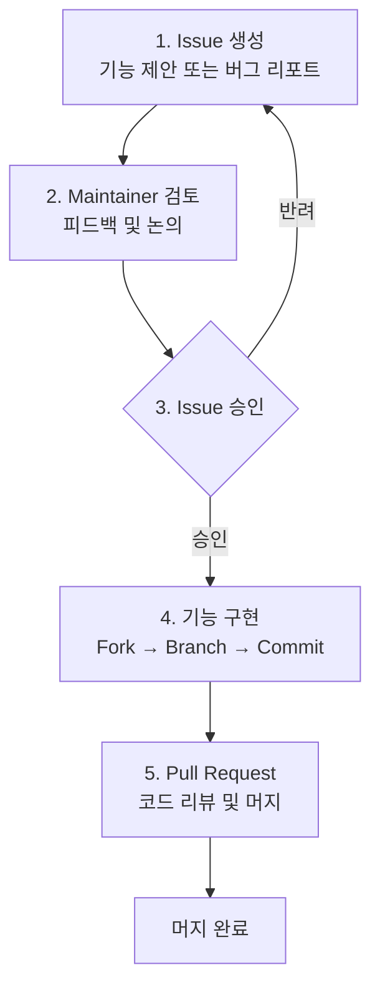

# 기여하기 (Contributing)

Spine에 기여하는 방법.

## 기여 프로세스

Spine에 기여하고 싶은 기능이나 개선 사항이 있다면 다음 절차를 따라주세요.



## 1. Issue 생성

기능 구현 전에 **반드시 Issue를 먼저 생성**해주세요.

[Spine GitHub Issues](https://github.com/NARUBROWN/spine/issues)에서 새 Issue를 생성하고 다음 내용을 포함해주세요:

**기능 제안의 경우**
- 제안하는 기능에 대한 설명
- 해당 기능이 필요한 이유
- 예상되는 사용 예시

**버그 리포트의 경우**
- 버그 재현 방법
- 예상 동작과 실제 동작
- 환경 정보 (Go 버전, OS 등)

## 2. Maintainer 검토

Issue가 생성되면 Maintainer가 확인 후 의견을 남깁니다. 이 단계에서 설계 방향, 구현 범위 등에 대한 논의가 이루어질 수 있습니다.

## 3. Issue 승인

Maintainer가 Issue를 승인하면 구현을 진행할 수 있습니다. 승인되지 않은 상태에서 작성된 PR은 머지되지 않을 수 있으니, 반드시 승인을 확인한 후 구현을 시작해주세요.

## 4. Pull Request

GitHub에서 Pull Request를 생성합니다. PR 설명에 관련 Issue 번호를 명시해주세요.

```
Closes #123
```

## 질문이 있다면

구현 중 궁금한 점이 있다면 해당 Issue에 코멘트를 남겨주세요.