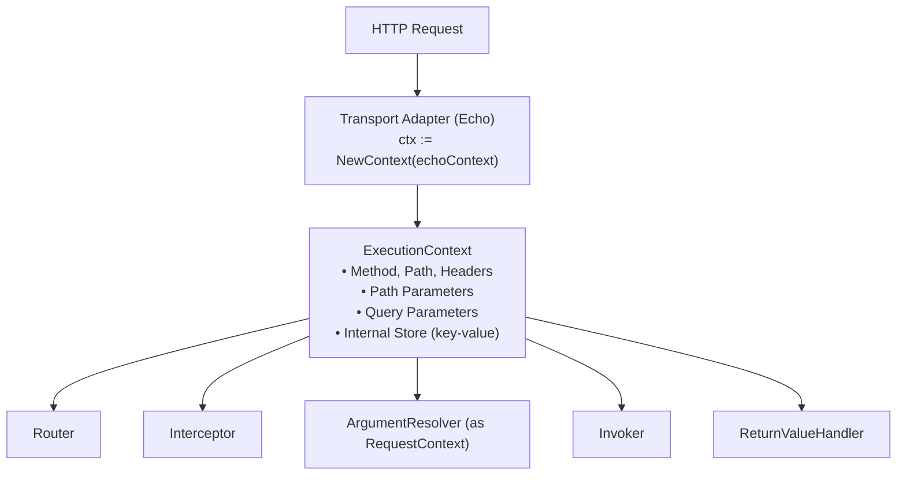

# 실행 컨텍스트 (ExecutionContext)

Spine 요청의 핵심.


## 개요

`ExecutionContext`는 Spine 파이프라인 전체에서 공유되는 요청 스코프 컨텍스트입니다. HTTP 요청이 도착하면 Transport 어댑터가 `ExecutionContext`를 생성하고, 이 컨텍스트는 파이프라인의 모든 단계를 통과하며 요청 정보와 실행 상태를 전달합니다.




## Context 분리 철학

Spine은 Context를 **두 계층**으로 명확히 분리합니다. 이는 의도적인 설계 결정입니다.

### 왜 분리하는가?

| 관심사 | 담당 Context | 사용 위치 |
|--------|-------------|----------|
| 실행 흐름 제어 | `ExecutionContext` | Router, Pipeline, Interceptor |
| 입력 값 해석 | `RequestContext` | ArgumentResolver |

**목표**: Controller와 비즈니스 로직이 실행 모델을 전혀 알지 못하게 합니다.

```go
// ❌ Controller가 ExecutionContext에 직접 접근
func (c *UserController) GetUser(ctx core.ExecutionContext) User {
    id := ctx.Param("id")  // HTTP 계층에 의존
    // ...
}

// ✓ Spine의 방식: 의미 타입으로 입력 받음
func (c *UserController) GetUser(userId path.Int) User {
    // HTTP를 모름, 실행 순서를 모름
    // 오직 비즈니스 로직만
}
```

## ExecutionContext 인터페이스

파이프라인 전체에서 사용되는 실행 흐름 제어용 인터페이스입니다.

```go
// core/context.go
type ExecutionContext interface {
    // 표준 컨텍스트
    Context() context.Context
    
    // HTTP 요청 정보
    Method() string                    // GET, POST, PUT, DELETE, ...
    Path() string                      // /users/123/posts/456
    Header(name string) string         // 특정 헤더 값
    
    // 파라미터 접근
    Params() map[string]string         // Path parameters
    PathKeys() []string                // Path key 순서 (바인딩용)
    Queries() map[string][]string      // Query parameters
    
    // 내부 저장소
    Set(key string, value any)         // 값 저장
    Get(key string) (any, bool)        // 값 조회
}
```

### 메서드 상세

#### Context()

Go 표준 `context.Context`를 반환합니다. 요청 취소, 타임아웃, 값 전달에 사용됩니다.

```go
func (e *echoContext) Context() context.Context {
    return e.reqCtx  // HTTP 요청의 context
}
```

#### Method() / Path()

HTTP 요청의 메서드와 경로를 반환합니다.

```go
ctx.Method()  // "GET"
ctx.Path()    // "/users/123/posts/456"
```

#### Params() / PathKeys()

Path parameter 정보를 제공합니다.

```go
// Route: /users/:userId/posts/:postId
// Request: /users/123/posts/456

ctx.Params()    // {"userId": "123", "postId": "456"}
ctx.PathKeys()  // ["userId", "postId"]
```

`PathKeys()`는 파라미터의 **선언 순서**를 보장합니다. Spine의 순서 기반 바인딩에 필수적입니다.

#### Queries()

Query parameter를 다중 값 형태로 반환합니다.

```go
// Request: /users?status=active&tag=go&tag=web

ctx.Queries()  // {"status": ["active"], "tag": ["go", "web"]}
```

#### Set() / Get()

파이프라인 내부에서 값을 공유하는 저장소입니다.

```go
// Router에서 path params 저장
ctx.Set("spine.params", params)
ctx.Set("spine.pathKeys", keys)

// Adapter에서 ResponseWriter 저장
ctx.Set("spine.response_writer", NewEchoResponseWriter(c))

// Interceptor에서 조회
rw, ok := ctx.Get("spine.response_writer")
```

## RequestContext 인터페이스

ArgumentResolver에서만 사용되는 입력 해석 전용 인터페이스입니다.

```go
// core/context.go
type RequestContext interface {
    // 개별 파라미터 접근
    Param(name string) string          // 특정 path param
    Query(name string) string          // 특정 query param (첫 번째 값)
    
    // 전체 뷰 접근
    Params() map[string]string         // 모든 path params
    Queries() map[string][]string      // 모든 query params
    
    // Body 바인딩
    Bind(out any) error                // JSON body → struct
}
```

### 메서드 상세

#### Param() / Query()

개별 파라미터에 편리하게 접근합니다.

```go
// Route: /users/:id?page=1&size=20

ctx.Param("id")     // "123"
ctx.Query("page")   // "1"
ctx.Query("size")   // "20"
ctx.Query("missing") // "" (없으면 빈 문자열)
```

#### Bind()

HTTP body를 구조체로 바인딩합니다.

```go
// internal/resolver/dto_resolver.go
func (r *DTOResolver) Resolve(ctx core.RequestContext, parameterMeta ParameterMeta) (any, error) {
    valuePtr := reflect.New(parameterMeta.Type)
    
    if err := ctx.Bind(valuePtr.Interface()); err != nil {
        return nil, fmt.Errorf("DTO 바인딩 실패 (%s): %w", parameterMeta.Type.Name(), err)
    }
    
    return valuePtr.Elem().Interface(), nil
}
```


## Echo 어댑터 구현

Spine은 Echo를 Transport 레이어로 사용합니다. `echoContext`가 두 인터페이스를 모두 구현합니다.

```go
// internal/adapter/echo/context_impl.go
type echoContext struct {
    echo   echo.Context           // Echo의 원본 컨텍스트
    reqCtx context.Context        // 요청 스코프 컨텍스트
    store  map[string]any         // 내부 저장소
}

func NewContext(c echo.Context) core.ExecutionContext {
    return &echoContext{
        echo:   c,
        reqCtx: c.Request().Context(),
        store:  make(map[string]any),
    }
}
```

### 주요 구현

#### Path Parameters

Router가 매칭한 결과를 우선 사용하고, 없으면 Echo의 값을 사용합니다.

```go
func (e *echoContext) Param(name string) string {
    // Spine Router가 저장한 값 우선
    if raw, ok := e.store["spine.params"]; ok {
        if m, ok := raw.(map[string]string); ok {
            if v, ok := m[name]; ok {
                return v
            }
        }
    }
    // Fallback to Echo
    return e.echo.Param(name)
}
```

#### Params() - 방어적 복사

외부에서 원본 맵을 변경하지 못하도록 복사본을 반환합니다.

```go
func (e *echoContext) Params() map[string]string {
    if raw, ok := e.store["spine.params"]; ok {
        if m, ok := raw.(map[string]string); ok {
            // 방어적 복사
            copyMap := make(map[string]string, len(m))
            for k, v := range m {
                copyMap[k] = v
            }
            return copyMap
        }
    }
    // Echo에서 직접 구성
    names := e.echo.ParamNames()
    values := e.echo.ParamValues()
    params := make(map[string]string, len(names))
    for i, name := range names {
        if i < len(values) {
            params[name] = values[i]
        }
    }
    return params
}
```

#### Body 바인딩

Echo의 `Bind`를 그대로 위임합니다.

```go
func (e *echoContext) Bind(out any) error {
    return e.echo.Bind(out)
}
```


## 파이프라인에서의 사용

### Router

```go
// internal/router/router.go
func (r *DefaultRouter) Route(ctx core.ExecutionContext) (core.HandlerMeta, error) {
    for _, route := range r.routes {
        if route.Method != ctx.Method() {
            continue
        }
        
        ok, params, keys := matchPath(route.Path, ctx.Path())
        if !ok {
            continue
        }
        
        // 매칭된 정보를 Context에 저장
        ctx.Set("spine.params", params)
        ctx.Set("spine.pathKeys", keys)
        
        return route.Meta, nil
    }
    return core.HandlerMeta{}, fmt.Errorf("핸들러가 없습니다.")
}
```

### ArgumentResolver

```go
// internal/pipeline/pipeline.go
func (p *Pipeline) resolveArguments(ctx core.ExecutionContext, paramMetas []resolver.ParameterMeta) ([]any, error) {
    // ExecutionContext → RequestContext 다운캐스트
    reqCtx, ok := ctx.(core.RequestContext)
    if !ok {
        return nil, fmt.Errorf("ExecutionContext이 RequestContext를 구현하고 있지 않습니다.")
    }
    
    args := make([]any, 0, len(paramMetas))
    
    for _, paramMeta := range paramMetas {
        for _, r := range p.argumentResolvers {
            if r.Supports(paramMeta) {
                // RequestContext만 전달
                val, err := r.Resolve(reqCtx, paramMeta)
                if err != nil {
                    return nil, err
                }
                args = append(args, val)
                break
            }
        }
    }
    return args, nil
}
```

### Interceptor

```go
// interceptor/cors/cors.go
func (i *CORSInterceptor) PreHandle(ctx core.ExecutionContext, meta core.HandlerMeta) error {
    // ResponseWriter 획득
    rwAny, ok := ctx.Get("spine.response_writer")
    if !ok {
        return nil
    }
    rw := rwAny.(core.ResponseWriter)
    
    // 요청 정보 확인
    origin := ctx.Header("Origin")
    if origin != "" && i.isAllowedOrigin(origin) {
        rw.SetHeader("Access-Control-Allow-Origin", origin)
    }
    
    // Preflight 처리
    if ctx.Method() == "OPTIONS" {
        rw.WriteStatus(204)
        return core.ErrAbortPipeline
    }
    
    return nil
}
```


## 내부 저장소 규약

`Set()`/`Get()`으로 사용하는 키에는 명확한 규약이 있습니다.

### Spine 예약 키

| 키 | 타입 | 설정 위치 | 용도 |
|----|------|----------|------|
| `spine.params` | `map[string]string` | Router | Path parameter 값 |
| `spine.pathKeys` | `[]string` | Router | Path key 순서 |
| `spine.response_writer` | `core.ResponseWriter` | Adapter | 응답 출력 |

### 사용 예시

```go
// ReturnValueHandler에서 ResponseWriter 사용
func (h *JSONReturnHandler) Handle(value any, ctx core.ExecutionContext) error {
    rwAny, ok := ctx.Get("spine.response_writer")
    if !ok {
        return fmt.Errorf("ExecutionContext 안에서 ResponseWriter를 찾을 수 없습니다.")
    }
    
    rw, ok := rwAny.(core.ResponseWriter)
    if !ok {
        return fmt.Errorf("ResponseWriter 타입이 올바르지 않습니다.")
    }
    
    return rw.WriteJSON(200, value)
}
```

## 설계 원칙

### 1. Controller는 Context를 모른다

Controller는 `ExecutionContext`나 `RequestContext`를 직접 받지 않습니다. 대신 의미 타입(`path.Int`, `query.Values` 등)으로 필요한 값만 받습니다.

```go
// ❌ 안티패턴
func (c *UserController) GetUser(ctx core.ExecutionContext) User

// ✓ Spine 방식
func (c *UserController) GetUser(userId path.Int) User
```

### 2. Resolver는 RequestContext만 안다

ArgumentResolver는 `RequestContext`만 사용합니다. 실행 흐름 제어(`Set`/`Get`)에 접근하지 않습니다.

```go
type ArgumentResolver interface {
    Supports(parameterMeta ParameterMeta) bool
    Resolve(ctx core.RequestContext, parameterMeta ParameterMeta) (any, error)
    //          ^^^^^^^^^^^^^^^^^ ExecutionContext가 아님
}
```

### 3. 단일 구현, 이중 인터페이스

Echo 어댑터의 `echoContext`는 두 인터페이스를 모두 구현합니다. 하지만 사용 위치에 따라 필요한 인터페이스만 노출됩니다.

```go
type echoContext struct { ... }

// ExecutionContext 구현
func (e *echoContext) Method() string { ... }
func (e *echoContext) Set(key string, value any) { ... }

// RequestContext 구현
func (e *echoContext) Param(name string) string { ... }
func (e *echoContext) Bind(out any) error { ... }
```

## 요약

| 구분 | ExecutionContext | RequestContext |
|------|------------------|----------------|
| **역할** | 실행 흐름 제어 | 입력 값 해석 |
| **사용 위치** | Router, Pipeline, Interceptor | ArgumentResolver |
| **주요 메서드** | `Method()`, `Path()`, `Set()`, `Get()` | `Param()`, `Query()`, `Bind()` |
| **Controller 노출** | ❌ | ❌ |

**핵심 원칙**: Context는 파이프라인 내부에서만 사용됩니다. Controller는 실행 모델을 전혀 알지 못하며, 오직 비즈니스 로직에만 집중합니다.