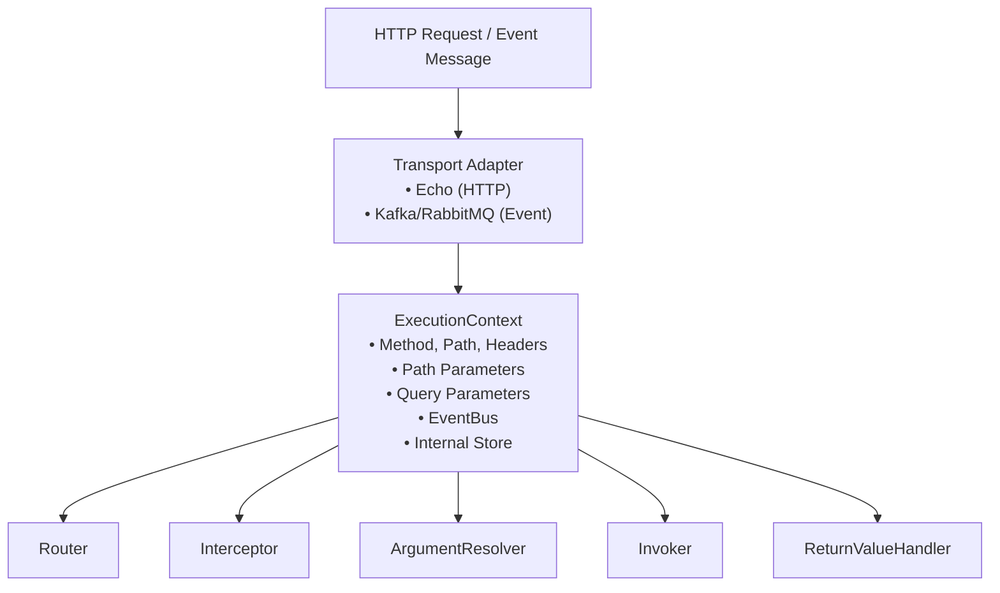
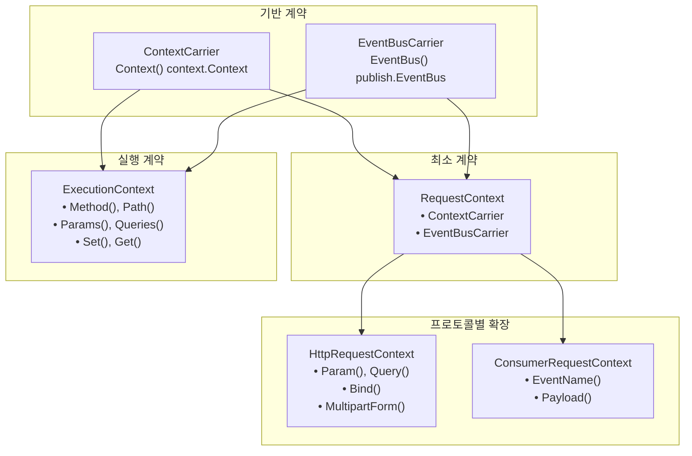

# 실행 컨텍스트 (ExecutionContext)

Spine 요청의 핵심.


## 개요

`ExecutionContext`는 Spine 파이프라인 전체에서 공유되는 요청 스코프 컨텍스트입니다. HTTP 요청이 도착하면 Transport 어댑터가 `ExecutionContext`를 생성하고, 이 컨텍스트는 파이프라인의 모든 단계를 통과하며 요청 정보와 실행 상태를 전달합니다.




## Context 계층 구조

Spine은 Context를 **계층적으로 분리**합니다. 이는 HTTP와 Event Consumer를 동일한 파이프라인 모델로 처리하기 위한 설계입니다.



### 왜 이렇게 분리하는가?

| 계층 | 담당 | 사용 위치 |
|------|------|----------|
| `ContextCarrier` | Go 표준 context 전달 | 모든 곳 |
| `EventBusCarrier` | 도메인 이벤트 발행 | Controller, Consumer |
| `RequestContext` | Resolver 공통 최소 계약 | ArgumentResolver 기반 |
| `ExecutionContext` | 실행 흐름 제어 | Router, Pipeline, Interceptor |
| `HttpRequestContext` | HTTP 입력 해석 | HTTP ArgumentResolver |
| `ConsumerRequestContext` | 이벤트 입력 해석 | Consumer ArgumentResolver |

**목표**: HTTP와 Event Consumer가 동일한 파이프라인 모델을 공유하면서, 각 프로토콜의 특성에 맞는 입력 해석이 가능하게 합니다.


## 기반 인터페이스

### ContextCarrier

Go 표준 `context.Context`를 전달하는 최소 계약입니다.

```go
// core/context.go
type ContextCarrier interface {
    Context() context.Context
}
```

### EventBusCarrier

도메인 이벤트 발행을 위한 EventBus 접근 계약입니다.

```go
// core/context.go
type EventBusCarrier interface {
    EventBus() publish.EventBus
}
```


## RequestContext 인터페이스

Resolver의 공통 최소 계약입니다. HTTP와 Consumer 모두에서 사용됩니다.

```go
// core/context.go
type RequestContext interface {
    ContextCarrier
    EventBusCarrier
}
```

`RequestContext`는 두 기반 인터페이스를 조합한 것입니다. 모든 ArgumentResolver는 이 계약 위에서 동작합니다.


## ExecutionContext 인터페이스

파이프라인 전체에서 사용되는 실행 흐름 제어용 인터페이스입니다.

```go
// core/context.go
type ExecutionContext interface {
    ContextCarrier
    EventBusCarrier

    // HTTP 요청 정보 (Consumer에서는 의미가 다름)
    Method() string                    // HTTP: GET, POST... / Consumer: "EVENT"
    Path() string                      // HTTP: /users/123 / Consumer: EventName
    Header(name string) string         // HTTP 헤더 (Consumer는 빈 문자열)
    
    // 파라미터 접근
    Params() map[string]string         // Path parameters
    PathKeys() []string                // Path key 순서
    Queries() map[string][]string      // Query parameters
    
    // 내부 저장소
    Set(key string, value any)         // 값 저장
    Get(key string) (any, bool)        // 값 조회
}
```

### 메서드 상세

#### Context()

Go 표준 `context.Context`를 반환합니다. 요청 취소, 타임아웃, 값 전달에 사용됩니다.

```go
func (e *echoContext) Context() context.Context {
    return e.reqCtx  // HTTP 요청의 context
}
```

#### EventBus()

요청 스코프의 EventBus를 반환합니다. Controller에서 도메인 이벤트를 발행할 때 사용됩니다.

```go
func (c *echoContext) EventBus() publish.EventBus {
    return c.eventBus
}
```

#### Method() / Path()

HTTP 요청의 메서드와 경로를 반환합니다. Consumer에서는 다른 의미로 사용됩니다.

```go
// HTTP
ctx.Method()  // "GET"
ctx.Path()    // "/users/123/posts/456"

// Consumer
ctx.Method()  // "EVENT"
ctx.Path()    // "order.created" (EventName)
```

#### Params() / PathKeys()

Path parameter 정보를 제공합니다.

```go
// Route: /users/:userId/posts/:postId
// Request: /users/123/posts/456

ctx.Params()    // {"userId": "123", "postId": "456"}
ctx.PathKeys()  // ["userId", "postId"]
```

`PathKeys()`는 파라미터의 **선언 순서**를 보장합니다. Spine의 순서 기반 바인딩에 필수적입니다.

#### Queries()

Query parameter를 다중 값 형태로 반환합니다.

```go
// Request: /users?status=active&tag=go&tag=web

ctx.Queries()  // {"status": ["active"], "tag": ["go", "web"]}
```

#### Set() / Get()

파이프라인 내부에서 값을 공유하는 저장소입니다.

```go
// Router에서 path params 저장
ctx.Set("spine.params", params)
ctx.Set("spine.pathKeys", keys)

// Adapter에서 ResponseWriter 저장
ctx.Set("spine.response_writer", NewEchoResponseWriter(c))

// Interceptor에서 조회
rw, ok := ctx.Get("spine.response_writer")
```


## HttpRequestContext 인터페이스

HTTP 전용 확장 인터페이스입니다. HTTP ArgumentResolver에서 사용됩니다.

```go
// core/context.go
type HttpRequestContext interface {
    RequestContext

    // 개별 파라미터 접근
    Param(name string) string          // 특정 path param
    Query(name string) string          // 특정 query param (첫 번째 값)
    
    // 전체 뷰 접근
    Params() map[string]string         // 모든 path params
    Queries() map[string][]string      // 모든 query params
    
    // Body 바인딩
    Bind(out any) error                // JSON body → struct
    
    // Multipart
    MultipartForm() (*multipart.Form, error)
}
```

### 메서드 상세

#### Param() / Query()

개별 파라미터에 편리하게 접근합니다.

```go
// Route: /users/:id?page=1&size=20

ctx.Param("id")      // "123"
ctx.Query("page")    // "1"
ctx.Query("size")    // "20"
ctx.Query("missing") // "" (없으면 빈 문자열)
```

#### Bind()

HTTP body를 구조체로 바인딩합니다.

```go
// internal/resolver/dto_resolver.go
func (r *DTOResolver) Resolve(ctx core.ExecutionContext, parameterMeta ParameterMeta) (any, error) {
    httpCtx, ok := ctx.(core.HttpRequestContext)
    if !ok {
        return nil, fmt.Errorf("HTTP 요청 컨텍스트가 아닙니다")
    }

    valuePtr := reflect.New(parameterMeta.Type)

    if err := httpCtx.Bind(valuePtr.Interface()); err != nil {
        return nil, fmt.Errorf("DTO 바인딩 실패 (%s): %w", parameterMeta.Type.Name(), err)
    }

    return valuePtr.Elem().Interface(), nil
}
```

#### MultipartForm()

Multipart form 데이터에 접근합니다. 파일 업로드 처리에 사용됩니다.

```go
// internal/resolver/uploaded_files_resolver.go
func (r *UploadedFilesResolver) Resolve(ctx core.ExecutionContext, parameterMeta ParameterMeta) (any, error) {
    httpCtx, ok := ctx.(core.HttpRequestContext)
    if !ok {
        return nil, fmt.Errorf("HTTP 요청 컨텍스트가 아닙니다")
    }

    form, err := httpCtx.MultipartForm()
    if err != nil {
        return nil, err
    }
    // ...
}
```


## ConsumerRequestContext 인터페이스

Event Consumer 전용 확장 인터페이스입니다.

```go
// core/context.go
type ConsumerRequestContext interface {
    RequestContext

    EventName() string    // 이벤트 이름 (예: "order.created")
    Payload() []byte      // 이벤트 페이로드 (JSON 등)
}
```

### 메서드 상세

#### EventName()

수신한 이벤트의 이름을 반환합니다.

```go
ctx.EventName()  // "order.created"
```

#### Payload()

이벤트의 원시 페이로드를 반환합니다.

```go
payload := ctx.Payload()  // []byte (JSON)
```

### Consumer Resolver 예시

```go
// internal/event/consumer/resolver/dto_resolver.go
func (r *DTOResolver) Resolve(ctx core.ExecutionContext, meta resolver.ParameterMeta) (any, error) {
    consumerCtx, ok := ctx.(core.ConsumerRequestContext)
    if !ok {
        return nil, fmt.Errorf("ConsumerRequestContext가 아닙니다")
    }

    payload := consumerCtx.Payload()
    if payload == nil {
        return nil, fmt.Errorf("Payload가 비어있어 DTO를 생성할 수 없습니다")
    }

    dtoPtr := reflect.New(meta.Type)
    if err := json.Unmarshal(payload, dtoPtr.Interface()); err != nil {
        return nil, fmt.Errorf("DTO 역직렬화에 실패했습니다: %w", err)
    }

    return dtoPtr.Elem().Interface(), nil
}
```


## Echo 어댑터 구현

Spine은 Echo를 HTTP Transport 레이어로 사용합니다. `echoContext`가 `ExecutionContext`와 `HttpRequestContext`를 모두 구현합니다.

```go
// internal/adapter/echo/context_impl.go
type echoContext struct {
    echo     echo.Context           // Echo의 원본 컨텍스트
    reqCtx   context.Context        // 요청 스코프 컨텍스트
    store    map[string]any         // 내부 저장소
    eventBus publish.EventBus       // 이벤트 버스
}

func NewContext(c echo.Context) core.ExecutionContext {
    return &echoContext{
        echo:     c,
        reqCtx:   c.Request().Context(),
        store:    make(map[string]any),
        eventBus: publish.NewEventBus(),
    }
}
```

### 주요 구현

#### Path Parameters

Router가 매칭한 결과를 우선 사용하고, 없으면 Echo의 값을 사용합니다.

```go
func (e *echoContext) Param(name string) string {
    // Spine Router가 저장한 값 우선
    if raw, ok := e.store["spine.params"]; ok {
        if m, ok := raw.(map[string]string); ok {
            if v, ok := m[name]; ok {
                return v
            }
        }
    }
    // Fallback to Echo
    return e.echo.Param(name)
}
```

#### Params() - 방어적 복사

외부에서 원본 맵을 변경하지 못하도록 복사본을 반환합니다.

```go
func (e *echoContext) Params() map[string]string {
    if raw, ok := e.store["spine.params"]; ok {
        if m, ok := raw.(map[string]string); ok {
            // 방어적 복사
            copyMap := make(map[string]string, len(m))
            for k, v := range m {
                copyMap[k] = v
            }
            return copyMap
        }
    }
    // Echo에서 직접 구성
    names := e.echo.ParamNames()
    values := e.echo.ParamValues()
    params := make(map[string]string, len(names))
    for i, name := range names {
        if i < len(values) {
            params[name] = values[i]
        }
    }
    return params
}
```

#### EventBus

요청 스코프의 EventBus를 반환합니다.

```go
func (c *echoContext) EventBus() publish.EventBus {
    return c.eventBus
}
```


## Consumer 어댑터 구현

Event Consumer용 Context 구현입니다.

```go
// internal/event/consumer/request_context_impl.go
type ConsumerRequestContextImpl struct {
    ctx      context.Context
    msg      *Message
    eventBus publish.EventBus
    store    map[string]any
}

func NewRequestContext(
    ctx context.Context,
    msg *Message,
    eventBus publish.EventBus,
) core.ExecutionContext {
    return &ConsumerRequestContextImpl{
        ctx:      ctx,
        msg:      msg,
        eventBus: eventBus,
        store:    make(map[string]any),
    }
}
```

### Consumer Context의 특수 동작

Consumer는 HTTP가 아니므로 일부 메서드가 다르게 동작합니다.

```go
func (c *ConsumerRequestContextImpl) Method() string {
    // Consumer 실행은 HTTP Method 개념이 없음
    // 라우팅 구분을 위해 "EVENT" 사용
    return "EVENT"
}

func (c *ConsumerRequestContextImpl) Path() string {
    // Consumer 라우팅에서 Path는 EventName
    return c.msg.EventName
}

func (c *ConsumerRequestContextImpl) Header(key string) string {
    // Consumer에는 HTTP Header 개념이 없음
    return ""
}

func (c *ConsumerRequestContextImpl) Params() map[string]string {
    // Consumer에는 Path Parameter 개념이 없음
    return map[string]string{}
}
```


## ArgumentResolver와 Context

ArgumentResolver는 `ExecutionContext`를 받고, 필요에 따라 프로토콜별 Context로 타입 단언합니다.

```go
// internal/resolver/argument.go
type ArgumentResolver interface {
    Supports(parameterMeta ParameterMeta) bool
    Resolve(ctx core.ExecutionContext, parameterMeta ParameterMeta) (any, error)
}
```

### HTTP Resolver 예시

```go
// internal/resolver/path_int_resolver.go
func (r *PathIntResolver) Resolve(ctx core.ExecutionContext, parameterMeta ParameterMeta) (any, error) {
    // HttpRequestContext로 타입 단언
    httpCtx, ok := ctx.(core.HttpRequestContext)
    if !ok {
        return nil, fmt.Errorf("HTTP 요청 컨텍스트가 아닙니다")
    }

    raw, ok := httpCtx.Params()[parameterMeta.PathKey]
    if !ok {
        return nil, fmt.Errorf("path param을 찾을 수 없습니다. %s", parameterMeta.PathKey)
    }

    value, err := strconv.ParseInt(raw, 10, 64)
    if err != nil {
        return nil, err
    }

    return path.Int{Value: value}, nil
}
```

### Consumer Resolver 예시

```go
// internal/event/consumer/resolver/event_name_resolver.go
func (r *EventNameResolver) Resolve(ctx core.ExecutionContext, meta resolver.ParameterMeta) (any, error) {
    // ConsumerRequestContext로 타입 단언
    consumerCtx, ok := ctx.(core.ConsumerRequestContext)
    if !ok {
        return nil, fmt.Errorf("ConsumerRequestContext가 아닙니다")
    }

    name := consumerCtx.EventName()
    if name == "" {
        return nil, fmt.Errorf("EventName을 RequestContext에서 찾을 수 없습니다")
    }

    return name, nil
}
```

### 공통 Resolver 예시

`StdContextResolver`는 HTTP와 Consumer 모두에서 동작합니다.

```go
// internal/resolver/std_context_resolver.go
func (r *StdContextResolver) Resolve(ctx core.ExecutionContext, parameterMeta ParameterMeta) (any, error) {
    baseCtx := ctx.Context()
    bus := ctx.EventBus()
    if bus != nil {
        return context.WithValue(baseCtx, publish.PublisherKey, bus), nil
    }
    return baseCtx, nil
}
```


## 파이프라인에서의 사용

### Router

```go
// internal/router/router.go
func (r *DefaultRouter) Route(ctx core.ExecutionContext) (core.HandlerMeta, error) {
    for _, route := range r.routes {
        if route.Method != ctx.Method() {
            continue
        }
        
        ok, params, keys := matchPath(route.Path, ctx.Path())
        if !ok {
            continue
        }
        
        // 매칭된 정보를 Context에 저장
        ctx.Set("spine.params", params)
        ctx.Set("spine.pathKeys", keys)
        
        return route.Meta, nil
    }
    return core.HandlerMeta{}, fmt.Errorf("핸들러가 없습니다.")
}
```

### Pipeline - ArgumentResolver 호출

```go
// internal/pipeline/pipeline.go
func (p *Pipeline) resolveArguments(ctx core.ExecutionContext, paramMetas []resolver.ParameterMeta) ([]any, error) {
    args := make([]any, 0, len(paramMetas))

    for _, paramMeta := range paramMetas {
        resolved := false

        for _, r := range p.argumentResolvers {
            if !r.Supports(paramMeta) {
                continue
            }

            // ExecutionContext를 직접 전달
            // Resolver 내부에서 필요한 타입으로 단언
            val, err := r.Resolve(ctx, paramMeta)
            if err != nil {
                return nil, err
            }

            args = append(args, val)
            resolved = true
            break
        }

        if !resolved {
            return nil, fmt.Errorf(
                "ArgumentResolver에 parameter가 없습니다. %d (%s)",
                paramMeta.Index,
                paramMeta.Type.String(),
            )
        }
    }
    return args, nil
}
```

### Interceptor

```go
// interceptor/cors/cors.go
func (i *CORSInterceptor) PreHandle(ctx core.ExecutionContext, meta core.HandlerMeta) error {
    // ResponseWriter 획득
    rwAny, ok := ctx.Get("spine.response_writer")
    if !ok {
        return nil
    }
    rw := rwAny.(core.ResponseWriter)
    
    // 요청 정보 확인
    origin := ctx.Header("Origin")
    if origin != "" && i.isAllowedOrigin(origin) {
        rw.SetHeader("Access-Control-Allow-Origin", origin)
    }
    
    // Preflight 처리
    if ctx.Method() == "OPTIONS" {
        rw.WriteStatus(204)
        return core.ErrAbortPipeline
    }
    
    return nil
}
```


## 내부 저장소 규약

`Set()`/`Get()`으로 사용하는 키에는 명확한 규약이 있습니다.

### Spine 예약 키

| 키 | 타입 | 설정 위치 | 용도 |
|----|------|----------|------|
| `spine.params` | `map[string]string` | Router | Path parameter 값 |
| `spine.pathKeys` | `[]string` | Router | Path key 순서 |
| `spine.response_writer` | `core.ResponseWriter` | Adapter | 응답 출력 |

### 사용 예시

```go
// ReturnValueHandler에서 ResponseWriter 사용
func (h *JSONReturnHandler) Handle(value any, ctx core.ExecutionContext) error {
    rwAny, ok := ctx.Get("spine.response_writer")
    if !ok {
        return fmt.Errorf("ExecutionContext 안에서 ResponseWriter를 찾을 수 없습니다.")
    }
    
    rw, ok := rwAny.(core.ResponseWriter)
    if !ok {
        return fmt.Errorf("ResponseWriter 타입이 올바르지 않습니다.")
    }
    
    return rw.WriteJSON(200, value)
}
```


## EventBus 통합

Spine 0.3.0부터 `ExecutionContext`에 EventBus가 통합되었습니다.

### Controller에서 이벤트 발행

```go
// cmd/demo/controller.go
func (c *UserController) CreateOrder(ctx context.Context, orderId path.Int) string {
    // context.Context에서 EventBus를 꺼내 이벤트 발행
    publish.Event(ctx, OrderCreated{
        OrderID: orderId.Value,
        At:      time.Now(),
    })

    return "OK"
}
```

### EventBus 주입 흐름

```go
// internal/resolver/std_context_resolver.go
func (r *StdContextResolver) Resolve(ctx core.ExecutionContext, parameterMeta ParameterMeta) (any, error) {
    baseCtx := ctx.Context()
    bus := ctx.EventBus()
    if bus != nil {
        // EventBus를 context.Context에 주입
        return context.WithValue(baseCtx, publish.PublisherKey, bus), nil
    }
    return baseCtx, nil
}
```


## 설계 원칙

### 1. Controller는 Context를 모른다

Controller는 `ExecutionContext`나 `HttpRequestContext`를 직접 받지 않습니다. 대신 의미 타입(`path.Int`, `query.Values` 등)과 `context.Context`로 필요한 값만 받습니다.

```go
// ❌ 안티패턴
func (c *UserController) GetUser(ctx core.ExecutionContext) User

// ✓ Spine 방식
func (c *UserController) GetUser(ctx context.Context, userId path.Int) User
```

### 2. Resolver는 ExecutionContext를 받고 필요한 타입으로 단언한다

ArgumentResolver는 `ExecutionContext`를 받습니다. 프로토콜별 기능이 필요하면 `HttpRequestContext`나 `ConsumerRequestContext`로 타입 단언합니다.

```go
func (r *PathIntResolver) Resolve(ctx core.ExecutionContext, parameterMeta ParameterMeta) (any, error) {
    httpCtx, ok := ctx.(core.HttpRequestContext)
    if !ok {
        return nil, fmt.Errorf("HTTP 요청 컨텍스트가 아닙니다")
    }
    // ...
}
```

### 3. 단일 파이프라인, 다중 프로토콜

HTTP와 Event Consumer가 동일한 파이프라인 구조를 공유합니다. Context 계층 분리로 각 프로토콜의 특성을 지원하면서 코드 재사용을 극대화합니다.

```go
// HTTP Pipeline
httpPipeline.AddArgumentResolver(
    &resolver.StdContextResolver{},      // 공통
    &resolver.PathIntResolver{},         // HTTP 전용
    &resolver.DTOResolver{},             // HTTP 전용
)

// Consumer Pipeline
consumerPipeline.AddArgumentResolver(
    &resolver.StdContextResolver{},           // 공통
    &eventResolver.EventNameResolver{},       // Consumer 전용
    &eventResolver.DTOResolver{},             // Consumer 전용
)
```


## 요약

| 인터페이스 | 역할 | 주요 메서드 | 사용 위치 |
|-----------|------|------------|----------|
| `ContextCarrier` | Go context 전달 | `Context()` | 모든 곳 |
| `EventBusCarrier` | 이벤트 발행 | `EventBus()` | Controller, Consumer |
| `RequestContext` | Resolver 최소 계약 | (조합) | ArgumentResolver 기반 |
| `ExecutionContext` | 실행 흐름 제어 | `Method()`, `Path()`, `Set()`, `Get()` | Router, Pipeline, Interceptor |
| `HttpRequestContext` | HTTP 입력 해석 | `Param()`, `Query()`, `Bind()`, `MultipartForm()` | HTTP ArgumentResolver |
| `ConsumerRequestContext` | 이벤트 입력 해석 | `EventName()`, `Payload()` | Consumer ArgumentResolver |

**핵심 원칙**: Context 계층 분리로 HTTP와 Event Consumer가 동일한 파이프라인 모델을 공유합니다. Controller는 실행 모델을 전혀 알지 못하며, 오직 비즈니스 로직에만 집중합니다.