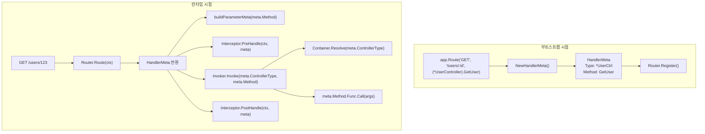

# 핸들러 메타 (HandlerMeta)

라우트 핸들러에 대한 메타데이터.

## 개요

`HandlerMeta`는 실행할 Controller 메서드에 대한 메타데이터를 담는 구조체입니다. Router가 요청 경로를 매칭하면 `HandlerMeta`를 반환하고, Pipeline은 이 정보를 사용해 실제 메서드를 호출합니다.

```mermaid
graph TD
    subgraph Bootstrap [Route 등록 (부트스트랩)]
        MethodExpr["(*UserController).GetUser<br>(메서드 표현식)"]
        NewMeta["NewHandlerMeta()"]
        MetaStruct["HandlerMeta<br>ControllerType: *UserController<br>Method: GetUser"]
    end

    subgraph Runtime [런타임]
        Pipeline["Pipeline"]
        Resolve["1. Container.Resolve(Type)"]
        Call["2. Method.Func.Call(args)"]
    end

    MethodExpr --> NewMeta
    NewMeta --> MetaStruct
    MetaStruct -.-> Pipeline
    Pipeline --> Resolve
    Resolve --> Call
```


## HandlerMeta 구조체

```go
// core/handler_meta.go
type HandlerMeta struct {
    // 컨트롤러 타입 (Container Resolve 대상)
    ControllerType reflect.Type
    
    // 호출할 메서드
    Method reflect.Method
}
```

### 필드 설명

#### ControllerType

Controller의 포인터 타입입니다. IoC Container에서 인스턴스를 Resolve할 때 사용됩니다.

```go
meta.ControllerType  // reflect.Type of *UserController
```

#### Method

호출할 메서드의 리플렉션 정보입니다. 메서드 이름, 시그니처, 함수 포인터를 포함합니다.

```go
meta.Method.Name           // "GetUser"
meta.Method.Type           // func(*UserController, path.Int) (User, error)
meta.Method.Func           // 호출 가능한 reflect.Value
```


## HandlerMeta 생성

### 메서드 표현식

Spine은 **메서드 표현식**(Method Expression)을 사용해 핸들러를 등록합니다.

```go
// cmd/demo/main.go
app.Route(
    "GET",
    "/users/:id",
    (*UserController).GetUser,  // 메서드 표현식
)
```

메서드 표현식 `(*UserController).GetUser`는 일반 함수로 취급됩니다:

```go
// 메서드 표현식의 실제 타입
func(*UserController, path.Int) (User, error)
//   ↑ receiver가 첫 번째 인자로 변환됨
```

### NewHandlerMeta 함수

메서드 표현식을 분석하여 `HandlerMeta`를 생성합니다.

```go
// internal/router/handler_meta.go
func NewHandlerMeta(handler any) (core.HandlerMeta, error) {
    t := reflect.TypeOf(handler)
    v := reflect.ValueOf(handler)
    
    // 1. 함수인지 검증
    if t.Kind() != reflect.Func {
        return core.HandlerMeta{}, fmt.Errorf("handler는 함수여야 합니다")
    }
    
    // 2. 메서드 표현식인지 검증 (첫 번째 인자가 receiver)
    if t.NumIn() < 1 {
        return core.HandlerMeta{}, fmt.Errorf("handler는 메서드 표현식이어야 합니다")
    }
    
    // 3. receiver가 포인터 타입인지 검증
    receiverType := t.In(0)
    if receiverType.Kind() != reflect.Ptr {
        return core.HandlerMeta{}, fmt.Errorf("handler의 리시버는 포인터 타입이어야 합니다")
    }
    
    // 4. 메서드 이름 추출
    fn := runtime.FuncForPC(v.Pointer())
    if fn == nil {
        return core.HandlerMeta{}, fmt.Errorf("메서드 정보를 추출할 수 없습니다")
    }
    
    fullName := fn.Name()
    // 예: github.com/NARUBROWN/spine-demo.(*UserController).GetUser
    lastDot := strings.LastIndex(fullName, ".")
    methodName := fullName[lastDot+1:]
    
    // 5. 리플렉션으로 메서드 정보 획득
    method, ok := receiverType.MethodByName(methodName)
    if !ok {
        return core.HandlerMeta{}, fmt.Errorf("메서드를 찾을 수 없습니다: %s", methodName)
    }
    
    return core.HandlerMeta{
        ControllerType: receiverType,
        Method:         method,
    }, nil
}
```

### 생성 과정 상세

#### Step 1: 함수 검증

```go
t := reflect.TypeOf((*UserController).GetUser)
t.Kind()  // reflect.Func ✓
```

#### Step 2: 메서드 표현식 검증

```go
t.NumIn()  // 2 (receiver + path.Int)
t.In(0)    // *UserController (receiver)
t.In(1)    // path.Int
```

#### Step 3: 메서드 이름 추출

`runtime.FuncForPC`로 함수의 전체 경로를 얻고, 마지막 `.` 이후의 문자열이 메서드 이름입니다.

```go
fn.Name()  // "github.com/NARUBROWN/spine-demo.(*UserController).GetUser"
           //                                                    ↑ methodName
```

#### Step 4: Method 획득

```go
method, _ := reflect.TypeOf(&UserController{}).MethodByName("GetUser")
// method.Name: "GetUser"
// method.Type: func(*UserController, path.Int) (User, error)
// method.Func: 호출 가능한 reflect.Value
```


## Router에서의 사용

### Route 등록

```go
// internal/router/router.go
type Route struct {
    Method string           // HTTP 메서드
    Path   string           // URL 패턴
    Meta   core.HandlerMeta // 핸들러 메타데이터
}

func (r *DefaultRouter) Register(method string, path string, meta core.HandlerMeta) {
    r.routes = append(r.routes, Route{
        Method: method,
        Path:   path,
        Meta:   meta,
    })
}
```

### Route 매칭

```go
func (r *DefaultRouter) Route(ctx core.ExecutionContext) (core.HandlerMeta, error) {
    for _, route := range r.routes {
        if route.Method != ctx.Method() {
            continue
        }
        
        ok, params, keys := matchPath(route.Path, ctx.Path())
        if !ok {
            continue
        }
        
        ctx.Set("spine.params", params)
        ctx.Set("spine.pathKeys", keys)
        
        return route.Meta, nil  // HandlerMeta 반환
    }
    return core.HandlerMeta{}, fmt.Errorf("핸들러가 없습니다.")
}
```


## Pipeline에서의 사용

### ParameterMeta 생성

`HandlerMeta.Method`를 분석하여 각 파라미터의 메타정보를 생성합니다.

```go
// internal/pipeline/pipeline.go
func buildParameterMeta(method reflect.Method, ctx core.ExecutionContext) []resolver.ParameterMeta {
    pathKeys := ctx.PathKeys()
    pathIdx := 0
    var metas []resolver.ParameterMeta
    
    // method.Type.NumIn()은 receiver 포함
    // i=0은 receiver이므로 i=1부터 시작
    for i := 1; i < method.Type.NumIn(); i++ {
        pt := method.Type.In(i)
        
        pm := resolver.ParameterMeta{
            Index: i - 1,
            Type:  pt,
        }
        
        if isPathType(pt) {
            if pathIdx < len(pathKeys) {
                pm.PathKey = pathKeys[pathIdx]
            }
            pathIdx++
        }
        
        metas = append(metas, pm)
    }
    
    return metas
}
```

### Controller 호출

```go
// internal/invoker/invoker.go
func (i *Invoker) Invoke(controllerType reflect.Type, method reflect.Method, args []any) ([]any, error) {
    // 1. Container에서 Controller 인스턴스 Resolve
    controller, err := i.container.Resolve(controllerType)
    if err != nil {
        return nil, err
    }
    
    // 2. 호출 인자 구성 (receiver + args)
    values := make([]reflect.Value, len(args)+1)
    values[0] = reflect.ValueOf(controller)  // receiver
    for idx, arg := range args {
        values[idx+1] = reflect.ValueOf(arg)
    }
    
    // 3. 리플렉션으로 메서드 호출
    results := method.Func.Call(values)
    
    // 4. 결과 변환
    out := make([]any, len(results))
    for i, result := range results {
        out[i] = result.Interface()
    }
    
    return out, nil
}
```

### Interceptor 전달

Interceptor의 모든 메서드는 `HandlerMeta`를 받아 실행 대상 정보에 접근할 수 있습니다.

```go
// cmd/demo/loggin_interceptor.go
func (i *LoggingInterceptor) PreHandle(ctx core.ExecutionContext, meta core.HandlerMeta) error {
    log.Printf(
        "[REQ] %s %s -> %s.%s",
        ctx.Method(),
        ctx.Path(),
        meta.ControllerType.Name(),  // "UserController"
        meta.Method.Name,            // "GetUser"
    )
    return nil
}
```


## 부트스트랩 과정

### 1. Route 선언

```go
// cmd/demo/main.go
app.Route("GET", "/users/:id", (*UserController).GetUser)
```

### 2. RouteSpec 수집

```go
// app.go
func (a *app) Route(method string, path string, handler any) {
    a.routes = append(a.routes, router.RouteSpec{
        Method:  method,
        Path:    path,
        Handler: handler,  // 메서드 표현식
    })
}
```

### 3. HandlerMeta 생성 및 등록

```go
// internal/bootstrap/bootstrap.go
router := spineRouter.NewRouter()

for _, route := range config.Routes {
    // 메서드 표현식 → HandlerMeta 변환
    meta, err := spineRouter.NewHandlerMeta(route.Handler)
    if err != nil {
        return err
    }
    
    router.Register(route.Method, route.Path, meta)
}
```

### 4. Controller 타입 수집

Router에 등록된 모든 Controller 타입을 수집합니다.

```go
// internal/router/router.go
func (r *DefaultRouter) ControllerTypes() []reflect.Type {
    seen := map[reflect.Type]struct{}{}
    var result []reflect.Type
    
    for _, route := range r.routes {
        t := route.Meta.ControllerType
        if _, ok := seen[t]; ok {
            continue
        }
        seen[t] = struct{}{}
        result = append(result, t)
    }
    
    return result
}
```

### 5. Warm-Up

부트스트랩 시점에 모든 Controller를 미리 인스턴스화합니다.

```go
// internal/bootstrap/bootstrap.go
if err := container.WarmUp(router.ControllerTypes()); err != nil {
    panic(err)
}
```

## 전체 흐름 요약




## 설계 원칙

### 1. 메서드 표현식 강제

일반 함수나 클로저가 아닌 메서드 표현식만 허용합니다.

```go
// ✓ 메서드 표현식
app.Route("GET", "/users/:id", (*UserController).GetUser)

// ❌ 일반 함수 (지원 안 함)
app.Route("GET", "/users/:id", func(id path.Int) User { ... })

// ❌ 인스턴스 메서드 (지원 안 함)
ctrl := &UserController{}
app.Route("GET", "/users/:id", ctrl.GetUser)
```

### 2. 포인터 리시버 강제

값 리시버는 지원하지 않습니다.

```go
// ✓ 포인터 리시버
func (c *UserController) GetUser(id path.Int) User

// ❌ 값 리시버 (지원 안 함)
func (c UserController) GetUser(id path.Int) User
```

### 3. 부트스트랩 검증

`NewHandlerMeta`는 부트스트랩 시점에 호출되므로, 잘못된 핸들러 등록은 서버 시작 전에 실패합니다.

```go
// 잘못된 핸들러 등록 시 부트스트랩 실패
meta, err := spineRouter.NewHandlerMeta(invalidHandler)
if err != nil {
    return err  // 서버 시작 전 에러
}
```

## 요약

| 구성 요소 | 역할 |
|----------|------|
| `HandlerMeta` | Controller 타입과 메서드 정보를 담는 메타데이터 |
| `NewHandlerMeta()` | 메서드 표현식 → HandlerMeta 변환 |
| `Router` | 요청 매칭 시 HandlerMeta 반환 |
| `Invoker` | HandlerMeta로 Controller 인스턴스 resolve 및 메서드 호출 |
| `Interceptor` | HandlerMeta로 실행 대상 정보 접근 |

**핵심**: HandlerMeta는 "무엇을 실행할 것인가"에 대한 메타데이터입니다. 부트스트랩 시점에 생성되어 런타임에 사용되며, 실행 모델과 비즈니스 로직을 연결하는 핵심 고리 역할을 합니다.