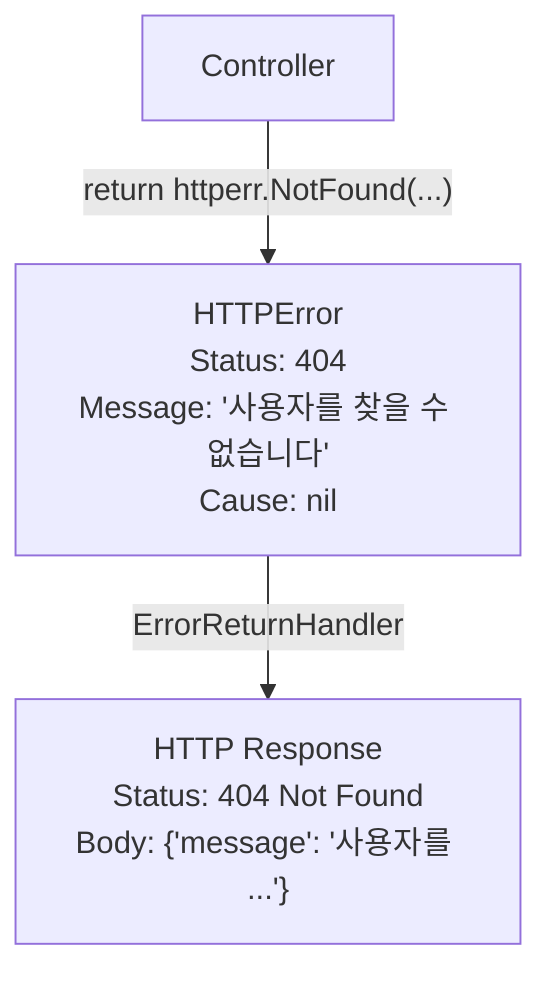

# httperr 패키지

표준화된 HTTP 에러 처리.


## 개요

`httperr` 패키지는 Controller에서 HTTP 상태 코드를 명시적으로 표현하면서도 HTTP 계층에 직접 의존하지 않도록 설계된 에러 타입을 제공합니다. Controller는 비즈니스 로직 관점에서 에러를 반환하고, `ErrorReturnHandler`가 이를 적절한 HTTP 응답으로 변환합니다.


```mermaid
graph TD
    Controller["Controller"]
    Controller -- "return httperr.NotFound(...)" --> HTTPError
    
    HTTPError["HTTPError<br/>Status: 404<br/>Message: '사용자를 찾을 수 없습니다'<br/>Cause: nil"]
    
    HTTPError -- ErrorReturnHandler --> Response
    
    Response["HTTP Response<br/>Status: 404 Not Found<br/>Body: {'message': '사용자를 ...'}"]
```


## 왜 httperr인가?

### 문제: Controller가 HTTP를 알아야 하는가?

일반적인 방식에서 Controller는 HTTP 응답을 직접 작성합니다:

```go
// ❌ HTTP 계층에 직접 의존
func (c *UserController) GetUser(ctx echo.Context) error {
    user, err := c.repo.FindByID(id)
    if err != nil {
        return ctx.JSON(404, map[string]string{"error": "not found"})
    }
    return ctx.JSON(200, user)
}
```

이 방식의 문제점:
- Controller가 HTTP 프레임워크(Echo)에 의존
- 상태 코드와 응답 형식이 비즈니스 로직과 섞임
- 테스트하기 어려움

### 해결: 의미 타입으로 에러 표현

```go
// ✓ Spine 방식: HTTP를 모르지만 의미는 명확
func (c *UserController) GetUser(userId path.Int) (User, error) {
    user, err := c.repo.FindByID(userId.Value)
    if err != nil {
        return User{}, httperr.NotFound("사용자를 찾을 수 없습니다")
    }
    return user, nil
}
```

Controller는:
- HTTP 프레임워크를 모름
- 상태 코드의 **의미**만 표현 (NotFound, BadRequest 등)
- 실제 HTTP 변환은 `ErrorReturnHandler`가 담당


## HTTPError 구조체

```go
// pkg/httperr/types.go
type HTTPError struct {
    Status  int    // HTTP 상태 코드
    Message string // 에러 메시지
    Cause   error  // 원인 에러 (선택)
}

// error 인터페이스 구현
func (e *HTTPError) Error() string {
    return e.Message
}
```

### 필드 설명

| 필드 | 타입 | 설명 |
|------|------|------|
| `Status` | `int` | HTTP 상태 코드 (400, 401, 404, 500 등) |
| `Message` | `string` | 클라이언트에게 전달할 에러 메시지 |
| `Cause` | `error` | 원인이 되는 하위 에러 (디버깅/로깅용) |

### error 인터페이스

`HTTPError`는 Go의 `error` 인터페이스를 구현합니다. 따라서 일반 에러처럼 반환하고 처리할 수 있습니다.

```go
func (c *UserController) GetUser(userId path.Int) (User, error) {
    // httperr.NotFound()는 error 타입을 반환
    return User{}, httperr.NotFound("사용자를 찾을 수 없습니다")
}
```


## 헬퍼 함수

자주 사용하는 HTTP 상태 코드에 대한 헬퍼 함수를 제공합니다.

### BadRequest

```go
func BadRequest(msg string) error {
    return &HTTPError{Status: 400, Message: msg}
}
```

클라이언트 요청이 잘못되었을 때 사용합니다.

```go
if userId.Value <= 0 {
    return User{}, httperr.BadRequest("유효하지 않은 사용자 ID입니다")
}
```

### Unauthorized

```go
func Unauthorized(msg string) error {
    return &HTTPError{Status: 401, Message: msg}
}
```

인증이 필요하거나 실패했을 때 사용합니다.

```go
if !c.auth.IsValid(token) {
    return User{}, httperr.Unauthorized("인증이 필요합니다")
}
```

### NotFound

```go
func NotFound(msg string) error {
    return &HTTPError{Status: 404, Message: msg}
}
```

리소스를 찾을 수 없을 때 사용합니다.

```go
user, err := c.repo.FindByID(id)
if err != nil {
    return User{}, httperr.NotFound("사용자를 찾을 수 없습니다")
}
```

### InternalServerError

```go
func InternalServerError(msg string) error {
    return &HTTPError{Status: 500, Message: msg}
}
```

서버 내부 오류를 명시적으로 표현할 때 사용합니다.

```go
result, err := c.externalService.Call()
if err != nil {
    return Result{}, httperr.InternalServerError("외부 서비스 호출에 실패했습니다")
}
```


## ErrorReturnHandler

Controller가 반환한 에러를 HTTP 응답으로 변환합니다.

```go
// internal/handler/error_return_handler.go
type ErrorReturnHandler struct{}

func (h *ErrorReturnHandler) Supports(returnType reflect.Type) bool {
    errorType := reflect.TypeFor[error]()
    return returnType.Implements(errorType)
}

func (h *ErrorReturnHandler) Handle(value any, ctx core.ExecutionContext) error {
    rwAny, ok := ctx.Get("spine.response_writer")
    if !ok {
        return fmt.Errorf("ExecutionContext 안에서 ResponseWriter를 찾을 수 없습니다.")
    }
    
    rw, ok := rwAny.(core.ResponseWriter)
    if !ok {
        return fmt.Errorf("ResponseWriter 타입이 올바르지 않습니다.")
    }
    
    err, ok := value.(error)
    if !ok {
        return fmt.Errorf("ErrorReturnHandler는 error 타입만 처리할 수 있습니다: %T", value)
    }
    
    status := 500
    message := err.Error()
    
    // HTTPError면 상태 코드 추출
    var httpErr *httperr.HTTPError
    if errors.As(err, &httpErr) {
        status = httpErr.Status
        message = httpErr.Message
    }
    
    return rw.WriteJSON(status, map[string]any{
        "message": message,
    })
}
```

### 동작 원리

1. Controller가 `error`를 반환
2. Pipeline이 `ErrorReturnHandler.Supports()` 호출 → `true`
3. `ErrorReturnHandler.Handle()` 실행
4. `errors.As()`로 `HTTPError` 여부 확인
5. `HTTPError`면 지정된 상태 코드 사용, 아니면 500

### HTTPError vs 일반 error

```go
// HTTPError → 지정된 상태 코드
return httperr.NotFound("...")  // → 404

// 일반 error → 500 Internal Server Error
return errors.New("something went wrong")  // → 500
```


## 사용 예시

### 기본 사용

```go
func (c *UserController) GetUser(userId path.Int) (User, error) {
    if userId.Value <= 0 {
        return User{}, httperr.BadRequest("유효하지 않은 사용자 ID입니다")
    }
    
    user, err := c.repo.FindByID(userId.Value)
    if err != nil {
        return User{}, httperr.NotFound("사용자를 찾을 수 없습니다")
    }
    
    return user, nil
}
```

```bash
# 잘못된 ID
GET /users/-1
→ 400 {"message": "유효하지 않은 사용자 ID입니다"}

# 존재하지 않는 사용자
GET /users/999
→ 404 {"message": "사용자를 찾을 수 없습니다"}

# 정상
GET /users/123
→ 200 {"id": 123, "name": "john"}
```

### 인증 처리

```go
func (c *OrderController) GetOrder(orderId path.Int) (Order, error) {
    order, err := c.repo.FindByID(orderId.Value)
    if err != nil {
        return Order{}, httperr.NotFound("주문을 찾을 수 없습니다")
    }
    
    if !c.auth.CanAccess(order.UserID) {
        return Order{}, httperr.Unauthorized("접근 권한이 없습니다")
    }
    
    return order, nil
}
```

### 비즈니스 규칙 검증

```go
func (c *PaymentController) Process(req PaymentRequest) (Receipt, error) {
    if req.Amount <= 0 {
        return Receipt{}, httperr.BadRequest("결제 금액은 0보다 커야 합니다")
    }
    
    if req.Amount > 10000000 {
        return Receipt{}, httperr.BadRequest("1회 결제 한도를 초과했습니다")
    }
    
    balance, err := c.wallet.GetBalance(req.UserID)
    if err != nil {
        return Receipt{}, httperr.NotFound("지갑을 찾을 수 없습니다")
    }
    
    if balance < req.Amount {
        return Receipt{}, httperr.BadRequest("잔액이 부족합니다")
    }
    
    return c.processPayment(req)
}
```

### 에러만 반환하는 경우

성공 시 반환값이 없는 경우에도 사용할 수 있습니다.

```go
func (c *UserController) DeleteUser(userId path.Int) error {
    exists, err := c.repo.Exists(userId.Value)
    if err != nil || !exists {
        return httperr.NotFound("사용자를 찾을 수 없습니다")
    }
    
    if err := c.repo.Delete(userId.Value); err != nil {
        return httperr.BadRequest("삭제할 수 없습니다")
    }
    
    return nil  // 성공 시 nil 반환
}
```


## 확장하기

### 새로운 상태 코드 추가

현재 제공되는 헬퍼는 400, 401, 404, 500입니다. 필요에 따라 확장할 수 있습니다.

```go
// 직접 HTTPError 생성
func Forbidden(msg string) error {
    return &httperr.HTTPError{Status: 403, Message: msg}
}

func Conflict(msg string) error {
    return &httperr.HTTPError{Status: 409, Message: msg}
}

func UnprocessableEntity(msg string) error {
    return &httperr.HTTPError{Status: 422, Message: msg}
}

func TooManyRequests(msg string) error {
    return &httperr.HTTPError{Status: 429, Message: msg}
}
```

### Cause 활용

원인 에러를 포함하여 디버깅에 활용할 수 있습니다.

```go
func WithCause(status int, msg string, cause error) error {
    return &httperr.HTTPError{
        Status:  status,
        Message: msg,
        Cause:   cause,
    }
}

// 사용
user, err := c.repo.FindByID(id)
if err != nil {
    return User{}, WithCause(404, "사용자를 찾을 수 없습니다", err)
}
```

Interceptor의 `AfterCompletion`에서 `Cause`를 로깅할 수 있습니다:

```go
func (i *LoggingInterceptor) AfterCompletion(ctx core.ExecutionContext, meta core.HandlerMeta, err error) {
    if err != nil {
        var httpErr *httperr.HTTPError
        if errors.As(err, &httpErr) && httpErr.Cause != nil {
            log.Printf("[ERR] %s %s: %s (cause: %v)", 
                ctx.Method(), ctx.Path(), httpErr.Message, httpErr.Cause)
        }
    }
}
```


## Pipeline에서의 에러 흐름

### 두 단계의 에러 처리

Spine Pipeline은 에러를 **두 단계**에서 처리합니다:

1. **`handleReturn()`**: Controller 반환값 중 error를 `ErrorReturnHandler`로 처리
2. **`handleExecutionError()`**: Pipeline 실행 중 발생한 에러를 최종 안전망으로 처리

```
Controller
     │
     │  return (User{}, httperr.NotFound("..."))
     ▼
┌─────────────────────────────────────┐
│         handleReturn()              │
│                                     │
│  results = [User{}, *HTTPError]     │
│                                     │
│  1. isNilResult() 체크              │
│  2. error 타입 우선 탐색             │
│  3. ErrorReturnHandler.Handle()     │
│     → rw.WriteJSON(404, {...})      │
└─────────────────────────────────────┘
```

### handleReturn - error 우선 처리

`Pipeline.handleReturn()`은 error 타입을 우선 처리합니다. `isNilResult()`로 nil 여부를 포괄적으로 체크합니다.

```go
// internal/pipeline/pipeline.go
func (p *Pipeline) handleReturn(ctx core.ExecutionContext, results []any) error {
    // error가 있으면 error만 처리하고 종료
    for _, result := range results {
        if isNilResult(result) {
            continue
        }
        if _, isErr := result.(error); isErr {
            resultType := reflect.TypeOf(result)
            for _, h := range p.returnHandlers {
                if h.Supports(resultType) {
                    if err := h.Handle(result, ctx); err != nil {
                        return err
                    }
                    // error 반환값은 여기서 소비하고 종료한다.
                    return nil
                }
            }
            return fmt.Errorf(
                "error 반환값을 처리할 ReturnValueHandler가 없습니다. (%s)",
                resultType.String(),
            )
        }
    }
    
    // error가 없으면 첫 번째 non-nil 값 처리
    for _, result := range results {
        if isNilResult(result) {
            continue
        }
        resultType := reflect.TypeOf(result)
        // ...ReturnValueHandler로 처리
    }
    return nil
}
```

> **`isNilResult`**: `nil` 리터럴뿐만 아니라, 타입 정보는 있으나 값이 nil인 경우(`interface`에 nil이 담긴 경우 등)까지 포괄적으로 처리합니다.

따라서 `(User, error)`를 반환할 때:
- `error`가 non-nil → error만 처리, User 무시
- `error`가 nil → User 처리

### handleExecutionError - 최종 안전망

Pipeline 실행 중 에러가 발생하면 `handleExecutionError`가 최종 안전망으로 동작합니다. 이미 응답이 커밋된 경우 이중 응답을 방지합니다.

```go
// internal/pipeline/pipeline.go
func (p *Pipeline) handleExecutionError(ctx core.ExecutionContext, err error) {
    rwAny, ok := ctx.Get("spine.response_writer")
    if !ok {
        return
    }
    
    rw, ok := rwAny.(core.ResponseWriter)
    if !ok {
        return
    }
    
    // 이미 응답이 커밋된 경우 이중 응답 방지
    if rw.IsCommitted() {
        return
    }
    
    var httpErr *httperr.HTTPError
    if errors.As(err, &httpErr) {
        rw.WriteJSON(httpErr.Status, map[string]any{
            "message": httpErr.Message,
        })
        return
    }
    
    rw.WriteJSON(500, map[string]any{
        "message": "Internal server error",
    })
}
```

### 에러 처리 전체 흐름

```
Pipeline.Execute()
     │
     ├── handleReturn() 에서 error 처리 성공
     │   └── ErrorReturnHandler가 응답 작성 → 종료
     │
     ├── handleReturn() 자체가 error 반환
     │   └── handleExecutionError() → 안전망 응답
     │
     ├── Router/Resolver/Invoker 에서 error 발생
     │   └── handleExecutionError() → 안전망 응답
     │
     └── handleExecutionError() 조건 분기
         ├── rw.IsCommitted() → 스킵 (이중 응답 방지)
         ├── HTTPError → 지정된 상태 코드로 응답
         └── 일반 error → 500 "Internal server error"
```


## 프레임워크 내부 사용

`httperr`는 Controller뿐 아니라 프레임워크 내부에서도 사용됩니다.

### Router에서의 사용

매칭되는 핸들러가 없을 때 `httperr.NotFound`를 반환합니다.

```go
// internal/router/router.go
func (r *DefaultRouter) Route(ctx core.ExecutionContext) (core.HandlerMeta, error) {
    for _, route := range r.routes {
        // ...매칭 시도
    }
    return core.HandlerMeta{}, httperr.NotFound("핸들러가 없습니다.")
}
```

이 에러는 `handleExecutionError`에 의해 404 응답으로 변환됩니다.


## 설계 원칙

### 1. Controller는 HTTP를 모른다

```go
// ✓ 의미만 표현
return httperr.NotFound("사용자를 찾을 수 없습니다")

// ❌ HTTP 직접 조작
return ctx.JSON(404, ...)
```

### 2. 상태 코드는 의미 타입

```go
// ✓ 함수 이름이 의미를 표현
httperr.BadRequest(...)
httperr.Unauthorized(...)
httperr.NotFound(...)
httperr.InternalServerError(...)

// ❌ 숫자 코드 직접 사용
return &HTTPError{Status: 404, ...}  // 가능하지만 권장하지 않음
```

### 3. 에러도 반환값

Go의 관례대로 에러를 반환값으로 처리합니다. 예외(exception)를 던지지 않습니다.

```go
// ✓ 명시적 반환
func GetUser(id path.Int) (User, error) {
    if ... {
        return User{}, httperr.NotFound(...)
    }
    return user, nil
}

// ❌ panic (Spine은 이 방식을 사용하지 않음)
func GetUser(id path.Int) User {
    if ... {
        panic(httperr.NotFound(...))
    }
    return user
}
```

### 4. 이중 응답 방지

Pipeline의 `handleExecutionError`는 `rw.IsCommitted()`를 확인하여, 이미 응답이 작성된 경우 추가 응답을 방지합니다. 이는 Interceptor가 직접 응답을 작성한 후 `ErrAbortPipeline`을 반환하는 패턴과도 안전하게 공존합니다.


## 요약

| 함수 | 상태 코드 | 용도 |
|------|----------|------|
| `BadRequest(msg)` | 400 | 잘못된 요청 |
| `Unauthorized(msg)` | 401 | 인증 필요/실패 |
| `NotFound(msg)` | 404 | 리소스를 찾을 수 없음 |
| `InternalServerError(msg)` | 500 | 서버 내부 오류 |

| 구성 요소 | 역할 |
|----------|------|
| `HTTPError` | 상태 코드와 메시지를 담는 에러 타입 |
| `ErrorReturnHandler` | Controller 반환 error → HTTP 응답 변환 |
| `handleExecutionError` | Pipeline 에러 최종 안전망 (이중 응답 방지) |
| `isNilResult` | 포괄적 nil 체크 (인터페이스 nil 포함) |

**핵심 철학**: Controller는 "404를 반환한다"가 아니라 "찾을 수 없다"를 표현합니다. HTTP 상태 코드로의 변환은 파이프라인이 담당합니다. 이것이 Spine의 관심사 분리 원칙입니다.