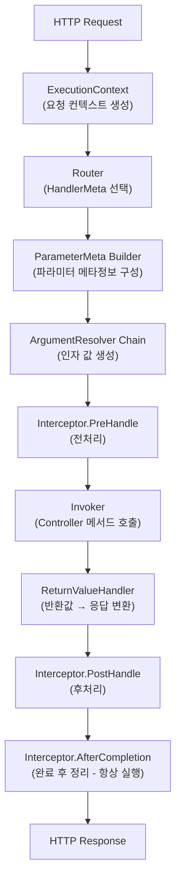

# 실행 파이프라인

Spine의 요청 생명주기 이해하기.


## 개요

Spine의 핵심 철학은 **실행 흐름의 명시성**입니다. 대부분의 웹 프레임워크가 요청 처리 과정을 내부에 숨기는 반면, Spine은 모든 단계를 코드 구조로 고정하고 명확하게 드러냅니다.

모든 HTTP 요청은 다음 파이프라인을 **반드시** 순서대로 통과합니다:




## 1. ExecutionContext 생성

HTTP 요청이 도착하면, Transport 어댑터(Echo)가 요청을 Spine의 `ExecutionContext`로 변환합니다.

```go
// internal/adapter/echo/adapter.go
func (s *Server) handle(c echo.Context) error {
    ctx := NewContext(c)
    
    ctx.Set(
        "spine.response_writer",
        NewEchoResponseWriter(c),
    )
    
    return s.pipeline.Execute(ctx)
}
```

`ExecutionContext`는 파이프라인 전체에서 공유되는 요청 스코프 컨텍스트입니다. HTTP 메서드, 경로, 헤더, 쿼리 파라미터 등 요청의 모든 정보에 접근할 수 있습니다.


## 2. Router - HandlerMeta 선택

Router는 요청 경로와 메서드를 기반으로 실행할 Controller 메서드를 결정합니다.

```go
// internal/router/router.go
func (r *DefaultRouter) Route(ctx core.ExecutionContext) (core.HandlerMeta, error) {
    for _, route := range r.routes {
        if route.Method != ctx.Method() {
            continue
        }
        
        ok, params, keys := matchPath(route.Path, ctx.Path())
        if !ok {
            continue
        }
        
        // path param 주입
        ctx.Set("spine.params", params)
        ctx.Set("spine.pathKeys", keys)
        
        return route.Meta, nil
    }
    return core.HandlerMeta{}, fmt.Errorf("핸들러가 없습니다.")
}
```

`HandlerMeta`는 실행 대상에 대한 메타데이터를 담고 있습니다:

```go
// core/handler_meta.go
type HandlerMeta struct {
    ControllerType reflect.Type   // 컨트롤러 타입
    Method         reflect.Method // 호출할 메서드
}
```


## 3. ParameterMeta 구성

Controller 메서드의 시그니처를 분석하여 각 파라미터에 대한 메타정보를 생성합니다.

```go
// internal/pipeline/pipeline.go
func buildParameterMeta(method reflect.Method, ctx core.ExecutionContext) []resolver.ParameterMeta {
    pathKeys := ctx.PathKeys()
    pathIdx := 0
    var metas []resolver.ParameterMeta
    
    for i := 1; i < method.Type.NumIn(); i++ {
        pt := method.Type.In(i)
        
        pm := resolver.ParameterMeta{
            Index: i - 1,
            Type:  pt,
        }
        
        // path.* 타입이면 순서대로 PathKey 할당
        if isPathType(pt) {
            if pathIdx < len(pathKeys) {
                pm.PathKey = pathKeys[pathIdx]
            }
            pathIdx++
        }
        
        metas = append(metas, pm)
    }
    
    return metas
}
```

**Path Parameter 바인딩 규칙**: Spine은 순서 기반(order-based) 바인딩을 사용합니다.

```go
// Route: /users/:userId/posts/:postId
// Controller:
func GetPost(userId path.Int, postId path.Int) // ✓ 순서 일치
```


## 4. ArgumentResolver Chain

각 파라미터 타입에 맞는 Resolver가 실제 값을 생성합니다.

```go
// internal/pipeline/pipeline.go
func (p *Pipeline) resolveArguments(ctx core.ExecutionContext, paramMetas []resolver.ParameterMeta) ([]any, error) {
    reqCtx := ctx.(core.RequestContext)
    args := make([]any, 0, len(paramMetas))
    
    for _, paramMeta := range paramMetas {
        for _, r := range p.argumentResolvers {
            if !r.Supports(paramMeta) {
                continue
            }
            
            val, err := r.Resolve(reqCtx, paramMeta)
            if err != nil {
                return nil, err
            }
            
            args = append(args, val)
            break
        }
    }
    return args, nil
}
```

### 기본 제공 Resolver

| Resolver | 지원 타입 | 설명 |
|----------|----------|------|
| `PathIntResolver` | `path.Int` | 경로에서 정수 추출 |
| `PathStringResolver` | `path.String` | 경로에서 문자열 추출 |
| `PathBooleanResolver` | `path.Boolean` | 경로에서 불리언 추출 |
| `PaginationResolver` | `query.Pagination` | page, size 쿼리 파라미터 |
| `QueryValuesResolver` | `query.Values` | 전체 쿼리 파라미터 뷰 |
| `DTOResolver` | `struct` | JSON body 바인딩 |
| `StdContextResolver` | `context.Context` | 표준 컨텍스트 |

### ArgumentResolver 인터페이스

```go
// internal/resolver/argument.go
type ArgumentResolver interface {
    // 이 Resolver가 해당 타입을 처리할 수 있는지 판단
    Supports(parameterMeta ParameterMeta) bool
    
    // Context로부터 실제 값 생성
    Resolve(ctx core.RequestContext, parameterMeta ParameterMeta) (any, error)
}
```


## 5. Interceptor.PreHandle

Controller 호출 전에 횡단 관심사(cross-cutting concerns)를 처리합니다.

```go
// internal/pipeline/pipeline.go
for _, it := range p.interceptors {
    if err := it.PreHandle(ctx, meta); err != nil {
        if errors.Is(err, core.ErrAbortPipeline) {
            // 의도적 종료 (예: CORS preflight)
            return nil
        }
        return err
    }
}
```

### Interceptor 인터페이스

```go
// core/interceptor.go
type Interceptor interface {
    // Controller 호출 전 실행
    PreHandle(ctx ExecutionContext, meta HandlerMeta) error
    
    // ReturnValueHandler 처리 후 실행
    PostHandle(ctx ExecutionContext, meta HandlerMeta)
    
    // 성공/실패와 관계없이 마지막에 호출
    AfterCompletion(ctx ExecutionContext, meta HandlerMeta, err error)
}
```

### 파이프라인 중단

`PreHandle`에서 `core.ErrAbortPipeline`을 반환하면 이후 단계를 건너뜁니다. CORS preflight 처리에서 주로 사용됩니다:

```go
// interceptor/cors/cors.go
if ctx.Method() == "OPTIONS" {
    rw.WriteStatus(204)
    return core.ErrAbortPipeline
}
```


## 6. Invoker - Controller 메서드 호출

IoC Container에서 Controller 인스턴스를 가져와 메서드를 호출합니다.

```go
// internal/invoker/invoker.go
func (i *Invoker) Invoke(controllerType reflect.Type, method reflect.Method, args []any) ([]any, error) {
    // Container에서 인스턴스 Resolve
    controller, err := i.container.Resolve(controllerType)
    if err != nil {
        return nil, err
    }
    
    // 리플렉션으로 메서드 호출
    values := make([]reflect.Value, len(args)+1)
    values[0] = reflect.ValueOf(controller)
    for idx, arg := range args {
        values[idx+1] = reflect.ValueOf(arg)
    }
    
    results := method.Func.Call(values)
    
    // 결과 변환
    out := make([]any, len(results))
    for i, result := range results {
        out[i] = result.Interface()
    }
    
    return out, nil
}
```

**Controller의 책임**: Controller는 순수하게 비즈니스 로직만 담당합니다. HTTP, 파이프라인, 실행 순서를 전혀 알지 못합니다.

```go
func (c *UserController) GetUser(userId path.Int) (User, error) {
    if userId.Value <= 0 {
        return User{}, httperr.BadRequest("유효하지 않은 사용자 ID")
    }
    return c.repo.FindByID(userId.Value)
}
```


## 7. ReturnValueHandler

Controller의 반환값을 HTTP 응답으로 변환합니다.

```go
// internal/pipeline/pipeline.go
func (p *Pipeline) handleReturn(ctx core.ExecutionContext, results []any) error {
    // error가 있으면 error만 처리
    for _, result := range results {
        if _, isErr := result.(error); isErr {
            resultType := reflect.TypeOf(result)
            for _, h := range p.returnHandlers {
                if h.Supports(resultType) {
                    return h.Handle(result, ctx)
                }
            }
        }
    }
    
    // error가 없으면 첫 번째 non-nil 값 처리
    for _, result := range results {
        if result == nil {
            continue
        }
        
        resultType := reflect.TypeOf(result)
        for _, h := range p.returnHandlers {
            if h.Supports(resultType) {
                return h.Handle(result, ctx)
            }
        }
    }
    return nil
}
```

### 기본 제공 Handler

| Handler | 지원 타입 | 응답 형식 |
|---------|----------|----------|
| `JSONReturnHandler` | struct, map, slice | JSON |
| `StringReturnHandler` | string | Plain Text |
| `ErrorReturnHandler` | error | JSON (상태 코드 매핑) |

### Error 처리

`httperr.HTTPError`를 사용하면 적절한 HTTP 상태 코드로 매핑됩니다:

```go
// internal/handler/error_return_handler.go
var httpErr *httperr.HTTPError
if errors.As(err, &httpErr) {
    status = httpErr.Status
    message = httpErr.Message
}

return rw.WriteJSON(status, map[string]any{
    "message": message,
})
```


## 8. Interceptor.PostHandle & AfterCompletion

### PostHandle

ReturnValueHandler 처리 후 역순으로 실행됩니다:

```go
for i := len(p.interceptors) - 1; i >= 0; i-- {
    p.interceptors[i].PostHandle(ctx, meta)
}
```

### AfterCompletion

성공/실패와 관계없이 **항상** 실행됩니다. `defer`로 보장됩니다:

```go
defer func() {
    for i := len(p.interceptors) - 1; i >= 0; i-- {
        p.interceptors[i].AfterCompletion(ctx, meta, finalErr)
    }
}()
```

리소스 정리, 로깅, 메트릭 수집 등에 활용합니다.


## Context 분리 설계

Spine은 Context를 두 계층으로 명확히 분리합니다:

### ExecutionContext

파이프라인 전체에서 사용되는 실행 흐름 제어용 컨텍스트:

```go
type ExecutionContext interface {
    Context() context.Context
    Method() string
    Path() string
    Params() map[string]string
    Header(name string) string
    PathKeys() []string
    Queries() map[string][]string
    Set(key string, value any)
    Get(key string) (any, bool)
}
```

### RequestContext

ArgumentResolver에서만 사용되는 입력 해석 전용 컨텍스트:

```go
type RequestContext interface {
    Param(name string) string
    Query(name string) string
    Params() map[string]string
    Queries() map[string][]string
    Bind(out any) error
}
```

**설계 원칙**: Controller와 Resolver는 `ExecutionContext`를 직접 참조하지 않습니다. 이를 통해 실행 모델과 비즈니스 로직의 완전한 분리를 달성합니다.


## 전체 실행 흐름 코드

```go
// internal/pipeline/pipeline.go
func (p *Pipeline) Execute(ctx core.ExecutionContext) (finalErr error) {
    // 1. Router가 실행 대상 결정
    meta, err := p.router.Route(ctx)
    if err != nil {
        return err
    }
    
    // 2. ParameterMeta 생성
    paramMetas := buildParameterMeta(meta.Method, ctx)
    
    // 3. ArgumentResolver 체인 실행
    args, err := p.resolveArguments(ctx, paramMetas)
    if err != nil {
        return err
    }
    
    // 4. Interceptor PreHandle
    for _, it := range p.interceptors {
        if err := it.PreHandle(ctx, meta); err != nil {
            if errors.Is(err, core.ErrAbortPipeline) {
                return nil
            }
            return err
        }
    }
    
    // 5. Controller 메서드 호출
    results, err := p.invoker.Invoke(meta.ControllerType, meta.Method, args)
    if err != nil {
        return err
    }
    
    // 6. ReturnValueHandler 처리
    if err := p.handleReturn(ctx, results); err != nil {
        return err
    }
    
    // 7. Interceptor PostHandle (역순)
    for i := len(p.interceptors) - 1; i >= 0; i-- {
        p.interceptors[i].PostHandle(ctx, meta)
    }
    
    // 8. AfterCompletion (항상 실행)
    defer func() {
        for i := len(p.interceptors) - 1; i >= 0; i-- {
            p.interceptors[i].AfterCompletion(ctx, meta, finalErr)
        }
    }()
    
    return nil
}
```


## 요약

| 단계 | 컴포넌트 | 책임 |
|------|----------|------|
| 1 | Transport Adapter | HTTP → ExecutionContext 변환 |
| 2 | Router | 요청 경로 → HandlerMeta 매핑 |
| 3 | ParameterMeta Builder | 메서드 시그니처 분석 |
| 4 | ArgumentResolver | 파라미터 타입 → 실제 값 생성 |
| 5 | Interceptor.PreHandle | 전처리 (인증, 로깅 등) |
| 6 | Invoker | Controller 메서드 호출 |
| 7 | ReturnValueHandler | 반환값 → HTTP 응답 변환 |
| 8 | Interceptor.PostHandle | 후처리 |
| 9 | Interceptor.AfterCompletion | 정리 (항상 실행) |

이 순서는 **숨겨지지 않으며, 암묵적으로 변경되지 않습니다.** 이것이 Spine의 "No Magic" 철학입니다.