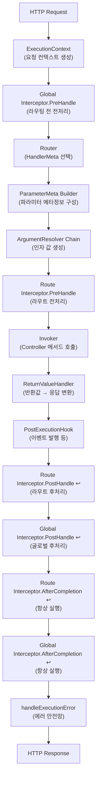

# 실행 파이프라인

Spine의 요청 생명주기 이해하기.


## 개요

Spine의 핵심 철학은 **실행 흐름의 명시성**입니다. 대부분의 웹 프레임워크가 요청 처리 과정을 내부에 숨기는 반면, Spine은 모든 단계를 코드 구조로 고정하고 명확하게 드러냅니다.

모든 HTTP 요청은 다음 파이프라인을 **반드시** 순서대로 통과합니다:


```mermaid
graph TD
    Request["HTTP Request"]
    
    ExecutionContext["ExecutionContext<br>(요청 컨텍스트 생성)"]
    GlobalPre["Global Interceptor.PreHandle<br>(라우팅 전 전처리)"]
    Router["Router<br>(HandlerMeta 선택)"]
    ParamMeta["ParameterMeta Builder<br>(파라미터 메타정보 구성)"]
    ArgResolver["ArgumentResolver Chain<br>(인자 값 생성)"]
    RoutePre["Route Interceptor.PreHandle<br>(라우트 전처리)"]
    Invoker["Invoker<br>(Controller 메서드 호출)"]
    ReturnHandler["ReturnValueHandler<br>(반환값 → 응답 변환)"]
    PostHook["PostExecutionHook<br>(이벤트 발행 등)"]
    RoutePost["Route Interceptor.PostHandle ↩<br>(라우트 후처리)"]
    GlobalPost["Global Interceptor.PostHandle ↩<br>(글로벌 후처리)"]
    RouteAfter["Route Interceptor.AfterCompletion ↩<br>(항상 실행)"]
    GlobalAfter["Global Interceptor.AfterCompletion ↩<br>(항상 실행)"]
    ErrorHandler["handleExecutionError<br>(에러 안전망)"]
    Response["HTTP Response"]

    Request --> ExecutionContext
    ExecutionContext --> GlobalPre
    GlobalPre --> Router
    Router --> ParamMeta
    ParamMeta --> ArgResolver
    ArgResolver --> RoutePre
    RoutePre --> Invoker
    Invoker --> ReturnHandler
    ReturnHandler --> PostHook
    PostHook --> RoutePost
    RoutePost --> GlobalPost
    GlobalPost --> RouteAfter
    RouteAfter --> GlobalAfter
    GlobalAfter --> ErrorHandler
    ErrorHandler --> Response
```


## 1. ExecutionContext 생성

HTTP 요청이 도착하면, Transport 어댑터(Echo)가 요청을 Spine의 `ExecutionContext`로 변환합니다.

```go
// internal/adapter/echo/adapter.go
func (s *Server) handle(c echo.Context) error {
    ctx := NewContext(c)
    
    ctx.Set(
        "spine.response_writer",
        NewEchoResponseWriter(c),
    )
    
    if err := s.pipeline.Execute(ctx); err != nil {
        c.Logger().Errorf("pipeline error: %v", err)
        // 파이프라인 내부에서 이미 응답이 작성되었으므로
        // Echo 기본 에러 핸들러로 중복 전달하지 않는다.
        return nil
    }
    return nil
}
```

`ExecutionContext`는 파이프라인 전체에서 공유되는 요청 스코프 컨텍스트입니다. HTTP 메서드, 경로, 헤더, 쿼리 파라미터 등 요청의 모든 정보에 접근할 수 있습니다.

> **참고**: WebSocket 요청도 동일한 Pipeline을 사용합니다. `ws.Runtime`이 메시지마다 `WSExecutionContext`를 생성하여 `pipeline.Execute(ctx)`를 호출합니다.


## 2. Global Interceptor.PreHandle

**라우팅 전에** 글로벌 인터셉터가 먼저 실행됩니다. 이 시점에서는 아직 어떤 핸들러가 실행될지 결정되지 않았으므로, 빈 `HandlerMeta`가 전달됩니다.

```go
// internal/pipeline/pipeline.go
globalMeta := core.HandlerMeta{}

for _, it := range p.interceptors {
    if err := it.PreHandle(ctx, globalMeta); err != nil {
        if errors.Is(err, core.ErrAbortPipeline) {
            return nil
        }
        return err
    }
}
```

CORS preflight 처리처럼 라우팅 전에 요청을 가로채야 하는 경우에 사용됩니다:

```go
// interceptor/cors/cors.go
if ctx.Method() == "OPTIONS" {
    rw.WriteStatus(204)
    return core.ErrAbortPipeline
}
```


## 3. Router - HandlerMeta 선택

Router는 요청 경로와 메서드를 기반으로 실행할 Controller 메서드를 결정합니다.

```go
// internal/router/router.go
func (r *DefaultRouter) Route(ctx core.ExecutionContext) (core.HandlerMeta, error) {
    for _, route := range r.routes {
        if route.Method != ctx.Method() {
            continue
        }
        
        ok, params, keys := matchPath(route.Path, ctx.Path())
        if !ok {
            continue
        }
        
        // path param 주입
        ctx.Set("spine.params", params)
        ctx.Set("spine.pathKeys", keys)
        
        return route.Meta, nil
    }
    return core.HandlerMeta{}, httperr.NotFound("핸들러가 없습니다.")
}
```

`HandlerMeta`는 실행 대상에 대한 메타데이터를 담고 있습니다:

```go
// core/handler_meta.go
type HandlerMeta struct {
    ControllerType reflect.Type    // 컨트롤러 타입
    Method         reflect.Method  // 호출할 메서드
    Interceptors   []Interceptor   // 라우트 레벨 인터셉터
}
```


## 4. ParameterMeta 구성

Controller 메서드의 시그니처를 분석하여 각 파라미터에 대한 메타정보를 생성합니다.

```go
// internal/pipeline/pipeline.go
func buildParameterMeta(method reflect.Method, ctx core.ExecutionContext) []resolver.ParameterMeta {
    pathKeys := ctx.PathKeys()
    pathIdx := 0
    var metas []resolver.ParameterMeta
    
    for i := 1; i < method.Type.NumIn(); i++ {
        pt := method.Type.In(i)
        
        pm := resolver.ParameterMeta{
            Index: i - 1,
            Type:  pt,
        }
        
        // path.* 타입이면 순서대로 PathKey 할당
        if isPathType(pt) {
            if pathIdx >= len(pathKeys) {
                pm.PathKey = ""
            } else {
                pm.PathKey = pathKeys[pathIdx]
            }
            pathIdx++
        }
        
        metas = append(metas, pm)
    }
    
    return metas
}

func isPathType(pt reflect.Type) bool {
    pathPkg := reflect.TypeFor[path.Int]().PkgPath()
    return pt.PkgPath() == pathPkg
}
```

**Path Parameter 바인딩 규칙**: Spine은 순서 기반(order-based) 바인딩을 사용합니다. `path` 패키지에 속한 타입(`path.Int`, `path.String`, `path.Boolean`)만 PathKey가 할당됩니다.

```go
// Route: /users/:userId/posts/:postId
// Controller:
func GetPost(userId path.Int, postId path.Int) // ✓ 순서 일치
```


## 5. ArgumentResolver Chain

각 파라미터 타입에 맞는 Resolver가 실제 값을 생성합니다.

```go
// internal/pipeline/pipeline.go
func (p *Pipeline) resolveArguments(ctx core.ExecutionContext, paramMetas []resolver.ParameterMeta) ([]any, error) {
    args := make([]any, 0, len(paramMetas))
    
    for _, paramMeta := range paramMetas {
        resolved := false
        
        for _, r := range p.argumentResolvers {
            if !r.Supports(paramMeta) {
                continue
            }
            
            val, err := r.Resolve(ctx, paramMeta)
            if err != nil {
                return nil, err
            }
            
            args = append(args, val)
            resolved = true
            break
        }
        
        if !resolved {
            return nil, fmt.Errorf(
                "ArgumentResolver에 parameter가 없습니다. %d (%s)",
                paramMeta.Index,
                paramMeta.Type.String(),
            )
        }
    }
    return args, nil
}
```

### 기본 제공 Resolver

| Resolver | 지원 타입 | 설명 |
|----------|----------|------|
| `StdContextResolver` | `context.Context` | 표준 컨텍스트 (EventBus 주입) |
| `ControllerContextResolver` | `core.ControllerContext` | ExecutionContext 읽기 전용 Facade |
| `HeaderResolver` | `header.*` | HTTP 헤더 값 |
| `PathIntResolver` | `path.Int` | 경로에서 정수 추출 |
| `PathStringResolver` | `path.String` | 경로에서 문자열 추출 |
| `PathBooleanResolver` | `path.Boolean` | 경로에서 불리언 추출 |
| `PaginationResolver` | `query.Pagination` | page, size 쿼리 파라미터 |
| `QueryValuesResolver` | `query.Values` | 전체 쿼리 파라미터 뷰 |
| `DTOResolver` | `*struct` (포인터) | JSON body 바인딩 |
| `FormDTOResolver` | `*struct` (form 태그) | Multipart/Form 바인딩 |
| `UploadedFilesResolver` | `multipart.Form` | 파일 업로드 |

### ArgumentResolver 인터페이스

```go
// internal/resolver/argument.go
type ArgumentResolver interface {
    // 이 Resolver가 해당 타입을 처리할 수 있는지 판단
    Supports(parameterMeta ParameterMeta) bool
    
    // Context로부터 실제 값 생성
    Resolve(ctx core.ExecutionContext, parameterMeta ParameterMeta) (any, error)
}
```

> **참고**: Resolver는 `core.ExecutionContext`를 받고, 필요에 따라 `core.HttpRequestContext`, `core.ConsumerRequestContext`, `core.WebSocketContext`로 타입 단언합니다.


## 6. Route Interceptor.PreHandle

라우팅 후, Controller 호출 전에 라우트 레벨 인터셉터가 실행됩니다. 이 인터셉터는 `HandlerMeta.Interceptors`에 포함되어 있으며, 특정 핸들러에만 적용됩니다.

```go
routeInterceptors := meta.Interceptors

for _, it := range routeInterceptors {
    if err := it.PreHandle(ctx, meta); err != nil {
        if errors.Is(err, core.ErrAbortPipeline) {
            return nil
        }
        return err
    }
}
```

### Interceptor 인터페이스

```go
// core/interceptor.go
type Interceptor interface {
    // Controller 호출 전 실행
    PreHandle(ctx ExecutionContext, meta HandlerMeta) error
    
    // ReturnValueHandler 처리 후 실행
    PostHandle(ctx ExecutionContext, meta HandlerMeta)
    
    // 성공/실패와 관계없이 마지막에 호출
    AfterCompletion(ctx ExecutionContext, meta HandlerMeta, err error)
}
```

### 글로벌 vs 라우트 인터셉터

| 구분 | 등록 방법 | 실행 시점 | meta 내용 |
|------|----------|----------|----------|
| 글로벌 | `app.Interceptor()` | 라우팅 **전** | 빈 `HandlerMeta{}` |
| 라우트 | `route.WithInterceptors()` | 라우팅 **후**, Controller **전** | 실제 `HandlerMeta` |

### 파이프라인 중단

`PreHandle`에서 `core.ErrAbortPipeline`을 반환하면 이후 단계를 건너뜁니다. 단, `AfterCompletion`은 항상 실행됩니다.


## 7. Invoker - Controller 메서드 호출

IoC Container에서 Controller 인스턴스를 가져와 메서드를 호출합니다.

```go
// internal/invoker/invoker.go
func (i *Invoker) Invoke(controllerType reflect.Type, method reflect.Method, args []any) ([]any, error) {
    // Container에서 인스턴스 Resolve
    controller, err := i.container.Resolve(controllerType)
    if err != nil {
        return nil, err
    }
    
    // 리플렉션으로 메서드 호출
    values := make([]reflect.Value, len(args)+1)
    values[0] = reflect.ValueOf(controller)
    for idx, arg := range args {
        values[idx+1] = reflect.ValueOf(arg)
    }
    
    results := method.Func.Call(values)
    
    // 결과 변환
    out := make([]any, len(results))
    for i, result := range results {
        out[i] = result.Interface()
    }
    
    return out, nil
}
```

**Controller의 책임**: Controller는 순수하게 비즈니스 로직만 담당합니다. HTTP, 파이프라인, 실행 순서를 전혀 알지 못합니다.

```go
func (c *UserController) GetUser(userId path.Int) (User, error) {
    if userId.Value <= 0 {
        return User{}, httperr.BadRequest("유효하지 않은 사용자 ID")
    }
    return c.repo.FindByID(userId.Value)
}
```


## 8. ReturnValueHandler

Controller의 반환값을 HTTP 응답으로 변환합니다. error 타입을 우선 처리하며, `isNilResult()`로 포괄적 nil 체크를 수행합니다.

```go
// internal/pipeline/pipeline.go
func (p *Pipeline) handleReturn(ctx core.ExecutionContext, results []any) error {
    // error가 있으면 error만 처리하고 종료
    for _, result := range results {
        if isNilResult(result) {
            continue
        }
        if _, isErr := result.(error); isErr {
            resultType := reflect.TypeOf(result)
            for _, h := range p.returnHandlers {
                if h.Supports(resultType) {
                    if err := h.Handle(result, ctx); err != nil {
                        return err
                    }
                    return nil
                }
            }
            return fmt.Errorf(
                "error 반환값을 처리할 ReturnValueHandler가 없습니다. (%s)",
                resultType.String(),
            )
        }
    }
    
    // error가 없으면 첫 번째 non-nil 값 처리
    for _, result := range results {
        if isNilResult(result) {
            continue
        }
        resultType := reflect.TypeOf(result)
        handled := false
        for _, h := range p.returnHandlers {
            if !h.Supports(resultType) {
                continue
            }
            if err := h.Handle(result, ctx); err != nil {
                return err
            }
            handled = true
            break
        }
        if !handled {
            return fmt.Errorf(
                "ReturnValueHandler가 없습니다. (%s)",
                resultType.String(),
            )
        }
    }
    return nil
}
```

### 기본 제공 Handler

| Handler | 지원 타입 | 응답 형식 |
|---------|----------|----------|
| `RedirectReturnValueHandler` | `httpx.Redirect` | Location 헤더 + 302 |
| `BinaryReturnHandler` | `httpx.Binary` | 바이너리 데이터 (파일 등) |
| `StringReturnHandler` | `httpx.Response[string]` | Plain Text |
| `JSONReturnHandler` | `httpx.Response[T]` (T ≠ string) | JSON |
| `ErrorReturnHandler` | `error` | JSON (상태 코드 매핑) |

### ReturnValueHandler 인터페이스

```go
// internal/handler/return_value.go
type ReturnValueHandler interface {
    Supports(returnType reflect.Type) bool
    Handle(value any, ctx core.ExecutionContext) error
}
```


## 9. PostExecutionHook

ReturnValueHandler 처리 후, 등록된 후처리 훅이 실행됩니다. 대표적으로 도메인 이벤트 발행이 이 단계에서 수행됩니다.

```go
// PostHooks 실행
for _, hook := range p.postHooks {
    hook.AfterExecution(ctx, results, returnError)
}
```

```go
// internal/event/hook/post_execution.go
func (h *EventDispatchHook) AfterExecution(ctx core.ExecutionContext, results []any, err error) {
    if err != nil {
        return
    }
    events := ctx.EventBus().Drain()
    if len(events) == 0 {
        return
    }
    h.Dispatcher.Dispatch(ctx.Context(), events)
}
```


## 10. Interceptor.PostHandle & AfterCompletion

### PostHandle

ReturnValueHandler 처리 후 역순으로 실행됩니다. 라우트 인터셉터가 먼저, 글로벌 인터셉터가 나중에 실행됩니다.

```go
// 라우트 Interceptor postHandle (역순)
for i := len(routeInterceptors) - 1; i >= 0; i-- {
    routeInterceptors[i].PostHandle(ctx, meta)
}

// 글로벌 Interceptor postHandle (역순)
for i := len(p.interceptors) - 1; i >= 0; i-- {
    p.interceptors[i].PostHandle(ctx, meta)
}
```

### AfterCompletion

성공/실패와 관계없이 **항상** 실행됩니다. `defer`로 보장됩니다. 라우트 인터셉터가 먼저, 글로벌 인터셉터가 나중에 정리됩니다.

```go
// 라우트 Interceptor AfterCompletion (defer - 항상 실행)
defer func() {
    for i := len(routeInterceptors) - 1; i >= 0; i-- {
        routeInterceptors[i].AfterCompletion(ctx, meta, finalErr)
    }
}()

// 글로벌 Interceptor AfterCompletion (defer - 항상 실행)
defer func() {
    for i := len(p.interceptors) - 1; i >= 0; i-- {
        p.interceptors[i].AfterCompletion(ctx, globalMeta, finalErr)
    }
}()
```

리소스 정리, 로깅, 메트릭 수집 등에 활용합니다.


## 11. handleExecutionError - 에러 안전망

Pipeline 실행 중 에러가 발생하면 최종 안전망으로 응답을 작성합니다. 이미 응답이 커밋된 경우 이중 응답을 방지합니다.

```go
// internal/pipeline/pipeline.go
defer func() {
    if finalErr != nil {
        p.handleExecutionError(ctx, finalErr)
    }
}()

func (p *Pipeline) handleExecutionError(ctx core.ExecutionContext, err error) {
    rwAny, ok := ctx.Get("spine.response_writer")
    if !ok {
        return
    }
    rw, ok := rwAny.(core.ResponseWriter)
    if !ok {
        return
    }
    
    // 이미 응답이 커밋된 경우 이중 응답 방지
    if rw.IsCommitted() {
        return
    }
    
    var httpErr *httperr.HTTPError
    if errors.As(err, &httpErr) {
        rw.WriteJSON(httpErr.Status, map[string]any{
            "message": httpErr.Message,
        })
        return
    }
    
    rw.WriteJSON(500, map[string]any{
        "message": "Internal server error",
    })
}
```


## 인터셉터 실행 순서 상세

테스트 코드로 검증된 실제 실행 순서입니다:

### 정상 흐름

```
pre:global → pre:route → [Controller] → post:route → post:global → after:route → after:global
```

### 라우트 인터셉터에서 중단 (ErrAbortPipeline)

```
pre:global → pre:route → after:route → after:global
```

Controller는 호출되지 않지만, `AfterCompletion`은 항상 실행됩니다.

### 글로벌 인터셉터에서 중단 (ErrAbortPipeline)

```
pre:global → after:global
```

Router도 호출되지 않으므로, 라우트 인터셉터도 실행되지 않습니다.


## 전체 실행 흐름 코드

```go
// internal/pipeline/pipeline.go
func (p *Pipeline) Execute(ctx core.ExecutionContext) (finalErr error) {
    // 에러 안전망: 에러 발생 시 응답 작성
    defer func() {
        if finalErr != nil {
            p.handleExecutionError(ctx, finalErr)
        }
    }()

    // 글로벌 Interceptor AfterCompletion (항상 실행)
    globalMeta := core.HandlerMeta{}
    defer func() {
        for i := len(p.interceptors) - 1; i >= 0; i-- {
            p.interceptors[i].AfterCompletion(ctx, globalMeta, finalErr)
        }
    }()

    // 1. 글로벌 Interceptor PreHandle (라우팅 전)
    for _, it := range p.interceptors {
        if err := it.PreHandle(ctx, globalMeta); err != nil {
            if errors.Is(err, core.ErrAbortPipeline) {
                return nil
            }
            return err
        }
    }

    // 2. Router가 실행 대상 결정
    meta, err := p.router.Route(ctx)
    if err != nil {
        return err
    }

    routeInterceptors := meta.Interceptors

    // 라우트 Interceptor AfterCompletion (항상 실행)
    defer func() {
        for i := len(routeInterceptors) - 1; i >= 0; i-- {
            routeInterceptors[i].AfterCompletion(ctx, meta, finalErr)
        }
    }()

    // 3. ParameterMeta 생성
    paramMetas := buildParameterMeta(meta.Method, ctx)

    // 4. ArgumentResolver 체인 실행
    args, err := p.resolveArguments(ctx, paramMetas)
    if err != nil {
        return err
    }

    // 5. 라우트 Interceptor PreHandle
    for _, it := range routeInterceptors {
        if err := it.PreHandle(ctx, meta); err != nil {
            if errors.Is(err, core.ErrAbortPipeline) {
                return nil
            }
            return err
        }
    }

    // 6. Controller 메서드 호출
    results, err := p.invoker.Invoke(meta.ControllerType, meta.Method, args)
    if err != nil {
        return err
    }

    // 7. ReturnValueHandler 처리
    returnError := p.handleReturn(ctx, results)

    // 8. PostExecutionHook (이벤트 발행 등)
    for _, hook := range p.postHooks {
        hook.AfterExecution(ctx, results, returnError)
    }

    if returnError != nil {
        return returnError
    }

    // 9. 라우트 Interceptor PostHandle (역순)
    for i := len(routeInterceptors) - 1; i >= 0; i-- {
        routeInterceptors[i].PostHandle(ctx, meta)
    }

    // 10. 글로벌 Interceptor PostHandle (역순)
    for i := len(p.interceptors) - 1; i >= 0; i-- {
        p.interceptors[i].PostHandle(ctx, meta)
    }

    return nil
}
```


## Pipeline 구조체

```go
// internal/pipeline/pipeline.go
type Pipeline struct {
    router            router.Router
    interceptors      []core.Interceptor
    argumentResolvers []resolver.ArgumentResolver
    returnHandlers    []handler.ReturnValueHandler
    invoker           *invoker.Invoker
    postHooks         []hook.PostExecutionHook
}
```

Pipeline은 단일 HTTP 파이프라인뿐 아니라 Consumer Pipeline, WebSocket Pipeline에서도 동일하게 사용됩니다. 각 Transport별로 별도의 Pipeline 인스턴스가 생성되며, Resolver와 Handler 구성만 달라집니다.


## 요약

| 단계 | 컴포넌트 | 책임 |
|------|----------|------|
| 1 | Transport Adapter | HTTP → ExecutionContext 변환 |
| 2 | Global Interceptor.PreHandle | 라우팅 전 전처리 (CORS 등) |
| 3 | Router | 요청 경로 → HandlerMeta 매핑 |
| 4 | ParameterMeta Builder | 메서드 시그니처 분석 |
| 5 | ArgumentResolver | 파라미터 타입 → 실제 값 생성 |
| 6 | Route Interceptor.PreHandle | 라우트 전처리 (인증 등) |
| 7 | Invoker | Controller 메서드 호출 |
| 8 | ReturnValueHandler | 반환값 → HTTP 응답 변환 |
| 9 | PostExecutionHook | 도메인 이벤트 발행 등 후처리 |
| 10 | Route Interceptor.PostHandle ↩ | 라우트 후처리 (역순) |
| 11 | Global Interceptor.PostHandle ↩ | 글로벌 후처리 (역순) |
| 12 | AfterCompletion ↩ | 정리 (라우트 → 글로벌, 항상 실행) |
| 13 | handleExecutionError | 에러 안전망 (이중 응답 방지) |

이 순서는 **숨겨지지 않으며, 암묵적으로 변경되지 않습니다.** 이것이 Spine의 "No Magic" 철학입니다.