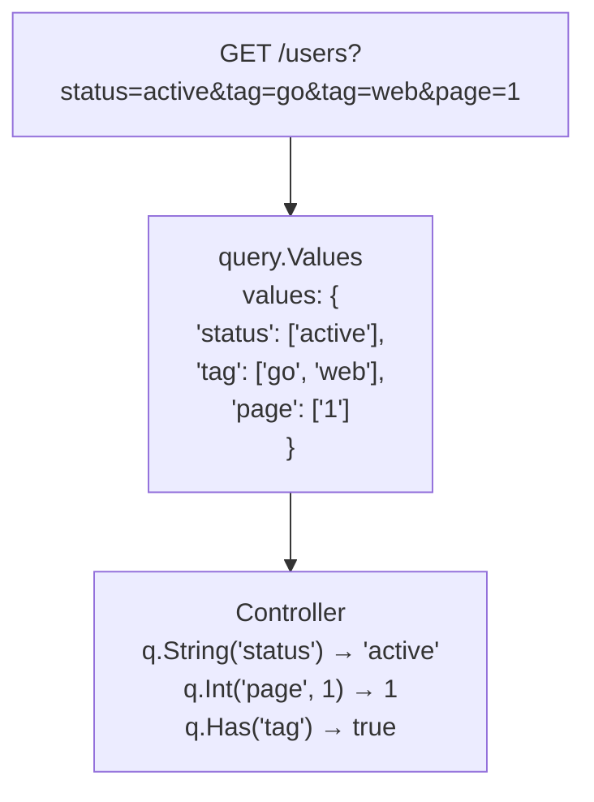

# query.Values

쿼리 파라미터를 명시적으로 처리하기.

## 개요

`query.Values`는 HTTP 쿼리 파라미터 전체에 대한 읽기 전용 뷰를 제공합니다. Spine은 쿼리 파라미터를 DTO로 자동 매핑하지 않습니다. 대신 `query.Values`를 통해 Controller가 직접 필요한 값을 명시적으로 꺼내 쓰도록 설계되었습니다.




## 왜 자동 매핑이 아닌가?

대부분의 프레임워크는 쿼리 파라미터를 struct 태그로 자동 바인딩합니다:

```go
// 다른 프레임워크의 방식
type SearchParams struct {
    Status string   `query:"status"`
    Tags   []string `query:"tag"`
    Page   int      `query:"page"`
}

func Search(params SearchParams) { ... }
```

Spine은 이 방식을 채택하지 않습니다.

### 이유 1: 명시성

쿼리 파라미터는 가변적이고 선택적입니다. 자동 매핑은 "어떤 파라미터가 어디서 왔는지"를 숨깁니다.

```go
// Spine 방식: 명시적 추출
func Search(q query.Values) []User {
    status := q.String("status")      // 명확한 출처
    page := q.Int("page", 1)          // 기본값 명시
    
    if q.Has("premium") {             // 조건부 처리
        // ...
    }
}
```

### 이유 2: 유연성

검색 API처럼 동적인 쿼리를 다룰 때 struct 기반 바인딩은 제약이 됩니다.

```go
// 동적 필터 처리
func Search(q query.Values) []Product {
    filters := make(map[string]string)
    
    // 어떤 필터가 올지 미리 알 수 없음
    if q.Has("min_price") {
        filters["min_price"] = q.String("min_price")
    }
    if q.Has("max_price") {
        filters["max_price"] = q.String("max_price")
    }
    if q.Has("category") {
        filters["category"] = q.String("category")
    }
    
    return c.repo.FindByFilters(filters)
}
```


## Values 구조체

```go
// pkg/query/types.go
type Values struct {
    values map[string][]string
}

func NewValues(values map[string][]string) Values {
    return Values{values: values}
}
```

`Values`는 `map[string][]string`을 감싸는 래퍼입니다. 각 키는 여러 값을 가질 수 있습니다 (예: `?tag=go&tag=web`).


## 메서드

### String(key string) string

지정한 키의 첫 번째 값을 문자열로 반환합니다. 키가 없으면 빈 문자열을 반환합니다.

```go
// GET /users?name=john&status=active

q.String("name")    // "john"
q.String("status")  // "active"
q.String("missing") // ""
```

### Get(key string) string

`String()`과 동일합니다. 별칭으로 제공됩니다.

```go
q.Get("name")  // "john"
```

### Int(key string, def int64) int64

지정한 키의 값을 정수로 파싱합니다. 파싱 실패 또는 키가 없으면 기본값을 반환합니다.

```go
// GET /users?page=3&size=20

q.Int("page", 1)    // 3
q.Int("size", 10)   // 20
q.Int("offset", 0)  // 0 (키 없음 → 기본값)
q.Int("page", 1)    // 1 (만약 page=abc라면 → 기본값)
```

### GetBoolByKey(key string, def bool) bool

지정한 키의 값을 불리언으로 파싱합니다.

**true로 인식**: `"true"`, `"1"`, `"yes"`, `"y"`, `"on"` (대소문자 무시)

**false로 인식**: `"false"`, `"0"`, `"no"`, `"n"`, `"off"` (대소문자 무시)

```go
// GET /users?active=true&verified=1&premium=yes

q.GetBoolByKey("active", false)    // true
q.GetBoolByKey("verified", false)  // true
q.GetBoolByKey("premium", false)   // true
q.GetBoolByKey("deleted", false)   // false (키 없음 → 기본값)
q.GetBoolByKey("active", false)    // false (만약 active=maybe → 기본값)
```

### Has(key string) bool

지정한 키가 존재하는지 확인합니다. 값이 비어있어도 키가 있으면 `true`입니다.

```go
// GET /users?status=active&empty=

q.Has("status")  // true
q.Has("empty")   // true (값은 비었지만 키는 존재)
q.Has("missing") // false
```


## QueryValuesResolver

`query.Values` 타입을 Controller 파라미터로 사용하면 `QueryValuesResolver`가 자동으로 값을 생성합니다.

```go
// internal/resolver/query_values_resolver.go
type QueryValuesResolver struct{}

func (r *QueryValuesResolver) Supports(pm ParameterMeta) bool {
    return pm.Type == reflect.TypeFor[query.Values]()
}

func (r *QueryValuesResolver) Resolve(ctx core.RequestContext, parameterMeta ParameterMeta) (any, error) {
    return query.NewValues(ctx.Queries()), nil
}
```

### 동작 원리

1. Pipeline이 Controller 시그니처를 분석
2. `query.Values` 타입 파라미터 발견
3. `QueryValuesResolver.Supports()` → `true`
4. `QueryValuesResolver.Resolve()` 호출
5. `ctx.Queries()`로 전체 쿼리 맵 획득
6. `query.NewValues()`로 래핑하여 반환


## 사용 예시

### 기본 사용

```go
// cmd/demo/controller.go
func (c *UserController) GetUserQuery(q query.Values) User {
    return User{
        ID:   q.Int("id", 0),
        Name: q.String("name"),
    }
}
```

```bash
# 요청
GET /users?id=123&name=john

# 응답
{
    "id": 123,
    "name": "john"
}
```

### 검색 API

```go
func (c *ProductController) Search(q query.Values) SearchResult {
    keyword := q.String("q")
    category := q.String("category")
    minPrice := q.Int("min_price", 0)
    maxPrice := q.Int("max_price", 999999)
    inStock := q.GetBoolByKey("in_stock", true)
    
    products := c.repo.Search(SearchCriteria{
        Keyword:  keyword,
        Category: category,
        MinPrice: minPrice,
        MaxPrice: maxPrice,
        InStock:  inStock,
    })
    
    return SearchResult{
        Query:    keyword,
        Count:    len(products),
        Products: products,
    }
}
```

```bash
GET /products?q=laptop&category=electronics&min_price=500&in_stock=true
```

### 페이지네이션과 함께 사용

`query.Values`와 `query.Pagination`을 함께 사용할 수 있습니다.

```go
func (c *UserController) List(p query.Pagination, q query.Values) PagedResult {
    status := q.String("status")
    sortBy := q.String("sort_by")
    
    users := c.repo.FindAll(status, sortBy, p.Page, p.Size)
    total := c.repo.Count(status)
    
    return PagedResult{
        Data:  users,
        Page:  p.Page,
        Size:  p.Size,
        Total: total,
    }
}
```

```bash
GET /users?page=2&size=20&status=active&sort_by=created_at
```

### 조건부 필터

```go
func (c *OrderController) List(q query.Values) []Order {
    filters := OrderFilters{}
    
    if q.Has("user_id") {
        filters.UserID = q.Int("user_id", 0)
    }
    
    if q.Has("status") {
        filters.Status = q.String("status")
    }
    
    if q.Has("from_date") {
        filters.FromDate = parseDate(q.String("from_date"))
    }
    
    if q.Has("to_date") {
        filters.ToDate = parseDate(q.String("to_date"))
    }
    
    return c.repo.FindByFilters(filters)
}
```


## 다중 값 처리

쿼리 파라미터는 같은 키로 여러 값을 전달할 수 있습니다.

```
GET /products?tag=go&tag=web&tag=api
```

현재 `query.Values`의 `String()`, `Get()` 메서드는 첫 번째 값만 반환합니다. 다중 값이 필요한 경우 내부 맵에 직접 접근하는 메서드를 추가하거나, 쉼표로 구분된 값을 파싱하는 방식을 사용할 수 있습니다.

```go
// 쉼표 구분 방식
// GET /products?tags=go,web,api

func (c *ProductController) Search(q query.Values) []Product {
    tagsRaw := q.String("tags")
    tags := strings.Split(tagsRaw, ",")
    
    return c.repo.FindByTags(tags)
}
```


## query.Pagination과의 차이

| 특성 | query.Values | query.Pagination |
|------|--------------|------------------|
| **용도** | 가변 쿼리 파라미터 | 고정된 페이지네이션 |
| **파라미터** | 모든 쿼리 | `page`, `size`만 |
| **기본값** | 메서드 호출 시 지정 | 자동 적용 (page=1, size=20) |
| **타입 변환** | 명시적 | 자동 |

### 사용 선택 기준

```go
// 고정된 페이지네이션만 필요 → query.Pagination
func List(p query.Pagination) []User

// 동적 필터 + 페이지네이션 → 둘 다 사용
func Search(p query.Pagination, q query.Values) []User

// 완전히 동적인 쿼리 → query.Values만
func CustomSearch(q query.Values) []User
```

## 설계 원칙

### 1. 명시적 추출

```go
// ✓ Spine: 어디서 왔는지 명확
status := q.String("status")
page := q.Int("page", 1)

// ❌ 자동 바인딩: 출처 불명확
func Search(params SearchParams) // status가 query? body? path?
```

### 2. 기본값 명시

```go
// ✓ 기본값이 코드에 드러남
page := q.Int("page", 1)
size := q.Int("size", 20)

// ❌ struct 태그의 기본값은 숨겨짐
type Params struct {
    Page int `query:"page" default:"1"`  // 어디서 설정됐는지 추적 어려움
}
```

### 3. 선택적 파라미터 처리

```go
// ✓ Has()로 존재 여부 명시적 확인
if q.Has("premium") {
    filters.Premium = q.GetBoolByKey("premium", false)
}

// ❌ 자동 바인딩은 zero value와 "값 없음"을 구분 못함
type Params struct {
    Premium bool `query:"premium"`  // false가 기본값인지 명시적 false인지?
}
```

## 요약

| 메서드 | 반환 타입 | 용도 |
|--------|----------|------|
| `String(key)` | `string` | 문자열 값 (없으면 `""`) |
| `Get(key)` | `string` | `String()`의 별칭 |
| `Int(key, def)` | `int64` | 정수 값 (실패 시 기본값) |
| `GetBoolByKey(key, def)` | `bool` | 불리언 값 (실패 시 기본값) |
| `Has(key)` | `bool` | 키 존재 여부 |

**핵심 철학**: Spine은 쿼리 파라미터를 "마법처럼" 자동 매핑하지 않습니다. `query.Values`를 통해 Controller가 필요한 값을 명시적으로 꺼내 씁니다. 이는 Spine의 "No Magic" 원칙과 일치합니다.