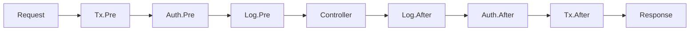

# 소개

## Spine이란 무엇인가요?

Spine은 **요청 과정을 숨기지 않는 Go 웹 프레임워크**입니다.

요청이 어떻게 해석되고, 어떤 순서로 실행되며, 언제 비즈니스 로직이 호출되고, 어떻게 응답으로 완성되는지를 명시적인 실행 파이프라인으로 드러냅니다.

```go
func main() {
    app := spine.New()
    
    // 의존성 등록 — 순서 상관없이, 생성자만 등록하면 자동 해결
    app.Constructor(NewUserRepository, NewUserService, NewUserController)
    
    // 인터셉터 — 실행 순서가 코드에 그대로 보임
    app.Interceptor(&TxInterceptor{}, &LoggingInterceptor{})
    
    // 라우트 — 어떤 메서드가 어떤 경로인지 명확
    app.Route("GET", "/users", (*UserController).GetUser)
    
    app.Run(":8080")
}
```


## 왜 Spine인가요?

### 숨겨진 마법이 없습니다

Spring Boot의 `@Autowired`, NestJS의 `@Injectable`.
편리하지만, 내부에서 무슨 일이 일어나는지 알기 어렵습니다.

Spine은 다릅니다.

- **어노테이션 없음** — 순수한 Go 코드
- **모듈 정의 없음** — 생성자 등록만으로 DI 해결
- **프록시 없음** — 스택 트레이스가 직관적

코드를 읽으면 실행 흐름이 보입니다.


### 익숙한 구조

Spring이나 NestJS를 써봤다면 바로 시작할 수 있습니다.

```
Controller → Service → Repository
```

생성자 주입, 인터셉터 체인, 계층형 아키텍처.
익숙한 패턴을 Go로 옮겼습니다.


### Go의 성능

- JVM 워밍업 없음
- Node.js 런타임 초기화 없음
- 컴파일된 바이너리가 즉시 실행

컨테이너와 서버리스 환경에 최적화되어 있습니다.


## 핵심 개념

### 1. 생성자 기반 의존성 주입

```go
// 생성자 파라미터가 곧 의존성 선언
func NewUserService(repo *UserRepository) *UserService {
    return &UserService{repo: repo}
}

// 등록만 하면 자동으로 의존성 그래프 해결
app.Constructor(NewUserRepository, NewUserService, NewUserController)
```

### 2. 인터셉터 파이프라인

```go
app.Interceptor(
    &TxInterceptor{},      // 1. 트랜잭션 시작
    &AuthInterceptor{},    // 2. 인증 확인
    &LoggingInterceptor{}, // 3. 로깅
)

```

**실행 순서:**



### 3. 명시적 라우팅

```go
// 한 곳에서 모든 라우트를 관리
func RegisterUserRoutes(app spine.App) {
    app.Route("GET", "/users", (*UserController).GetUser)
    app.Route("POST", "/users", (*UserController).CreateUser)
    app.Route("PUT", "/users", (*UserController).UpdateUser)
    app.Route("DELETE", "/users", (*UserController).DeleteUser)
}
```

### 4. 타입 안전한 핸들러

```go
// 함수 시그니처가 곧 API 스펙
func (c *UserController) GetUser(
    ctx context.Context,      // 컨텍스트
    q query.Values,           // 쿼리 파라미터
) (UserResponse, error) {     // 응답 타입
    return c.svc.Get(ctx, q.Int("id", 0))
}

// DTO는 자동으로 바인딩
func (c *UserController) CreateUser(
    ctx context.Context,
    req CreateUserRequest,    // JSON body → 구조체
) (UserResponse, error) {
    return c.svc.Create(ctx, req)
}
```

## 다른 프레임워크와의 비교

| | Spine | NestJS | Spring Boot |
|---|:---:|:---:|:---:|
| **언어** | Go | TypeScript | Java/Kotlin |
| **런타임** | 네이티브 바이너리 | Node.js | JVM |
| **IoC 컨테이너** | ✅ | ✅ | ✅ |
| **어노테이션/데코레이터** | 불필요 | 필수 | 필수 |
| **모듈 정의** | 불필요 | 필수 | 불필요 |
| **타입 안전성** | 컴파일 타임 | 런타임 | 컴파일 타임 |


## 시작할 준비가 되셨나요?

```bash
go get github.com/NARUBROWN/spine
```

[5분 퀵스타트 →](/guide/quickstart)