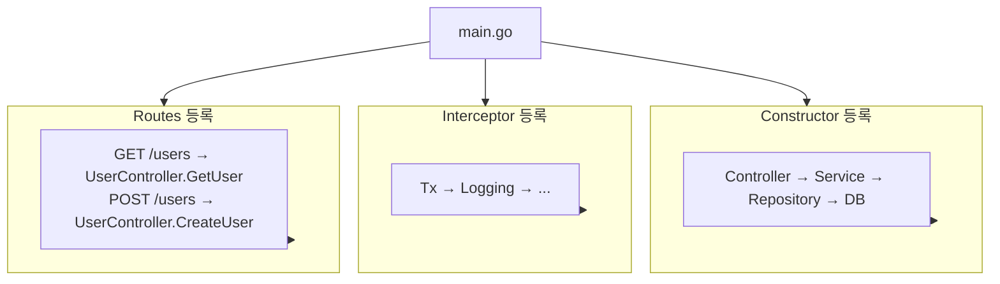

# 프로젝트 구조

Spine 프로젝트를 구조화하는 방법.


## 권장 구조

```
my-app/
├── main.go                  # 앱 진입점
├── go.mod
├── go.sum
│
├── controller/              # 컨트롤러 계층
│   └── user_controller.go
│
├── service/                 # 서비스 계층 (비즈니스 로직)
│   └── user_service.go
│
├── repository/              # 리포지토리 계층 (데이터 접근)
│   └── user_repository.go
│
├── entity/                  # 데이터베이스 엔티티
│   └── user.go
│
├── dto/                     # 요청/응답 객체
│   ├── user_request.go
│   └── user_response.go
│
├── routes/                  # 라우트 정의
│   └── user_routes.go
│
├── interceptor/             # 인터셉터
│   ├── tx_interceptor.go
│   └── logging_interceptor.go
│
└── migrations/              # DB 마이그레이션
    ├── 001_create_users.up.sql
    └── 001_create_users.down.sql
```


## 각 계층의 역할

### main.go

앱의 진입점입니다. 생성자 등록, 인터셉터 설정, 라우트 등록을 수행합니다.

```go
package main

func main() {
    app := spine.New()

    // 1. 생성자 등록
    app.Constructor(
        NewDB,
        repository.NewUserRepository,
        service.NewUserService,
        controller.NewUserController,
        interceptor.NewTxInterceptor,
    )

    // 2. 인터셉터 등록
    app.Interceptor(
        (*interceptor.TxInterceptor)(nil),
        &interceptor.LoggingInterceptor{},
    )

    // 3. 라우트 등록
    routes.RegisterUserRoutes(app)

    // 4. 서버 시작
    app.Run(":8080")
}
```

### controller/

HTTP 요청을 받아 서비스에 위임합니다. 비즈니스 로직을 포함하지 않습니다.

```go
// controller/user_controller.go
package controller

type UserController struct {
    svc *service.UserService  // 서비스 의존성
}

func NewUserController(svc *service.UserService) *UserController {
    return &UserController{svc: svc}
}

// 함수 시그니처가 곧 API 스펙
func (c *UserController) GetUser(
    ctx context.Context,
    q query.Values,
) (dto.UserResponse, error) {
    id := int(q.Int("id", 0))
    return c.svc.Get(ctx, id)
}

func (c *UserController) CreateUser(
    ctx context.Context,
    req dto.CreateUserRequest,
) (dto.UserResponse, error) {
    return c.svc.Create(ctx, req.Name, req.Email)
}
```


### service/

비즈니스 로직을 담당합니다. 리포지토리를 통해 데이터에 접근합니다.

```go
// service/user_service.go
package service

type UserService struct {
    repo *repository.UserRepository  // 리포지토리 의존성
}

func NewUserService(repo *repository.UserRepository) *UserService {
    return &UserService{repo: repo}
}

func (s *UserService) Get(ctx context.Context, id int) (dto.UserResponse, error) {
    user, err := s.repo.FindByID(ctx, id)
    if err != nil {
        return dto.UserResponse{}, err
    }
    
    return dto.UserResponse{
        ID:    int(user.ID),
        Name:  user.Name,
        Email: user.Email,
    }, nil
}

func (s *UserService) Create(ctx context.Context, name, email string) (dto.UserResponse, error) {
    user := &entity.User{Name: name, Email: email}
    
    if err := s.repo.Save(ctx, user); err != nil {
        return dto.UserResponse{}, err
    }
    
    return dto.UserResponse{
        ID:    int(user.ID),
        Name:  user.Name,
        Email: user.Email,
    }, nil
}
```


### repository/

데이터베이스 접근을 담당합니다. SQL 쿼리나 ORM 호출이 여기에 위치합니다.

```go
// repository/user_repository.go
package repository

type UserRepository struct {
    db bun.IDB  // bun.DB 또는 bun.Tx 모두 수용
}

func NewUserRepository(db bun.IDB) *UserRepository {
    return &UserRepository{db: db}
}

func (r *UserRepository) FindByID(ctx context.Context, id int) (*entity.User, error) {
    user := new(entity.User)
    err := r.db.NewSelect().
        Model(user).
        Where("id = ?", id).
        Scan(ctx)
    return user, err
}

func (r *UserRepository) Save(ctx context.Context, user *entity.User) error {
    _, err := r.db.NewInsert().
        Model(user).
        Exec(ctx)
    return err
}
```


### entity/

데이터베이스 테이블과 매핑되는 구조체입니다.

```go
// entity/user.go
package entity

type User struct {
    ID        int64     `bun:",pk,autoincrement"`
    Name      string    `bun:",notnull"`
    Email     string    `bun:",unique,notnull"`
    CreatedAt time.Time `bun:",nullzero,notnull,default:current_timestamp"`
    UpdatedAt time.Time `bun:",nullzero,notnull,default:current_timestamp"`
}
```


### dto/

요청/응답 객체입니다. API 계약을 정의합니다.

```go
// dto/user_request.go
package dto

type CreateUserRequest struct {
    Name  string `json:"name"`
    Email string `json:"email"`
}

type UpdateUserRequest struct {
    Name  string `json:"name"`
    Email string `json:"email"`
}
```

```go
// dto/user_response.go
package dto

type UserResponse struct {
    ID    int    `json:"id"`
    Name  string `json:"name"`
    Email string `json:"email"`
}
```


### routes/

라우트를 한 곳에서 관리합니다. 어떤 경로가 어떤 핸들러와 연결되는지 한눈에 파악할 수 있습니다.

```go
// routes/user_routes.go
package routes

func RegisterUserRoutes(app spine.App) {
    app.Route("GET", "/users", (*controller.UserController).GetUser)
    app.Route("POST", "/users", (*controller.UserController).CreateUser)
    app.Route("PUT", "/users", (*controller.UserController).UpdateUser)
    app.Route("DELETE", "/users", (*controller.UserController).DeleteUser)
}
```


### interceptor/

요청 전/후 처리 로직입니다. 트랜잭션, 로깅, 인증 등을 담당합니다.

```go
// interceptor/logging_interceptor.go
package interceptor

type LoggingInterceptor struct{}

func (i *LoggingInterceptor) PreHandle(ctx core.ExecutionContext, meta core.HandlerMeta) error {
    log.Printf("[REQ] %s %s", ctx.Method(), ctx.Path())
    return nil
}

func (i *LoggingInterceptor) PostHandle(ctx core.ExecutionContext, meta core.HandlerMeta) {
    log.Printf("[RES] %s %s OK", ctx.Method(), ctx.Path())
}

func (i *LoggingInterceptor) AfterCompletion(ctx core.ExecutionContext, meta core.HandlerMeta, err error) {
    if err != nil {
        log.Printf("[ERR] %s %s : %v", ctx.Method(), ctx.Path(), err)
    }
}
```


## 의존성 흐름




## 핵심 원칙

| 원칙 | 설명 |
|------|------|
| **단방향 의존성** | Controller → Service → Repository (역방향 금지) |
| **관심사 분리** | 각 계층은 자신의 역할만 수행 |
| **생성자 주입** | 모든 의존성은 생성자를 통해 주입 |
| **인터페이스 활용** | Repository는 `bun.IDB`로 DB/Tx 모두 수용 |


## 다음 단계

- [튜토리얼: 컨트롤러](/tutorial/controller) — 컨트롤러 작성법
- [튜토리얼: 의존성 주입](/tutorial/dependency-injection) — DI 심화
- [튜토리얼: 인터셉터](/tutorial/interceptor) — 트랜잭션, 로깅 구현