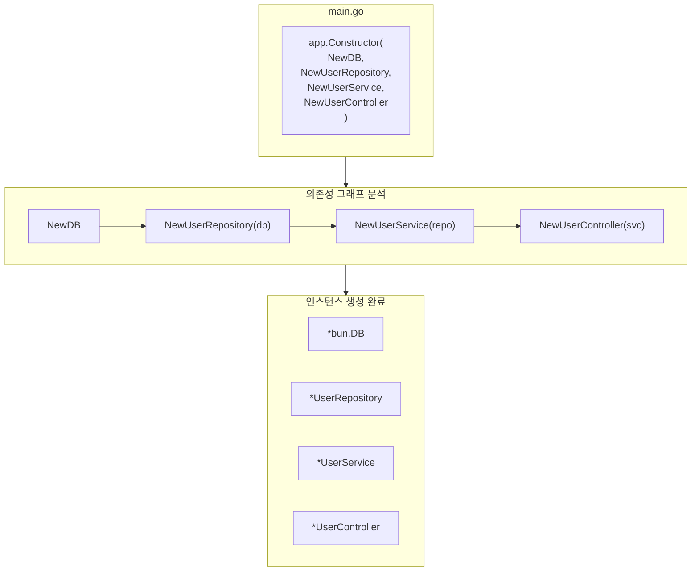

# 의존성 주입

Spine의 DI 이해하기.


## 핵심 개념

Spine의 의존성 주입은 **생성자 기반**입니다.

- 어노테이션 없음 (`@Autowired`, `@Injectable` 불필요)
- 설정 파일 없음
- 생성자 파라미터가 곧 의존성 선언

```go
// 파라미터 타입을 보고 자동으로 의존성 주입
func NewUserService(repo *UserRepository) *UserService {
    return &UserService{repo: repo}
}
```


## 기본 사용법

### 1. 생성자 작성

각 컴포넌트는 생성자 함수를 가집니다.

```go
// repository.go
type UserRepository struct {
    db *bun.DB
}

func NewUserRepository(db *bun.DB) *UserRepository {
    return &UserRepository{db: db}
}

// service.go
type UserService struct {
    repo *UserRepository
}

func NewUserService(repo *UserRepository) *UserService {
    return &UserService{repo: repo}
}

// controller.go
type UserController struct {
    svc *UserService
}

func NewUserController(svc *UserService) *UserController {
    return &UserController{svc: svc}
}
```

### 2. 생성자 등록

`app.Constructor()`에 생성자를 등록합니다.

```go
func main() {
    app := spine.New()
    
    app.Constructor(
        NewDB,              // *bun.DB 반환
        NewUserRepository,  // *bun.DB 필요 → *UserRepository 반환
        NewUserService,     // *UserRepository 필요 → *UserService 반환
        NewUserController,  // *UserService 필요 → *UserController 반환
    )
    
    app.Run(":8080")
}
```

### 3. 자동 해결

Spine이 의존성 그래프를 분석하고 올바른 순서로 인스턴스를 생성합니다.

```
등록 순서: 아무렇게나
실행 순서: DB → Repository → Service → Controller
```

## 순서 무관

등록 순서는 상관없습니다. Spine이 의존성을 분석해 자동으로 정렬합니다.

```go
// 이렇게 등록해도
app.Constructor(
    NewUserController,  // UserService 필요
    NewUserService,     // UserRepository 필요
    NewUserRepository,  // bun.DB 필요
    NewDB,
)

// 실제 생성 순서는
// 1. NewDB()
// 2. NewUserRepository(db)
// 3. NewUserService(repo)
// 4. NewUserController(svc)
```


## 의존성 그래프

### 시각화




## 생성자 규칙

### 파라미터

생성자 파라미터는 **이미 등록된 타입**이어야 합니다.

```go
// ✅ 올바른 예
func NewUserService(repo *UserRepository) *UserService

// ✅ 여러 의존성도 가능
func NewUserController(svc *UserService, logger *Logger) *UserController

// ✅ 의존성 없음도 가능
func NewLogger() *Logger
```

### 반환 타입

생성자는 **단일 값** 또는 **(값, error)**를 반환합니다.

```go
// ✅ 단일 값 반환
func NewUserService(repo *UserRepository) *UserService {
    return &UserService{repo: repo}
}

// ✅ 에러 반환 가능
func NewDB() (*bun.DB, error) {
    db, err := sql.Open("mysql", "...")
    if err != nil {
        return nil, err
    }
    return bun.NewDB(db, mysqldialect.New()), nil
}
```

## 인터페이스 활용

### 문제 상황

트랜잭션을 사용할 때, Repository는 `*bun.DB`와 `*bun.Tx` 모두 처리해야 합니다.

```go
// ❌ 이렇게 하면 트랜잭션 사용 불가
type UserRepository struct {
    db *bun.DB  // *bun.Tx를 받을 수 없음
}
```

### 해결: 인터페이스 사용

`bun.IDB` 인터페이스를 사용하면 둘 다 수용할 수 있습니다.

```go
// ✅ bun.IDB는 *bun.DB와 *bun.Tx 모두 구현
type UserRepository struct {
    db bun.IDB
}

func NewUserRepository(db bun.IDB) *UserRepository {
    return &UserRepository{db: db}
}
```

### 인터셉터에서 트랜잭션 주입

```go
// interceptor/tx_interceptor.go
func (i *TxInterceptor) PreHandle(ctx core.ExecutionContext, meta core.HandlerMeta) error {
    tx, err := i.db.BeginTx(ctx.Context(), nil)
    if err != nil {
        return err
    }
    
    ctx.Set("tx", tx)  // 트랜잭션 저장
    return nil
}

func (i *TxInterceptor) AfterCompletion(ctx core.ExecutionContext, meta core.HandlerMeta, err error) {
    tx, ok := ctx.Get("tx")
    if !ok {
        return
    }
    
    if err != nil {
        tx.(*bun.Tx).Rollback()
    } else {
        tx.(*bun.Tx).Commit()
    }
}
```


## 여러 컴포넌트 등록

### 도메인별 분리

```go
func main() {
    app := spine.New()
    
    // 인프라
    app.Constructor(
        NewDB,
        NewRedisClient,
        NewLogger,
    )
    
    // User 도메인
    app.Constructor(
        repository.NewUserRepository,
        service.NewUserService,
        controller.NewUserController,
    )
    
    // Order 도메인
    app.Constructor(
        repository.NewOrderRepository,
        service.NewOrderService,
        controller.NewOrderController,
    )
    
    app.Run(":8080")
}
```

### 여러 번 호출 가능

`app.Constructor()`는 여러 번 호출할 수 있습니다.

```go
app.Constructor(NewDB)
app.Constructor(NewUserRepository, NewUserService)
app.Constructor(NewUserController)
```

## 동일 타입 여러 개

같은 타입의 인스턴스가 여러 개 필요한 경우, 래퍼 타입을 사용합니다.

```go
// ❌ 구분 불가
func NewApp(db1 *bun.DB, db2 *bun.DB) *App  // 어떤 게 어떤 건지?

// ✅ 래퍼 타입으로 구분
type PrimaryDB struct{ *bun.DB }
type ReplicaDB struct{ *bun.DB }

func NewPrimaryDB() *PrimaryDB {
    return &PrimaryDB{connectToPrimary()}
}

func NewReplicaDB() *ReplicaDB {
    return &ReplicaDB{connectToReplica()}
}

func NewUserRepository(primary *PrimaryDB, replica *ReplicaDB) *UserRepository {
    return &UserRepository{
        writer: primary.DB,
        reader: replica.DB,
    }
}
```
## 에러 처리

### 순환 의존성

```go
// ❌ A → B → A 순환
func NewA(b *B) *A { ... }
func NewB(a *A) *B { ... }

// 부팅 시 에러 발생
// panic: 순환 의존성 감지: *A
```

### 누락된 의존성

```go
// UserRepository를 등록하지 않으면
app.Constructor(
    NewUserService,     // *UserRepository 필요
    NewUserController,
)

// 부팅 시 에러 발생
// panic: 등록된 생성자가 없습니다: *repository.UserRepository
```

## 핵심 정리

| 개념 | 설명 |
|------|------|
| **생성자 기반** | 파라미터 타입으로 의존성 선언 |
| **자동 해결** | 등록 순서 무관, 그래프 분석 후 생성 |
| **타입 매칭** | 같은 타입이면 자동 주입 |
| **인터페이스** | 유연한 의존성 처리 가능 |

## 다음 단계

- [튜토리얼: 인터셉터](/ko/learn/tutorial/4-interceptor) — 요청 전/후 처리
- [튜토리얼: 데이터베이스](/ko/learn/tutorial/5-database) — Bun ORM 연결