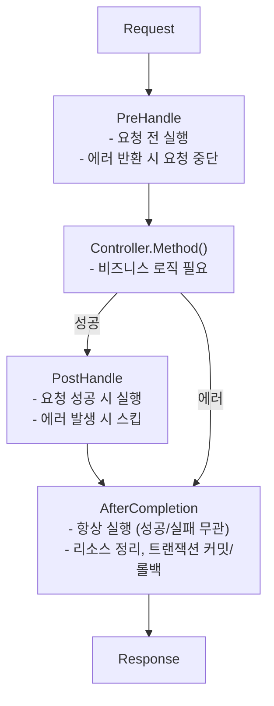

# 인터셉터

인터셉터 생성 및 사용하기.

## 인터셉터란?

인터셉터는 요청 전/후에 실행되는 로직입니다.

- 트랜잭션 관리
- 로깅
- 인증/인가
- 요청 검증

Spring의 `HandlerInterceptor`와 동일한 패턴입니다.


## 라이프사이클

인터셉터는 3단계 라이프사이클을 가집니다.




## 인터페이스

```go
type Interceptor interface {
    PreHandle(ctx ExecutionContext, meta HandlerMeta) error
    PostHandle(ctx ExecutionContext, meta HandlerMeta)
    AfterCompletion(ctx ExecutionContext, meta HandlerMeta, err error)
}
```

| 메서드 | 실행 시점 | 반환 | 용도 |
|--------|----------|------|------|
| `PreHandle` | 컨트롤러 실행 전 | `error` | 인증, 검증, 트랜잭션 시작 |
| `PostHandle` | 컨트롤러 성공 후 | 없음 | 응답 가공 |
| `AfterCompletion` | 항상 (성공/실패) | 없음 | 리소스 정리, 커밋/롤백 |


## 기본 예제: 로깅 인터셉터

```go
// interceptor/logging_interceptor.go
package interceptor

import (
    "log"
    "github.com/NARUBROWN/spine/core"
)

type LoggingInterceptor struct{}

func (i *LoggingInterceptor) PreHandle(ctx core.ExecutionContext, meta core.HandlerMeta) error {
    log.Printf("[REQ] %s %s → %s.%s",
        ctx.Method(),
        ctx.Path(),
        meta.ControllerType.Name(),
        meta.Method.Name,
    )
    return nil
}

func (i *LoggingInterceptor) PostHandle(ctx core.ExecutionContext, meta core.HandlerMeta) {
    log.Printf("[RES] %s %s OK",
        ctx.Method(),
        ctx.Path(),
    )
}

func (i *LoggingInterceptor) AfterCompletion(ctx core.ExecutionContext, meta core.HandlerMeta, err error) {
    if err != nil {
        log.Printf("[ERR] %s %s : %v",
            ctx.Method(),
            ctx.Path(),
            err,
        )
    }
}
```

### 등록

```go
func main() {
    app := spine.New()
    
    app.Interceptor(
        &interceptor.LoggingInterceptor{},
    )
    
    app.Run(":8080")
}
```

### 출력 예시

```
[REQ] GET /users → UserController.GetUser
[RES] GET /users OK

[REQ] GET /users → UserController.GetUser
[ERR] GET /users : 유저를 찾을 수 없습니다.
```


## 트랜잭션 인터셉터

데이터베이스 트랜잭션을 자동으로 관리합니다.

```go
// interceptor/tx_interceptor.go
package interceptor

import (
    "errors"
    "github.com/NARUBROWN/spine/core"
    "github.com/uptrace/bun"
)

type TxInterceptor struct {
    db *bun.DB
}

// 생성자 — DB 의존성 주입
func NewTxInterceptor(db *bun.DB) *TxInterceptor {
    return &TxInterceptor{db: db}
}

func (i *TxInterceptor) PreHandle(ctx core.ExecutionContext, meta core.HandlerMeta) error {
    reqCtx := ctx.Context()
    if reqCtx == nil {
        return errors.New("execution context has no request context")
    }
    
    // 트랜잭션 시작
    tx, err := i.db.BeginTx(reqCtx, nil)
    if err != nil {
        return err
    }
    
    // ExecutionContext에 저장
    ctx.Set("tx", tx)
    return nil
}

func (i *TxInterceptor) PostHandle(ctx core.ExecutionContext, meta core.HandlerMeta) {
    // 아무것도 안 함
}

func (i *TxInterceptor) AfterCompletion(ctx core.ExecutionContext, meta core.HandlerMeta, err error) {
    v, ok := ctx.Get("tx")
    if !ok {
        return
    }
    
    tx, ok := v.(*bun.Tx)
    if !ok {
        return
    }
    
    // 에러 여부에 따라 롤백/커밋
    if err != nil {
        tx.Rollback()
    } else {
        tx.Commit()
    }
}
```

### 등록 (의존성 주입 필요)

생성자가 있는 인터셉터는 `Constructor`에 먼저 등록합니다.

```go
func main() {
    app := spine.New()
    
    // 1. 생성자 등록
    app.Constructor(
        NewDB,
        interceptor.NewTxInterceptor,  // DB 의존성 필요
    )
    
    // 2. 인터셉터 등록 (타입으로 참조)
    app.Interceptor(
        (*interceptor.TxInterceptor)(nil),  // ← 이미 생성된 인스턴스 사용
    )
    
    app.Run(":8080")
}
```


## ExecutionContext

요청 컨텍스트에서 값을 저장하고 조회합니다.

### 메서드

| 메서드 | 설명 |
|--------|------|
| `Context()` | `context.Context` 반환 |
| `Method()` | HTTP 메서드 (GET, POST 등) |
| `Path()` | 요청 경로 |
| `Set(key, value)` | 값 저장 |
| `Get(key)` | 값 조회 |

### 사용 예시

```go
// PreHandle에서 저장
func (i *AuthInterceptor) PreHandle(ctx core.ExecutionContext, meta core.HandlerMeta) error {
    user := validateToken(ctx)
    ctx.Set("currentUser", user)  // 저장
    return nil
}

// 다른 인터셉터나 컨트롤러에서 조회
func (i *LoggingInterceptor) PreHandle(ctx core.ExecutionContext, meta core.HandlerMeta) error {
    user, ok := ctx.Get("currentUser")  // 조회
    if ok {
        log.Printf("User: %v", user)
    }
    return nil
}
```


## HandlerMeta

실행될 핸들러의 메타 정보입니다.

| 필드 | 타입 | 설명 |
|------|------|------|
| `ControllerType` | `reflect.Type` | 컨트롤러 타입 |
| `Method` | `reflect.Method` | 핸들러 메서드 |

### 사용 예시

```go
func (i *LoggingInterceptor) PreHandle(ctx core.ExecutionContext, meta core.HandlerMeta) error {
    log.Printf("컨트롤러: %s", meta.ControllerType.Name())  // UserController
    log.Printf("메서드: %s", meta.Method.Name)              // GetUser
    return nil
}
```


## 인터셉터 체인

여러 인터셉터를 순서대로 실행합니다.

### 등록 순서 = 실행 순서

```go
app.Interceptor(
    (*interceptor.TxInterceptor)(nil),     // 1번
    &interceptor.AuthInterceptor{},        // 2번
    &interceptor.LoggingInterceptor{},     // 3번
)
```

### 실행 흐름

```
Request
   │
   ├─→ Tx.PreHandle        (1)
   ├─→ Auth.PreHandle      (2)
   ├─→ Logging.PreHandle   (3)
   │
   ├─→ Controller.Method
   │
   ├─→ Logging.PostHandle  (3)
   ├─→ Auth.PostHandle     (2)
   ├─→ Tx.PostHandle       (1)
   │
   ├─→ Logging.AfterCompletion  (3)
   ├─→ Auth.AfterCompletion     (2)
   └─→ Tx.AfterCompletion       (1)
   
Response
```

- `PreHandle`: 등록 순서대로 (1 → 2 → 3)
- `PostHandle`: 역순 (3 → 2 → 1)
- `AfterCompletion`: 역순 (3 → 2 → 1)


## 에러 처리

### PreHandle에서 에러 반환

`PreHandle`에서 에러를 반환하면 요청이 중단됩니다.

```go
func (i *AuthInterceptor) PreHandle(ctx core.ExecutionContext, meta core.HandlerMeta) error {
    token := getToken(ctx)
    if token == "" {
        return httperr.Unauthorized("인증이 필요합니다.")  // 요청 중단
    }
    return nil
}
```

```
Request
   │
   ├─→ Tx.PreHandle        ✓
   ├─→ Auth.PreHandle      ✗ (에러 반환)
   │
   ├─→ Auth.AfterCompletion
   └─→ Tx.AfterCompletion
   
Response (401 Unauthorized)
```


## 인증 인터셉터 예제

```go
// interceptor/auth_interceptor.go
package interceptor

import (
    "github.com/NARUBROWN/spine/core"
    "github.com/NARUBROWN/spine/pkg/httperr"
)

type AuthInterceptor struct{}

func (i *AuthInterceptor) PreHandle(ctx core.ExecutionContext, meta core.HandlerMeta) error {
    // 헤더에서 토큰 추출
    // token := ctx.Request().Header.Get("Authorization")
    
    // 토큰 검증 (예시)
    token := "valid"  // 실제로는 헤더에서 추출
    
    if token == "" {
        return httperr.Unauthorized("인증이 필요합니다.")
    }
    
    // 사용자 정보 저장
    user := validateAndGetUser(token)
    ctx.Set("currentUser", user)
    
    return nil
}

func (i *AuthInterceptor) PostHandle(ctx core.ExecutionContext, meta core.HandlerMeta) {}

func (i *AuthInterceptor) AfterCompletion(ctx core.ExecutionContext, meta core.HandlerMeta, err error) {}

func validateAndGetUser(token string) interface{} {
    // 토큰 검증 로직
    return map[string]string{"id": "1", "name": "Alice"}
}
```

## 요청 시간 측정 인터셉터

```go
// interceptor/timing_interceptor.go
package interceptor

import (
    "log"
    "time"
    "github.com/NARUBROWN/spine/core"
)

type TimingInterceptor struct{}

func (i *TimingInterceptor) PreHandle(ctx core.ExecutionContext, meta core.HandlerMeta) error {
    ctx.Set("startTime", time.Now())
    return nil
}

func (i *TimingInterceptor) PostHandle(ctx core.ExecutionContext, meta core.HandlerMeta) {}

func (i *TimingInterceptor) AfterCompletion(ctx core.ExecutionContext, meta core.HandlerMeta, err error) {
    startTime, ok := ctx.Get("startTime")
    if !ok {
        return
    }
    
    duration := time.Since(startTime.(time.Time))
    log.Printf("[TIMING] %s %s took %v",
        ctx.Method(),
        ctx.Path(),
        duration,
    )
}
```


## 등록 방법 정리

### 의존성 없는 인터셉터

인스턴스를 직접 전달합니다.

```go
app.Interceptor(
    &interceptor.LoggingInterceptor{},
    &interceptor.TimingInterceptor{},
)
```

### 의존성 있는 인터셉터

`Constructor`에 등록 후 타입으로 참조합니다.

```go
// 1. 생성자 등록
app.Constructor(
    NewDB,
    interceptor.NewTxInterceptor,
)

// 2. 타입으로 참조
app.Interceptor(
    (*interceptor.TxInterceptor)(nil),
)
```

### 혼합 사용

```go
app.Constructor(
    NewDB,
    interceptor.NewTxInterceptor,
)

app.Interceptor(
    (*interceptor.TxInterceptor)(nil),     // 의존성 있음 (타입 참조)
    &interceptor.AuthInterceptor{},        // 의존성 없음 (인스턴스)
    &interceptor.LoggingInterceptor{},     // 의존성 없음 (인스턴스)
)
```


## 핵심 정리

| 개념 | 설명 |
|------|------|
| **3단계 라이프사이클** | PreHandle → PostHandle → AfterCompletion |
| **체인 실행** | 등록 순서대로 Pre, 역순으로 Post/After |
| **에러 시 중단** | PreHandle 에러 → 컨트롤러 스킵 |
| **컨텍스트 공유** | `ctx.Set()` / `ctx.Get()`으로 데이터 전달 |


## 다음 단계

- [튜토리얼: 데이터베이스](/tutorial/database) — Bun ORM 연결
- [튜토리얼: 에러 처리](/tutorial/error-handling) — httperr 사용법