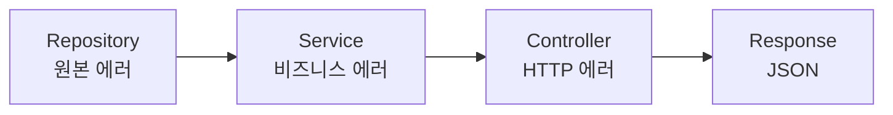
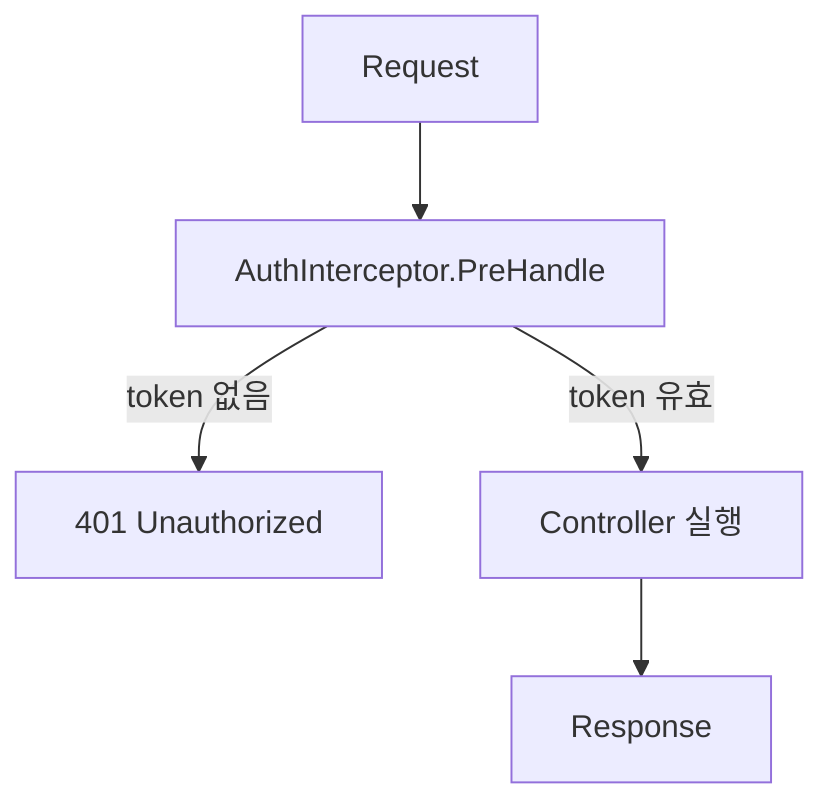

코드를 확인했습니다. 실제 `httperr` 패키지에는 3개의 헬퍼 함수만 있습니다:

```go
// pkg/httperr/types.go
func NotFound(msg string) error {
    return &HTTPError{Status: 404, Message: msg}
}

func BadRequest(msg string) error {
    return &HTTPError{Status: 400, Message: msg}
}

func Unauthorized(msg string) error {
    return &HTTPError{Status: 401, Message: msg}
}
```

문서를 수정하겠습니다:

---

# 에러 처리

에러를 우아하게 처리하는 방법.

## 개요

Spine은 `httperr` 패키지로 HTTP 에러를 표현합니다. Controller는 HTTP를 직접 다루지 않고, `httperr`로 에러의 **의미**만 표현합니다. 실제 HTTP 응답 변환은 `ErrorReturnHandler`가 담당합니다.

```go
import "github.com/NARUBROWN/spine/pkg/httperr"

func (c *UserController) GetUser(userId path.Int) (User, error) {
    if userId.Value <= 0 {
        return User{}, httperr.BadRequest("유효하지 않은 사용자 ID입니다")
    }
    
    user, err := c.repo.FindByID(userId.Value)
    if err != nil {
        return User{}, httperr.NotFound("사용자를 찾을 수 없습니다")
    }
    
    return user, nil
}
```

## httperr 함수

| 함수 | 상태 코드 | 용도 |
|------|----------|------|
| `httperr.BadRequest(msg)` | 400 | 잘못된 요청, 입력 검증 실패 |
| `httperr.Unauthorized(msg)` | 401 | 인증 필요, 토큰 무효 |
| `httperr.NotFound(msg)` | 404 | 리소스 없음 |

## HTTPError 구조체

```go
type HTTPError struct {
    Status  int    // HTTP 상태 코드
    Message string // 에러 메시지
    Cause   error  // 원인 에러 (선택)
}

func (e *HTTPError) Error() string {
    return e.Message
}
```

## 사용 예시

### 리소스 없음 (404)

```go
func (c *UserController) GetUser(userId path.Int) (User, error) {
    user, err := c.repo.FindByID(userId.Value)
    if err != nil {
        return User{}, httperr.NotFound("사용자를 찾을 수 없습니다")
    }
    return user, nil
}
```

응답:
```json
{"message": "사용자를 찾을 수 없습니다"}
```
```
HTTP/1.1 404 Not Found
```

### 잘못된 요청 (400)

```go
func (c *UserController) CreateUser(req CreateUserRequest) (User, error) {
    if req.Name == "" {
        return User{}, httperr.BadRequest("이름은 필수입니다")
    }
    if req.Email == "" {
        return User{}, httperr.BadRequest("이메일은 필수입니다")
    }
    
    return c.service.Create(req)
}
```

### 인증 필요 (401)

```go
func (i *AuthInterceptor) PreHandle(ctx core.ExecutionContext, meta core.HandlerMeta) error {
    token := ctx.Header("Authorization")
    
    if token == "" {
        return httperr.Unauthorized("인증이 필요합니다")
    }
    
    if !isValidToken(token) {
        return httperr.Unauthorized("유효하지 않은 토큰입니다")
    }
    
    return nil
}
```

## 다른 상태 코드 사용하기

제공되지 않는 상태 코드가 필요하면 `HTTPError`를 직접 생성합니다.

```go
// 403 Forbidden
func Forbidden(msg string) error {
    return &httperr.HTTPError{Status: 403, Message: msg}
}

// 409 Conflict
func Conflict(msg string) error {
    return &httperr.HTTPError{Status: 409, Message: msg}
}

// 500 Internal Server Error
func InternalServerError(msg string) error {
    return &httperr.HTTPError{Status: 500, Message: msg}
}
```

## 계층별 에러 처리



### Repository

원본 에러를 그대로 반환합니다.

```go
func (r *UserRepository) FindByID(id int64) (*User, error) {
    user, ok := r.users[id]
    if !ok {
        return nil, ErrUserNotFound  // 원본 에러
    }
    return user, nil
}

var ErrUserNotFound = errors.New("user not found")
```

### Service

비즈니스 로직을 처리하고, Repository 에러를 전달합니다.

```go
func (s *UserService) GetUser(id int64) (*User, error) {
    user, err := s.repo.FindByID(id)
    if err != nil {
        return nil, err  // 에러 전달
    }
    return user, nil
}
```

### Controller

비즈니스 에러를 HTTP 에러로 변환합니다.

```go
func (c *UserController) GetUser(userId path.Int) (User, error) {
    user, err := c.service.GetUser(userId.Value)
    if err != nil {
        return User{}, toHTTPError(err)
    }
    return *user, nil
}

func toHTTPError(err error) error {
    switch {
    case errors.Is(err, repository.ErrUserNotFound):
        return httperr.NotFound("사용자를 찾을 수 없습니다")
    case errors.Is(err, repository.ErrEmailAlreadyExists):
        return httperr.BadRequest("이미 사용 중인 이메일입니다")
    default:
        return httperr.BadRequest(err.Error())
    }
}
```

## 입력 검증

### DTO에서 검증 메서드 정의

```go
type CreateUserRequest struct {
    Name  string `json:"name"`
    Email string `json:"email"`
}

func (r *CreateUserRequest) Validate() error {
    if r.Name == "" {
        return errors.New("이름은 필수입니다")
    }
    if len(r.Name) > 100 {
        return errors.New("이름은 100자 이하여야 합니다")
    }
    if r.Email == "" {
        return errors.New("이메일은 필수입니다")
    }
    return nil
}
```

### Controller에서 검증 호출

```go
func (c *UserController) CreateUser(req CreateUserRequest) (User, error) {
    if err := req.Validate(); err != nil {
        return User{}, httperr.BadRequest(err.Error())
    }
    
    return c.service.Create(req)
}
```

## Interceptor에서 에러 처리

`PreHandle`에서 에러를 반환하면 Controller가 실행되지 않습니다.

```go
func (i *AuthInterceptor) PreHandle(ctx core.ExecutionContext, meta core.HandlerMeta) error {
    token := ctx.Header("Authorization")
    
    if token == "" {
        return httperr.Unauthorized("인증 토큰이 필요합니다")
    }
    
    user, err := i.auth.Validate(token)
    if err != nil {
        return httperr.Unauthorized("유효하지 않은 토큰입니다")
    }
    
    ctx.Set("auth.user", user)
    return nil
}
```



## 에러 로깅

`AfterCompletion`에서 에러를 로깅할 수 있습니다.

```go
func (i *LoggingInterceptor) AfterCompletion(ctx core.ExecutionContext, meta core.HandlerMeta, err error) {
    if err != nil {
        log.Printf("[ERR] %s %s : %v", ctx.Method(), ctx.Path(), err)
    }
}
```

## 일반 error 처리

`httperr.HTTPError`가 아닌 일반 `error`는 500 상태 코드로 처리됩니다.

```go
// httperr.HTTPError → 지정된 상태 코드
return httperr.NotFound("...")  // → 404

// 일반 error → 500
return errors.New("something went wrong")  // → 500
```

## 핵심 정리

| 계층 | 역할 |
|------|------|
| Repository | 원본 에러 반환 |
| Service | 비즈니스 로직 처리, 에러 전달 |
| Controller | HTTP 에러로 변환 |
| Interceptor | 공통 에러 처리 (인증, 로깅) |

| httperr 함수 | 상태 코드 |
|--------------|----------|
| `BadRequest` | 400 |
| `Unauthorized` | 401 |
| `NotFound` | 404 |