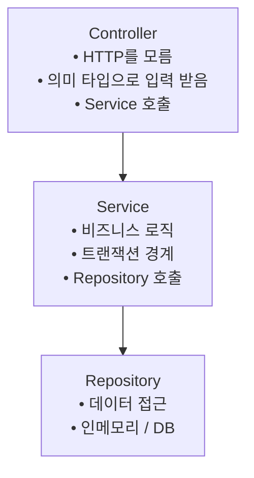

# CRUD 예제

기본적인 CRUD 구현 예제.

## 개요

ORM 없이 인메모리 저장소를 사용하는 User CRUD 예제입니다. Controller → Service → Repository 레이어 구조로 구성되어 있습니다.



## 프로젝트 구조

```
spine-user-demo/
├── main.go
├── model/
│   └── user.go
├── repository/
│   └── user_repository.go
├── service/
│   └── user_service.go
├── controller/
│   └── user_controller.go
└── dto/
    └── user_dto.go
```

## Model

```go
// model/user.go
package model

import "time"

type User struct {
    ID        int64     `json:"id"`
    Name      string    `json:"name"`
    Email     string    `json:"email"`
    CreatedAt time.Time `json:"created_at"`
    UpdatedAt time.Time `json:"updated_at"`
}
```

## Repository

```go
// repository/user_repository.go
package repository

import (
    "errors"
    "sync"
    "time"

    "spine-user-demo/model"
)

var (
    ErrUserNotFound      = errors.New("user not found")
    ErrEmailAlreadyExists = errors.New("email already exists")
)

type UserRepository struct {
    mu      sync.RWMutex
    users   map[int64]*model.User
    counter int64
}

func NewUserRepository() *UserRepository {
    return &UserRepository{
        users:   make(map[int64]*model.User),
        counter: 0,
    }
}

func (r *UserRepository) FindAll() []*model.User {
    r.mu.RLock()
    defer r.mu.RUnlock()

    result := make([]*model.User, 0, len(r.users))
    for _, user := range r.users {
        result = append(result, user)
    }
    return result
}

func (r *UserRepository) FindByID(id int64) (*model.User, error) {
    r.mu.RLock()
    defer r.mu.RUnlock()

    user, ok := r.users[id]
    if !ok {
        return nil, ErrUserNotFound
    }
    return user, nil
}

func (r *UserRepository) FindByEmail(email string) (*model.User, error) {
    r.mu.RLock()
    defer r.mu.RUnlock()

    for _, user := range r.users {
        if user.Email == email {
            return user, nil
        }
    }
    return nil, ErrUserNotFound
}

func (r *UserRepository) ExistsByEmail(email string) bool {
    _, err := r.FindByEmail(email)
    return err == nil
}

func (r *UserRepository) Save(user *model.User) *model.User {
    r.mu.Lock()
    defer r.mu.Unlock()

    now := time.Now()

    if user.ID == 0 {
        r.counter++
        user.ID = r.counter
        user.CreatedAt = now
    }
    user.UpdatedAt = now

    r.users[user.ID] = user
    return user
}

func (r *UserRepository) Delete(id int64) error {
    r.mu.Lock()
    defer r.mu.Unlock()

    if _, ok := r.users[id]; !ok {
        return ErrUserNotFound
    }

    delete(r.users, id)
    return nil
}

func (r *UserRepository) Count() int {
    r.mu.RLock()
    defer r.mu.RUnlock()
    return len(r.users)
}
```

## DTO

```go
// dto/user_dto.go
package dto

import (
    "time"

    "spine-user-demo/model"
)

// 요청 DTO

type CreateUserRequest struct {
    Name  string `json:"name"`
    Email string `json:"email"`
}

type UpdateUserRequest struct {
    Name  string `json:"name"`
    Email string `json:"email"`
}

// 응답 DTO

type UserResponse struct {
    ID        int64     `json:"id"`
    Name      string    `json:"name"`
    Email     string    `json:"email"`
    CreatedAt time.Time `json:"created_at"`
    UpdatedAt time.Time `json:"updated_at"`
}

type UserListResponse struct {
    Users []UserResponse `json:"users"`
    Total int            `json:"total"`
}

// 변환 함수

func ToUserResponse(user *model.User) UserResponse {
    return UserResponse{
        ID:        user.ID,
        Name:      user.Name,
        Email:     user.Email,
        CreatedAt: user.CreatedAt,
        UpdatedAt: user.UpdatedAt,
    }
}

func ToUserListResponse(users []*model.User) UserListResponse {
    responses := make([]UserResponse, len(users))
    for i, user := range users {
        responses[i] = ToUserResponse(user)
    }
    return UserListResponse{
        Users: responses,
        Total: len(responses),
    }
}
```

## Service

```go
// service/user_service.go
package service

import (
    "spine-user-demo/dto"
    "spine-user-demo/model"
    "spine-user-demo/repository"
)

type UserService struct {
    repo *repository.UserRepository
}

func NewUserService(repo *repository.UserRepository) *UserService {
    return &UserService{repo: repo}
}

func (s *UserService) GetAllUsers() dto.UserListResponse {
    users := s.repo.FindAll()
    return dto.ToUserListResponse(users)
}

func (s *UserService) GetUserByID(id int64) (*dto.UserResponse, error) {
    user, err := s.repo.FindByID(id)
    if err != nil {
        return nil, err
    }

    response := dto.ToUserResponse(user)
    return &response, nil
}

func (s *UserService) CreateUser(req dto.CreateUserRequest) (*dto.UserResponse, error) {
    // 이메일 중복 체크
    if s.repo.ExistsByEmail(req.Email) {
        return nil, repository.ErrEmailAlreadyExists
    }

    user := &model.User{
        Name:  req.Name,
        Email: req.Email,
    }

    saved := s.repo.Save(user)
    response := dto.ToUserResponse(saved)
    return &response, nil
}

func (s *UserService) UpdateUser(id int64, req dto.UpdateUserRequest) (*dto.UserResponse, error) {
    user, err := s.repo.FindByID(id)
    if err != nil {
        return nil, err
    }

    // 이메일 변경 시 중복 체크
    if req.Email != user.Email && s.repo.ExistsByEmail(req.Email) {
        return nil, repository.ErrEmailAlreadyExists
    }

    user.Name = req.Name
    user.Email = req.Email

    saved := s.repo.Save(user)
    response := dto.ToUserResponse(saved)
    return &response, nil
}

func (s *UserService) DeleteUser(id int64) error {
    return s.repo.Delete(id)
}
```

## Controller

```go
// controller/user_controller.go
package controller

import (
    "errors"

    "github.com/NARUBROWN/spine/pkg/httperr"
    "github.com/NARUBROWN/spine/pkg/path"

    "spine-user-demo/dto"
    "spine-user-demo/repository"
    "spine-user-demo/service"
)

type UserController struct {
    service *service.UserService
}

func NewUserController(service *service.UserService) *UserController {
    return &UserController{service: service}
}

// GET /users
func (c *UserController) List() dto.UserListResponse {
    return c.service.GetAllUsers()
}

// GET /users/:id
func (c *UserController) GetByID(id path.Int) (dto.UserResponse, error) {
    if id.Value <= 0 {
        return dto.UserResponse{}, httperr.BadRequest("유효하지 않은 사용자 ID입니다")
    }

    user, err := c.service.GetUserByID(id.Value)
    if err != nil {
        return dto.UserResponse{}, toHTTPError(err)
    }

    return *user, nil
}

// POST /users
func (c *UserController) Create(req dto.CreateUserRequest) (dto.UserResponse, error) {
    if req.Name == "" {
        return dto.UserResponse{}, httperr.BadRequest("이름은 필수입니다")
    }
    if req.Email == "" {
        return dto.UserResponse{}, httperr.BadRequest("이메일은 필수입니다")
    }

    user, err := c.service.CreateUser(req)
    if err != nil {
        return dto.UserResponse{}, toHTTPError(err)
    }

    return *user, nil
}

// PUT /users/:id
func (c *UserController) Update(id path.Int, req dto.UpdateUserRequest) (dto.UserResponse, error) {
    if id.Value <= 0 {
        return dto.UserResponse{}, httperr.BadRequest("유효하지 않은 사용자 ID입니다")
    }
    if req.Name == "" {
        return dto.UserResponse{}, httperr.BadRequest("이름은 필수입니다")
    }
    if req.Email == "" {
        return dto.UserResponse{}, httperr.BadRequest("이메일은 필수입니다")
    }

    user, err := c.service.UpdateUser(id.Value, req)
    if err != nil {
        return dto.UserResponse{}, toHTTPError(err)
    }

    return *user, nil
}

// DELETE /users/:id
func (c *UserController) Delete(id path.Int) error {
    if id.Value <= 0 {
        return httperr.BadRequest("유효하지 않은 사용자 ID입니다")
    }

    err := c.service.DeleteUser(id.Value)
    if err != nil {
        return toHTTPError(err)
    }

    return nil
}

// Repository 에러를 HTTP 에러로 변환
func toHTTPError(err error) error {
    switch {
    case errors.Is(err, repository.ErrUserNotFound):
        return httperr.NotFound("사용자를 찾을 수 없습니다")
    case errors.Is(err, repository.ErrEmailAlreadyExists):
        return httperr.BadRequest("이미 사용 중인 이메일입니다")
    default:
        return httperr.BadRequest(err.Error())
    }
}
```

## Main

```go
// main.go
package main

import (
    "log"

    "github.com/NARUBROWN/spine"
    "github.com/NARUBROWN/spine/interceptor/cors"
    "github.com/NARUBROWN/spine/pkg/boot"

    "spine-user-demo/controller"
    "spine-user-demo/repository"
    "spine-user-demo/service"
)

func main() {
    app := spine.New()

    // 생성자 등록
    app.Constructor(
        repository.NewUserRepository,
        service.NewUserService,
        controller.NewUserController,
    )

    // 라우트 등록
    app.Route("GET", "/users", (*controller.UserController).List)
    app.Route("GET", "/users/:id", (*controller.UserController).GetByID)
    app.Route("POST", "/users", (*controller.UserController).Create)
    app.Route("PUT", "/users/:id", (*controller.UserController).Update)
    app.Route("DELETE", "/users/:id", (*controller.UserController).Delete)

    // Interceptor 등록
    app.Interceptor(
        cors.New(cors.Config{
            AllowOrigins: []string{"*"},
            AllowMethods: []string{"GET", "POST", "PUT", "DELETE", "OPTIONS"},
            AllowHeaders: []string{"Content-Type"},
        }),
    )

    // 앱 시작
    app.Run(boot.Options{
		Address:                ":8080",
		EnableGracefulShutdown: true,
		ShutdownTimeout:        10 * time.Second,
	}); 
}
```

## API 테스트

### 사용자 생성

```bash
curl -X POST http://localhost:8080/users \
  -H "Content-Type: application/json" \
  -d '{"name": "홍길동", "email": "hong@example.com"}'
```

```json
{
  "id": 1,
  "name": "홍길동",
  "email": "hong@example.com",
  "created_at": "2025-01-19T10:00:00Z",
  "updated_at": "2025-01-19T10:00:00Z"
}
```

### 사용자 목록 조회

```bash
curl http://localhost:8080/users
```

```json
{
  "users": [
    {
      "id": 1,
      "name": "홍길동",
      "email": "hong@example.com",
      "created_at": "2025-01-19T10:00:00Z",
      "updated_at": "2025-01-19T10:00:00Z"
    }
  ],
  "total": 1
}
```

### 사용자 조회

```bash
curl http://localhost:8080/users/1
```

```json
{
  "id": 1,
  "name": "홍길동",
  "email": "hong@example.com",
  "created_at": "2025-01-19T10:00:00Z",
  "updated_at": "2025-01-19T10:00:00Z"
}
```

### 사용자 수정

```bash
curl -X PUT http://localhost:8080/users/1 \
  -H "Content-Type: application/json" \
  -d '{"name": "홍길동(수정)", "email": "hong2@example.com"}'
```

```json
{
  "id": 1,
  "name": "홍길동(수정)",
  "email": "hong2@example.com",
  "created_at": "2025-01-19T10:00:00Z",
  "updated_at": "2025-01-19T10:05:00Z"
}
```

### 사용자 삭제

```bash
curl -X DELETE http://localhost:8080/users/1
```

### 에러 응답

```bash
# 존재하지 않는 사용자
curl http://localhost:8080/users/999
```

```json
{
  "message": "사용자를 찾을 수 없습니다"
}
```

```bash
# 중복 이메일
curl -X POST http://localhost:8080/users \
  -H "Content-Type: application/json" \
  -d '{"name": "김철수", "email": "hong@example.com"}'
```

```json
{
  "message": "이미 사용 중인 이메일입니다"
}
```

## 핵심 포인트

### Controller는 HTTP를 모른다

```go
// ✓ 의미 타입으로 입력 받음
func (c *UserController) GetByID(id path.Int) (dto.UserResponse, error)

// ✓ httperr로 의미만 표현
return dto.UserResponse{}, httperr.NotFound("사용자를 찾을 수 없습니다")
```

### 의존성 주입

```go
// 생성자 등록만으로 의존성 자동 해결
app.Constructor(
    repository.NewUserRepository,  // 의존성 없음
    service.NewUserService,        // Repository 의존
    controller.NewUserController,  // Service 의존
)
```

### 레이어 분리

| 레이어 | 책임 | 의존 |
|-------|------|------|
| Controller | 입력 검증, 에러 변환 | Service |
| Service | 비즈니스 로직 | Repository |
| Repository | 데이터 접근 | 없음 |