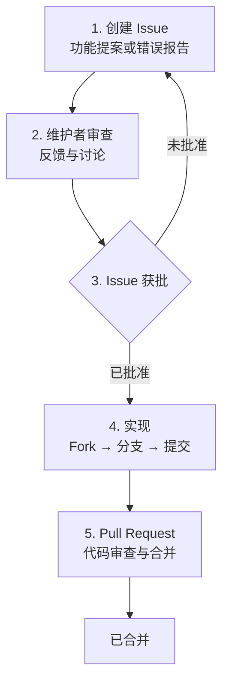

# 贡献指南

如何为 Spine 做出贡献。

## 贡献流程

如果你想为 Spine 贡献功能或改进，请遵循以下步骤。



## 1. 创建 Issue

开始实现前，请先**创建 Issue**。

在 [Spine GitHub Issues](https://github.com/NARUBROWN/spine/issues) 新建 Issue，并包含以下内容：

**功能提案**

- 所提功能的说明
- 需要此功能的原因
- 预期使用示例

**错误报告**

- 重现问题的方法
- 预期行为与实际行为
- 环境信息（Go 版本、操作系统等）

## 2. 维护者审查

Issue 创建后，维护者会进行审查并留下评论。在此阶段可能会讨论设计方向与实现范围。

## 3. Issue 获批

维护者批准 Issue 后即可开始实现。未获批准就创建的 PR 可能不会被合并，请先确认批准状态。

## 4. Pull Request

在 GitHub 创建 Pull Request，并在 PR 描述中注明关联 Issue 编号。

```
Closes #123
```

## 有疑问？

实现过程中如有疑问，请在对应的 Issue 中留言。
