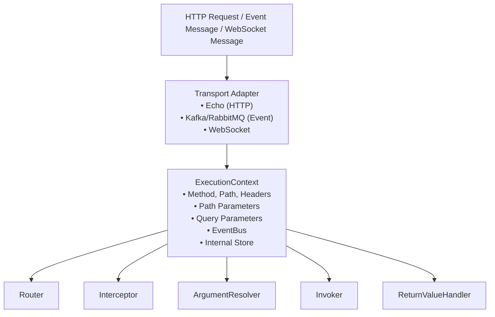
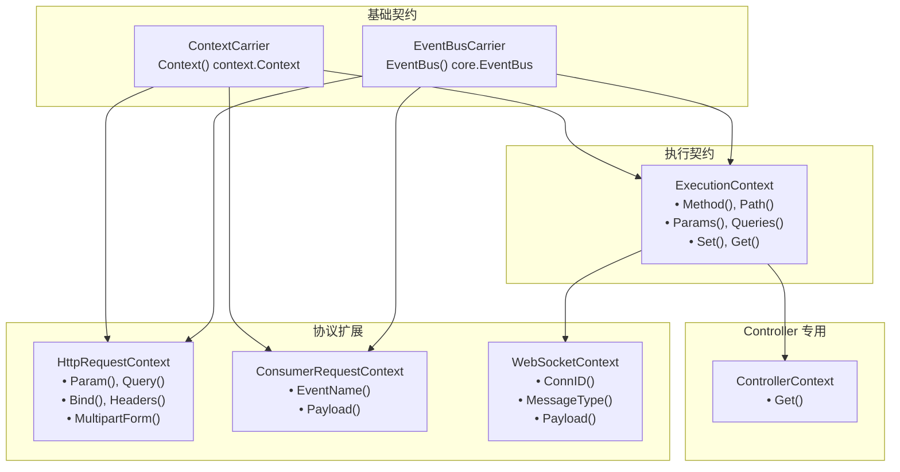

# 执行上下文

Spine 请求的本质。

## 大纲

`ExecutionContext` 是跨 Spine 管道共享的请求范围上下文。当 HTTP 请求到达时，传输适配器会创建 `ExecutionContext`，这是一个经过管道所有阶段并携带请求信息和执行状态的上下文。



## 上下文层次结构

Spine 将 Context **分层** 分开。它旨在使用相同的管道模型处理 HTTP、Event Consumer 和 WebSocket。



### 为什么要分开？

|等级 |负责 |在哪里使用 |
|------|------|----------|
| `ContextCarrier` | `ContextCarrier` Go 标准上下文传递 |无处不在 |
| `EventBusCarrier` | `EventBusCarrier`发出域事件 (`core.EventBus`) |控制器，消费者|
| `ExecutionContext` | `ExecutionContext`执行流程控制|路由器、管道、拦截器|
| `ControllerContext` | `ControllerContext` ExecutionContext 的只读外观 |控制器（参见拦截器注入值）|
| `HttpRequestContext` | `HttpRequestContext` HTTP 输入解析 | HTTP 参数解析器 |
| `ConsumerRequestContext` | `ConsumerRequestContext`事件输入解释 |消费者争论解析器 |
| `WebSocketContext` | `WebSocketContext` WebSocket 输入解释 | WebSocket 参数解析器 |

**目标**：HTTP、事件使用者和 WebSocket 共享相同的管道模型，从而能够根据每个协议的特性进行输入解释。

## 基于接口

### 上下文载体

带有 Go 标准 `context.Context` 的最小合约。

```go
// 核心/context.go
type ContextCarrier interface {
    Context() context.Context
}
```

### EventBusCarrier

用于发布领域事件的 EventBus 访问合约。返回类型为 `core.EventBus`。

```go
// 核心/context.go
type EventBusCarrier interface {
    EventBus() EventBus
}
```

`core.EventBus` 是一个最小的合约，用于收集域事件并在执行后立即发出所有事件。

```go
// 核心/event_bus.go
type EventBus interface {
    Publish(events ...publish.DomainEvent)
    Drain() []publish.DomainEvent
}
```

> **注意**：`internal/event/publish.EventBus` 是 `core.EventBus` 的类型别名 (`type EventBus = core.EventBus`)，其内部实现配置为满足此类型。

## ExecutionContext 接口

用于控制整个管道中使用的执行流程的接口。

```go
// 核心/context.go
type ExecutionContext interface {
    ContextCarrier
    EventBusCarrier

    // HTTP请求信息（Consumer/WebSocket含义不同）
    Method() string                    // HTTP: GET, POST... / Consumer: "EVENT" / WS: "WS"
    Path() string                      // HTTP: /users/123 / Consumer: EventName / WS: path
    Header(name string) string         // HTTP 标头 (Consumer, WS  )
    
    // 参数访问
    Params() map[string]string         // Path parameters
    PathKeys() []string                // Path key 顺序
    Queries() map[string][]string      // Query parameters
    
    // 内部存储
    Set(key string, value any)         // 保存值
    Get(key string) (any, bool)        // 读取值
}
```

### 方法细节

#### 语境（）

返回 Go 标准 `context.Context`。用于请求取消、超时和值传递。

```go
func (e *echoContext) Context() context.Context {
    return e.reqCtx  // HTTP 请求上下文
}
```

#### EventBus()

返回请求范围的EventBus。当控制器发出域事件时使用。

```go
func (c *echoContext) EventBus() publish.EventBus {
    return c.eventBus
}
```

#### 方法() / 路径()

返回 HTTP 请求的方法和路径。 Consumer 和 WebSocket 有不同的含义。

```go
// HTTP协议
ctx.Method()  // "GET"
ctx.Path()    // "/users/123/posts/456"

// 消费者
ctx.Method()  // "EVENT"
ctx.Path()    // "order.created" (EventName)

// WebSockets
ctx.Method()  // "WS"
ctx.Path()    // WebSocket
```

#### 参数（）/路径键（）

提供路径参数信息。

```go
// 路线：/users/:userId/posts/:postId
// 请求：/user/123/posts/456

ctx.Params()    // {"userId": "123", "postId": "456"}
ctx.PathKeys()  // ["userId", "postId"]
```

`PathKeys()` 保证参数的**声明顺序**。对于 Spine 基于顺序的绑定至关重要。

#### 查询()

以多值格式返回查询参数。

```go
// 请求：/users?status=active&tag=go&tag=web

ctx.Queries()  // {"status": ["active"], "tag": ["go", "web"]}
```

#### 设置（）/获取（）

用于在管道内共享值的存储库。

```go
// 在路由器中保存路径参数
ctx.Set("spine.params", params)
ctx.Set("spine.pathKeys", keys)

// 从适配器保存 ResponseWriter
ctx.Set("spine.response_writer", NewEchoResponseWriter(c))

// 在拦截器中查找
rw, ok := ctx.Get("spine.response_writer")
```

## ControllerContext接口

这是控制器专用的上下文视图。这是`ExecutionContext`的只读门面，是控制器引用从拦截器注入的值的官方通道。

```go
// 核心/context.go
type ControllerContext interface {
    Get(key string) (any, bool)
}
```

### 执行

```go
// 内部/运行时/controller_ctx.go
type controllerCtxView struct {
    ec core.ExecutionContext
}

func NewControllerContext(ec core.ExecutionContext) core.ControllerContext {
    return controllerCtxView{ec: ec}
}

func (v controllerCtxView) Get(key string) (any, bool) {
    return v.ec.Get(key)
}
```

### 用法示例

```go
// 引用Controller中Interceptor注入的值
func (c *UserController) GetUser(ctx context.Context, cc core.ControllerContext, userId path.Int) User {
    authInfo, _ := cc.Get("auth.user")
    // ...
}
```

> **注意**：`pkg/spine/types.go` 定义了 `Ctx` 接口 (`Get(key string) (any, bool)`)，因此也可以从用户代码中以 `spine.Ctx` 的形式进行访问。

## HttpRequestContext 接口

这是一个仅限 HTTP 的扩展接口。由 HTTP ArgumentResolver 使用。

```go
// 核心/context.go
type HttpRequestContext interface {
    ContextCarrier
    EventBusCarrier

    // 单独的参数访问
    Param(name string) string          // 指定路径参数
    Query(name string) string          // 指定查询参数（第一个值）
    Header(name string) string         //  标头
    
    // 全视图访问
    Params() map[string]string         // 所有路径参数
    Queries() map[string][]string      // 所有查询参数
    Headers() map[string][]string      // 所有标头
    
    // 身体绑定
    Bind(out any) error                // JSON body → struct
    
    // 多部分
    MultipartForm() (*multipart.Form, error)
}
```

> **注意**：`HttpRequestContext` 不包括 `RequestContext`。直接嵌入 `ContextCarrier` 和 `EventBusCarrier` 。此外，还添加了 `Headers() map[string][]string` 方法以允许访问整个标头映射。

### 方法细节

#### 参数（）/查询（）

方便地访问各个参数。

```go
// 路线：/users/:id?page=1&size=20

ctx.Param("id")      // "123"
ctx.Query("page")    // "1"
ctx.Query("size")    // "20"
ctx.Query("missing") // "" (不存在时为空字符串)
```

#### 绑定()

将 HTTP 正文绑定到结构。

```go
// 内部/解析器/dto_resolver.go
func (r *DTOResolver) Resolve(ctx core.ExecutionContext, parameterMeta ParameterMeta) (any, error) {
    httpCtx, ok := ctx.(core.HttpRequestContext)
    if !ok {
        return nil, fmt.Errorf("不是 HTTP 请求上下文")
    }

    valuePtr := reflect.New(parameterMeta.Type)

    if err := httpCtx.Bind(valuePtr.Interface()); err != nil {
        return nil, fmt.Errorf("DTO 绑定失败 (%s): %w", parameterMeta.Type.Name(), err)
    }

    return valuePtr.Elem().Interface(), nil
}
```

#### MultipartForm()

访问多部分表单数据。用于文件上传处理。

```go
// 内部/解析器/uploaded_files_resolver.go
func (r *UploadedFilesResolver) Resolve(ctx core.ExecutionContext, parameterMeta ParameterMeta) (any, error) {
    httpCtx, ok := ctx.(core.HttpRequestContext)
    if !ok {
        return nil, fmt.Errorf("不是 HTTP 请求上下文")
    }

    form, err := httpCtx.MultipartForm()
    if err != nil {
        return nil, err
    }
    // ...
}
```

## ConsumerRequestContext接口

这是专用于事件消费者的扩展接口。

```go
// 核心/context.go
type ConsumerRequestContext interface {
    ContextCarrier
    EventBusCarrier

    EventName() string    // 事件名称 (: "order.created")
    Payload() []byte      // 事件负载 (JSON )
}
```

### 方法细节

#### 事件名称()

返回收到的事件的名称。

```go
ctx.EventName()  // "order.created"
```

#### 有效负载()

返回事件的原始负载。

```go
payload := ctx.Payload()  // []byte (JSON)
```

### 消费者解析器示例

```go
// 内部/事件/消费者/解析器/dto_resolver.go
func (r *DTOResolver) Resolve(ctx core.ExecutionContext, meta resolver.ParameterMeta) (any, error) {
    consumerCtx, ok := ctx.(core.ConsumerRequestContext)
    if !ok {
        return nil, fmt.Errorf("不是 ConsumerRequestContext")
    }

    payload := consumerCtx.Payload()
    if payload == nil {
        return nil, fmt.Errorf("Payload 为空，无法创建 DTO")
    }

    dtoPtr := reflect.New(meta.Type)
    if err := json.Unmarshal(payload, dtoPtr.Interface()); err != nil {
        return nil, fmt.Errorf("DTO 反序列化失败: %w", err)
    }

    return dtoPtr.Elem().Interface(), nil
}
```

## WebSocketContext 接口

特定于 WebSocket 的 ExecutionContext 扩展。通过嵌入 `ExecutionContext` 保持管道兼容性。

```go
// 核心/context.go
type WebSocketContext interface {
    ExecutionContext

    ConnID() string       // 连接 ID
    MessageType() int     // 消息类型 (Text, Binary )
    Payload() []byte      // 消息负载
}
```

### WebSocket 解析器示例

```go
// 内部/ws/resolver/dto_resolver.go
func (r *DTOResolver) Resolve(ctx core.ExecutionContext, meta resolver.ParameterMeta) (any, error) {
    wsCtx, ok := ctx.(core.WebSocketContext)
    if !ok {
        return nil, fmt.Errorf("不是 WebSocketContext")
    }

    payload := wsCtx.Payload()
    if payload == nil {
        return nil, fmt.Errorf("Payload 为空，无法创建 DTO")
    }

    dtoPtr := reflect.New(meta.Type)
    if err := json.Unmarshal(payload, dtoPtr.Interface()); err != nil {
        return nil, fmt.Errorf("DTO  失败: %w", err)
    }

    return dtoPtr.Elem().Interface(), nil
}
```

## Echo 适配器实现

Spine 使用 Echo 作为其 HTTP 传输层。 `echoContext` 实现 `ExecutionContext` 和 `HttpRequestContext`。

```go
// 内部/适配器/echo/context_impl.go
type echoContext struct {
    echo     echo.Context           // Echo 原始上下文
    reqCtx   context.Context        // 请求作用域上下文
    store    map[string]any         // 内部存储
    eventBus publish.EventBus       // 事件总线
}

func NewContext(c echo.Context) core.ExecutionContext {
    return &echoContext{
        echo:     c,
        reqCtx:   c.Request().Context(),
        store:    make(map[string]any),
        eventBus: publish.NewEventBus(),
    }
}
```

### 主要实现

#### 路径参数

首先使用路由器的匹配结果，如果没有，则使用Echo值。

```go
func (e *echoContext) Param(name string) string {
    // Spine Router存储的值优先
    if raw, ok := e.store["spine.params"]; ok {
        if m, ok := raw.(map[string]string); ok {
            if v, ok := m[name]; ok {
                return v
            }
        }
    }
    // 回退到 Echo
    return e.echo.Param(name)
}
```

#### Params() - 防御性复制

返回副本以防止对原始地图进行外部更改。使用 `maps.Copy`。

```go
func (e *echoContext) Params() map[string]string {
    if raw, ok := e.store["spine.params"]; ok {
        if m, ok := raw.(map[string]string); ok {
            // 返回浅拷贝以避免突变
            copyMap := make(map[string]string, len(m))
            maps.Copy(copyMap, m)
            return copyMap
        }
    }
    // 直接从 Echo 配置
    names := e.echo.ParamNames()
    values := e.echo.ParamValues()
    params := make(map[string]string, len(names))
    for i, name := range names {
        if i < len(values) {
            params[name] = values[i]
        }
    }
    return params
}
```

#### 标题()

以映射形式返回所有 HTTP 标头。

```go
func (e *echoContext) Headers() map[string][]string {
    return e.echo.Request().Header
}
```

#### 事件总线

返回请求范围的EventBus。

```go
func (c *echoContext) EventBus() publish.EventBus {
    return c.eventBus
}
```

## 消费者适配器实现

事件消费者的上下文实现。

```go
// 内部/事件/消费者/request_context_impl.go
type ConsumerRequestContextImpl struct {
    ctx      context.Context
    msg      *Message
    eventBus publish.EventBus
    store    map[string]any
}

func NewRequestContext(
    ctx context.Context,
    msg *Message,
    eventBus publish.EventBus,
) core.ExecutionContext {
    return &ConsumerRequestContextImpl{
        ctx:      ctx,
        msg:      msg,
        eventBus: eventBus,
        store:    make(map[string]any),
    }
}
```

### Consumer Context 的特殊行为

Consumer 不是 HTTP，因此某些方法的行为有所不同。

```go
func (c *ConsumerRequestContextImpl) Method() string {
    // Consumer执行没有HTTP Method的概念，用“EVENT”来区分路由。
    return "EVENT"
}

func (c *ConsumerRequestContextImpl) Path() string {
    // 在消费者路由中，Path 按原样使用 EventName。
    return c.msg.EventName
}

func (c *ConsumerRequestContextImpl) Header(key string) string {
    // Consumer没有HTTP Header的概念
    return ""
}

func (c *ConsumerRequestContextImpl) Params() map[string]string {
    // Consumer没有Path Parameter的概念
    return map[string]string{}
}

func (c *ConsumerRequestContextImpl) PathKeys() []string {
    // 消费者没有 Path Key 的概念
    return []string{}
}

func (c *ConsumerRequestContextImpl) Queries() map[string][]string {
    // 消费者没有查询参数的概念
    return map[string][]string{}
}
```

## WebSocket 适配器实现

WebSocket 的上下文实现。实现 `core.WebSocketContext`。

```go
// 内部/ws/context_impl.go
type WSExecutionContext struct {
    ctx         context.Context
    connID      string
    path        string
    messageType int
    payload     []byte
    eventBus    publish.EventBus
    store       map[string]any
}

func NewWSExecutionContext(
    ctx context.Context,
    connID string,
    path string,
    messageType int,
    payload []byte,
    eventBus publish.EventBus,
    sendFn func(int, []byte) error,
) core.WebSocketContext {
    ctx = context.WithValue(ctx, pkgws.SenderKey, &connSender{send: sendFn})

    return &WSExecutionContext{
        ctx:         ctx,
        connID:      connID,
        path:        path,
        messageType: messageType,
        payload:     payload,
        eventBus:    eventBus,
        store:       make(map[string]any),
    }
}
```

### WebSocket Context 的特殊行为

```go
func (w *WSExecutionContext) Method() string {
    return "WS"
}

func (w *WSExecutionContext) ConnID() string {
    return w.connID
}

func (w *WSExecutionContext) MessageType() int {
    return w.messageType
}

func (w *WSExecutionContext) Payload() []byte {
    return w.payload
}

func (w *WSExecutionContext) EventBus() core.EventBus {
    return w.eventBus
}
```

## ArgumentResolver 和上下文

ArgumentResolver 接收 `ExecutionContext` ，并在必要时使用每个协议的上下文断言类型。

```go
// 内部/解析器/argument.go
type ArgumentResolver interface {
    Supports(parameterMeta ParameterMeta) bool
    Resolve(ctx core.ExecutionContext, parameterMeta ParameterMeta) (any, error)
}
```

### HTTP 解析器示例

```go
// 内部/解析器/path_int_resolver.go
func (r *PathIntResolver) Resolve(ctx core.ExecutionContext, parameterMeta ParameterMeta) (any, error) {
    // 使用 HttpRequestContext 进行类型断言
    httpCtx, ok := ctx.(core.HttpRequestContext)
    if !ok {
        return nil, fmt.Errorf("不是 HTTP 请求上下文")
    }

    raw, ok := httpCtx.Params()[parameterMeta.PathKey]
    if !ok {
        return nil, fmt.Errorf("找不到路径参数. %s", parameterMeta.PathKey)
    }

    value, err := strconv.ParseInt(raw, 10, 64)
    if err != nil {
        return nil, err
    }

    return path.Int{Value: value}, nil
}
```

### 消费者解析器示例

```go
// 内部/事件/消费者/解析器/event_name_resolver.go
func (r *EventNameResolver) Resolve(ctx core.ExecutionContext, meta resolver.ParameterMeta) (any, error) {
    // 使用 ConsumerRequestContext 进行类型断言
    consumerCtx, ok := ctx.(core.ConsumerRequestContext)
    if !ok {
        return nil, fmt.Errorf("不是 ConsumerRequestContext")
    }

    name := consumerCtx.EventName()
    if name == "" {
        return nil, fmt.Errorf("无法从 RequestContext 找到 EventName")
    }

    return name, nil
}
```

### WebSocket 解析器示例

```go
// 内部/ws/resolver/dto_resolver.go
func (r *DTOResolver) Resolve(ctx core.ExecutionContext, meta resolver.ParameterMeta) (any, error) {
    wsCtx, ok := ctx.(core.WebSocketContext)
    if !ok {
        return nil, fmt.Errorf("不是 WebSocketContext")
    }

    payload := wsCtx.Payload()
    if payload == nil {
        return nil, fmt.Errorf("Payload 为空，无法创建 DTO")
    }

    dtoPtr := reflect.New(meta.Type)
    if err := json.Unmarshal(payload, dtoPtr.Interface()); err != nil {
        return nil, fmt.Errorf("DTO  失败: %w", err)
    }

    return dtoPtr.Elem().Interface(), nil
}
```

### 常见解析器示例

`StdContextResolver` 在 HTTP、Consumer 和 WebSocket 上运行。

```go
// 内部/解析器/std_context_resolver.go
func (r *StdContextResolver) Resolve(ctx core.ExecutionContext, parameterMeta ParameterMeta) (any, error) {
    baseCtx := ctx.Context()
    bus := ctx.EventBus()
    if bus != nil {
        return context.WithValue(baseCtx, publish.PublisherKey, bus), nil
    }
    return baseCtx, nil
}
```

### ControllerContextResolver

`ControllerContextResolver` 将 `ExecutionContext` 包装为只读 `ControllerContext`。

```go
// 内部/解析器/controller_context_resolver.go
func (r *ControllerContextResolver) Resolve(ctx core.ExecutionContext, _ ParameterMeta) (any, error) {
    return runtime.NewControllerContext(ctx), nil
}
```

## 在管道中使用

### 路由器

```go
// 内部/路由器/router.go
func (r *DefaultRouter) Route(ctx core.ExecutionContext) (core.HandlerMeta, error) {
    for _, route := range r.routes {
        if route.Method != ctx.Method() {
            continue
        }
        
        ok, params, keys := matchPath(route.Path, ctx.Path())
        if !ok {
            continue
        }
        
        // 在上下文中保存匹配的信息
        ctx.Set("spine.params", params)
        ctx.Set("spine.pathKeys", keys)
        
        return route.Meta, nil
    }
    return core.HandlerMeta{}, httperr.NotFound("找不到处理器.")
}
```

### Pipeline - 执行流程

```go
// 内部/管道/pipeline.go
func (p *Pipeline) Execute(ctx core.ExecutionContext) (finalErr error) {
    // 1.全局拦截器PreHandle（路由前）
    // 2. Router确定执行目标
    // 3. 路由拦截器PreHandle
    // 4.ArgumentResolver链执行
    // 5. 调用控制器方法（Invoker）
    // 6.ReturnValueHandler处理
    // 7.PostExecutionHook（事件发布等）
    // 8. 路由拦截器PostHandle（逆序）
    // 9.全局拦截器PostHandle（逆序）
    // 10. AfterCompletion（成功/失败无关，倒序）
}
```

### 管道 - 调用 ArgumentResolver

```go
// 内部/管道/pipeline.go
func (p *Pipeline) resolveArguments(ctx core.ExecutionContext, paramMetas []resolver.ParameterMeta) ([]any, error) {
    args := make([]any, 0, len(paramMetas))

    for _, paramMeta := range paramMetas {
        resolved := false

        for _, r := range p.argumentResolvers {
            if !r.Supports(paramMeta) {
                continue
            }

            // 直接传递ExecutionContext
            // 使用解析器内所需的类型进行断言
            val, err := r.Resolve(ctx, paramMeta)
            if err != nil {
                return nil, err
            }

            args = append(args, val)
            resolved = true
            break
        }

        if !resolved {
            return nil, fmt.Errorf(
                "ArgumentResolver 缺少参数. %d (%s)",
                paramMeta.Index,
                paramMeta.Type.String(),
            )
        }
    }
    return args, nil
}
```

### 拦截器

```go
// 拦截器/cors/cors.go
func (i *CORSInterceptor) PreHandle(ctx core.ExecutionContext, meta core.HandlerMeta) error {
    // 获取ResponseWriter
    rwAny, ok := ctx.Get("spine.response_writer")
    if !ok {
        return nil
    }
    rw := rwAny.(core.ResponseWriter)
    
    // 确认所请求的信息
    origin := ctx.Header("Origin")
    if origin != "" && i.isAllowedOrigin(origin) {
        rw.SetHeader("Access-Control-Allow-Origin", origin)
    }
    
    // 预检处理
    if ctx.Method() == "OPTIONS" {
        rw.WriteStatus(204)
        return core.ErrAbortPipeline
    }
    
    return nil
}
```

## 内部存储约定

对于用作 `Set()`/`Get()` 的键有明确的约定。

### 脊柱储备钥匙

|关键|类型 |设置位置 |使用|
|----|------|----------|------|
| `spine.params` | `spine.params` `map[string]string` | `map[string]string`路由器|路径参数值|
| `spine.pathKeys` | `spine.pathKeys` `[]string` | `[]string`路由器|路径键顺序|
| `spine.response_writer` | `spine.response_writer` `core.ResponseWriter` | `core.ResponseWriter`适配器|响应输出|

### 用法示例

```go
// 在 ReturnValueHandler 中使用 ResponseWriter
func (h *JSONReturnHandler) Handle(value any, ctx core.ExecutionContext) error {
    rwAny, ok := ctx.Get("spine.response_writer")
    if !ok {
        return fmt.Errorf("ExecutionContext  找不到 ResponseWriter.")
    }
    
    rw, ok := rwAny.(core.ResponseWriter)
    if !ok {
        return fmt.Errorf("ResponseWriter 类型不正确.")
    }
    
    return rw.WriteJSON(200, value)
}
```

## EventBus 集成

`core.EventBus` 合并到 `ExecutionContext` 中。

### 事件由控制器发出

```go
// cmd/demo/controller.go
func (c *UserController) CreateOrder(ctx context.Context, orderId path.Int) string {
    // 通过从 context.Context 中提取 EventBus 来发出事件
    publish.Event(ctx, OrderCreated{
        OrderID: orderId.Value,
        At:      time.Now(),
    })

    return "OK"
}
```

### EventBus注入流程

```go
// 内部/解析器/std_context_resolver.go
func (r *StdContextResolver) Resolve(ctx core.ExecutionContext, parameterMeta ParameterMeta) (any, error) {
    baseCtx := ctx.Context()
    bus := ctx.EventBus()
    if bus != nil {
        // 将 EventBus 注入 context.Context
        return context.WithValue(baseCtx, publish.PublisherKey, bus), nil
    }
    return baseCtx, nil
}
```

### 从 PostExecutionHook 发出事件

管道执行完成后，立即发出收集到的事件。

```go
// 内部/事件/钩子/post_execution.go
func (h *EventDispatchHook) AfterExecution(ctx core.ExecutionContext, results []any, err error) {
    if err != nil {
        return
    }

    events := ctx.EventBus().Drain()
    if len(events) == 0 {
        return
    }

    h.Dispatcher.Dispatch(ctx.Context(), events)
}
```

## 设计原则

### 1. 控制器不知道 ExecutionContext

控制器不直接接收 `ExecutionContext` 或 `HttpRequestContext`。相反，它只接受作为语义类型的值（`path.Int`、`query.Values` 等）、`context.Context`，以及（如果需要）`ControllerContext`。

```go
// ❌ 反模式
func (c *UserController) GetUser(ctx core.ExecutionContext) User

// ✓ 脊椎法
func (c *UserController) GetUser(ctx context.Context, userId path.Int) User

// ✓ 当需要Interceptor注入值时
func (c *UserController) GetUser(ctx context.Context, cc core.ControllerContext, userId path.Int) User
```

### 2.Resolver接收ExecutionContext并断言所需的类型

ArgumentResolver 采用 `ExecutionContext`。如果您需要特定于协议的功能，请键入assert `HttpRequestContext`、`ConsumerRequestContext` 或`WebSocketContext`。

```go
func (r *PathIntResolver) Resolve(ctx core.ExecutionContext, parameterMeta ParameterMeta) (any, error) {
    httpCtx, ok := ctx.(core.HttpRequestContext)
    if !ok {
        return nil, fmt.Errorf("不是 HTTP 请求上下文")
    }
    // ...
}
```

### 3.单管道，多协议

HTTP、Event Consumer 和 WebSocket 共享相同的管道结构。上下文层分离最大化代码重用，同时支持每个协议的特性。

```go
// HTTP管道
httpPipeline.AddArgumentResolver(
    &resolver.StdContextResolver{},           // 通用
    &resolver.ControllerContextResolver{},    // 通用
    &resolver.HeaderResolver{},               // 仅 HTTP
    &resolver.PathIntResolver{},              // 仅 HTTP
    &resolver.PathStringResolver{},           // 仅 HTTP
    &resolver.PathBooleanResolver{},          // 仅 HTTP
    &resolver.PaginationResolver{},           // 仅 HTTP
    &resolver.QueryValuesResolver{},          // 仅 HTTP
    &resolver.DTOResolver{},                  // 仅 HTTP
    &resolver.FormDTOResolver{},              // 仅 HTTP
    &resolver.UploadedFilesResolver{},        // 仅 HTTP
)

// 消费管道
consumerPipeline.AddArgumentResolver(
    &resolver.StdContextResolver{},           // 通用
    &eventResolver.EventNameResolver{},       // 仅 Consumer
    &eventResolver.DTOResolver{},             // 仅 Consumer
)

// WebSocket 管道
wsPipeline.AddArgumentResolver(
    &resolver.StdContextResolver{},           // 通用
    &wsResolver.ConnectionIDResolver{},       // 仅 WebSocket
    &wsResolver.DTOResolver{},                // 仅 WebSocket
)
```

## 概括

|接口|角色 |主要方法|在哪里使用 |
|------------|------|----------------|----------|
| `ContextCarrier` | `ContextCarrier`传递 Go 上下文 | `Context()` | `Context()`无处不在 |
| `EventBusCarrier` | `EventBusCarrier`问题事件 (`core.EventBus`) | `EventBus()` | `EventBus()`控制器，消费者|
| `ExecutionContext` | `ExecutionContext`执行流程控制| `Method()`、`Path()`、`Header()`、`Set()`、`Get()` |路由器、管道、拦截器|
| `ControllerContext` | `ControllerContext` ExecutionContext 只读`Get()` | `Get()`控制器|
| `HttpRequestContext` | `HttpRequestContext` HTTP 输入解析 | `Param()`、`Query()`、`Header()`、`Headers()`、`Bind()`、`MultipartForm()` | HTTP 参数解析器 |
| `ConsumerRequestContext` | `ConsumerRequestContext`事件输入解释 | `EventName()`、`Payload()` |消费者争论解析器 |
| `WebSocketContext` | `WebSocketContext` WebSocket 输入解释 | `ConnID()`、`MessageType()`、`Payload()` | WebSocket 参数解析器 |

**核心原理**：上下文层分离确保HTTP、Event Consumer和WebSocket共享相同的管道模型。 Controller不了解执行模型，只关注业务逻辑。
