# 执行管道

了解 Spine 的请求生命周期。

## 大纲

Spine 的核心理念是**执行流程的明确性**。虽然大多数 Web 框架在内部隐藏请求处理，但 Spine 将所有步骤锚定到代码结构中并清楚地公开它们。

所有 HTTP 请求**必须**按顺序通过以下管道：

```mermaid
graph TD
    Request["HTTP Request"]

    ExecutionContext["ExecutionContext<br>(创建请求上下文)"]
    GlobalPre["Global Interceptor.PreHandle<br>(路由前预处理)"]
    Router["Router<br>(选择 HandlerMeta)"]
    ParamMeta["ParameterMeta Builder<br>(构建参数元数据)"]
    ArgResolver["ArgumentResolver Chain<br>(生成参数值)"]
    RoutePre["Route Interceptor.PreHandle<br>(路由预处理)"]
    Invoker["Invoker<br>(调用 Controller 方法)"]
    ReturnHandler["ReturnValueHandler<br>(将返回值转换为响应)"]
    PostHook["PostExecutionHook<br>(发布事件等)"]
    RoutePost["Route Interceptor.PostHandle ↩<br>(路由后处理)"]
    GlobalPost["Global Interceptor.PostHandle ↩<br>(全局后处理)"]
    RouteAfter["Route Interceptor.AfterCompletion ↩<br>(始终执行)"]
    GlobalAfter["Global Interceptor.AfterCompletion ↩<br>(始终执行)"]
    ErrorHandler["handleExecutionError<br>(错误安全网)"]
    Response["HTTP Response"]

    Request --> ExecutionContext
    ExecutionContext --> GlobalPre
    GlobalPre --> Router
    Router --> ParamMeta
    ParamMeta --> ArgResolver
    ArgResolver --> RoutePre
    RoutePre --> Invoker
    Invoker --> ReturnHandler
    ReturnHandler --> PostHook
    PostHook --> RoutePost
    RoutePost --> GlobalPost
    GlobalPost --> RouteAfter
    RouteAfter --> GlobalAfter
    GlobalAfter --> ErrorHandler
    ErrorHandler --> Response
```



## 1. 创建ExecutionContext

当 HTTP 请求到达时，传输适配器 (Echo) 会将请求转换为 Spine 的 `ExecutionContext`。

```go
// 内部/适配器/echo/adapter.go
func (s *Server) handle(c echo.Context) error {
    ctx := NewContext(c)

    ctx.Set(
        "spine.response_writer",
        NewEchoResponseWriter(c),
    )

    if err := s.pipeline.Execute(ctx); err != nil {
        c.Logger().Errorf("pipeline error: %v", err)
        // 因为响应已经写入管道内
        // 不要向 Echo 默认错误处理程序发送重复的消息。
        return nil
    }
    return nil
}
```

`ExecutionContext` 是跨管道共享的请求范围上下文。您可以访问请求中的所有信息，包括 HTTP 方法、路径、标头和查询参数。

> **注意**：WebSocket 请求也使用相同的 Pipeline。 `ws.Runtime` 为每条消息生成 `WSExecutionContext` 并调用 `pipeline.Execute(ctx)`。

## 2.全局拦截器.PreHandle

**在路由之前**首先运行全局拦截器。此时尚未确定将执行哪个处理程序，因此传递了一个空的 `HandlerMeta` 。

```go
// 内部/管道/pipeline.go
globalMeta := core.HandlerMeta{}

for _, it := range p.interceptors {
    if err := it.PreHandle(ctx, globalMeta); err != nil {
        if errors.Is(err, core.ErrAbortPipeline) {
            return nil
        }
        return err
    }
}
```

当需要在路由之前拦截请求时使用此选项，例如 CORS 预检处理：

```go
// 拦截器/cors/cors.go
if ctx.Method() == "OPTIONS" {
    rw.WriteStatus(204)
    return core.ErrAbortPipeline
}
```

## 3.选择路由器-HandlerMeta

Router根据请求路径和方法来决定执行哪个Controller方法。

```go
// 内部/路由器/router.go
func (r *DefaultRouter) Route(ctx core.ExecutionContext) (core.HandlerMeta, error) {
    for _, route := range r.routes {
        if route.Method != ctx.Method() {
            continue
        }

        ok, params, keys := matchPath(route.Path, ctx.Path())
        if !ok {
            continue
        }

        // 路径参数注入
        ctx.Set("spine.params", params)
        ctx.Set("spine.pathKeys", keys)

        return route.Meta, nil
    }
    return core.HandlerMeta{}, httperr.NotFound("找不到处理器.")
}
```

`HandlerMeta` 包含有关可执行文件的元数据：

```go
// 核心/handler_meta.go
type HandlerMeta struct {
    ControllerType reflect.Type    // 控制器类型
    Method         reflect.Method  // 要调用的方法
    Interceptors   []Interceptor   // 路由级拦截器
}
```

## 4.ParameterMeta配置

分析Controller方法的签名并生成每个参数的元信息。

```go
// 内部/管道/pipeline.go
func buildParameterMeta(method reflect.Method, ctx core.ExecutionContext) []resolver.ParameterMeta {
    pathKeys := ctx.PathKeys()
    pathIdx := 0
    var metas []resolver.ParameterMeta

    for i := 1; i < method.Type.NumIn(); i++ {
        pt := method.Type.In(i)

        pm := resolver.ParameterMeta{
            Index: i - 1,
            Type:  pt,
        }

        // 如果是path.*类型，则按顺序分配PathKey。
        if isPathType(pt) {
            if pathIdx >= len(pathKeys) {
                pm.PathKey = ""
            } else {
                pm.PathKey = pathKeys[pathIdx]
            }
            pathIdx++
        }

        metas = append(metas, pm)
    }

    return metas
}

func isPathType(pt reflect.Type) bool {
    pathPkg := reflect.TypeFor[path.Int]().PkgPath()
    return pt.PkgPath() == pathPkg
}
```

**路径参数绑定规则**：Spine 使用基于顺序的绑定。 PathKey 仅分配给属于 `path` 包的类型（`path.Int`、`path.String`、`path.Boolean`）。

```go
// 路线：/users/:userId/posts/:postId
// 控制器：
func GetPost(userId path.Int, postId path.Int) // ✓ 顺序一致
```

## 5.ArgumentResolver 链

适用于每种参数类型的解析器会生成实际值。

```go
// 内部/管道/pipeline.go
func (p *Pipeline) resolveArguments(ctx core.ExecutionContext, paramMetas []resolver.ParameterMeta) ([]any, error) {
    args := make([]any, 0, len(paramMetas))

    for _, paramMeta := range paramMetas {
        resolved := false

        for _, r := range p.argumentResolvers {
            if !r.Supports(paramMeta) {
                continue
            }

            val, err := r.Resolve(ctx, paramMeta)
            if err != nil {
                return nil, err
            }

            args = append(args, val)
            resolved = true
            break
        }

        if !resolved {
            return nil, fmt.Errorf(
                "ArgumentResolver 缺少参数. %d (%s)",
                paramMeta.Index,
                paramMeta.Type.String(),
            )
        }
    }
    return args, nil
}
```

### 内置旋转变压器

|旋转变压器|支持类型|描述 |
|----------|----------|------|
| `StdContextResolver` | `StdContextResolver` `context.Context` | `context.Context`标准上下文（EventBus 注入）|
| `ControllerContextResolver` | `ControllerContextResolver` `core.ControllerContext` | `core.ControllerContext` ExecutionContext 只读
| `HeaderResolver` | `HeaderResolver` `header.*` | `header.*` HTTP 标头值 |
| `PathIntResolver` | `PathIntResolver` `path.Int` | `path.Int`从路径中提取整数 |
| `PathStringResolver` | `PathStringResolver` `path.String` | `path.String`从路径中提取字符串 |
| `PathBooleanResolver` | `PathBooleanResolver` `path.Boolean` | `path.Boolean`从路径中提取布尔值 |
| `PaginationResolver` | `PaginationResolver` `query.Pagination` | `query.Pagination`页、尺寸查询参数|
| `QueryValuesResolver` | `QueryValuesResolver` `query.Values` | `query.Values`完整查询参数查看|
| `DTOResolver` | `DTOResolver` `*struct`（指针）| JSON 正文绑定 |
| `FormDTOResolver` | `FormDTOResolver` `*struct`（表单标签）|多部分/表单绑定 |
| `UploadedFilesResolver` | `UploadedFilesResolver` `multipart.Form` | `multipart.Form`上传文件 |

### ArgumentResolver 接口

```go
// 内部/解析器/argument.go
type ArgumentResolver interface {
    // 判断这个Resolver是否可以处理该类型
    Supports(parameterMeta ParameterMeta) bool

    // 从上下文生成实际值
    Resolve(ctx core.ExecutionContext, parameterMeta ParameterMeta) (any, error)
}
```

> **注意**：解析器采用 `core.ExecutionContext` 并可选择键入断言 `core.HttpRequestContext`、`core.ConsumerRequestContext` 和 `core.WebSocketContext`。

## 6. 路由拦截器.PreHandle

路由之后，路由级别拦截器在Controller调用之前执行。该拦截器包含在 `HandlerMeta.Interceptors` 中，并且仅适用于该特定处理程序。

```go
routeInterceptors := meta.Interceptors

for _, it := range routeInterceptors {
    if err := it.PreHandle(ctx, meta); err != nil {
        if errors.Is(err, core.ErrAbortPipeline) {
            return nil
        }
        return err
    }
}
```

### 拦截器接口

```go
// 核心/拦截器.go
type Interceptor interface {
    // 在调用Controller之前执行
    PreHandle(ctx ExecutionContext, meta HandlerMeta) error

    // 处理ReturnValueHandler后执行
    PostHandle(ctx ExecutionContext, meta HandlerMeta)

    // 无论成功/失败最后调用
    AfterCompletion(ctx ExecutionContext, meta HandlerMeta, err error)
}
```

### 全局拦截器与路由拦截器

|类别 |如何注册 |何时跑步 |元内容 |
|------|----------|----------|----------|
|全球| `app.Interceptor()` | `app.Interceptor()`路由 **之前** |空 `HandlerMeta{}` |
|路线 | `route.WithInterceptors()` | `route.WithInterceptors()`路由**之后**，控制器**之前** |实际 `HandlerMeta` |

### 管道中止

如果 `PreHandle` 返回 `core.ErrAbortPipeline`，则跳过后续步骤。但是，`AfterCompletion` 始终会被执行。

## 7. Invoker - 控制器方法调用

从 IoC 容器获取一个 Controller 实例并调用该方法。

```go
// 内部/调用者/invoker.go
func (i *Invoker) Invoke(controllerType reflect.Type, method reflect.Method, args []any) ([]any, error) {
    // 解析容器中的实例
    controller, err := i.container.Resolve(controllerType)
    if err != nil {
        return nil, err
    }

    // 使用反射调用方法
    values := make([]reflect.Value, len(args)+1)
    values[0] = reflect.ValueOf(controller)
    for idx, arg := range args {
        values[idx+1] = reflect.ValueOf(arg)
    }

    results := method.Func.Call(values)

    // 结果转化
    out := make([]any, len(results))
    for i, result := range results {
        out[i] = result.Interface()
    }

    return out, nil
}
```

**控制器的职责**：控制器纯粹负责业务逻辑。我对 HTTP、管道或执行顺序一无所知。

```go
func (c *UserController) GetUser(userId path.Int) (User, error) {
    if userId.Value <= 0 {
        return User{}, httperr.BadRequest("用户 ID 无效")
    }
    return c.repo.FindByID(userId.Value)
}
```

## 8. 返回值处理程序

将控制器的返回值转换为 HTTP 响应。首先处理错误类型，并使用 `isNilResult()` 执行全面的 nil 检查。

```go
// 内部/管道/pipeline.go
func (p *Pipeline) handleReturn(ctx core.ExecutionContext, results []any) error {
    // 如果出现错误，则仅处理错误并退出。
    for _, result := range results {
        if isNilResult(result) {
            continue
        }
        if _, isErr := result.(error); isErr {
            resultType := reflect.TypeOf(result)
            for _, h := range p.returnHandlers {
                if h.Supports(resultType) {
                    if err := h.Handle(result, ctx); err != nil {
                        return err
                    }
                    return nil
                }
            }
            return fmt.Errorf(
                "没有 ReturnValueHandler 处理 error 返回值. (%s)",
                resultType.String(),
            )
        }
    }

    // 如果没有错误，则处理第一个非nil值
    for _, result := range results {
        if isNilResult(result) {
            continue
        }
        resultType := reflect.TypeOf(result)
        handled := false
        for _, h := range p.returnHandlers {
            if !h.Supports(resultType) {
                continue
            }
            if err := h.Handle(result, ctx); err != nil {
                return err
            }
            handled = true
            break
        }
        if !handled {
            return fmt.Errorf(
                "找不到 ReturnValueHandler. (%s)",
                resultType.String(),
            )
        }
    }
    return nil
}
```

### 内置处理程序

|处理程序 |支持类型|响应格式|
|---------|----------|----------|
| `RedirectReturnValueHandler` | `RedirectReturnValueHandler` `httpx.Redirect` | `httpx.Redirect`位置标头 + 302 |
| `BinaryReturnHandler` | `BinaryReturnHandler` `httpx.Binary` | `httpx.Binary`二进制数据（文件等）|
| `StringReturnHandler` | `StringReturnHandler` `httpx.Response[string]` | `httpx.Response[string]`纯文本|
| `JSONReturnHandler` | `JSONReturnHandler` `httpx.Response[T]`（T ≠ 字符串）| JSON |
| `ErrorReturnHandler` | `ErrorReturnHandler` `error` | `error` JSON（状态代码映射）|

### ReturnValueHandler 接口

```go
// 内部/处理程序/return_value.go
type ReturnValueHandler interface {
    Supports(returnType reflect.Type) bool
    Handle(value any, ctx core.ExecutionContext) error
}
```

## 9.PostExecutionHook

ReturnValueHandler 处理后，将执行已注册的后处理挂钩。通常，领域事件发布是在这个阶段进行的。

```go
// 运行 PostHooks
for _, hook := range p.postHooks {
    hook.AfterExecution(ctx, results, returnError)
}
```

```go
// 内部/事件/钩子/post_execution.go
func (h *EventDispatchHook) AfterExecution(ctx core.ExecutionContext, results []any, err error) {
    if err != nil {
        return
    }
    events := ctx.EventBus().Drain()
    if len(events) == 0 {
        return
    }
    h.Dispatcher.Dispatch(ctx.Context(), events)
}
```

## 10.Interceptor.PostHandle & AfterCompletion

### 后句柄

ReturnValueHandler处理完后，按照相反的顺序执行。路由拦截器首先运行，全局拦截器最后运行。

```go
// 路由拦截器 postHandle（反向）
for i := len(routeInterceptors) - 1; i >= 0; i-- {
    routeInterceptors[i].PostHandle(ctx, meta)
}

// 全局拦截器postHandle（逆序）
for i := len(p.interceptors) - 1; i >= 0; i-- {
    p.interceptors[i].PostHandle(ctx, meta)
}
```

### 完成后

无论成功/失败，**始终**运行。保证为 `defer`。首先清理路由拦截器，最后清理全局拦截器。

```go
// 完成后的路由拦截器（延迟 - 始终运行）
defer func() {
    for i := len(routeInterceptors) - 1; i >= 0; i-- {
        routeInterceptors[i].AfterCompletion(ctx, meta, finalErr)
    }
}()

// 全局拦截器 AfterCompletion（延迟 - 始终运行）
defer func() {
    for i := len(p.interceptors) - 1; i >= 0; i-- {
        p.interceptors[i].AfterCompletion(ctx, globalMeta, finalErr)
    }
}()
```

它用于资源清理、日志记录、指标收集等。

## 11.handleExecutionError - 错误安全网

如果在管道执行期间发生错误，则会写入响应作为最终安全网。当响应已经提交时，防止重复响应。

```go
// 内部/管道/pipeline.go
defer func() {
    if finalErr != nil {
        p.handleExecutionError(ctx, finalErr)
    }
}()

func (p *Pipeline) handleExecutionError(ctx core.ExecutionContext, err error) {
    rwAny, ok := ctx.Get("spine.response_writer")
    if !ok {
        return
    }
    rw, ok := rwAny.(core.ResponseWriter)
    if !ok {
        return
    }

    // 当响应已经提交时避免重复响应
    if rw.IsCommitted() {
        return
    }

    var httpErr *httperr.HTTPError
    if errors.As(err, &httpErr) {
        rw.WriteJSON(httpErr.Status, map[string]any{
            "message": httpErr.Message,
        })
        return
    }

    rw.WriteJSON(500, map[string]any{
        "message": "Internal server error",
    })
}
```

## 拦截器执行顺序详细信息

这是通过测试代码验证的实际执行顺序：

### 正常流量

```
pre:global → pre:route → [Controller] → post:route → post:global → after:route → after:global
```

### 在路由拦截器中中止 (ErrAbortPipeline)

```
pre:global → pre:route → after:route → after:global
```

控制器永远不会被调用，但 `AfterCompletion` 总是被执行。

### 在全局拦截器中中止 (ErrAbortPipeline)

```
pre:global → after:global
```

路由器也没有被调用，因此路由拦截器也没有被执行。

## 完整执行流程代码

```go
// 内部/管道/pipeline.go
func (p *Pipeline) Execute(ctx core.ExecutionContext) (finalErr error) {
    // 错误安全网：发生错误时写入响应
    defer func() {
        if finalErr != nil {
            p.handleExecutionError(ctx, finalErr)
        }
    }()

    // 全局拦截器 AfterCompletion（始终运行）
    globalMeta := core.HandlerMeta{}
    defer func() {
        for i := len(p.interceptors) - 1; i >= 0; i-- {
            p.interceptors[i].AfterCompletion(ctx, globalMeta, finalErr)
        }
    }()

    // 1.全局拦截器PreHandle（路由前）
    for _, it := range p.interceptors {
        if err := it.PreHandle(ctx, globalMeta); err != nil {
            if errors.Is(err, core.ErrAbortPipeline) {
                return nil
            }
            return err
        }
    }

    // 2. 路由器决定执行什么
    meta, err := p.router.Route(ctx)
    if err != nil {
        return err
    }

    routeInterceptors := meta.Interceptors

    // 完成后的路由拦截器（始终运行）
    defer func() {
        for i := len(routeInterceptors) - 1; i >= 0; i-- {
            routeInterceptors[i].AfterCompletion(ctx, meta, finalErr)
        }
    }()

    // 3. 创建参数元
    paramMetas := buildParameterMeta(meta.Method, ctx)

    // 4.ArgumentResolver链执行
    args, err := p.resolveArguments(ctx, paramMetas)
    if err != nil {
        return err
    }

    // 5. 路由拦截器PreHandle
    for _, it := range routeInterceptors {
        if err := it.PreHandle(ctx, meta); err != nil {
            if errors.Is(err, core.ErrAbortPipeline) {
                return nil
            }
            return err
        }
    }

    // 6.调用Controller方法
    results, err := p.invoker.Invoke(meta.ControllerType, meta.Method, args)
    if err != nil {
        return err
    }

    // 7.ReturnValueHandler处理
    returnError := p.handleReturn(ctx, results)

    // 8.PostExecutionHook（事件发布等）
    for _, hook := range p.postHooks {
        hook.AfterExecution(ctx, results, returnError)
    }

    if returnError != nil {
        return returnError
    }

    // 9. 路由拦截器PostHandle（逆序）
    for i := len(routeInterceptors) - 1; i >= 0; i-- {
        routeInterceptors[i].PostHandle(ctx, meta)
    }

    // 10.全局拦截器PostHandle（逆序）
    for i := len(p.interceptors) - 1; i >= 0; i-- {
        p.interceptors[i].PostHandle(ctx, meta)
    }

    return nil
}
```

## 管道结构

```go
// 内部/管道/pipeline.go
type Pipeline struct {
    router            router.Router
    interceptors      []core.Interceptor
    argumentResolvers []resolver.ArgumentResolver
    returnHandlers    []handler.ReturnValueHandler
    invoker           *invoker.Invoker
    postHooks         []hook.PostExecutionHook
}
```

Pipeline 同样用于 Single HTTP Pipeline、Consumer Pipeline 和 WebSocket Pipeline。每个Transport都会创建一个单独的Pipeline实例，只有Resolver和Handler配置不同。

## 概括

|步骤|组件|责任|
|------|----------|------|
| 1 |传输适配器| HTTP → ExecutionContext 转换 |
| 2 |全局拦截器.PreHandle |路由前的预处理（CORS等）|
| 3 |路由器|请求路径→HandlerMeta 映射|
| 4 |参数元生成器 |方法签名分析 |
| 5 |参数解析器 |参数类型 → 创建实际值 |
| 6 |路由拦截器.PreHandle |路由预处理（认证等） |
| 7 |祈求者 |控制器方法调用 |
| 8 |返回值处理程序 |返回值→HTTP响应转换|
| 9 |执行后钩子 |发布领域事件等后处理 |
| 10 | 10路由拦截器.PostHandle ↩ |路线后处理（逆序）|
| 11 | 11全局拦截器.PostHandle ↩ |全局后处理（逆序）|
| 12 | 12完成后 ↩ |清理（​​路由 → 全局，始终运行）|
| 13 |处理执行错误 |错误安全网（防止双重响应）|

这个顺序**不隐藏，也不隐式改变。**这是Spine的“No Magic”哲学。
