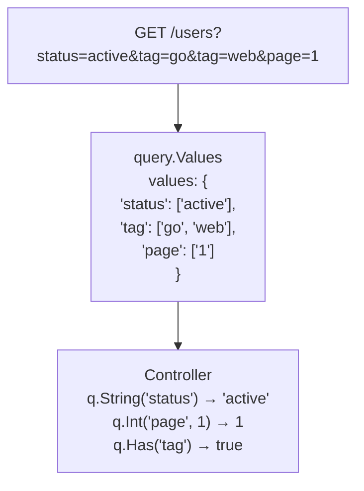

# 查询.值

显式处理查询参数。

＃＃ 大纲

`query.Values` 提供所有 HTTP 查询参数的只读视图。 Spine 不会自动将查询参数映射到 DTO。相反，它的设计是让Controller直接通过`query.Values`显式地取出并写入必要的值。



## 为什么不自动映射？

大多数框架自动将查询参数绑定到结构标签：

```go
// 其他框架如何工作
type SearchParams struct {
    Status string   `query:"status"`
    Tags   []string `query:"tag"`
    Page   int      `query:"page"`
}

func Search(params SearchParams) { ... }
```

Spine没有采用这种方式。

### 原因 1：明确

查询参数是可变的且可选的。自动映射隐藏了“哪些参数来自哪里”。

```go
// Spine 方法：显式提取
func Search(q query.Values) []User {
    status := q.String("status")      // 명확한 출처
    page := q.Int("page", 1)          // 기본값 명시
    
    if q.Has("premium") {             // 조건부 처리
        // ...
    }
}
```

### 原因 2：灵活性

在处理动态查询（例如搜索 API）时，基于结构的绑定成为一个限制。

```go
// 动态滤波处理
func Search(q query.Values) []Product {
    filters := make(map[string]string)
    
    // 无法提前知道哪些过滤器会出现
    if q.Has("min_price") {
        filters["min_price"] = q.String("min_price")
    }
    if q.Has("max_price") {
        filters["max_price"] = q.String("max_price")
    }
    if q.Has("category") {
        filters["category"] = q.String("category")
    }
    
    return c.repo.FindByFilters(filters)
}
```

## 价值观结构

```go
// pkg/query/types.go
type Values struct {
    values map[string][]string
}

func NewValues(values map[string][]string) Values {
    return Values{values: values}
}
```

`Values` 是 `map[string][]string` 的包装。每个键可以有多个值（例如`?tag=go&tag=web`）。

＃＃ 方法

### 获取（键字符串）字符串

以字符串形式返回指定键的第一个值。如果键不存在，则返回空字符串。

```go
// GET /users?name=john&status=active

q.Get("name")    // "john"
q.Get("status")  // "active"
q.Get("missing") // ""
```

### String(键字符串) 字符串

与 `Get()` 相同。作为别名提供。

```go
q.String("name")  // "john"
```

### Int(键字符串, def int64) int64

将指定键的值解析为整数。如果解析失败或密钥丢失，则返回默认值。

```go
// 获取 /users?page=3&size=20

q.Int("page", 1)    // 3
q.Int("size", 10)   // 20
q.Int("offset", 0)  // 0 (키 없음 → 기본값)
q.Int("page", 1)    // 1 (만약 page=abc라면 → 기본값)
```

### GetBoolByKey(key string, def bool) bool

将指定键的值解析为布尔值。将值转换为小写，然后确定。

**识别为 true**：`"true"`、`"1"`、`"yes"`、`"y"`、`"on"`（忽略大小写）

**识别为 false**：`"false"`、`"0"`、`"no"`、`"n"`、`"off"`（忽略大小写）

```go
// GET /users?active=true&verified=1&premium=yes

q.GetBoolByKey("active", false)    // true
q.GetBoolByKey("verified", false)  // true
q.GetBoolByKey("premium", false)   // true
q.GetBoolByKey("deleted", false)   // false (키 없음 → 기본값)
q.GetBoolByKey("active", false)    // false (만약 active=maybe → 기본값)
```

### Has(key string) bool

检查指定的键是否存在。即使值为空，如果键存在，它也是 `true`。

```go
// GET /users?status=active&empty=

q.Has("status")  // true
q.Has("empty")   // true (값은 비었지만 키는 존재)
q.Has("missing") // false
```

## 查询值解析器

如果使用 `query.Values` 类型作为控制器参数，`QueryValuesResolver` 会自动生成一个值。

```go
// 内部/解析器/query_values_resolver.go
type QueryValuesResolver struct{}

func (r *QueryValuesResolver) Supports(pm ParameterMeta) bool {
    return pm.Type == reflect.TypeFor[query.Values]()
}

func (r *QueryValuesResolver) Resolve(ctx core.ExecutionContext, parameterMeta ParameterMeta) (any, error) {
    httpCtx, ok := ctx.(core.HttpRequestContext)
    if !ok {
        return nil, fmt.Errorf("HTTP 요청 컨텍스트가 아닙니다")
    }
    return query.NewValues(httpCtx.Queries()), nil
}
```

### 它是如何工作的

1. Pipeline分析Controller签名
2. `query.Values`类型参数发现
3. `QueryValuesResolver.Supports()` → `true`
4. 调用`QueryValuesResolver.Resolve()`
5. 将断言 `ExecutionContext` 键入 `HttpRequestContext`
6. 使用`httpCtx.Queries()`获取完整查询映射
7. 用`query.NewValues()`换行并返回

> **注意**：解析器采用 `core.ExecutionContext`，然后键入断言 `core.HttpRequestContext`。在 HTTP 请求（Consumer、WebSocket）以外的上下文中返回错误。

## 用法示例

### 默认启用

```go
// cmd/demo/controller.go
func (c *UserController) GetUserQuery(q query.Values) User {
    return User{
        ID:   q.Int("id", 0),
        Name: q.String("name"),
    }
}
```

```bash
# 要求
GET /users?id=123&name=john

# 回复
{
    "id": 123,
    "name": "john"
}
```

### 搜索API

```go
func (c *ProductController) Search(q query.Values) SearchResult {
    keyword := q.String("q")
    category := q.String("category")
    minPrice := q.Int("min_price", 0)
    maxPrice := q.Int("max_price", 999999)
    inStock := q.GetBoolByKey("in_stock", true)
    
    products := c.repo.Search(SearchCriteria{
        Keyword:  keyword,
        Category: category,
        MinPrice: minPrice,
        MaxPrice: maxPrice,
        InStock:  inStock,
    })
    
    return SearchResult{
        Query:    keyword,
        Count:    len(products),
        Products: products,
    }
}
```

```bash
GET /products?q=laptop&category=electronics&min_price=500&in_stock=true
```

### 与分页一起使用

`query.Values` 和 `query.Pagination` 可以一起使用。

```go
func (c *UserController) List(p query.Pagination, q query.Values) PagedResult {
    status := q.String("status")
    sortBy := q.String("sort_by")
    
    users := c.repo.FindAll(status, sortBy, p.Page, p.Size)
    total := c.repo.Count(status)
    
    return PagedResult{
        Data:  users,
        Page:  p.Page,
        Size:  p.Size,
        Total: total,
    }
}
```

```bash
GET /users?page=2&size=20&status=active&sort_by=created_at
```

### 条件过滤器

```go
func (c *OrderController) List(q query.Values) []Order {
    filters := OrderFilters{}
    
    if q.Has("user_id") {
        filters.UserID = q.Int("user_id", 0)
    }
    
    if q.Has("status") {
        filters.Status = q.String("status")
    }
    
    if q.Has("from_date") {
        filters.FromDate = parseDate(q.String("from_date"))
    }
    
    if q.Has("to_date") {
        filters.ToDate = parseDate(q.String("to_date"))
    }
    
    return c.repo.FindByFilters(filters)
}
```

## 多值处理

查询参数可以传递具有相同键的多个值。

```
GET /products?tag=go&tag=web&tag=api
```

目前，`query.Values` 的 `String()`、`Get()` 方法仅返回第一个值。如果需要多个值，可以添加直接访问内部map的方法，或者使用解析逗号分隔值的方法。

```go
// 逗号分隔法
// 获取 /products?tags=go,web,api

func (c *ProductController) Search(q query.Values) []Product {
    tagsRaw := q.String("tags")
    tags := strings.Split(tagsRaw, ",")
    
    return c.repo.FindByTags(tags)
}
```

## 与 query.Pagination 的区别

|特点 |查询.值​​|查询。分页 |
|------|--------------|--------------------|
| **使用** |可变查询参数|固定分页|
| **参数** |所有查询 |仅 `page`、`size` |
| **默认** |调用方法时指定 |自动应用（页=1，大小=20）|
| **类型转换** |明确 |自动|

### 使用选择标准

```go
// 只需要固定分页→query.Pagination
func List(p query.Pagination) []User

// 动态过滤+分页→同时使用
func Search(p query.Pagination, q query.Values) []User

// 完全动态查询→query.Values only
func CustomSearch(q query.Values) []User
```

## 设计原则

### 1.显式提取

```go
// ✓ 脊柱：清楚它来自哪里
status := q.String("status")
page := q.Int("page", 1)

// ❌ 自动绑定：来源未知
func Search(params SearchParams) // status가 query? body? path?
```

### 2.指定默认值

```go
// ✓ 默认值在代码中可见
page := q.Int("page", 1)
size := q.Int("size", 20)

// ❌ struct 标签的默认值被隐藏
type Params struct {
    Page int `query:"page" default:"1"`  // 어디서 설정됐는지 추적 어려움
}
```

### 3.可选参数处理

```go
// ✓ 使用 Has() 显式检查是否存在
if q.Has("premium") {
    filters.Premium = q.GetBoolByKey("premium", false)
}

// ❌ 自动绑定无法区分零值和“无值”
type Params struct {
    Premium bool `query:"premium"`  // false가 기본값인지 명시적 false인지?
}
```

＃＃ 概括

|方法|返回类型 |使用|
|--------|----------|------|
| `Get(key)` | `Get(key)` `string` | `string`字符串值（`""` 如果没有）|
| `String(key)` | `String(key)` `string` | `string` `Get()` 的别名 |
| `Int(key, def)` | `Int(key, def)` `int64` | `int64`整数值（失败时默认）|
| `GetBoolByKey(key, def)` | `GetBoolByKey(key, def)` `bool` | `bool`布尔值（失败时默认）|
| `Has(key)` | `Has(key)` `bool` | `bool`关键存在|

**核心理念**：Spine 不会“神奇地”自动映射查询参数。通过 `query.Values`，控制器显式地提取并写入必要的值。这与 Spine 的“No Magic”原则是一致的。