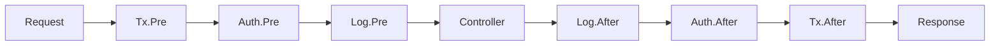

# 介绍

## 什么是脊柱？

Spine 是一个不隐藏请求过程的 Go Web 框架。

显式执行管道揭示了如何解释请求、执行顺序、何时调用业务逻辑以及如何在响应中完成请求。

```go
func main() {
    app := spine.New()

    // 依赖注册 - 只需注册构造函数即可自动解决，无论顺序如何
    app.Constructor(NewUserRepository, NewUserService, NewUserController)

    // 拦截器——执行顺序在代码中可见
    app.Interceptor(&TxInterceptor{}, &LoggingInterceptor{})

    // 路线 — 哪个方法是哪条路线一目了然。
    app.Route("GET", "/users", (*UserController).GetUser)

    if err := app.Run(boot.Options{
		Address:                ":8080",
		EnableGracefulShutdown: true,
		ShutdownTimeout:        10 * time.Second,
		HTTP: &boot.HTTPOptions{},
	}); err != nil {
		log.Fatal(err)
	}
}
```

## 为什么是脊柱？

### 没有隐藏的魔法

Spring Boot 中为 `@Autowired`，NestJS 中为 `@Injectable`。
方便，但很难看到里面发生了什么。

脊柱不一样。

- **无注释** — 纯 Go 代码
- **没有模块定义** - DI 只需通过注册构造函数即可解决
- **无代理** — 堆栈跟踪非常直观

当你阅读代码时，你可以看到执行流程。

### 熟悉的结构

如果您使用过Spring或NestJS，您可以立即开始。

```
Controller → Service → Repository
```

构造函数注入、拦截器链、分层架构。
我们将熟悉的模式转移到 Go 中。

### Go 中的性能

- 无需 JVM 预热
- 没有 Node.js 运行时初始化
- 编译后的二进制文件立即运行

针对容器和无服务器环境进行了优化。

## 关键概念

### 1. 基于构造函数的依赖注入

```go
// 构造函数参数是依赖关系的声明
func NewUserService(repo *UserRepository) *UserService {
    return &UserService{repo: repo}
}

// 简单注册并自动解决依赖图
app.Constructor(NewUserRepository, NewUserService, NewUserController)
```

### 2.拦截器管道

```go
app.Interceptor(
    &TxInterceptor{},      // 1. 开始事务
    &AuthInterceptor{},    // 2. 检查认证
    &LoggingInterceptor{}, // 3. 日志记录
)

```

**执行顺序：**



### 3.显式路由

```go
// 在一处管理您的所有路线
func RegisterUserRoutes(app spine.App) {
    app.Route("GET", "/users", (*UserController).GetUser)
    app.Route("POST", "/users", (*UserController).CreateUser)
    app.Route("PUT", "/users", (*UserController).UpdateUser)
    app.Route("DELETE", "/users", (*UserController).DeleteUser)
}
```

### 4. 类型安全处理程序

```go
// 函数签名是API规范
func (c *UserController) GetUser(
    ctx context.Context,      // 上下文
    q query.Values,           // 查询参数
) (httpx.Response[UserResponse], error) {     // 响应类型
    user, err := c.svc.Get(ctx, q.Int("id", 0))
    if err != nil {
        return httpx.Response[UserResponse]{}, err
    }
    return httpx.Response[UserResponse]{Body: user}, nil
}

// DTO 自动绑定
func (c *UserController) CreateUser(
    ctx context.Context,
    req *CreateUserRequest,    // JSON body → 结构体（指针）
) (httpx.Response[UserResponse], error) {
    user, err := c.svc.Create(ctx, req)
    if err != nil {
        return httpx.Response[UserResponse]{}, err
    }
    return httpx.Response[UserResponse]{Body: user}, nil
}
```

## 与其他框架的比较

| |脊柱 | NestJS |春季启动|
|---|:---:|:---:|:---:|
| **语言** |去 |打字稿 | Java/Kotlin |
| **运行时** |本机二进制 | Node.js | JVM |
| **IoC 容器** | ✅ | ✅ | ✅ |
| **注释/装饰器** |没有必要|必填 |必填 |
| **模块定义** |没有必要|必填 |没有必要|
| **类型安全** |编译时间|运行时|编译时间|

## 你准备好开始了吗？

```bash
go get github.com/NARUBROWN/spine
```

[5 分钟快速入门 →](/zh-Hans/learn/getting-started/first-app)
