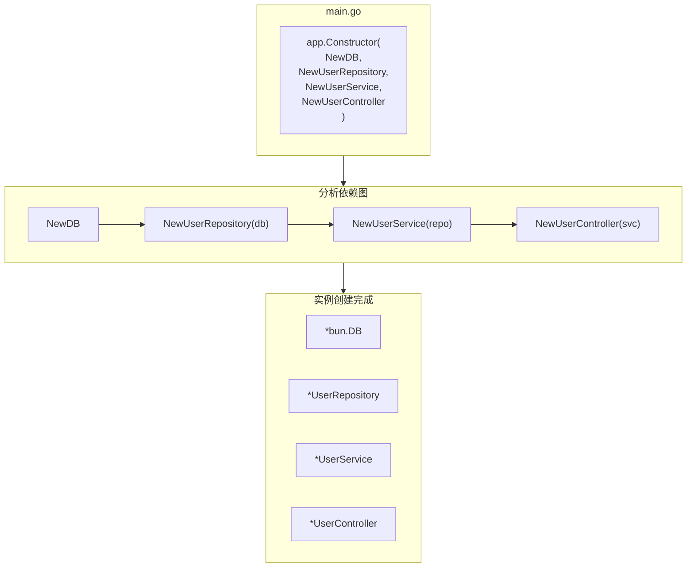

# 依赖注入

了解 Spine 的 DI。

## 关键概念

Spine 的依赖注入是**基于构造函数的**。

- 无注释（`@Autowired`、`@Injectable` 不需要）
- 没有配置文件
- 构造函数参数被声明为依赖项

```go
// 通过查看参数类型自动注入依赖项
func NewUserService(repo *UserRepository) *UserService {
    return &UserService{repo: repo}
}
```

## 基本用法

### 1. 编写构造函数

每个组件都有一个构造函数。

```go
// 存储库.go
type UserRepository struct {
    db *bun.DB
}

func NewUserRepository(db *bun.DB) *UserRepository {
    return &UserRepository{db: db}
}

// 服务.go
type UserService struct {
    repo *UserRepository
}

func NewUserService(repo *UserRepository) *UserService {
    return &UserService{repo: repo}
}

// 控制器.go
type UserController struct {
    svc *UserService
}

func NewUserController(svc *UserService) *UserController {
    return &UserController{svc: svc}
}
```

### 2.构造函数注册

在 `app.Constructor()` 中注册一个构造函数。

```go
func main() {
    app := spine.New()
    
    app.Constructor(
        NewDB,              // 返回 *bun.DB
        NewUserRepository,  // 需要 *bun.DB → 返回 *UserRepository
        NewUserService,     // 需要 *UserRepository → 返回 *UserService
        NewUserController,  // 需要 *UserService → 返回 *UserController
    )
    
    if err := app.Run(boot.Options{
		Address:                ":8080",
		EnableGracefulShutdown: true,
		ShutdownTimeout:        10 * time.Second,
		HTTP: &boot.HTTPOptions{},
	}); err != nil {
		log.Fatal(err)
	}
}
```

### 3.自动解析

Spine 分析依赖图并以正确的顺序创建实例。

```
注册顺序：任意
执行顺序：DB → Repository → Service → Controller
```

## 任意订单

注册顺序并不重要。 Spine 分析依赖关系并自动对它们进行排序。

```go
// 即使你这样注册
app.Constructor(
    NewUserController,  // 需要 UserService
    NewUserService,     // 需要 UserRepository
    NewUserRepository,  // 需要 bun.DB
    NewDB,
)

// 实际的创建顺序是
// 1.NewDB()
// 2.新建用户存储库(db)
// 3.NewUserService（回购）
// 4.新建用户控制器(svc)
```

## 依赖关系图

### 可视化



## 构造函数规则

＃＃＃ 参数

构造函数参数必须是**已注册的类型**。

```go
// ✅ 正确的例子
func NewUserService(repo *UserRepository) *UserService

// ✅ 可能有多个依赖项
func NewUserController(svc *UserService, logger *Logger) *UserController

// ✅ 没有依赖性
func NewLogger() *Logger
```

### 返回类型

构造函数返回**单个值**或**（值，错误）**。

```go
// ✅ 返回单个值
func NewUserService(repo *UserRepository) *UserService {
    return &UserService{repo: repo}
}

// ✅ 可能返回错误
func NewDB() (*bun.DB, error) {
    db, err := sql.Open("mysql", "...")
    if err != nil {
        return nil, err
    }
    return bun.NewDB(db, mysqldialect.New()), nil
}
```

## 使用接口

### 问题情况

使用事务时，存储库必须同时处理 `*bun.DB` 和 `*bun.Tx`。

```go
// ❌这将禁用交易
type UserRepository struct {
    db *bun.DB  // 无法接收 *bun.Tx
}
```

### 已解决：使用接口

`bun.IDB` 接口允许您同时容纳两者。

```go
// ✅ Bun.IDB 实现了 *bun.DB 和 *bun.Tx
type UserRepository struct {
    db bun.IDB
}

func NewUserRepository(db bun.IDB) *UserRepository {
    return &UserRepository{db: db}
}
```

### 拦截器中的事务注入

```go
// 拦截器/tx_interceptor.go
func (i *TxInterceptor) PreHandle(ctx core.ExecutionContext, meta core.HandlerMeta) error {
    tx, err := i.db.BeginTx(ctx.Context(), nil)
    if err != nil {
        return err
    }
    
    ctx.Set("tx", tx)  // 保存事务
    return nil
}

func (i *TxInterceptor) AfterCompletion(ctx core.ExecutionContext, meta core.HandlerMeta, err error) {
    tx, ok := ctx.Get("tx")
    if !ok {
        return
    }
    
    if err != nil {
        tx.(*bun.Tx).Rollback()
    } else {
        tx.(*bun.Tx).Commit()
    }
}
```

## 注册多个组件

### 按域分隔

```go
func main() {
    app := spine.New()
    
    // 基础设施
    app.Constructor(
        NewDB,
        NewRedisClient,
        NewLogger,
    )
    
    // 用户域
    app.Constructor(
        repository.NewUserRepository,
        service.NewUserService,
        controller.NewUserController,
    )
    
    // 订购域名
    app.Constructor(
        repository.NewOrderRepository,
        service.NewOrderService,
        controller.NewOrderController,
    )
    
    if err := app.Run(boot.Options{
		Address:                ":8080",
		EnableGracefulShutdown: true,
		ShutdownTimeout:        10 * time.Second,
		HTTP: &boot.HTTPOptions{},
	}); err != nil {
		log.Fatal(err)
	}
}
```

### 可以多次调用

`app.Constructor()` 可以被多次调用。

```go
app.Constructor(NewDB)
app.Constructor(NewUserRepository, NewUserService)
app.Constructor(NewUserController)
```

## 多个相同类型

如果需要同一类型的多个实例，请使用包装类型。

```go
// ❌ 难以区分
func NewApp(db1 *bun.DB, db2 *bun.DB) *App  // 无法区分各自用途

// ✅ 按包装类型分类
type PrimaryDB struct{ *bun.DB }
type ReplicaDB struct{ *bun.DB }

func NewPrimaryDB() *PrimaryDB {
    return &PrimaryDB{connectToPrimary()}
}

func NewReplicaDB() *ReplicaDB {
    return &ReplicaDB{connectToReplica()}
}

func NewUserRepository(primary *PrimaryDB, replica *ReplicaDB) *UserRepository {
    return &UserRepository{
        writer: primary.DB,
        reader: replica.DB,
    }
}
```## 错误处理

### 循环依赖

```go
// ❌A→B→A循环
func NewA(b *B) *A { ... }
func NewB(a *A) *B { ... }

// 启动时出现错误
// 恐慌：检测到循环依赖：*A
```

### 缺少依赖项

```go
// 如果您没有注册UserRepository
app.Constructor(
    NewUserService,     // *需要 UserRepository
    NewUserController,
)

// 启动时出现错误
// 恐慌：没有注册构造函数：*repository.UserRepository
```

## 主要摘要

|概念|描述 |
|------|------|
| **基于构造函数** |声明与参数类型的依赖关系 |
| **自动解析** |不考虑注册顺序，图分析后生成|
| **类型匹配** |相同类型自动注入 |
| **界面** |灵活的依赖性处理成为可能 |

## 后续步骤

- [教程：拦截器](/zh-Hans/learn/tutorial/4-interceptor) — 请求前/请求后处理
- [教程：数据库](/zh-Hans/learn/tutorial/5-database) — Bun ORM 连接
