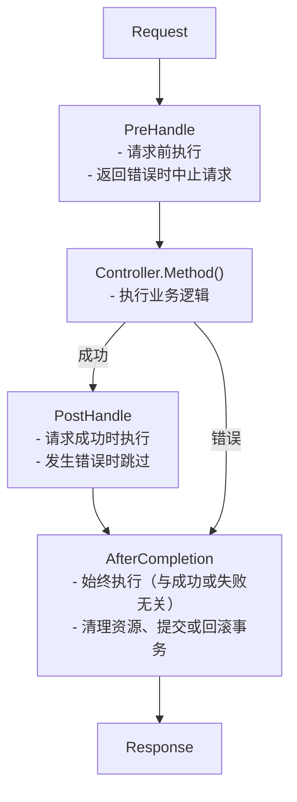

# 拦截器

创建和使用拦截器。

## 什么是拦截器？

拦截器是在请求之前/之后运行的逻辑。

- 交易管理
- 日志记录
- 认证/授权
- 请求验证

## 生命周期

拦截器的生命周期分为三个阶段。



## 界面

```go
type Interceptor interface {
    PreHandle(ctx ExecutionContext, meta HandlerMeta) error
    PostHandle(ctx ExecutionContext, meta HandlerMeta)
    AfterCompletion(ctx ExecutionContext, meta HandlerMeta, err error)
}
```

|方法|何时跑步 |返回 |使用|
|--------|----------|------|-----|
| `PreHandle` | `PreHandle`运行控制器之前 | `error` | `error`认证、验证、交易发起 |
| `PostHandle` | `PostHandle`控制器成功后 |无 |响应处理 |
| `AfterCompletion` | `AfterCompletion`总是（成功/失败）|无 |资源清理、提交/回滚|

## 全局拦截器与路由拦截器

Spine 支持两级拦截器。

|类别 |全局拦截器|路由拦截器|
|------|--------------|----------------|
|适用范围 |所有请求 |仅特定路线|
|如何注册 | `app.Interceptor()` | `app.Interceptor()` `route.WithInterceptors()` | `route.WithInterceptors()`
|使用| CORS、日志记录、事务 |认证、授权检查|
|执行订单 |先运行|追随全球|

## 全局拦截器

适用于所有请求的拦截器。

### 日志拦截器示例

```go
// 拦截器/logging_interceptor.go
package interceptor

import (
    "log"
    "github.com/NARUBROWN/spine/core"
)

type LoggingInterceptor struct{}

func (i *LoggingInterceptor) PreHandle(ctx core.ExecutionContext, meta core.HandlerMeta) error {
    log.Printf("[REQ] %s %s → %s.%s",
        ctx.Method(),
        ctx.Path(),
        meta.ControllerType.Name(),
        meta.Method.Name,
    )
    return nil
}

func (i *LoggingInterceptor) PostHandle(ctx core.ExecutionContext, meta core.HandlerMeta) {
    log.Printf("[RES] %s %s OK",
        ctx.Method(),
        ctx.Path(),
    )
}

func (i *LoggingInterceptor) AfterCompletion(ctx core.ExecutionContext, meta core.HandlerMeta, err error) {
    if err != nil {
        log.Printf("[ERR] %s %s : %v",
            ctx.Method(),
            ctx.Path(),
            err,
        )
    }
}
```

### 注册全局拦截器

```go
func main() {
    app := spine.New()

    // 全局拦截器——适用于所有请求
    app.Interceptor(
        &interceptor.LoggingInterceptor{},
    )

    app.Run(boot.Options{
		Address:                ":8080",
		EnableGracefulShutdown: true,
		ShutdownTimeout:        10 * time.Second,
		HTTP: &boot.HTTPOptions{},
	})
}
```

## 路由拦截器

这是一个仅适用于特定路由的拦截器。

### 身份验证拦截器示例

```go
// 拦截器/auth_interceptor.go
package interceptor

import (
    "github.com/NARUBROWN/spine/core"
    "github.com/NARUBROWN/spine/pkg/httperr"
)

type AuthInterceptor struct{}

func (i *AuthInterceptor) PreHandle(ctx core.ExecutionContext, meta core.HandlerMeta) error {
    token := ctx.Header("Authorization")

    if token == "" {
        return httperr.Unauthorized("需要认证.")
    }

    user, err := validateToken(token)
    if err != nil {
        return httperr.Unauthorized("令牌无效.")
    }

    ctx.Set("currentUser", user)
    return nil
}

func (i *AuthInterceptor) PostHandle(ctx core.ExecutionContext, meta core.HandlerMeta) {}

func (i *AuthInterceptor) AfterCompletion(ctx core.ExecutionContext, meta core.HandlerMeta, err error) {}

func validateToken(token string) (map[string]string, error) {
    // 令牌验证逻辑
    return map[string]string{"id": "1", "name": "Alice"}, nil
}
```

### 注册路由拦截器

使用 `route.WithInterceptors()`。

```go
import (
    "github.com/NARUBROWN/spine"
    "github.com/NARUBROWN/spine/pkg/route"
)

func main() {
    app := spine.New()

    app.Constructor(
        NewUserController,
    )

    // 不需要认证的路由
    app.Route(
        "POST",
        "/login",
        (*UserController).Login,
    )

    // 需要身份验证的路由
    app.Route(
        "GET",
        "/users/:id",
        (*UserController).GetUser,
        route.WithInterceptors(&interceptor.AuthInterceptor{}),
    )

    // 需要身份验证的路由
    app.Route(
        "PUT",
        "/users/:id",
        (*UserController).UpdateUser,
        route.WithInterceptors(&interceptor.AuthInterceptor{}),
    )

    app.Run(boot.Options{
		Address:                ":8080",
		EnableGracefulShutdown: true,
		ShutdownTimeout:        10 * time.Second,
		HTTP: &boot.HTTPOptions{},
	})
}
```

## 全局+路由拦截器组合

在实际应用中，两者是结合使用的。

```go
func main() {
    app := spine.New()

    app.Constructor(
        NewUserController,
    )

    // 全局拦截器——适用于所有请求
    app.Interceptor(
        &interceptor.LoggingInterceptor{},
        cors.New(cors.Config{
            AllowOrigins: []string{"*"},
            AllowMethods: []string{"GET", "POST", "PUT", "DELETE"},
        }),
    )

    // 公共路线——仅适用全球拦截器
    app.Route("POST", "/login", (*UserController).Login)
    app.Route("POST", "/signup", (*UserController).Signup)

    // 身份验证所需的路由 - 全局 + 身份验证拦截器
    app.Route(
        "GET",
        "/users/:id",
        (*UserController).GetUser,
        route.WithInterceptors(&interceptor.AuthInterceptor{}),
    )

    app.Route(
        "GET",
        "/me",
        (*UserController).GetMe,
        route.WithInterceptors(&interceptor.AuthInterceptor{}),
    )

    app.Run(boot.Options{
		Address:                ":8080",
		EnableGracefulShutdown: true,
		ShutdownTimeout:        10 * time.Second,
		HTTP: &boot.HTTPOptions{},
	})
}
```

## 执行顺序

全局拦截器首先运行，路由拦截器最后运行。

### 注册示例

```go
// 全局拦截器
app.Interceptor(
    &interceptor.LoggingInterceptor{},   // 全局 1
    &interceptor.CORSInterceptor{},      // 全局 2
)

// 路由拦截器
app.Route(
    "GET",
    "/users/:id",
    (*UserController).GetUser,
    route.WithInterceptors(&interceptor.AuthInterceptor{}),  // 路由 1
)
```

### 执行流程

```
Request (GET /users/1)
   │
   ├─→ Logging.PreHandle     (全局 1)
   ├─→ CORS.PreHandle        (全局 2)
   ├─→ Auth.PreHandle        (路由 1)
   │
   ├─→ UserController.GetUser
   │
   ├─→ Auth.PostHandle       (路由 1)
   ├─→ CORS.PostHandle       (全局 2)
   ├─→ Logging.PostHandle    (全局 1)
   │
   ├─→ Auth.AfterCompletion       (路由 1)
   ├─→ CORS.AfterCompletion       (全局 2)
   └─→ Logging.AfterCompletion    (全局 1)

Response
```

- `PreHandle`：全局 → 路由顺序
- `PostHandle`：路由 → 全局逆序
- `AfterCompletion`：路由 → 全局逆序

## 错误处理

### PreHandle 返回错误

如果 `PreHandle` 返回错误，则请求将中止。

```go
func (i *AuthInterceptor) PreHandle(ctx core.ExecutionContext, meta core.HandlerMeta) error {
    token := ctx.Header("Authorization")
    if token == "" {
        return httperr.Unauthorized("需要认证.")
    }
    return nil
}
```

```
Request (GET /users/1, 没有令牌)
   │
   ├─→ Logging.PreHandle     ✓
   ├─→ CORS.PreHandle        ✓
   ├─→ Auth.PreHandle        ✗ (返回错误)
   │
   ├─→ Auth.AfterCompletion
   ├─→ CORS.AfterCompletion
   └─→ Logging.AfterCompletion

Response (401 Unauthorized)
```

## 执行上下文

在请求上下文中存储和检索值。

### 方法

|方法|描述 |
|--------|------|
| `Context()` | `Context()`返回 `context.Context` |
| `Method()` | `Method()` HTTP 方法（GET、POST 等）|
| `Path()` | `Path()`请求路径 |
| `Header(name)` | `Header(name)`标头值查找 |
| `Set(key, value)` | `Set(key, value)`储值|
| `Get(key)` | `Get(key)`值查找 |

### 在拦截器之间传递数据

```go
// AuthInterceptor——存储用户信息
func (i *AuthInterceptor) PreHandle(ctx core.ExecutionContext, meta core.HandlerMeta) error {
    token := ctx.Header("Authorization")
    user, _ := validateToken(token)
    ctx.Set("currentUser", user)
    return nil
}

// 必须注入 ExecutionContext 才能在控制器中进行查询
// 或者在另一个拦截器中查找
func (i *AuditInterceptor) PreHandle(ctx core.ExecutionContext, meta core.HandlerMeta) error {
    user, ok := ctx.Get("currentUser")
    if ok {
        log.Printf("User %v accessing %s", user, ctx.Path())
    }
    return nil
}
```


## HandlerMeta

有关要执行的处理程序的元信息。

|领域 |类型 |描述 |
|------|------|------|
| `ControllerType` | `ControllerType` `reflect.Type` | `reflect.Type`控制器类型 |
| `Method` | `Method` `reflect.Method` | `reflect.Method`处理程序方法 |
| `Interceptors` | `Interceptors` `[]Interceptor` | `[]Interceptor`拦截器绑定到路由 |

### 用法示例

```go
func (i *LoggingInterceptor) PreHandle(ctx core.ExecutionContext, meta core.HandlerMeta) error {
    log.Printf("控制器: %s", meta.ControllerType.Name())  // UserController
    log.Printf("方法: %s", meta.Method.Name)              // GetUser
    return nil
}
```

## 需要依赖注入的拦截器

具有构造函数的拦截器首先使用 `Constructor` 进行注册。

### 事务拦截器示例

```go
// 拦截器/tx_interceptor.go
package interceptor

import (
    "github.com/NARUBROWN/spine/core"
    "github.com/uptrace/bun"
)

type TxInterceptor struct {
    db *bun.DB
}

func NewTxInterceptor(db *bun.DB) *TxInterceptor {
    return &TxInterceptor{db: db}
}

func (i *TxInterceptor) PreHandle(ctx core.ExecutionContext, meta core.HandlerMeta) error {
    tx, err := i.db.BeginTx(ctx.Context(), nil)
    if err != nil {
        return err
    }
    ctx.Set("tx", tx)
    return nil
}

func (i *TxInterceptor) PostHandle(ctx core.ExecutionContext, meta core.HandlerMeta) {}

func (i *TxInterceptor) AfterCompletion(ctx core.ExecutionContext, meta core.HandlerMeta, err error) {
    v, ok := ctx.Get("tx")
    if !ok {
        return
    }

    tx := v.(*bun.Tx)
    if err != nil {
        tx.Rollback()
    } else {
        tx.Commit()
    }
}
```

### 注册（全球）

```go
app.Constructor(
    NewDB,
    interceptor.NewTxInterceptor,
)

app.Interceptor(
    (*interceptor.TxInterceptor)(nil),  // 按类型引用
)
```

### 注册（路线）

```go
app.Constructor(
    NewDB,
    interceptor.NewTxInterceptor,
)

app.Route(
    "POST",
    "/orders",
    (*OrderController).CreateOrder,
    route.WithInterceptors((*interceptor.TxInterceptor)(nil)),  // 按类型引用
)
```


## 注册方式总结

### 全局拦截器

|方法|代码|何时使用 |
|------|------|----------|
|直接实例交付 | `&interceptor.LoggingInterceptor{}` | `&interceptor.LoggingInterceptor{}`无依赖 |
|按类型参考 | `(*interceptor.TxInterceptor)(nil)` | `(*interceptor.TxInterceptor)(nil)`依赖|

```go
app.Interceptor(
    &interceptor.LoggingInterceptor{},      // 实例
    (*interceptor.TxInterceptor)(nil),      // 类型引用
)
```

### 路由拦截器

|方法|代码|何时使用 |
|------|------|----------|
|直接实例交付 | `&interceptor.AuthInterceptor{}` | `&interceptor.AuthInterceptor{}`无依赖 |
|按类型参考 | `(*interceptor.TxInterceptor)(nil)` | `(*interceptor.TxInterceptor)(nil)`依赖|

```go
app.Route(
    "GET",
    "/users/:id",
    (*UserController).GetUser,
    route.WithInterceptors(
        &interceptor.AuthInterceptor{},         // 实例
        (*interceptor.TxInterceptor)(nil),      // 类型引用
    ),
)
```

## 主要摘要

|概念|描述 |
|------|------|
| **全局拦截器** | `app.Interceptor()` — 适用于所有请求 |
| **路由拦截器** | `route.WithInterceptors()` — 仅特定路线 |
| **执行顺序** |全局→路线（后/后是相反的顺序）|
| **3 阶段生命周期** | PreHandle → PostHandle → AfterCompletion | 处理前 → 处理后 → 完成后 |
| **出错时停止** | PreHandle 错误 → 控制器跳过 |
| **上下文共享** |将数据传递到 `ctx.Set()` / `ctx.Get()` |

## 后续步骤

- 教程：数据库 — Bun ORM 连接
- 教程：错误处理 — 如何使用 httperr
