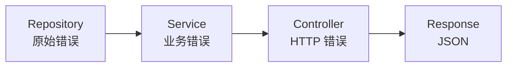
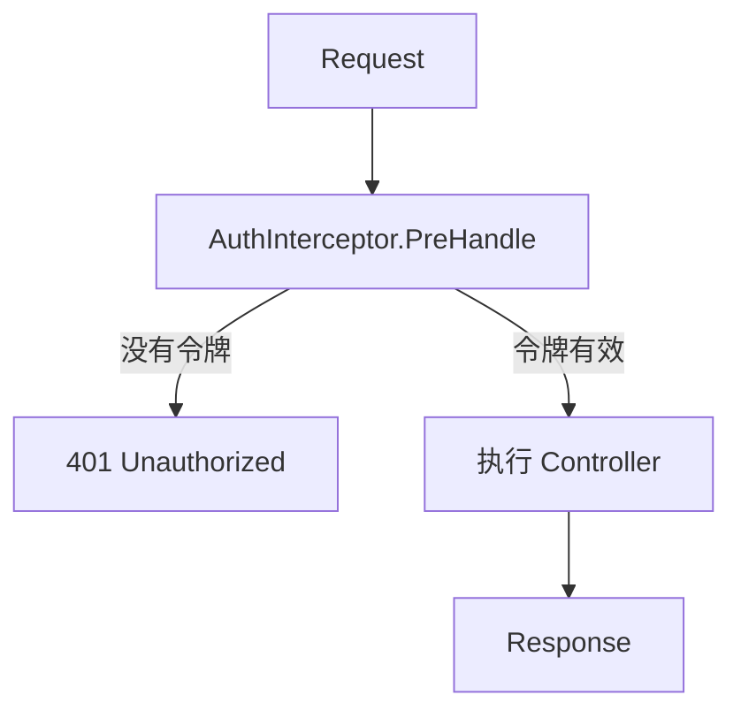

我检查了代码。事实上，`httperr` 包中只有三个辅助函数：

```go
// pkg/httperr/types.go
func NotFound(msg string) error {
    return &HTTPError{Status: 404, Message: msg}
}

func BadRequest(msg string) error {
    return &HTTPError{Status: 400, Message: msg}
}

func Unauthorized(msg string) error {
    return &HTTPError{Status: 401, Message: msg}
}
```

让我编辑一下文档：

---

# 错误处理

如何优雅地处理错误。

## 大纲

Spine 使用 `httperr` 包表示 HTTP 错误。 Controller不直接处理HTTP，仅用`httperr`表达错误的**含义**。实际的 HTTP 响应转换由 `ErrorReturnHandler` 处理。

```go
import "github.com/NARUBROWN/spine/pkg/httperr"

func (c *UserController) GetUser(userId path.Int) (User, error) {
    if userId.Value <= 0 {
        return User{}, httperr.BadRequest("用户 ID 无效")
    }

    user, err := c.repo.FindByID(userId.Value)
    if err != nil {
        return User{}, httperr.NotFound("找不到用户")
    }

    return user, nil
}
```

## httperr 函数

|功能|状态码|使用 |
|------|----------|------|
| `httperr.BadRequest(msg)` | `httperr.BadRequest(msg)` 400 |错误请求，输入验证失败 |
| `httperr.Unauthorized(msg)` | `httperr.Unauthorized(msg)` 401 | 401需要身份验证，令牌无效 |
| `httperr.NotFound(msg)` | `httperr.NotFound(msg)` 404 | 404没有资源 |

## HTTPError 结构体

```go
type HTTPError struct {
    Status  int    // HTTP 状态码
    Message string // 错误消息
    Cause   error  // 原因错误（可选）
}

func (e *HTTPError) Error() string {
    return e.Message
}
```

## 用法示例

### 没有资源 (404)

```go
func (c *UserController) GetUser(userId path.Int) (User, error) {
    user, err := c.repo.FindByID(userId.Value)
    if err != nil {
        return User{}, httperr.NotFound("找不到用户")
    }
    return user, nil
}
```

回复：```json
{"message": "找不到用户"}
```
```
HTTP/1.1 404 Not Found
```

### 错误请求 (400)

```go
func (c *UserController) CreateUser(req CreateUserRequest) (User, error) {
    if req.Name == "" {
        return User{}, httperr.BadRequest("姓名为必填项")
    }
    if req.Email == "" {
        return User{}, httperr.BadRequest("电子邮件为必填项")
    }

    return c.service.Create(req)
}
```

### 需要身份验证 (401)

```go
func (i *AuthInterceptor) PreHandle(ctx core.ExecutionContext, meta core.HandlerMeta) error {
    token := ctx.Header("Authorization")

    if token == "" {
        return httperr.Unauthorized("需要认证")
    }

    if !isValidToken(token) {
        return httperr.Unauthorized("令牌无效")
    }

    return nil
}
```

## 使用不同的状态代码

如果您需要未提供的状态代码，请自行生成 `HTTPError` 。

```go
// 403 禁忌
func Forbidden(msg string) error {
    return &httperr.HTTPError{Status: 403, Message: msg}
}

// 409 冲突
func Conflict(msg string) error {
    return &httperr.HTTPError{Status: 409, Message: msg}
}

// 500 内部服务器错误
func InternalServerError(msg string) error {
    return &httperr.HTTPError{Status: 500, Message: msg}
}
```

## 按层进行错误处理



### 存储库

原始错误按原样返回。

```go
func (r *UserRepository) FindByID(id int64) (*User, error) {
    user, ok := r.users[id]
    if !ok {
        return nil, ErrUserNotFound  // 原始错误
    }
    return user, nil
}

var ErrUserNotFound = errors.New("user not found")
```

### 服务

处理业务逻辑并传递存储库错误。

```go
func (s *UserService) GetUser(id int64) (*User, error) {
    user, err := s.repo.FindByID(id)
    if err != nil {
        return nil, err  // 传递错误
    }
    return user, nil
}
```

### 控制器

将业务错误转换为 HTTP 错误。

```go
func (c *UserController) GetUser(userId path.Int) (User, error) {
    user, err := c.service.GetUser(userId.Value)
    if err != nil {
        return User{}, toHTTPError(err)
    }
    return *user, nil
}

func toHTTPError(err error) error {
    switch {
    case errors.Is(err, repository.ErrUserNotFound):
        return httperr.NotFound("找不到用户")
    case errors.Is(err, repository.ErrEmailAlreadyExists):
        return httperr.BadRequest("电子邮件已被使用")
    default:
        return httperr.BadRequest(err.Error())
    }
}
```

## 输入验证

### 在DTO中定义验证方法

```go
type CreateUserRequest struct {
    Name  string `json:"name"`
    Email string `json:"email"`
}

func (r *CreateUserRequest) Validate() error {
    if r.Name == "" {
        return errors.New("姓名为必填项")
    }
    if len(r.Name) > 100 {
        return errors.New("姓名不得超过 100 个字符")
    }
    if r.Email == "" {
        return errors.New("电子邮件为必填项")
    }
    return nil
}
```

### 来自控制器的验证调用

```go
func (c *UserController) CreateUser(req CreateUserRequest) (User, error) {
    if err := req.Validate(); err != nil {
        return User{}, httperr.BadRequest(err.Error())
    }

    return c.service.Create(req)
}
```

## 拦截器中的错误处理

如果 `PreHandle` 返回错误，控制器将不会运行。

```go
func (i *AuthInterceptor) PreHandle(ctx core.ExecutionContext, meta core.HandlerMeta) error {
    token := ctx.Header("Authorization")

    if token == "" {
        return httperr.Unauthorized("需要认证令牌")
    }

    user, err := i.auth.Validate(token)
    if err != nil {
        return httperr.Unauthorized("令牌无效")
    }

    ctx.Set("auth.user", user)
    return nil
}
```



## 错误记录

您可以在 `AfterCompletion` 中记录错误。

```go
func (i *LoggingInterceptor) AfterCompletion(ctx core.ExecutionContext, meta core.HandlerMeta, err error) {
    if err != nil {
        log.Printf("[ERR] %s %s : %v", ctx.Method(), ctx.Path(), err)
    }
}
```

## 一般错误处理

普通的 `error` 而不是 `httperr.HTTPError` 被视为 500 状态代码。

```go
// httperr.HTTPError → 指定状态码
return httperr.NotFound("...")  // → 404

// 一般错误 → 500
return errors.New("something went wrong")  // → 500
```

## 主要摘要

|等级 |角色 |
|------|------|
|存储库 |返回原始错误 |
|服务 |业务逻辑处理、错误传输 |
|控制器|转换为 HTTP 错误 |
|拦截器|常见错误处理（身份验证、日志记录）|

| httperr 函数 |状态码|
|--------------|----------|
| `BadRequest` | `BadRequest` 400 |
| `Unauthorized` | `Unauthorized` 401 | 401
| `NotFound` | `NotFound` 404 | 404
