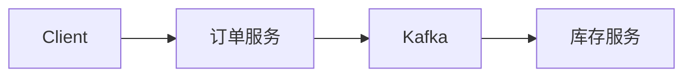

# 基于 Kafka 的 MSA 示例

本示例包含发布订单事件的订单服务，以及消费事件并更新库存的库存服务。

## 架构



## 事件发布

订单控制器在创建订单后发布领域事件：

```go
ctx.EventBus().Publish(OrderCreated{OrderID: order.ID, ProductID: req.ProductID})
```

## 事件消费

库存服务注册消费者处理器。消费者同样通过 Spine 的执行管道执行，因此可使用依赖注入、参数解析和拦截器。

```go
app.Consumers(stock.NewOrderCreatedConsumer)
```

## 运行

先启动 Kafka 与库存服务，再启动订单服务。向订单 API 发送创建请求后，Kafka 将事件传递给库存服务。

## 要点

事件发布端与消费端独立部署；事件类型是明确的契约；Kafka 配置决定生产与消费行为。
