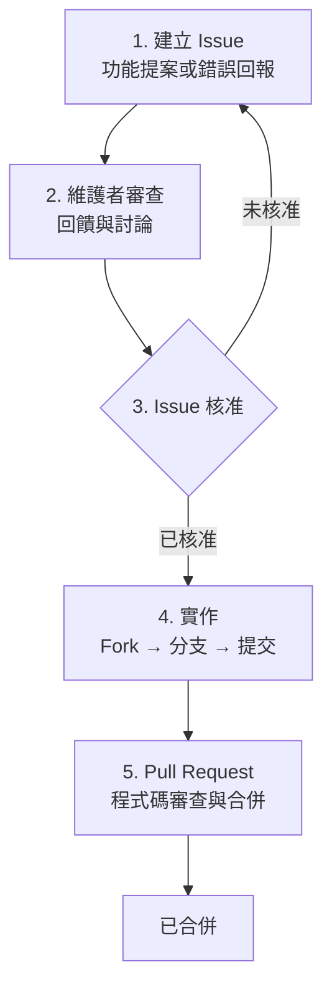

# 貢獻指南

如何為 Spine 做出貢獻。

## 貢獻流程

如果你想為 Spine 貢獻功能或改進，請遵循以下步驟。



## 1. 建立 Issue

開始實作前，請先**建立 Issue**。

在 [Spine GitHub Issues](https://github.com/NARUBROWN/spine/issues) 建立新 Issue，並包含下列內容：

**功能提案**

- 所提功能的說明
- 需要此功能的原因
- 預期使用範例

**錯誤回報**

- 重現問題的方法
- 預期行為與實際行為
- 環境資訊（Go 版本、作業系統等）

## 2. 維護者審查

Issue 建立後，維護者會進行審查並留下評論。此階段可能會討論設計方向與實作範圍。

## 3. Issue 核准

維護者核准 Issue 後即可開始實作。未經核准就建立的 PR 可能不會被合併，請先確認核准狀態。

## 4. Pull Request

在 GitHub 建立 Pull Request，並在 PR 說明中註明關聯 Issue 編號。

```
Closes #123
```

## 有疑問？

實作過程中如有疑問，請在對應的 Issue 中留言。
