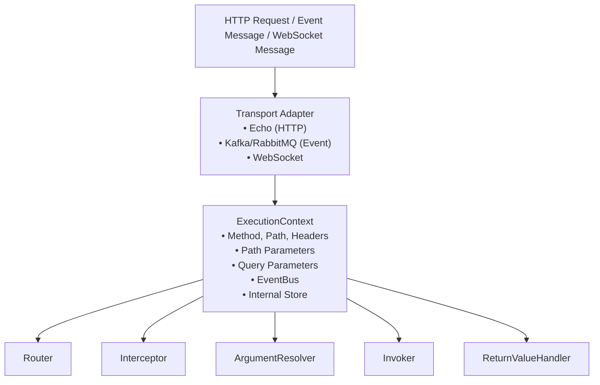
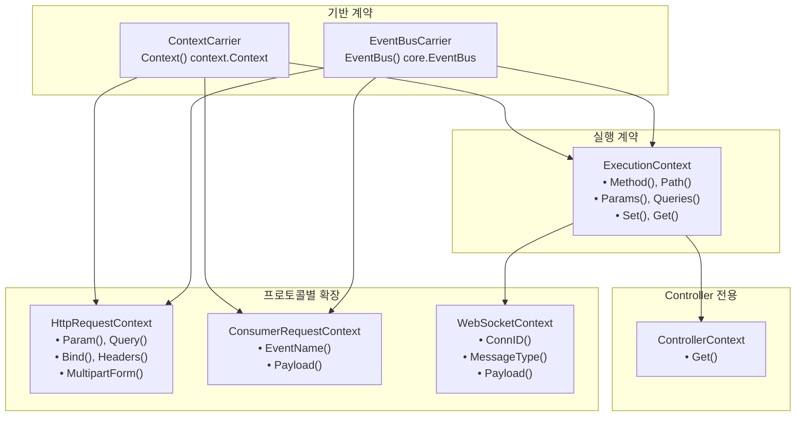

# 執行上下文

Spine 請求的本質。

＃＃ 大綱

`ExecutionContext` 是跨 Spine 管道共享的請求範圍上下文。當 HTTP 請求到達時，傳輸適配器會建立 `ExecutionContext`，這是一個經過管道所有階段並攜帶請求資訊和執行狀態的上下文。



## 上下文層次結構

Spine 將 Context **分層** 分開。它旨在使用相同的管道模型處理 HTTP、Event Consumer 和 WebSocket。



### 為什麼要分開？

|等級 |負責|在哪裡使用 |
|------|------|----------|
| `ContextCarrier` | `ContextCarrier` Go 標準上下文傳遞 |無所不在 |
| `EventBusCarrier` | `EventBusCarrier`發出網域事件 (`core.EventBus`) |控制器，消費者|
| `ExecutionContext` | `ExecutionContext`執行流程控制 |路由器、管道、攔截器|
| `ControllerContext` | `ControllerContext` ExecutionContext 的唯讀外觀 |控制器（請參閱攔截器注入值）|
| `HttpRequestContext` | `HttpRequestContext` HTTP 輸入解析 | HTTP 參數解析器 |
| `ConsumerRequestContext` | `ConsumerRequestContext`事件輸入解釋 |消費者爭論解析器 |
| `WebSocketContext` | `WebSocketContext` WebSocket 輸入解釋 | WebSocket 參數解析器 |

**目標**：HTTP、事件使用者和 WebSocket 共享相同的管道模型，從而能夠根據每個協定的特性進行輸入解釋。

## 基於介面

###上下文載體

帶有 Go 標準 `context.Context` 的最小合約。

```go
// 核心/context.go
type ContextCarrier interface {
    Context() context.Context
}
```

###EventBusCarrier

用於發布領域事件的 EventBus 存取合約。傳回類型為 `core.EventBus`。

```go
// 核心/context.go
type EventBusCarrier interface {
    EventBus() EventBus
}
```

`core.EventBus` 是一個最小的合約，用於收集域事件並在執行後立即發出所有事件。

```go
// 核心/event_bus.go
type EventBus interface {
    Publish(events ...publish.DomainEvent)
    Drain() []publish.DomainEvent
}
```

> **注意**：`internal/event/publish.EventBus` 是 `core.EventBus` 的類型別名 (`type EventBus = core.EventBus`)，其內部實作配置為滿足此類型。

## ExecutionContext 接口

用於控制整個管道中使用的執行流程的介面。

```go
// 核心/context.go
type ExecutionContext interface {
    ContextCarrier
    EventBusCarrier

    // HTTP請求資訊（Consumer/WebSocket意義不同）
    Method() string                    // HTTP: GET, POST... / Consumer: "EVENT" / WS: "WS"
    Path() string                      // HTTP: /users/123 / Consumer: EventName / WS: path
    Header(name string) string         // HTTP 헤더 (Consumer, WS는 빈 문자열)
    
    // 參數訪問
    Params() map[string]string         // Path parameters
    PathKeys() []string                // Path key 순서
    Queries() map[string][]string      // Query parameters
    
    // 內部儲存
    Set(key string, value any)         // 값 저장
    Get(key string) (any, bool)        // 값 조회
}
```

### 方法細節

#### 情境()

傳回 Go 標準 `context.Context`。用於請求取消、逾時和值傳遞。

```go
func (e *echoContext) Context() context.Context {
    return e.reqCtx  // HTTP 요청의 context
}
```

####EventBus()

요청 스코프의 EventBus를 반환합니다. Controller에서 도메인 이벤트를 발행할 때 사용됩니다.

```go
func (c *echoContext) EventBus() publish.EventBus {
    return c.eventBus
}
```

#### 方法() / 路徑()

傳回 HTTP 請求的方法和路徑。 Consumer 和 WebSocket 有不同的意義。

```go
// HTTP協定
ctx.Method()  // "GET"
ctx.Path()    // "/users/123/posts/456"

// 消費者
ctx.Method()  // "EVENT"
ctx.Path()    // "order.created" (EventName)

// WebSockets
ctx.Method()  // "WS"
ctx.Path()    // WebSocket 경로
```

#### 參數（）/路徑鍵（）

提供路徑參數資訊。

```go
// 路線：/users/:userId/posts/:postId
// 請求：/user/123/posts/456

ctx.Params()    // {"userId": "123", "postId": "456"}
ctx.PathKeys()  // ["userId", "postId"]
```

`PathKeys()` 確保參數的**宣告順序**。對於 Spine 基於順序的綁定至關重要。

#### 查詢()

以多值格式傳回查詢參數。

```go
// 請求：/users?status=active&tag=go&tag=web

ctx.Queries()  // {"status": ["active"], "tag": ["go", "web"]}
```

#### 設定（）/取得（）

用於在管道內共享值的儲存庫。

```go
// 在路由器中儲存路徑參數
ctx.Set("spine.params", params)
ctx.Set("spine.pathKeys", keys)

// 從適配器儲存 ResponseWriter
ctx.Set("spine.response_writer", NewEchoResponseWriter(c))

// 在攔截器中尋找
rw, ok := ctx.Get("spine.response_writer")
```

## ControllerContext接口

這是控制器專用的上下文視圖。這是`ExecutionContext`的唯讀門面，是控制器引用從攔截器注入的值的官方通道。

```go
// 核心/context.go
type ControllerContext interface {
    Get(key string) (any, bool)
}
```

＃＃＃ 執行

```go
// 內部/運行時/controller_ctx.go
type controllerCtxView struct {
    ec core.ExecutionContext
}

func NewControllerContext(ec core.ExecutionContext) core.ControllerContext {
    return controllerCtxView{ec: ec}
}

func (v controllerCtxView) Get(key string) (any, bool) {
    return v.ec.Get(key)
}
```

### 用法範例

```go
// 引用Controller中Interceptor注入的值
func (c *UserController) GetUser(ctx context.Context, cc core.ControllerContext, userId path.Int) User {
    authInfo, _ := cc.Get("auth.user")
    // ...
}
```

> **注意**：`pkg/spine/types.go` 定義了 `Ctx` 介面 (`Get(key string) (any, bool)`)，因此也可以從使用者程式碼以 `spine.Ctx` 的形式存取。

## HttpRequestContext 介面

這是一個僅限 HTTP 的擴充介面。由 HTTP ArgumentResolver 使用。

```go
// 核心/context.go
type HttpRequestContext interface {
    ContextCarrier
    EventBusCarrier

    // 單獨的參數訪問
    Param(name string) string          // 특정 path param
    Query(name string) string          // 특정 query param (첫 번째 값)
    Header(name string) string         // 특정 헤더
    
    // 全視圖訪問
    Params() map[string]string         // 모든 path params
    Queries() map[string][]string      // 모든 query params
    Headers() map[string][]string      // 모든 헤더
    
    // 身體綁定
    Bind(out any) error                // JSON body → struct
    
    // 多部分
    MultipartForm() (*multipart.Form, error)
}
```

> **注意**：`HttpRequestContext` 不包含 `RequestContext`。直接嵌入 `ContextCarrier` 和 `EventBusCarrier` 。此外，還新增了 `Headers() map[string][]string` 方法以允許存取整個標頭映射。

### 方法細節

#### 參數（）/查詢（）

方便地存取各個參數。

```go
// 路線：/users/:id?page=1&size=20

ctx.Param("id")      // "123"
ctx.Query("page")    // "1"
ctx.Query("size")    // "20"
ctx.Query("missing") // "" (없으면 빈 문자열)
```

####綁定()

將 HTTP 正文綁定到結構。

```go
// 內部/解析器/dto_resolver.go
func (r *DTOResolver) Resolve(ctx core.ExecutionContext, parameterMeta ParameterMeta) (any, error) {
    httpCtx, ok := ctx.(core.HttpRequestContext)
    if !ok {
        return nil, fmt.Errorf("HTTP 요청 컨텍스트가 아닙니다")
    }

    valuePtr := reflect.New(parameterMeta.Type)

    if err := httpCtx.Bind(valuePtr.Interface()); err != nil {
        return nil, fmt.Errorf("DTO 바인딩 실패 (%s): %w", parameterMeta.Type.Name(), err)
    }

    return valuePtr.Elem().Interface(), nil
}
```

#### MultipartForm()

存取多部分錶單資料。用於文件上傳處理。

```go
// 內部/解析器/uploaded_files_resolver.go
func (r *UploadedFilesResolver) Resolve(ctx core.ExecutionContext, parameterMeta ParameterMeta) (any, error) {
    httpCtx, ok := ctx.(core.HttpRequestContext)
    if !ok {
        return nil, fmt.Errorf("HTTP 요청 컨텍스트가 아닙니다")
    }

    form, err := httpCtx.MultipartForm()
    if err != nil {
        return nil, err
    }
    // ...
}
```

## ConsumerRequestContext介面

這是專用於事件消費者的擴充介面。

```go
// 核心/context.go
type ConsumerRequestContext interface {
    ContextCarrier
    EventBusCarrier

    EventName() string    // 이벤트 이름 (예: "order.created")
    Payload() []byte      // 이벤트 페이로드 (JSON 등)
}
```

### 方法細節

####事件名稱()

傳回收到的事件的名稱。

```go
ctx.EventName()  // "order.created"
```

####有效負載()

傳回事件的原始負載。

```go
payload := ctx.Payload()  // []byte (JSON)
```

### 消費者解析器範例

```go
// 內部/事件/消費者/解析器/dto_resolver.go
func (r *DTOResolver) Resolve(ctx core.ExecutionContext, meta resolver.ParameterMeta) (any, error) {
    consumerCtx, ok := ctx.(core.ConsumerRequestContext)
    if !ok {
        return nil, fmt.Errorf("ConsumerRequestContext가 아닙니다")
    }

    payload := consumerCtx.Payload()
    if payload == nil {
        return nil, fmt.Errorf("Payload가 비어있어 DTO를 생성할 수 없습니다")
    }

    dtoPtr := reflect.New(meta.Type)
    if err := json.Unmarshal(payload, dtoPtr.Interface()); err != nil {
        return nil, fmt.Errorf("DTO 역직렬화에 실패했습니다: %w", err)
    }

    return dtoPtr.Elem().Interface(), nil
}
```

## WebSocketContext 介面

特定於 WebSocket 的 ExecutionContext 擴充。透過嵌入 `ExecutionContext` 保持管道相容性。

```go
// 核心/context.go
type WebSocketContext interface {
    ExecutionContext

    ConnID() string       // 연결 ID
    MessageType() int     // 메시지 타입 (Text, Binary 등)
    Payload() []byte      // 메시지 페이로드
}
```

### WebSocket 解析器範例

```go
// 內/ws/resolver/dto_resolver.go
func (r *DTOResolver) Resolve(ctx core.ExecutionContext, meta resolver.ParameterMeta) (any, error) {
    wsCtx, ok := ctx.(core.WebSocketContext)
    if !ok {
        return nil, fmt.Errorf("WebSocketContext가 아닙니다")
    }

    payload := wsCtx.Payload()
    if payload == nil {
        return nil, fmt.Errorf("Payload가 비어있어 DTO를 생성할 수 없습니다")
    }

    dtoPtr := reflect.New(meta.Type)
    if err := json.Unmarshal(payload, dtoPtr.Interface()); err != nil {
        return nil, fmt.Errorf("DTO 역직렬화 실패: %w", err)
    }

    return dtoPtr.Elem().Interface(), nil
}
```

## Echo 適配器實現

Spine 使用 Echo 作為其 HTTP 傳輸層。 `echoContext` 實作 `ExecutionContext` 和 `HttpRequestContext`。

```go
// 內部/適配器/echo/context_impl.go
type echoContext struct {
    echo     echo.Context           // Echo의 원본 컨텍스트
    reqCtx   context.Context        // 요청 스코프 컨텍스트
    store    map[string]any         // 내부 저장소
    eventBus publish.EventBus       // 이벤트 버스
}

func NewContext(c echo.Context) core.ExecutionContext {
    return &echoContext{
        echo:     c,
        reqCtx:   c.Request().Context(),
        store:    make(map[string]any),
        eventBus: publish.NewEventBus(),
    }
}
```

### 主要實現

#### 路徑參數

首先使用路由器的匹配結果，如果沒有，則使用Echo值。

```go
func (e *echoContext) Param(name string) string {
    // Spine Router儲存的值優先
    if raw, ok := e.store["spine.params"]; ok {
        if m, ok := raw.(map[string]string); ok {
            if v, ok := m[name]; ok {
                return v
            }
        }
    }
    // 回退到 Echo
    return e.echo.Param(name)
}
```

#### Params() - 防禦性複製

返回副本以防止對原始地圖進行外部更改。使用 `maps.Copy`。

```go
func (e *echoContext) Params() map[string]string {
    if raw, ok := e.store["spine.params"]; ok {
        if m, ok := raw.(map[string]string); ok {
            // 返回淺拷貝以避免突變
            copyMap := make(map[string]string, len(m))
            maps.Copy(copyMap, m)
            return copyMap
        }
    }
    // 直接從 Echo 配置
    names := e.echo.ParamNames()
    values := e.echo.ParamValues()
    params := make(map[string]string, len(names))
    for i, name := range names {
        if i < len(values) {
            params[name] = values[i]
        }
    }
    return params
}
```

#### 標題()

以映射形式傳回所有 HTTP 標頭。

```go
func (e *echoContext) Headers() map[string][]string {
    return e.echo.Request().Header
}
```

####事件匯流排

傳回請求範圍的EventBus。

```go
func (c *echoContext) EventBus() publish.EventBus {
    return c.eventBus
}
```

## 消費者適配器實現

事件消費者的上下文實作。

```go
// 內部/事件/消費者/request_context_impl.go
type ConsumerRequestContextImpl struct {
    ctx      context.Context
    msg      *Message
    eventBus publish.EventBus
    store    map[string]any
}

func NewRequestContext(
    ctx context.Context,
    msg *Message,
    eventBus publish.EventBus,
) core.ExecutionContext {
    return &ConsumerRequestContextImpl{
        ctx:      ctx,
        msg:      msg,
        eventBus: eventBus,
        store:    make(map[string]any),
    }
}
```

### Consumer Context 的特殊行為

Consumer 不是 HTTP，因此某些方法的行為有所不同。

```go
func (c *ConsumerRequestContextImpl) Method() string {
    // Consumer執行沒有HTTP Method的概念，用「EVENT」區分路由。
    return "EVENT"
}

func (c *ConsumerRequestContextImpl) Path() string {
    // 在消費者路由中，Path 會按原樣使用 EventName。
    return c.msg.EventName
}

func (c *ConsumerRequestContextImpl) Header(key string) string {
    // Consumer沒有HTTP Header的概念
    return ""
}

func (c *ConsumerRequestContextImpl) Params() map[string]string {
    // Consumer沒有Path Parameter的概念
    return map[string]string{}
}

func (c *ConsumerRequestContextImpl) PathKeys() []string {
    // 消費者沒有 Path Key 的概念
    return []string{}
}

func (c *ConsumerRequestContextImpl) Queries() map[string][]string {
    // 消費者沒有查詢參數的概念
    return map[string][]string{}
}
```

## WebSocket 適配器實現

WebSocket 的上下文實作。實作 `core.WebSocketContext`。

```go
// 內部/ws/context_impl.go
type WSExecutionContext struct {
    ctx         context.Context
    connID      string
    path        string
    messageType int
    payload     []byte
    eventBus    publish.EventBus
    store       map[string]any
}

func NewWSExecutionContext(
    ctx context.Context,
    connID string,
    path string,
    messageType int,
    payload []byte,
    eventBus publish.EventBus,
    sendFn func(int, []byte) error,
) core.WebSocketContext {
    ctx = context.WithValue(ctx, pkgws.SenderKey, &connSender{send: sendFn})

    return &WSExecutionContext{
        ctx:         ctx,
        connID:      connID,
        path:        path,
        messageType: messageType,
        payload:     payload,
        eventBus:    eventBus,
        store:       make(map[string]any),
    }
}
```

### WebSocket Context 的特殊行為

```go
func (w *WSExecutionContext) Method() string {
    return "WS"
}

func (w *WSExecutionContext) ConnID() string {
    return w.connID
}

func (w *WSExecutionContext) MessageType() int {
    return w.messageType
}

func (w *WSExecutionContext) Payload() []byte {
    return w.payload
}

func (w *WSExecutionContext) EventBus() core.EventBus {
    return w.eventBus
}
```

## ArgumentResolver 和上下文

ArgumentResolver 接收 `ExecutionContext` ，並在必要時使用每個協定的上下文斷言類型。

```go
// 內部/解析器/argument.go
type ArgumentResolver interface {
    Supports(parameterMeta ParameterMeta) bool
    Resolve(ctx core.ExecutionContext, parameterMeta ParameterMeta) (any, error)
}
```

### HTTP 解析器範例

```go
// 內部/解析器/path_int_resolver.go
func (r *PathIntResolver) Resolve(ctx core.ExecutionContext, parameterMeta ParameterMeta) (any, error) {
    // 使用 HttpRequestContext 進行類型斷言
    httpCtx, ok := ctx.(core.HttpRequestContext)
    if !ok {
        return nil, fmt.Errorf("HTTP 요청 컨텍스트가 아닙니다")
    }

    raw, ok := httpCtx.Params()[parameterMeta.PathKey]
    if !ok {
        return nil, fmt.Errorf("path param을 찾을 수 없습니다. %s", parameterMeta.PathKey)
    }

    value, err := strconv.ParseInt(raw, 10, 64)
    if err != nil {
        return nil, err
    }

    return path.Int{Value: value}, nil
}
```

### Consumer Resolver 예시

```go
// 內部/事件/消費者/解析器/event_name_resolver.go
func (r *EventNameResolver) Resolve(ctx core.ExecutionContext, meta resolver.ParameterMeta) (any, error) {
    // 使用 ConsumerRequestContext 進行類型斷言
    consumerCtx, ok := ctx.(core.ConsumerRequestContext)
    if !ok {
        return nil, fmt.Errorf("ConsumerRequestContext가 아닙니다")
    }

    name := consumerCtx.EventName()
    if name == "" {
        return nil, fmt.Errorf("EventName을 RequestContext에서 찾을 수 없습니다")
    }

    return name, nil
}
```

### WebSocket 解析器範例

```go
// 內/ws/resolver/dto_resolver.go
func (r *DTOResolver) Resolve(ctx core.ExecutionContext, meta resolver.ParameterMeta) (any, error) {
    wsCtx, ok := ctx.(core.WebSocketContext)
    if !ok {
        return nil, fmt.Errorf("WebSocketContext가 아닙니다")
    }

    payload := wsCtx.Payload()
    if payload == nil {
        return nil, fmt.Errorf("Payload가 비어있어 DTO를 생성할 수 없습니다")
    }

    dtoPtr := reflect.New(meta.Type)
    if err := json.Unmarshal(payload, dtoPtr.Interface()); err != nil {
        return nil, fmt.Errorf("DTO 역직렬화 실패: %w", err)
    }

    return dtoPtr.Elem().Interface(), nil
}
```

### 常見解析器範例

`StdContextResolver` 在 HTTP、Consumer 和 WebSocket 上運作。

```go
// 內部/解析器/std_context_resolver.go
func (r *StdContextResolver) Resolve(ctx core.ExecutionContext, parameterMeta ParameterMeta) (any, error) {
    baseCtx := ctx.Context()
    bus := ctx.EventBus()
    if bus != nil {
        return context.WithValue(baseCtx, publish.PublisherKey, bus), nil
    }
    return baseCtx, nil
}
```

### ControllerContextResolver

`ControllerContextResolver` 將 `ExecutionContext` 包裝為唯讀 `ControllerContext`。

```go
// 內部/解析器/controller_context_resolver.go
func (r *ControllerContextResolver) Resolve(ctx core.ExecutionContext, _ ParameterMeta) (any, error) {
    return runtime.NewControllerContext(ctx), nil
}
```

## 在管道中使用

＃＃＃路由器

```go
// 內部/路由器/router.go
func (r *DefaultRouter) Route(ctx core.ExecutionContext) (core.HandlerMeta, error) {
    for _, route := range r.routes {
        if route.Method != ctx.Method() {
            continue
        }
        
        ok, params, keys := matchPath(route.Path, ctx.Path())
        if !ok {
            continue
        }
        
        // 在上下文中保存匹配的信息
        ctx.Set("spine.params", params)
        ctx.Set("spine.pathKeys", keys)
        
        return route.Meta, nil
    }
    return core.HandlerMeta{}, httperr.NotFound("핸들러가 없습니다.")
}
```

### Pipeline - 執行流程

```go
// 內部/管道/pipeline.go
func (p *Pipeline) Execute(ctx core.ExecutionContext) (finalErr error) {
    // 1.全域攔截器PreHandle（路由前）
    // 2. Router確定執行目標
    // 3. 路由攔截器PreHandle
    // 4.ArgumentResolver鏈執行
    // 5. 呼叫控制器方法（Invoker）
    // 6.ReturnValueHandler處理
    // 7.PostExecutionHook（活動發布等）
    // 8. 路由攔截器PostHandle（逆序）
    // 9.全域攔截器PostHandle（逆序）
    // 10. AfterCompletion（成功/失敗無關，倒序）
}
```

### 管道 - 呼叫 ArgumentResolver

```go
// 內部/管道/pipeline.go
func (p *Pipeline) resolveArguments(ctx core.ExecutionContext, paramMetas []resolver.ParameterMeta) ([]any, error) {
    args := make([]any, 0, len(paramMetas))

    for _, paramMeta := range paramMetas {
        resolved := false

        for _, r := range p.argumentResolvers {
            if !r.Supports(paramMeta) {
                continue
            }

            // 直接傳遞ExecutionContext
            // 使用解析器內所需的型別進行斷言
            val, err := r.Resolve(ctx, paramMeta)
            if err != nil {
                return nil, err
            }

            args = append(args, val)
            resolved = true
            break
        }

        if !resolved {
            return nil, fmt.Errorf(
                "ArgumentResolver에 parameter가 없습니다. %d (%s)",
                paramMeta.Index,
                paramMeta.Type.String(),
            )
        }
    }
    return args, nil
}
```

###攔截器

```go
// 攔截器/cors/cors.go
func (i *CORSInterceptor) PreHandle(ctx core.ExecutionContext, meta core.HandlerMeta) error {
    // 取得ResponseWriter
    rwAny, ok := ctx.Get("spine.response_writer")
    if !ok {
        return nil
    }
    rw := rwAny.(core.ResponseWriter)
    
    // 確認所要求的訊息
    origin := ctx.Header("Origin")
    if origin != "" && i.isAllowedOrigin(origin) {
        rw.SetHeader("Access-Control-Allow-Origin", origin)
    }
    
    // 預檢處理
    if ctx.Method() == "OPTIONS" {
        rw.WriteStatus(204)
        return core.ErrAbortPipeline
    }
    
    return nil
}
```

## 內部儲存約定

對於用作 `Set()`/`Get()` 的鍵有明確的約定。

### 脊椎儲備鑰匙

|關鍵|類型 |設定位置 |使用 |
|----|------|----------|------|
| `spine.params` | `spine.params` `map[string]string` | `map[string]string`路由器|路徑參數值|
| `spine.pathKeys` | `spine.pathKeys` `[]string` | `[]string`路由器|路徑鍵順序 |
| `spine.response_writer` | `spine.response_writer` `core.ResponseWriter` | `core.ResponseWriter`適配器|回應輸出|

### 用法範例

```go
// 在 ReturnValueHandler 中使用 ResponseWriter
func (h *JSONReturnHandler) Handle(value any, ctx core.ExecutionContext) error {
    rwAny, ok := ctx.Get("spine.response_writer")
    if !ok {
        return fmt.Errorf("ExecutionContext 안에서 ResponseWriter를 찾을 수 없습니다.")
    }
    
    rw, ok := rwAny.(core.ResponseWriter)
    if !ok {
        return fmt.Errorf("ResponseWriter 타입이 올바르지 않습니다.")
    }
    
    return rw.WriteJSON(200, value)
}
```

## EventBus 集成

`core.EventBus` 合併到 `ExecutionContext` 中。

### 事件由控制器發出

```go
// cmd/demo/controller.go
func (c *UserController) CreateOrder(ctx context.Context, orderId path.Int) string {
    // 透過從 context.Context 提取 EventBus 來發出事件
    publish.Event(ctx, OrderCreated{
        OrderID: orderId.Value,
        At:      time.Now(),
    })

    return "OK"
}
```

### EventBus注入流程

```go
// 內部/解析器/std_context_resolver.go
func (r *StdContextResolver) Resolve(ctx core.ExecutionContext, parameterMeta ParameterMeta) (any, error) {
    baseCtx := ctx.Context()
    bus := ctx.EventBus()
    if bus != nil {
        // 將EventBus注入context.Context
        return context.WithValue(baseCtx, publish.PublisherKey, bus), nil
    }
    return baseCtx, nil
}
```

### 從 PostExecutionHook 發出事件

Pipeline 실행 완료 후 수집된 이벤트를 한 번에 방출합니다.

```go
// 內部/事件/鉤子/post_execution.go
func (h *EventDispatchHook) AfterExecution(ctx core.ExecutionContext, results []any, err error) {
    if err != nil {
        return
    }

    events := ctx.EventBus().Drain()
    if len(events) == 0 {
        return
    }

    h.Dispatcher.Dispatch(ctx.Context(), events)
}
```

## 設計原則

### 1. 控制器不知道 ExecutionContext

控制器不直接接收 `ExecutionContext` 或 `HttpRequestContext`。相反，它只接受作為語義類型的值（`path.Int`、`query.Values` 等）、`context.Context`，以及（如果需要）`ControllerContext`。

```go
// ❌ 反模式
func (c *UserController) GetUser(ctx core.ExecutionContext) User

// ✓ 脊椎法
func (c *UserController) GetUser(ctx context.Context, userId path.Int) User

// ✓ 當需要Interceptor注入值時
func (c *UserController) GetUser(ctx context.Context, cc core.ControllerContext, userId path.Int) User
```

### 2. Resolver는 ExecutionContext를 받고 필요한 타입으로 단언한다

ArgumentResolver 採用 `ExecutionContext`。如果您需要特定於協定的功能，請鍵入assert `HttpRequestContext`、`ConsumerRequestContext` 或`WebSocketContext`。

```go
func (r *PathIntResolver) Resolve(ctx core.ExecutionContext, parameterMeta ParameterMeta) (any, error) {
    httpCtx, ok := ctx.(core.HttpRequestContext)
    if !ok {
        return nil, fmt.Errorf("HTTP 요청 컨텍스트가 아닙니다")
    }
    // ...
}
```

### 3.單管道，多協議

HTTP、Event Consumer 和 WebSocket 共享相同的管道結構。上下文層分離最大化程式碼重複使用，同時支援每個協定的特性。

```go
// HTTP管道
httpPipeline.AddArgumentResolver(
    &resolver.StdContextResolver{},           // 공통
    &resolver.ControllerContextResolver{},    // 공통
    &resolver.HeaderResolver{},               // HTTP 전용
    &resolver.PathIntResolver{},              // HTTP 전용
    &resolver.PathStringResolver{},           // HTTP 전용
    &resolver.PathBooleanResolver{},          // HTTP 전용
    &resolver.PaginationResolver{},           // HTTP 전용
    &resolver.QueryValuesResolver{},          // HTTP 전용
    &resolver.DTOResolver{},                  // HTTP 전용
    &resolver.FormDTOResolver{},              // HTTP 전용
    &resolver.UploadedFilesResolver{},        // HTTP 전용
)

// 消費管道
consumerPipeline.AddArgumentResolver(
    &resolver.StdContextResolver{},           // 공통
    &eventResolver.EventNameResolver{},       // Consumer 전용
    &eventResolver.DTOResolver{},             // Consumer 전용
)

// WebSocket 管道
wsPipeline.AddArgumentResolver(
    &resolver.StdContextResolver{},           // 공통
    &wsResolver.ConnectionIDResolver{},       // WebSocket 전용
    &wsResolver.DTOResolver{},                // WebSocket 전용
)
```

＃＃ 概括

|介面|角色 |主要方法|在哪裡使用 |
|------------|------|----------------|----------|
| `ContextCarrier` | `ContextCarrier`傳遞 Go 上下文 | `Context()` | `Context()`無所不在 |
| `EventBusCarrier` | `EventBusCarrier`問題事件 (`core.EventBus`) | `EventBus()` | `EventBus()`控制器，消費者|
| `ExecutionContext` | `ExecutionContext`執行流程控制| `Method()`、`Path()`、`Header()`、`Set()`、`Get()` |路由器、管道、攔截器|
| `ControllerContext` | `ControllerContext` ExecutionContext 只讀`Get()` | `Get()`控制器|
| `HttpRequestContext` | `HttpRequestContext` HTTP 輸入解析 | `Param()`、`Query()`、`Header()`、`Headers()`、__IN___CODELINE_18__、__19_DEINLINE_CODE_17__、__IN___CODELINE_18__、__19_DEINLINE_CODECO DE_P_U_CO服務 |
| `ConsumerRequestContext` | `ConsumerRequestContext`事件輸入解釋 | `EventName()`、`Payload()` |消費者論證解析器 |
| `WebSocketContext` | `WebSocketContext` WebSocket 輸入解釋 | `ConnID()`、`MessageType()`、`Payload()` | WebSocket 參數解析器 |

**核心原理**：上下文層分離確保HTTP、Event Consumer和WebSocket共享相同的管道模型。 Controller不了解執行模型，只專注於業務邏輯。